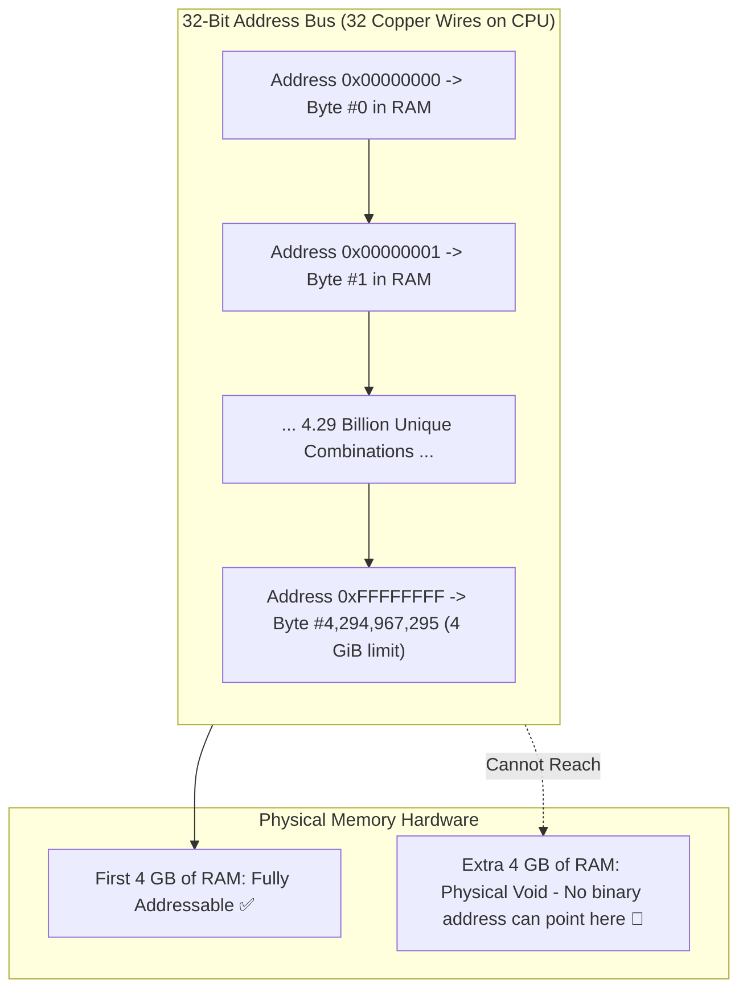

## 🎯 The Question

> **"If you plug an 8 GB or 16 GB RAM stick into a motherboard running a 32-bit Operating System, Task Manager only reports ~3.2 GB to 4 GB as usable. Where does the rest of the memory go, and why can't a 32-bit CPU access it?"**

---

## ⚡ 30-Second Elevator Pitch

Computer memory is **Byte-Addressable**: every individual byte of physical RAM requires its own unique numerical binary address.

A **32-bit CPU** uses memory pointers and address buses that are **32 bits wide**:
* The maximum number of unique memory addresses a 32-bit register can express is:
  $$2^{32} = 4{,}294{,}967{,}296 \text{ distinct addresses}$$
* Since each address points to exactly 1 byte:
  $$4{,}294{,}967{,}296 \text{ bytes} = \frac{4{,}294{,}967{,}296}{1024^3} = \mathbf{4\text{ GiB}}$$

Any physical RAM beyond the 4 GiB boundary **literally cannot have a binary address assigned to it**. The CPU simply has no wires on its address bus to signal a byte location beyond address `0xFFFFFFFF`.

---

## 🧠 Under-the-Hood: The 32-Bit Address Space Limit

---

## 🔬 Why Windows 32-Bit Only Shows ~3.2 GB Usable (MMIO Hole)

Even though $2^{32} = 4\text{ GiB}$, 32-bit Windows often displays only **3.2 GB to 3.5 GB usable RAM**.

This happens due to **Memory-Mapped I/O (MMIO)**:
* Hardware devices (PCIe bus, Graphics Card VRAM, network adapters) must be accessible to the CPU.
* The system reserves the top **500 MB to 1 GB of the 32-bit address space** to map hardware device registers.
* Because physical RAM cannot share addresses with device hardware, the overlapping physical RAM is sacrificed, reducing usable memory to ~3.2 GB!

---

## 📌 Comparison Matrix: 32-Bit vs. 64-Bit Memory Architecture

| Dimension | 32-Bit Architecture | 64-Bit Architecture (x86-64 / ARM64) |
| :--- | :--- | :--- |
| **Address Register Width** | 32 bits | 64 bits |
| **Total Addressable Bytes** | $2^{32} = 4{,}294{,}967{,}296$ bytes | $2^{64} \approx 18.4$ Quintillion bytes (16 Exabytes) |
| **Theoretical RAM Ceiling** | **4 GiB** | **16 Exabytes** (Current CPUs implement 48/57-bit $\approx 128\text{ TB}$ – $4\text{ PB}$) |
| **Process Virtual Address Limit** | 2 GB or 3 GB per process | Up to 128 TB per process |
| **Memory-Mapped I/O Penalty** | Steals from the 4 GB limit (~3.2 GB left) | Hardware mapped high above physical RAM |

---

## 💡 What Interviewers Ask Next (Follow-Up Traps)

1. **"What was PAE (Physical Address Extension), and did it allow 32-bit apps to use 8GB RAM?"**
   - *Answer*: PAE was an Intel hardware hack that expanded the physical address bus from 32 to **36 bits** ($2^{36} = 64\text{ GiB}$ of physical RAM). However, each individual process still had 32-bit pointers, meaning an individual app was **still strictly capped at 4 GB (or 2 GB user-space)**. It only allowed the OS to run multiple 4 GB apps concurrently.

2. **"Do 64-bit systems actually use all 64 bits for memory addressing?"**
   - *Answer*: **No.** Currently, implementing full 64-bit address decoders in silicon would waste hardware and power. Modern CPUs use **48-bit addressing** (providing 256 TB of virtual space) or **57-bit addressing** (providing 128 PB), using sign-extension to format canonical 64-bit pointers.

---

:::tip Placement & Interview Takeaway
**Interview Answer**: A 32-bit system cannot use 8GB of RAM because memory is byte-addressable and a 32-bit address bus can only generate $2^{32}$ unique binary addresses (exactly 4 GiB). Any memory installed beyond 4GB cannot be addressed by the CPU, and Memory-Mapped I/O further reduces usable space to ~3.2GB.
:::

---

## 📺 Video Explanation

<YouTubeEmbed 
  id="6sYJupYnbyk" 
  title="Why 32-Bit Systems CANNOT Use 8GB RAM | Interview Question #56" 
/>
