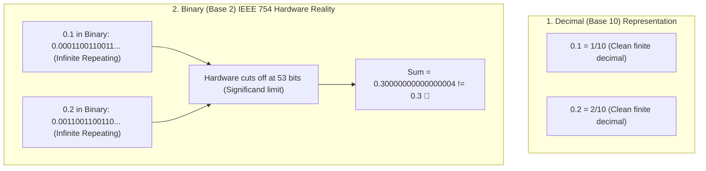

## 🎯 The Question

> **"Why does executing `0.1 + 0.2 == 0.3` evaluate to `false` in Python, JavaScript, Java, and C++ (resulting in `0.30000000000000004`)? Why is using floating-point types strictly forbidden in financial and banking software?"**

---

## ⚡ 30-Second Elevator Pitch

Computers do not store numbers in decimal (Base 10); they store them in **binary (Base 2)** using the **IEEE 754 Floating-Point Standard**.

* In decimal, a fraction can only be represented cleanly with finite digits if its denominator has prime factors of only 2 and 5 (like $\frac{1}{2} = 0.5$ or $\frac{1}{4} = 0.25$). Factions like $\frac{1}{3} = 0.33333\dots$ repeat infinitely.
* In binary, a fraction can only be finite if its denominator is a pure power of 2.
* Because the decimal number **0.1 is $\frac{1}{10}$** (which contains factor 5), in binary it becomes an **infinitely repeating fraction**:
  $$0.1_{10} = 0.00011001100110011\dots_2$$

Because standard 64-bit double-precision floats have only a **53-bit mantissa (significand)**, the infinite stream is truncated and rounded, yielding:
$$0.1 + 0.2 = 0.3000000000000000444089209850062616169452667236328125$$

---

## 🧠 Under-the-Hood: Binary Mantissa Truncation



---

## 🔬 How Fintech & Banking Architectures Handle Money

In banking and e-commerce platforms, storing money in `float` or `double` is an instant bug that causes balances to drift over time.

Production solutions enforce two patterns:
1. **Integer Minor Units (Cents / Paise)**: Store all amounts as integers representing the smallest currency unit:
   * Instead of storing `$10.50` as `float 10.50`, store `1050` cents as a 64-bit integer (`BIGINT`).
2. **Arbitrary-Precision Decimal Types**:
   * Java: `BigDecimal`
   * Python: `decimal.Decimal`
   * SQL: `DECIMAL(19, 4)` / `NUMERIC`

---

## 📌 Comparison Matrix: Floating-Point vs. Fixed-Point / Integer

| Dimension | `float` / `double` (IEEE 754) | `BigDecimal` / `DECIMAL(18,2)` | Integer Minor Units (Cents / Paise) |
| :--- | :--- | :--- | :--- |
| **Precision** | Inexact / Approximate | Exact decimal precision | Exact integer precision |
| **CPU Execution** | ⚡ Blazing fast (Direct FPU hardware) | 🐢 Slower (Software-emulated math) | ⚡ Blazing fast (Standard integer ALU) |
| **Memory Footprint** | 4 to 8 bytes | Heavy heap object allocations | 8 bytes (`int64_t` / `BIGINT`) |
| **Rounding Errors** | Inevitable on decimal fractions | Fully controlled rounding modes | Zero fractional rounding drift |
| **Use Cases** | 3D graphics, physics simulations, ML | Core accounting, tax engines | Stripe, PayPal, billing APIs |

---

## 💡 What Interviewers Ask Next (Follow-Up Traps)

1. **"How should you safely compare two floating-point numbers in code?"**
   - *Answer*: Never use strict equality (`a == b`). Compare using an epsilon tolerance window:
     ```python
     # Safe floating-point equality check
     def is_equal(a, b, epsilon=1e-9):
         return abs(a - b) < epsilon
     ```

2. **"What is Bankers' Rounding (Half-Even Rounding), and why do financial systems mandate it?"**
   - *Answer*: Standard elementary rounding (round half up) creates an upward statistical bias over millions of transactions. Bankers' Rounding rounds `.5` to the nearest **even number** (e.g. `2.5 -> 2` and `3.5 -> 4`). This ensures that over massive datasets, rounding errors cancel each other out symmetrically.

---

:::tip Placement & Interview Takeaway
**Interview Answer**: `0.1 + 0.2 != 0.3` because computers store numbers in binary floating-point (IEEE 754). The fraction $\frac{1}{10}$ is an infinitely repeating fraction in binary, just as $\frac{1}{3}$ is in decimal. Truncating to the 53-bit mantissa introduces tiny precision errors. Financial systems avoid floats by using integer minor units (cents) or arbitrary-precision `BigDecimal`.
:::

---

## 📺 Video Explanation

<YouTubeEmbed 
  id="fRrGv63WO7U" 
  title="Why 0.1 + 0.2 ≠ 0.3 in Programming | Interview Question #57" 
/>
