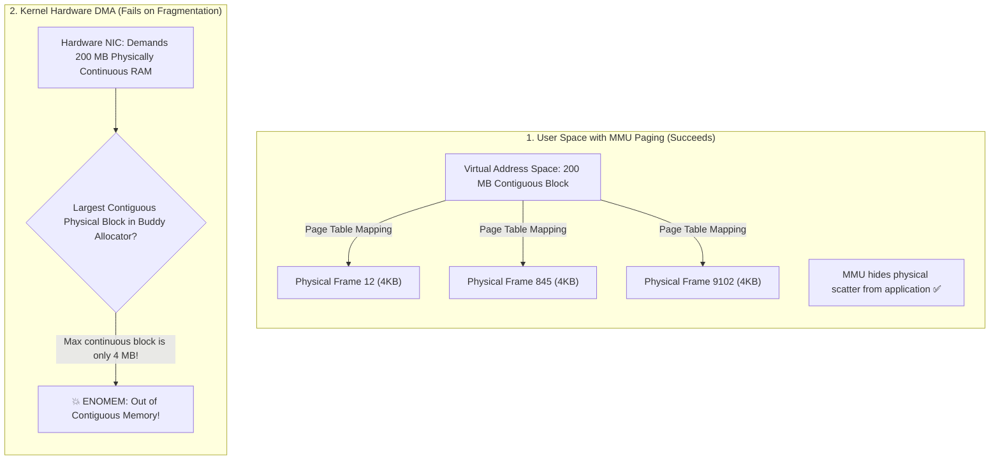

## 🎯 The Question

> **"Your server's task manager shows 2 GB of free physical RAM. Yet, when a hardware driver or network stack attempts to allocate a 200 MB buffer, the kernel crashes with an Out-of-Memory (`ENOMEM`) error. Why can free memory fail to satisfy an allocation?"**

---

## ⚡ 30-Second Elevator Pitch

To understand this bug, you must distinguish between **Virtual Memory** and **Physically Contiguous Memory**:

* **User-Space Applications (e.g. Python, Java, C++ `malloc`)**:
  Rely on the CPU's **Memory Management Unit (MMU)** and Page Tables. The OS can stitch together 50,000 scattered 4 KB physical frames from anywhere in RAM and present them to the program as a seamless, continuous 200 MB virtual address block.
* **Kernel Drivers & Hardware DMA (Direct Memory Access)**:
  Hardware devices (Network Interface Cards, GPUs, Disk Controllers) bypass the MMU and communicate directly with physical RAM address lines. They demand **Physically Contiguous Memory**.
* **The Killer: External Memory Fragmentation**:
  Over days of server uptime, random allocations and deallocations turn physical RAM into Swiss cheese. You have 2 GB of total free space, but it is shattered into thousands of tiny 4 KB pockets. Not a single continuous 200 MB physical block exists in the entire machine!

---

## 🧠 Under-the-Hood: Paged Virtual Memory vs. Contiguous Physical DMA



---

## 🔬 How the Linux Buddy Allocator Works

The Linux kernel manages physical pages using the **Buddy Allocator**:
* RAM is divided into power-of-2 blocks (Order 0 = 4 KB, Order 1 = 8 KB, ... up to Order 10 = 4 MB).
* When a high-order block is requested, the allocator splits a larger block into two "buddies".
* Over time, if high-order blocks are broken up by scattered long-lived allocations, the kernel runs out of contiguous high-order pages.
* You can inspect this live on Linux by running:
  ```bash
  cat /proc/buddyinfo
  ```

---

## 📌 Comparison Matrix: Internal vs. External Memory Fragmentation

| Dimension | Internal Fragmentation | External Fragmentation |
| :--- | :--- | :--- |
| **Where it Occurs** | Inside an allocated memory block / page | Between allocated blocks across physical RAM |
| **The Cause** | Fixed-size allocation (e.g. requesting 5 bytes inside a 4 KB page) | Variable-sized allocations and deallocations over time |
| **Wasted Space** | Unused padding inside the allocated chunk | Free space isolated in tiny unallocatable slivers |
| **Mitigation Technique** | Fine-grained allocators (Slab / Slub / Jemalloc) | Memory Compaction (`echo 1 > /proc/sys/vm/compact_memory`) |
| **Impact on Userspace** | Minor memory overhead | Harmless to paged virtual RAM; fatal to physical DMA |

---

## 💡 What Interviewers Ask Next (Follow-Up Traps)

1. **"What is Memory Compaction in the Linux kernel?"**
   - *Answer*: When a high-order allocation fails, the kernel triggers **Memory Compaction**. It scans physical memory from both ends: scanning free pages from the bottom and allocated pages from the top, migrating movable pages to group free pages into large, continuous power-of-2 blocks.

2. **"Why can't the kernel just use Virtual Memory for all DMA operations?"**
   - *Answer*: Modern servers can use an **IOMMU (Input-Output Memory Management Unit)** to translate virtual addresses for hardware peripherals. However, legacy hardware, high-speed network ring buffers, and real-time embedded devices lack IOMMU support and still mandate physically contiguous DMA buffers.

---

:::tip Placement & Interview Takeaway
**Interview Answer**: Allocations fail with 2GB free RAM because of External Fragmentation. While user-space applications use MMU virtual paging to stitch scattered 4KB frames together, hardware drivers and DMA controllers demand physically contiguous RAM. Over time, allocations fragment physical memory so that no single continuous block of the required size exists.
:::

---

## 📺 Video Explanation

<YouTubeEmbed 
  id="D57YnXj2bc0" 
  title="Why 2GB Free RAM CAN'T Allocate 200MB | Interview Question #58" 
/>
