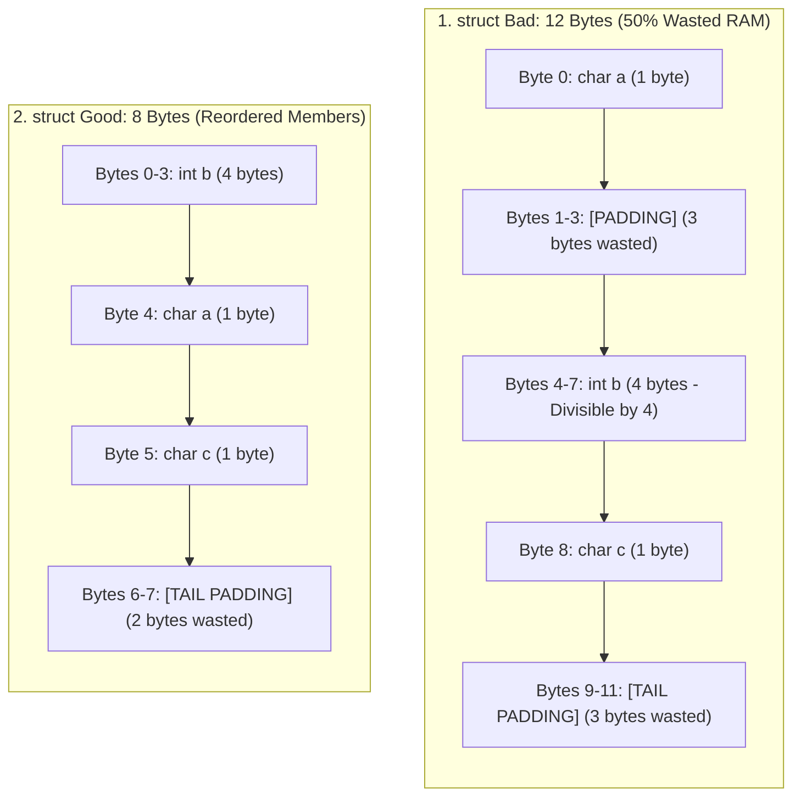

## 🎯 The Question

> **"In C and C++, consider a struct containing a 1-byte char, a 4-byte int, and another 1-byte char. Why does `sizeof(struct Bad)` print 12 bytes instead of 6 bytes? How does variable ordering waste 50% of your RAM?"**

---

## ⚡ 30-Second Elevator Pitch

Modern 32-bit and 64-bit CPUs do not read memory from RAM 1 byte at a time; they fetch data in **4-byte or 8-byte Word Chunks** aligned to addresses divisible by 4 or 8.

To maximize performance, compilers enforce the **Natural Alignment Invariant**:
* A variable of size $K$ bytes **must reside at a memory address that is a multiple of $K$**:
  - `char` (1 byte) can be placed at any address ($N \pmod 1 == 0$).
  - `int` (4 bytes) must be placed at an address divisible by 4 ($N \pmod 4 == 0$).
  - `double` / `pointer` (8 bytes) must be placed at an address divisible by 8.

If an `int` were placed directly after a `char` at offset 1, accessing that integer would straddle two separate CPU word chunks, requiring **two memory bus cycles instead of one**. The compiler prevents this by injecting invisible **Padding Bytes**.

---

## 🧠 Under-the-Hood: Memory Layout of Struct Bad vs. Struct Good



---

## 🔬 Code Walkthrough & Tail Padding Rule

```cpp
struct Bad {
    char a; // 1 byte  + 3 padding bytes (offset 0..3)
    int  b; // 4 bytes (offset 4..7)
    char c; // 1 byte  + 3 tail padding bytes (offset 8..11)
}; // sizeof = 12 bytes!

struct Good {
    int  b; // 4 bytes (offset 0..3)
    char a; // 1 byte  (offset 4)
    char c; // 1 byte  (offset 5)
            // 2 tail padding bytes (offset 6..7)
}; // sizeof = 8 bytes!
```

**Why Tail Padding Exists**:
Struct total size must always be a multiple of its **largest member's alignment** (here, 4 bytes). If you created an array of `Bad arr[2]`, without tail padding `arr[1].b` would end up at byte offset 13 (not divisible by 4!), violating the alignment invariant for subsequent array elements.

---

## 📌 Comparison Matrix: Unoptimized vs. Optimized Struct Layout

| Metric | `struct Bad { char, int, char }` | `struct Good { int, char, char }` |
| :--- | :--- | :--- |
| **Payload Size** | 6 bytes (1 + 4 + 1) | 6 bytes (4 + 1 + 1) |
| **Padding Waste** | **6 bytes** (3 internal + 3 tail) | **2 bytes** (tail padding only) |
| **Total `sizeof`** | **12 bytes** | **8 bytes** (33% memory savings!) |
| **Array of 10M Items** | 120 MB RAM | 80 MB RAM (Saves 40 MB of L1/L2 cache!) |
| **Member Ordering Rule** | Unordered / Random | **Ordered by descending size** (8 $\to$ 4 $\to$ 2 $\to$ 1) |

---

## 💡 What Interviewers Ask Next (Follow-Up Traps)

1. **"What is `#pragma pack(1)`, and why shouldn't you use it everywhere?"**
   - *Answer*: `#pragma pack(1)` forces the compiler to eliminate all padding bytes, compressing `struct Bad` down to exactly 6 bytes. However, this causes **unaligned memory accesses**. On x86 CPUs, unaligned reads trigger double memory accesses; on some ARM or RISC-V architectures, unaligned access generates a hardware crash (`SIGBUS` alignment fault).

2. **"What is `alignof` in modern C++?"**
   - *Answer*: Modern C++ introduces `alignof(T)`, which queries the alignment requirement of a type in bytes, and `alignas(N)`, which allows developers to force specific alignment (e.g. aligning a struct to 64 bytes to prevent CPU Cache Line False Sharing).

---

:::tip Placement & Interview Takeaway
**Interview Answer**: A struct of size 1+4+1 takes 12 bytes because compilers inject padding bytes to align data on CPU word boundaries. To eliminate memory waste without paying unaligned access penalties, always declare struct members in descending order of size (largest primitive types first).
:::

---

## 📺 Video Explanation

<YouTubeEmbed 
  id="WUkzO7R5HKs" 
  title="Why 1 + 4 + 1 = 12 Bytes in C/C++ | Interview Question #59" 
/>
