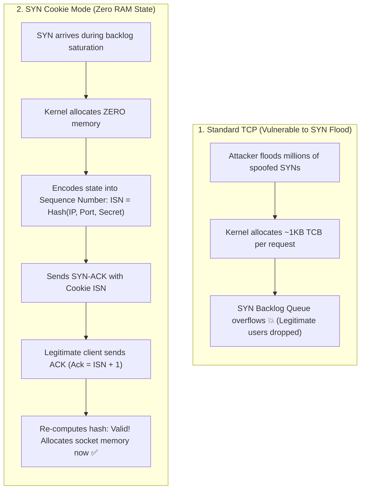

## 🎯 The Question

> **"In a TCP SYN Flood Denial-of-Service (DoS) attack, an attacker sends millions of SYN packets with spoofed IPs and never completes the handshake. Why does this crash backend servers, and how do SYN Cookies defend against it without allocating any memory?"**

---

## ⚡ 30-Second Elevator Pitch

During a normal TCP 3-way handshake:
1. When a server receives a `SYN`, it allocates a **Transmission Control Block (TCB)** in kernel RAM (~280 to 1,000 bytes) and places it into the **SYN Backlog Queue**.
2. It responds with `SYN-ACK` and waits for the client's final `ACK`.

**The SYN Flood Attack**:
An attacker floods the server with millions of `SYN` packets from fake, unreachable IP addresses. The server allocates memory for every spoofed connection, exhausts the SYN backlog queue, and runs out of kernel RAM. Legitimate users are denied connection!

**The Defense: SYN Cookies (Zero-Memory Handshake)**:
When the backlog fills up:
* The kernel **refuses to allocate any memory or state for incoming SYNs**.
* Instead, it calculates a cryptographic hash of the client IP, port, and a secret counter, and embeds this hash directly into the **32-bit Initial Sequence Number (ISN)** of the `SYN-ACK`.
* If a legitimate client returns the final `ACK`, the server reconstructs and verifies the hash from the sequence number, allocating memory **only when the handshake is 100% completed!**

---

## 🧠 Under-the-Hood: SYN Flood Exhaustion vs. SYN Cookie Defense



---

## 🔬 Bit Layout of a SYN Cookie Sequence Number

The 32-bit Initial Sequence Number (`ISN`) is cleverly partitioned:

```text
 0               5               8                               31
+---------------+---------------+-------------------------------+
|   t (5 bits)  |  MSS (3 bits) |     Cryptographic Hash (24 bits)      |
+---------------+---------------+-------------------------------+
```

* **Bits 0–4 (`t`)**: A 5-bit slow-moving timestamp counter that increments every 64 seconds (prevents replay attacks).
* **Bits 5–7 (`MSS`)**: Encodes one of 8 standard Maximum Segment Size values.
* **Bits 8–31 (`Hash`)**: A 24-bit cryptographic hash: `SHA256(client_ip, client_port, server_ip, server_port, secret, t)`.

When the client returns `ACK (seq + 1)`, the server inspects `ack_number - 1`, extracts the timestamp, re-runs the hash, and verifies that the client is genuine.

---

## 📌 Comparison Matrix: Standard SYN Backlog vs. SYN Cookie Mode

| Metric / Aspect | Standard TCP Backlog Queue | SYN Cookie Defense Mode |
| :--- | :--- | :--- |
| **Server State on SYN** | Allocates TCB & buffer in kernel RAM | **Zero bytes allocated in memory** |
| **Backlog Capacity** | Limited by `net.ipv4.tcp_max_syn_backlog` | Infinite (Can survive multi-gigabit attacks) |
| **CPU Overhead** | Low (Direct memory pointer insert) | Slightly higher (Cryptographic hashing per SYN) |
| **TCP Options Support** | Full (Window Scale, SACK, Timestamps) | Limited (Only MSS fits in 32-bit ISN unless Timestamps enabled) |
| **Activation** | Default state | Auto-engages when SYN queue overflows (`tcp_syncookies = 1`) |

---

## 💡 What Interviewers Ask Next (Follow-Up Traps)

1. **"What is the major downside of enabling SYN Cookies?"**
   - *Answer*: Because connection state is compressed into only 32 bits, the server cannot store advanced TCP negotiation options like **TCP Window Scaling** or **Selective Acknowledgments (SACK)** in the SYN Cookie. However, modern Linux kernels work around this by encoding TCP options into the **TCP Timestamps extension** (`net.ipv4.tcp_timestamps`).

2. **"How do you inspect or enable SYN Cookies on Linux?"**
   - *Answer*: Check sysctl configuration:
     ```bash
     sysctl net.ipv4.tcp_syncookies # 1 means auto-activate when queue is full
     ```

---

:::tip Placement & Interview Takeaway
**Interview Answer**: SYN Cookies stop SYN Flood DoS attacks by removing server-side state allocation during the handshake. Instead of saving connection state in a memory buffer, the server cryptographically encodes the connection details into the 32-bit TCP Sequence Number. State is only allocated once the client sends the final ACK and validates the cookie.
:::

---

## 📺 Video Explanation

<YouTubeEmbed 
  id="1kFUnpqlCUc" 
  title="How SYN Cookies STOP Server Crashes | Interview Question #60" 
/>
