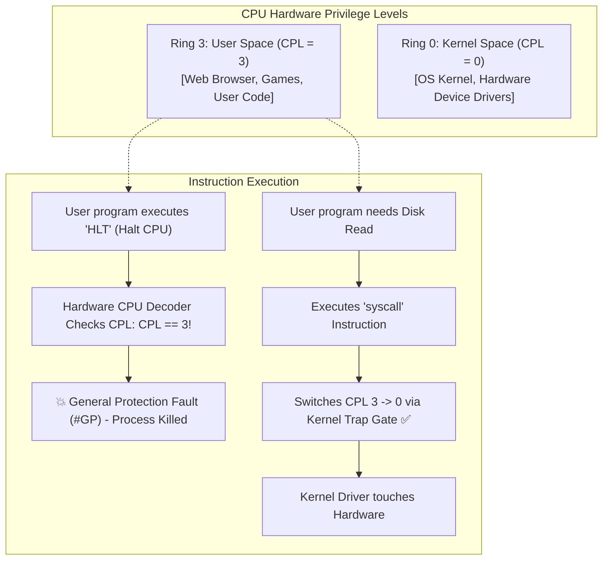

## 🎯 The Question

> **"Your compiled C or C++ application compiles down to raw x86 machine instructions executed directly by the CPU. What physically prevents an ordinary user program from executing the `HLT` instruction to freeze the CPU or writing directly to disk controller memory?"**

---

## ⚡ 30-Second Elevator Pitch

The boundary between user code and physical hardware is enforced at the **silicon hardware level** using **CPU Protection Rings**:

1. Modern x86 and ARM processors maintain a hardware status register called the **Current Privilege Level (CPL)**.
2. **Ring 0 (Kernel Mode)**: Runs with `CPL = 0`. Has unrestricted hardware access and can execute privileged instructions (`HLT`, `CLI`, `LIDT`, `MOV CR3`).
3. **Ring 3 (User Mode)**: Runs with `CPL = 3`. Ordinary user applications execute here.

If a program running in Ring 3 attempts to execute a privileged instruction or access memory outside its page table, the CPU hardware decoders instantly intercept the instruction, abort execution, and fire a **General Protection Fault (`#GP` / Exception 13)**, terminating the rogue process.

To access hardware (disk, network, screen), user applications must execute a **System Call (`syscall`)**, which safely transfers control to the OS kernel at a pre-defined hardware entry point.

---

## 🧠 Under-the-Hood: CPU Rings and Privilege Transitions

---

## 🔬 How System Calls Cross the Privilege Boundary

An application cannot simply `JMP` to a kernel memory address in Ring 0; the MMU blocks any jump to supervisor pages.

The only safe transition is via hardware-controlled gates:
1. User application loads parameters into CPU registers (`RAX` for syscall number, `RDI`, `RSI`).
2. Program executes the **`syscall` instruction** (or `SYSENTER` on legacy x86).
3. The CPU hardware:
   - Saves the user program counter (`RIP`) and flags.
   - Sets `CPL = 0` (switches to Ring 0).
   - Jumps directly to the memory address stored in the **Model-Specific Register (`MSR_LSTAR`)**, where the kernel's secure syscall dispatcher lives.

---

## 📌 Comparison Matrix: User Mode (Ring 3) vs. Kernel Mode (Ring 0)

| Dimension | Ring 3 (User Space) | Ring 0 (Kernel Space) |
| :--- | :--- | :--- |
| **Hardware CPL** | `CPL = 3` | `CPL = 0` |
| **Privileged Instructions** | ❌ Forbidden (`HLT`, `INVD`, `STI`, `CLI`) | ✅ Unrestricted execution |
| **Memory Access** | Strictly limited to process virtual page tables | Access to all physical memory & control registers (`CR0..CR4`) |
| **Direct Hardware I/O** | ❌ Blocked (`IN`/`OUT` instructions restricted) | ✅ Full access to MMIO and port I/O |
| **Crash Impact** | Process terminates (`SIGSEGV` / Crash report) | Blue Screen of Death (BSOD) / Kernel Panic |

---

## 💡 What Interviewers Ask Next (Follow-Up Traps)

1. **"x86 CPUs have 4 rings (Ring 0, 1, 2, 3). Why don't modern Operating Systems like Linux and Windows use Ring 1 and Ring 2?"**
   - *Answer*: Ring 1 and 2 were originally designed for device drivers and OS services. However, other architectures (like ARM and MIPS) only offered two privilege levels (Supervisor vs. User). To keep operating system kernels portable across hardware architectures, Linux and Windows adopted a two-ring model (Ring 0 and Ring 3).

2. **"What is Ring -1 and Ring -2?"**
   - *Answer*: Modern CPUs added even higher privilege levels below Ring 0:
     - **Ring -1 (Hypervisor Mode / VMX Root)**: Used by virtualization hypervisors (KVM, ESXi) to manage multiple guest OS kernels.
     - **Ring -2 (System Management Mode / SMM)**: Used by motherboard UEFI/BIOS firmware for power management and thermal throttling.

---

:::tip Placement & Interview Takeaway
**Interview Answer**: User applications cannot touch hardware because CPUs enforce hardware protection rings. User code runs in Ring 3 (CPL = 3), where executing privileged instructions triggers a hardware General Protection Fault. To interact with hardware, programs must invoke system calls (`syscall`) to delegate execution to the OS kernel running in Ring 0.
:::

---

## 📺 Video Explanation

<YouTubeEmbed 
  id="U2u1kNisFEU" 
  title="Why User Apps CANNOT Touch Hardware | Interview Question #61" 
/>
