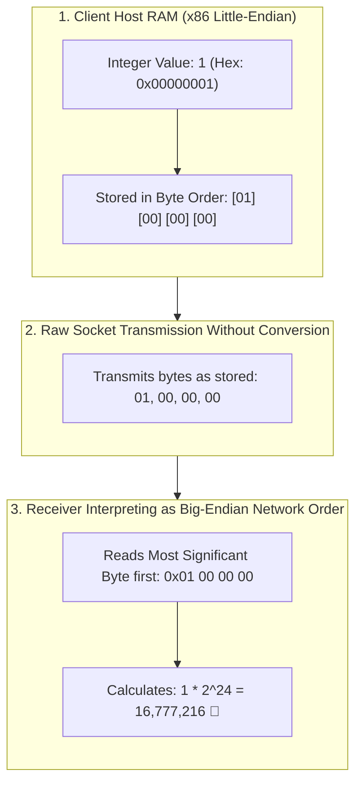

## 🎯 The Question

> **"You write a C program where a client sends a 32-bit integer `1` over a raw TCP socket to a server. On the receiving end, the server reads the value not as `1`, but as `16,777,216`! Why does this happen, and how do socket APIs resolve it?"**

---

## ⚡ 30-Second Elevator Pitch

This classic networking bug is caused by **Endianness (Byte Ordering in RAM)**:

* **Little-Endian (x86 & ARM Desktop/Mobile CPUs)**:
  Stores the **Least Significant Byte (LSB)** at the lowest memory address.
  The 32-bit integer `1` (`0x00000001`) is stored in RAM as:
  $$\mathbf{01}\ 00\ 00\ 00$$
* **Big-Endian / Network Byte Order (TCP/IP Standard)**:
  Transmits the **Most Significant Byte (MSB)** first over the wire.
  If sent directly without byte swapping, the receiver reads the first byte `01` as the highest-order byte:
  $$0x01000000_{16} = 1 \times 2^{24} = \mathbf{16{,}777{,}216}$$

**The Socket Standard**: All multi-byte integers sent over TCP/IP must be converted to Network Byte Order using standard library functions: **`htonl()`** (*Host-to-Network-Long*) on write, and **`ntohl()`** (*Network-to-Host-Long*) on read.

---

## 🧠 Under-the-Hood: Little-Endian vs. Big-Endian Byte Layout



---

## 🔬 The Standard Conversion API

To write portable network code that runs safely across both Big-Endian and Little-Endian architectures, POSIX provides standard byte-swapping functions:

```c
#include <arpa/inet.h>

// On Sender (Host to Network):
uint32_t val = 1;
uint32_t network_val = htonl(val); // Swaps bytes on x86; no-op on Big-Endian
send(sock, &network_val, sizeof(network_val), 0);

// On Receiver (Network to Host):
uint32_t received_val;
recv(sock, &received_val, sizeof(received_val), 0);
uint32_t host_val = ntohl(received_val); // Restores integer to 1 ✅
```

---

## 📌 Comparison Matrix: Little-Endian vs. Big-Endian

| Dimension | Little-Endian | Big-Endian (Network Byte Order) |
| :--- | :--- | :--- |
| **Byte Storage Rule** | Least Significant Byte first | Most Significant Byte first |
| **Value `0x12345678` in RAM**| `78 56 34 12` | `12 34 56 78` (Natural human order) |
| **Primary Architectures** | x86-64, AMD64, ARM (default) | IBM PowerPC, SPARC, Mainframes |
| **Hardware Benefit** | Typecasting low-order bytes is zero-cost | Intuitive debug print inspection |
| **Network Protocol Standard**| Used in USB and PCI buses | Mandated for TCP, UDP, IP headers |

---

## 💡 What Interviewers Ask Next (Follow-Up Traps)

1. **"How can you write a 2-line C program to check whether the current CPU is Little-Endian or Big-Endian?"**
   - *Answer*: Inspect the first byte of a multi-byte integer:
     ```c
     int n = 1;
     bool is_little_endian = (*(char*)&n == 1);
     ```

2. **"Why do modern serialization formats like Protocol Buffers and JSON avoid endianness bugs?"**
   - *Answer*: Text formats like JSON serialize numbers into ASCII strings (`"1"`), which are arrays of single bytes that have no multi-byte endianness. Binary formats like **Protobuf** explicitly specify little-endian varints in their wire specification, ensuring cross-platform consistency.

---

:::tip Placement & Interview Takeaway
**Interview Answer**: Sending 1 reads as 16,777,216 because of an Endianness mismatch. x86 CPUs use Little-Endian (storing `0x01 00 00 00`), whereas TCP/IP protocols expect Big-Endian Network Byte Order. Without converting using `htonl()` and `ntohl()`, the first byte is interpreted as the most significant byte ($1 \times 2^{24}$).
:::

---

## 📺 Video Explanation

<YouTubeEmbed 
  id="BaCD9mgdGf4" 
  title="Why Sending 1 Reads as 16,777,216 Over Sockets | Interview Question #62" 
/>
