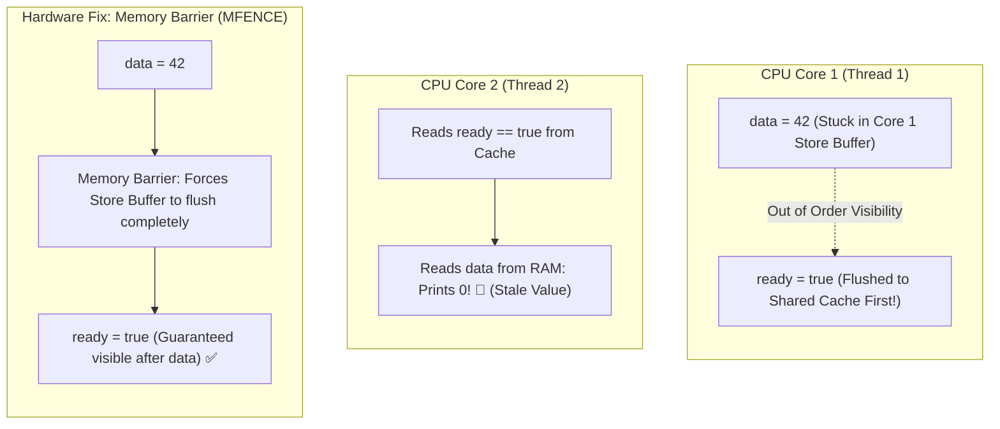

## 🎯 The Question

> **"In a multithreaded program, Thread 1 executes `data = 42; ready = true;` while Thread 2 executes `if (ready) print(data);`. Why can Thread 2 print `0` instead of `42`, even though `data` was assigned on the line before `ready`?"**

---

## ⚡ 30-Second Elevator Pitch

Developers assume code executes in the exact sequential order written on screen (**Sequential Consistency**). In hardware, this is an illusion.

To prevent the CPU from stalling for hundreds of cycles waiting for RAM writes:
1. **Out-of-Order Execution (OoOE)**: The CPU scheduler dynamically reorders independent instructions to fill idle execution units.
2. **CPU Store Buffers**: When a CPU writes to memory, it writes to a tiny, ultra-fast **Store Buffer** instead of waiting for the L1 cache.
3. Because writes to `ready` may commit to cache before writes to `data` drain from the buffer, another CPU core can observe `ready == true` while still reading the old value `data == 0`.

**The Fix**: Multithreaded systems enforce order using **Hardware Memory Barriers (Fences)** or atomic **Acquire-Release Semantics** (`std::memory_order_release` and `std::memory_order_acquire`).

---

## 🧠 Under-the-Hood: Store Buffer Reordering and Memory Fences



---

## 🔬 Acquire-Release Semantics in C++

Instead of heavy global memory fences, high-performance concurrency uses **Acquire-Release ordering**:

```cpp
#include <atomic>

std::atomic<bool> ready(false);
int data = 0;

// Thread 1 (Producer)
void producer() {
    data = 42;
    // Release: Ensures all previous writes in this thread commit before this write
    ready.store(true, std::memory_order_release);
}

// Thread 2 (Consumer)
void consumer() {
    // Acquire: Ensures all subsequent reads in this thread see values committed before release
    while (!ready.load(std::memory_order_acquire));
    std::cout << data; // Guaranteed 100% to print 42! ✅
}
```

---

## 📌 Comparison Matrix: Sequential Consistency vs. Weak Memory Models

| Dimension | Sequential Consistency (`seq_cst`) | Acquire-Release (`acquire`/`release`) | Relaxed Ordering (`relaxed`) |
| :--- | :--- | :--- | :--- |
| **Ordering Guarantee** | Total global order across all threads | Synchronizes pairs of producer-consumer threads | No ordering guarantees; atomicity only |
| **Hardware Cost** | Highest (Issues full memory fences / `MFENCE`) | Low (Native x86 hardware semantics) | Lowest (Free; pure ALU operations) |
| **Default in Languages** | Java `volatile`, C++ `std::atomic` default | Modern lock-free data structures | Atomic counters, telemetry metrics |
| **Visibility Bug Risk** | Zero risk | Safe when paired correctly | High risk of reordering bugs |

---

## 💡 What Interviewers Ask Next (Follow-Up Traps)

1. **"Does an x86 processor reorder writes with other writes?"**
   - *Answer*: **No.** The x86-64 architecture enforces a **Total Store Order (TSO)** memory model. An x86 CPU never reorders Write-Write or Read-Read operations. However, it *does* allow **Store-Load reordering** (a Read can pass a previous Write trapped in a Store Buffer). Weak architectures like **ARM64 and POWER** can reorder virtually any memory operation unless explicit memory barriers are inserted.

2. **"What is the difference between Compiler Reordering and CPU Reordering?"**
   - *Answer*: **Compiler Reordering** happens at compile-time when optimizing loops or inlining (prevented via compiler barriers like `asm volatile("" ::: "memory")`). **CPU Reordering** happens at runtime inside silicon hardware pipelines (prevented via hardware memory fence instructions like `MFENCE` or `DMB`).

---

:::tip Placement & Interview Takeaway
**Interview Answer**: CPUs reorder memory operations and buffer writes in Store Buffers to maximize hardware pipeline utilization. In concurrent multithreaded systems, this can cause one core to observe dependent writes out of order. Engineers use Memory Barriers and Acquire-Release atomic semantics to enforce memory visibility across cores.
:::

---

## 📺 Video Explanation

<YouTubeEmbed 
  id="9GCmnGwHebM" 
  title="Why CPUs Reorder Code Behind Your Back | Interview Question #63" 
/>
