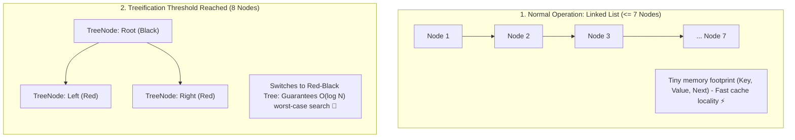

## 🎯 The Question

> **"In Java 8+, why does `HashMap` convert a bucket's linked list into a balanced Red-Black Tree (`TreeNode`) specifically at 8 collisions (`TREEIFY_THRESHOLD = 8`), and back to a list at 6 collisions? Why 8, and not 4 or 16?"**

---

## ⚡ 30-Second Elevator Pitch

In classic hash tables, hash collisions are resolved via **Separate Chaining** (linked lists). If many keys hash to the same bucket, lookup time degrades from $O(1)$ to **$O(N)$**.

Java 8 introduced **Treeification**: when a bucket reaches **8 elements** (and table capacity is $\ge 64$), the bucket's linked list is transformed into a **Red-Black Tree**, guaranteeing $O(\log N)$ worst-case search.

**Why the Threshold is Exactly 8**:
1. **The Math (Poisson Distribution)**: Under uniform, random hash codes, the probability of 8 keys landing in the same bucket by chance is **less than 1 in 10 million** ($P(8) \approx 0.0000006$). Under normal conditions, trees are virtually never created.
2. **The Memory Penalty**: A `TreeNode` is more than **twice the memory size** of a simple `ListNode` (it stores parent, left, right pointers, and a boolean color). Treeifying early would waste massive RAM.
3. **Security Defense (Hash-Flooding DoS)**: If an attacker maliciously crafts thousands of colliding keys, the table cannot be forced into $O(N)$ crawl; the tree bounds performance to $O(\log N)$.

---

## 🧠 Under-the-Hood: Linked List vs. Red-Black Tree in Bucket

---

## 🔬 The Poisson Distribution Proof

The Java JDK team documented the mathematical proof in the `HashMap.java` source code:

$$P(k) = \frac{\lambda^k e^{-\lambda}}{k!}$$

With a default load factor of $0.75$, the probability of a bucket having $k$ collisions is:
* $0\text{ collisions}: 0.6065$
* $1\text{ collision}: 0.3033$
* $2\text{ collisions}: 0.0758$
* $3\text{ collisions}: 0.0126$
* $7\text{ collisions}: 0.00000094$
* **$8\text{ collisions}: 0.00000006$ (Roughly 1 in 10,000,000)**

Choosing 8 ensures treeification **never occurs during honest program execution**, only activating under pathological hash functions or malicious DoS attacks.

---

## 📌 Comparison Matrix: `Node` (Linked List) vs. `TreeNode` (Red-Black Tree)

| Dimension | `HashMap.Node` (Linked List) | `HashMap.TreeNode` (Red-Black Tree) |
| :--- | :--- | :--- |
| **Search Time** | $O(N)$ linear scan | **$O(\log N)$ balanced search** |
| **Memory Footprint** | Small (~24–32 bytes per node) | **Large (~56–64 bytes per node)** |
| **Pointers Stored** | 1 pointer (`next`) | 3 pointers (`parent`, `left`, `right`) + 1 boolean (`red`) |
| **Insertion Overhead** | Fast $O(1)$ append | Requires tree rotations and color flips ($O(\log N)$) |
| **Untreeify Threshold** | Reverts to list when size drops to **6** | Stays tree until bucket size shrinks below 6 |

---

## 💡 What Interviewers Ask Next (Follow-Up Traps)

1. **"Why does the tree un-treeify at 6 elements instead of 8?"**
   - *Answer*: To prevent **Hysteresis (Thrashing)**. If treeify and untreeify both triggered at 8, repeatedly inserting and deleting a single element around the threshold would force the HashMap to continuously construct and tear down Red-Black Trees, cratering performance. The gap between 8 and 6 provides a stability buffer.

2. **"What is the second condition required before a bucket treeifies?"**
   - *Answer*: `MIN_TREEIFY_CAPACITY = 64`. Even if a bucket reaches 8 collisions, if the entire table has fewer than 64 buckets, Java chooses to **resize (double) the table** instead of treeifying. Doubling the array redistributes the colliding keys across new buckets with less overhead.

---

:::tip Placement & Interview Takeaway
**Interview Answer**: Java's HashMap converts buckets to Red-Black Trees at 8 collisions because Poisson distribution shows the odds of 8 collisions under a good hash are 1 in 10 million. TreeNodes consume over double the memory of ListNodes, so the threshold of 8 keeps memory overhead low while bounding worst-case lookup time to $O(\log N)$ to neutralize Hash-DoS attacks.
:::

---

## 📺 Video Explanation

<YouTubeEmbed 
  id="JV2ktY5ALE8" 
  title="Why HashMaps Switch to Trees at 8 Collisions | Interview Question #64" 
/>
