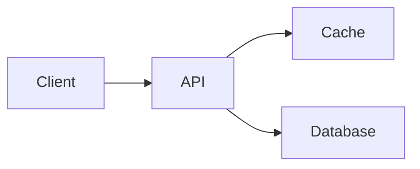

# Contributing to Binary Dose 🚀

Thank you for your interest in contributing to **Binary Dose**! We welcome articles, interview questions, notes, and fixes from students, software engineers, and educators.

---

## ✍️ How to Write a Blog Post for Binary Dose

Writing for Binary Dose gives you a **dedicated author profile** with backlinks to your LinkedIn, GitHub, and social handles, reaching thousands of computer science students and engineers.

### Topics We Love
- **Operating Systems** (Memory management, scheduling, kernel, Linux internals)
- **System Design & Backend** (Scalability, caching, databases, rate limiting, microservices)
- **Concurrency & Multithreading** (Locks, race conditions, atomic operations)
- **Computer Networks** (TCP/IP, HTTP, sockets, DNS, protocols)
- **Data Structures & Algorithms** (Deep-dive problem walkthroughs, patterns)
- **Tech Interview Experiences & System Breakdown**

---

### 3-Step Guide to Submit via GitHub Pull Request (PR)

#### Step 1: Fork and Clone the Repository
```bash
git clone https://github.com/YOUR_USERNAME/binarydose_website.git
cd binarydose_website
npm install
```

#### Step 2: Add Yourself to `blog/authors.yml`
Open `blog/authors.yml` and add your author profile at the bottom:

```yaml
your_username:
  name: Your Full Name
  title: Software Engineer @ Company / Student @ University
  url: https://linkedin.com/in/your-profile
  image_url: https://github.com/your_username.png  # or /img/authors/your_photo.jpg
  socials:
    linkedin: https://linkedin.com/in/your-profile
    github: https://github.com/your_username
    twitter: https://twitter.com/your_handle
```

#### Step 3: Create Your Article
Create a new file in `blog/` using the naming format: `YYYY-MM-DD-your-topic-title.md` (or `.mdx`):

```markdown
---
title: "Your Catchy Article Title Here"
description: "A short 1-2 sentence summary of what this article covers."
authors: [your_username]
tags: [operating-systems, backend, concurrency]  # Choose relevant tags
hide_table_of_contents: true
---

import TOCInline from '@theme/TOCInline';

Write a compelling 2-3 paragraph introduction explaining what problem this article solves.

<!-- truncate -->

<div className="inline-toc-container">
  <details open>
    <summary><strong>📑 Table of Contents</strong></summary>
    <TOCInline toc={toc} />
  </details>
</div>

---

## 1. Section Title

Your content, code snippets, and explanations here.

### Diagrams with Mermaid
You can use interactive Mermaid diagrams:



---

## 🎯 Key Takeaways
- Point 1
- Point 2
```

#### Step 4: Test Locally & Open a Pull Request
```bash
npm run start
```
Check `http://localhost:3000/blog` to ensure everything looks sharp. Then push your branch and open a **Pull Request (PR)** on GitHub!

---

## 📬 Don't Know Git? Submit via Email
You can also email your draft (Google Doc or Markdown) to **dosebinary@gmail.com** with the subject:
`[Blog Submission] Your Article Title - Your Name`

Include:
1. Your Full Name & Current Role / College
2. Your LinkedIn / GitHub URL
3. Your Profile Photo URL
4. Your Article Content

---

## 📜 Community & Quality Guidelines
- **Original Content**: Please submit original, insightful content. No raw copy-pasting from Wikipedia or unverified AI dumps.
- **Code & Clarity**: Include code examples, clean explanations, and practical takeaways.
- **Tone**: Friendly, clear, and educational. Write for engineers and students looking to truly master concepts.
