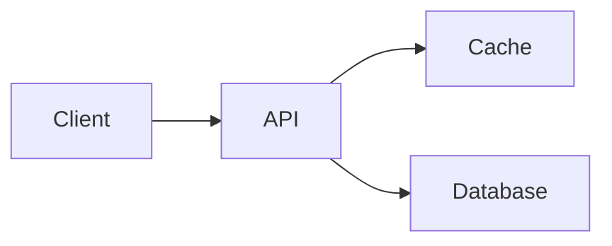

# Contributing to Binary Dose 🚀

Thank you for your interest in contributing to **Binary Dose**! We welcome technical articles, interview breakdowns, code solutions, and improvements from students, software engineers, and educators.

---

## ✍️ How to Write an Article / Interview Breakdown

Writing for Binary Dose gives you a **dedicated author profile** with backlinks to your LinkedIn, GitHub, and portfolio, reaching thousands of computer science students and engineers.

### Topics We Welcome in Blogs
- **Operating Systems** (Memory management, scheduling, kernel, Linux internals)
- **System Design & Backend** (Scalability, caching, databases, rate limiting, microservices)
- **Concurrency & Multithreading** (Locks, race conditions, atomic operations)
- **Computer Networks** (TCP/IP, HTTP, sockets, DNS, protocols)
- **Data Structures & Algorithms** (Deep-dive problem walkthroughs, patterns)
- **Interview Questions & Round Experiences** (Breakdown of tricky problems & architectural lessons)

---

## 🚀 3-Step Guide to Submit via GitHub (Pull Request)

### Step 1: Fork and Clone the Repository
```bash
git clone https://github.com/YOUR_USERNAME/binarydose_website.git
cd binarydose_website
npm install
```

### Step 2: Add Yourself to `blog/authors.yml`
Open `blog/authors.yml` and add your author profile at the bottom:

```yaml
your_username:
  name: Your Full Name
  title: Software Engineer @ Company / Student @ University
  url: https://linkedin.com/in/your-profile
  image_url: https://github.com/your_username.png  # or link to your photo
  socials:
    linkedin: https://linkedin.com/in/your-profile
    github: https://github.com/your_username
    twitter: https://twitter.com/your_handle
```

### Step 3: Create Your Article
Create a new file in `blog/` using the naming format: `YYYY-MM-DD-your-topic-title.md` (or `.mdx`):

```markdown
---
title: "Your Catchy Article Title Here"
description: "A short 1-2 sentence summary of what this article covers."
authors: [your_username]
tags: [operating-systems, backend, interview]
hide_table_of_contents: true
---

import TOCInline from '@theme/TOCInline';

Write a compelling introduction explaining what problem or concept this article covers.

<!-- truncate -->

<div className="inline-toc-container">
  <details open>
    <summary><strong>📑 Table of Contents</strong></summary>
    <TOCInline toc={toc} />
  </details>
</div>

---

## 1. Section Title

Your content, code snippets, and explanations here.

### Diagrams with Mermaid
You can include interactive diagrams:



---

## 🎯 Key Takeaways
- Point 1
- Point 2
```

### Step 4: Test Locally & Open a PR
```bash
npm run start
```
Check `http://localhost:3000/blog` to ensure everything looks sharp. Then push your branch and open a **Pull Request (PR)** on GitHub!

---

## 📬 Prefer Email or Instagram?
If you're not familiar with Git, you can also submit directly:
1. 📸 **DM us on Instagram:** [@binarydose](https://www.instagram.com/binarydose)
2. ✉️ **Email your draft:** [dosebinary@gmail.com](mailto:dosebinary@gmail.com) with your article (Google Doc / Markdown), name, bio, and LinkedIn link.

---

## 📺 Follow the 100 Days CS Series
For daily high-yield interview deep dives, check out our signature **100 Days CS Series** on [YouTube (@binarydose)](https://www.youtube.com/@binarydose) and [Instagram (@binarydose)](https://www.instagram.com/binarydose)!

---

## ⚖️ Contributor Terms & Copyright Protection
- **Author Credit & Attribution**: When your article is merged, you retain full author credit, backlinks to your LinkedIn, GitHub, and portfolio, and bragging rights as an official contributor to Binary Dose.
- **Publication License**: By submitting a Pull Request, you grant Binary Dose a perpetual, worldwide, non-exclusive license to host, display, and share your article on `https://binarydose.in`.
- **Anti-Plagiarism Protection**: Your contributed work is protected under the Binary Dose [LICENSE](LICENSE). Third parties are strictly prohibited from scraping, cloning, or commercially redistributing your articles without permission.

