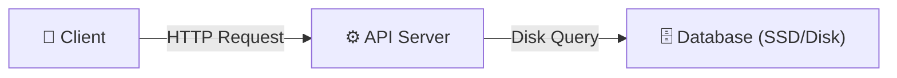
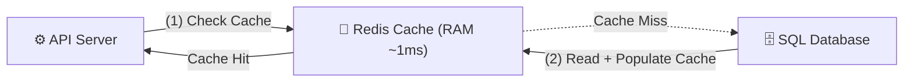
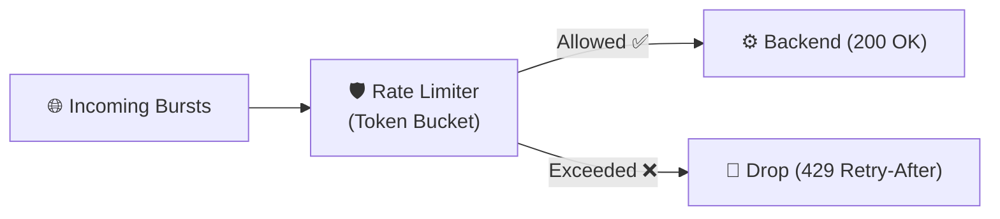
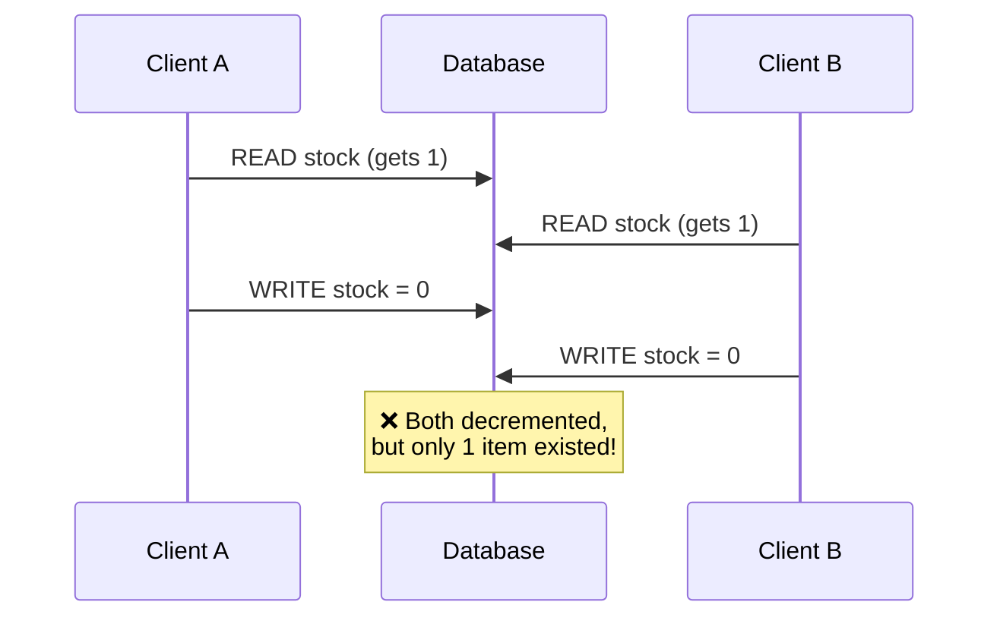
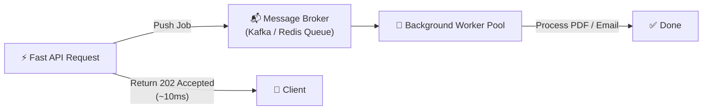

When you build a small web application, everything feels straightforward: you create an API endpoint, connect it to a database, and fetch records. On your local machine, requests complete in a few milliseconds.

The problem begins when traffic shifts from 10 users to **10,000 concurrent requests**.

Naive architectures fail not because of syntax errors, but because of **physical hardware and networking limits**: disk I/O bottlenecks, RAM exhaustion, and thread starvation. System design is the practice of architecting backends to remain fast, consistent, and resilient under high concurrency.

<!-- truncate -->

---

## The Core Problem: Why Direct Database Calls Break

In a basic setup, every incoming HTTP request triggers a direct read or write to a centralized relational database.



This model encounters immediate scale bottlenecks:

- **Disk I/O Latency:** Reading from memory (RAM) takes nanoseconds, while querying an SSD or traditional disk storage takes milliseconds. Under heavy read volume, the disk queue saturates, slowing down response times for all clients.
- **Connection Exhaustion:** Databases allocate memory and threads/processes for every active client connection. Opening hundreds of unmanaged connections exhausts host memory, leading to connection timeouts.
- **Write Contention & Locks:** When multiple clients update the exact same database row concurrently, the database acquires locks to preserve data integrity, forcing other incoming queries to wait in a blocked state.

To handle growth, systems evolve by placing **specialized engineering layers** in front of and around the primary database.

---

## 1. The Fast Read Layer: In-Memory Caching

The first defense against disk saturation is caching frequently read data in memory using tools like **Redis**.



### The Cache-Aside Pattern

1. The application checks the in-memory cache for the requested key.
2. **Cache Hit:** If found, the data is returned to the client in sub-milliseconds.
3. **Cache Miss:** If missing, the application queries the persistent database, writes the result to the cache for future requests, and returns the response.

:::warning[Trade-off to Watch]
Caching introduces **data staleness**. When an item is updated in the database, the system must explicitly invalidate or update the cached key (`redis.delete()`) to prevent serving outdated state.
:::

---

## 2. The Gateway Layer: Rate Limiting & Protection

Exposing raw API routes directly to the public internet leaves backend instances vulnerable to traffic spikes, scraping bots, and abusive request loops.

**Rate Limiting** acts as an edge filter that monitors incoming traffic per client IP or authenticated API token, rejecting requests that exceed predefined thresholds using HTTP status `429 Too Many Requests`.



### The Token Bucket Algorithm

- A bucket holds a **maximum capacity** of tokens.
- Tokens are added at a **constant refill rate** per second.
- Each incoming request **consumes one token**.
- If tokens are available, the request passes through; if the bucket is empty, the request is rejected or delayed until tokens refill.

This allows systems to absorb brief traffic bursts while strictly enforcing sustained throughput boundaries.

---

## 3. The Concurrency Layer: Race Conditions & Safe Writes

When multiple clients attempt to modify the same state simultaneously — such as reserving the last ticket in an event — simple code like `stock = stock - 1` fails.

### The Read-Modify-Write Bug



1. Client A reads `stock = 1`.
2. Client B reads `stock = 1` before Client A can write.
3. Both clients write `stock = 0`, decrementing inventory twice for a single item (**overselling**).

### How Systems Fix It

- **Pessimistic Locking (`SELECT ... FOR UPDATE`):** Locks the row immediately during read, preventing other transactions from accessing it until the commit finishes.
- **Atomic Conditional Updates:** Pushes the validation directly to the database engine in a single atomic step:

```sql
UPDATE inventory 
SET stock = stock - 1 
WHERE product_id = 101 AND stock > 0;
```

If another thread modified the row first, **zero rows update**, allowing the application to safely notify the second user that the item is sold out.

---

## 4. The Asynchronous Layer: Task Queues & Buffers

Operations like generating PDF invoices, resizing media uploads, or calling external payment and email APIs introduce variable latencies (often hundreds of milliseconds to several seconds). Executing these synchronously inside an HTTP handler **blocks backend worker threads**.



By placing a message broker between the API gateway and worker instances, the API returns an **immediate acknowledgment** (`202 Accepted`) to the client. Dedicated background workers consume and process tasks at their own steady rate without risking request dropouts during sudden volume spikes.

---

## Architectural Comparison Matrix

| Pattern / Layer | Primary Bottleneck Solved | Core Technology | Key Trade-Off |
|---|---|---|---|
| **In-Memory Caching** | Slow disk read latency (>500ms) | Redis, Memcached | Cache invalidation complexity & stale data risks |
| **Rate Limiting** | Server abuse, bots, and sudden traffic floods | Redis Lua scripts, API Gateways | Drops excess requests at the edge (429) |
| **Atomic Row Locks** | Race conditions and concurrent data corruption | PostgreSQL, MySQL | Reduces write throughput under high contention |
| **Async Queues** | Slow I/O tasks blocking the HTTP event loop | RabbitMQ, Kafka, Redis Streams | Introduces eventual consistency across background jobs |

---

## Key Takeaway

Scaling software is **not about finding a single tool** that solves every performance bottleneck. Production architectures succeed by applying **distinct layers of defense**:

1. 🛡️ **Rate limiting** to safeguard ingress boundaries
2. 🧠 **In-memory caches** to accelerate read operations
3. 🔐 **Atomic locking** to preserve transactional integrity
4. 📬 **Async message queues** to decouple heavy background workloads

Each layer addresses a specific class of failure, and together they form the backbone of every modern high-traffic system — from payment gateways to social media feeds.
