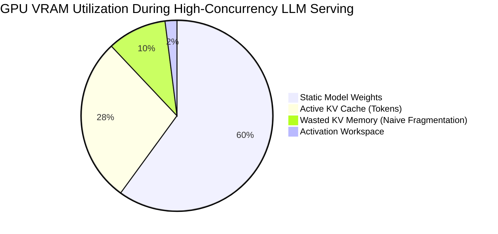
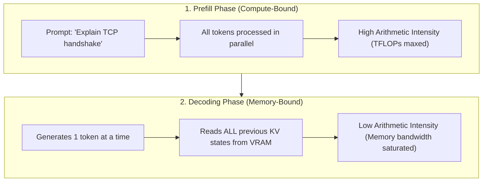
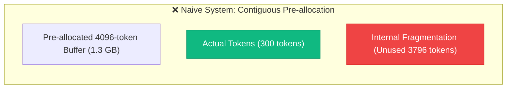
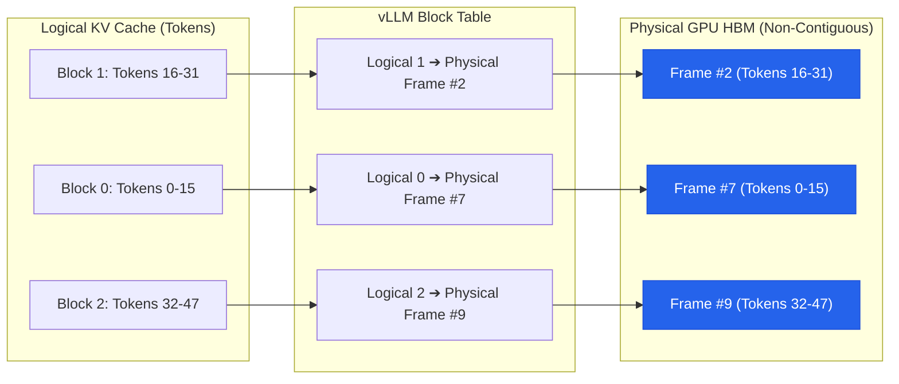
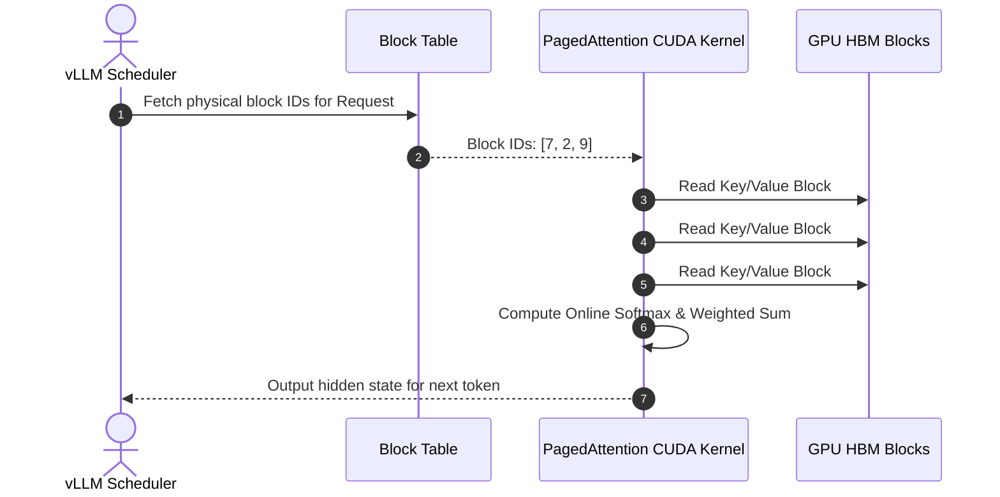
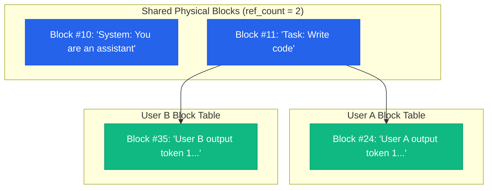

import TOCInline from '@theme/TOCInline';

When serving Large Language Models (LLMs) in production, you quickly run into a counterintuitive reality: **serving LLMs is rarely bottlenecked by raw GPU compute power (FLOPs). It is almost always bottlenecked by GPU High Bandwidth Memory (HBM).**

An NVIDIA H100 GPU costs upwards of \$30,000 and comes with 80 GB of VRAM. A 70-billion parameter model like LLaMA-3 in FP16 precision consumes **140 GB** of memory just to load model weights across multiple GPUs. 

Whatever precious VRAM remains must hold the dynamic **KV Cache (Key-Value Cache)** for all concurrent incoming user requests.



In traditional inference servers (like naive HuggingFace Transformers or early FasterTransformer), **up to 60% to 80% of that KV-cache memory was completely wasted** due to fragmentation and over-allocation.

Then came **vLLM** and **PagedAttention** (developed by UC Berkeley researchers in 2023). By resurrecting a 60-year-old fundamental concept from classical Operating Systems — **Virtual Memory Paging** — they revolutionized AI serving, slashing memory waste to under 4% and boosting throughput by **2x to 4x**.

Here is how PagedAttention works from first principles, under the hood.

<!-- truncate -->

<div className="inline-toc-container">
  <details open>
    <summary><strong>📑 Table of Contents</strong></summary>
    <TOCInline toc={toc} />
  </details>
</div>

---

## 1. The Anatomy of an LLM Request: Prefill vs. Decode

To understand why memory management is so brutal for LLMs, we must separate the two phases of Transformer generation:



1. **The Prefill Phase (Prompt Evaluation):**
   - The model ingests the entire user prompt (e.g., 500 tokens).
   - Because all prompt tokens are known in advance, matrix multiplications run in parallel.
   - This phase saturates the GPU's Tensor Cores: it is **compute-bound**.

2. **The Decoding Phase (Token-by-Token Generation):**
   - The model generates text autoregressively, **one single token at a time**.
   - To predict the next token $t_{n+1}$, the attention mechanism must compute attention scores against **all previous tokens** ($t_1, t_2, \dots, t_n$).
   - Recomputing the Key ($K$) and Value ($V$) vectors for past tokens at every new step would result in $O(N^2)$ redundant compute.
   - Therefore, engines store the $K$ and $V$ activation vectors of all past tokens in GPU memory: this is the **KV Cache**.

---

## 2. The KV-Cache Formula: Why Memory Explodes

How big is this cache in practice? Let us calculate the memory required for a single request:

$$
\text{Memory per Token} = 2 \times (\text{layers}) \times (\text{KV heads}) \times (\text{head dimension}) \times (\text{bytes per element})
$$

Let's plug in numbers for a production model like **LLaMA-3-70B** using Grouped-Query Attention (GQA):
- **Layers:** 80
- **KV Heads:** 8
- **Head Dimension ($d_k$):** 128
- **Precision:** FP16 (2 bytes per number)
- Factor of 2 accounts for storing both **Keys** and **Values**.

$$
\text{Memory per Token} = 2 \times 80 \times 8 \times 128 \times 2 = 327,680 \text{ bytes} \approx 320 \text{ KB per token}
$$

Now calculate what happens under real production traffic:
- **Sequence Length:** 4,096 tokens (prompt + generation)
- **1 User:** $4,096 \times 320 \text{ KB} \approx \mathbf{1.31 \text{ GB}}$ of VRAM!
- **Concurrent Batch of 50 Users:** $50 \times 1.31 \text{ GB} = \mathbf{65.5 \text{ GB}}$ of pure KV Cache!

On an 80GB GPU, your available memory for KV cache is already suffocating after just a few dozen concurrent sessions.

---

## 3. The Root Bottleneck: Naive Contiguous Allocation

In standard deep learning frameworks (PyTorch, TensorFlow), tensors must reside in **physically contiguous memory chunks**. 

When a user connects to an inference endpoint, the server does not know whether the user will ask for a 2-word answer or write an entire novel.



To prevent out-of-memory (OOM) crashes midway through generation, naive engines make a devastating compromise:
1. **Pre-allocation for Worst-Case Length:** They reserve a contiguous array sized for `max_model_len` (e.g., 4096 tokens) immediately when the request arrives.
2. **Internal Fragmentation:** If the model outputs "Yes, that is correct." (5 tokens) and emits an `[EOS]` token, the remaining 4,091 allocated token slots sit empty and useless in VRAM.
3. **External Fragmentation:** Over time, requests of varying lengths complete at different times. The GPU memory space turns into Swiss cheese — full of small holes that cannot accommodate new requests needing large contiguous blocks.
4. **Reservation Waste:** Even if a request eventually outputs 2,000 tokens, allocating all 2,000 slots at step 1 means memory is locked up before the tokens even exist.

Studies by the vLLM team showed that in traditional systems, **only 20% to 40% of allocated KV memory held actual data**. The remaining **60% to 80% was pure waste**.

---

## 4. The Solution: PagedAttention (Borrowing from 1960s OS Design)

In 1962, the designers of the Ferranti Atlas computer faced the exact same crisis with physical RAM: programs required varying amounts of memory, physical RAM was fragmented, and programs crashed.

Their breakthrough was **Virtual Memory Paging**:
- Divide logical memory into fixed-size **Pages**.
- Divide physical memory into fixed-size **Frames**.
- Use an **OS Page Table** to map contiguous virtual addresses to non-contiguous physical frames scattered across RAM.



### The vLLM Mental Model Mapping

| Operating System Concept | vLLM PagedAttention Concept |
| :--- | :--- |
| **Virtual Address Space** | Logical KV Cache sequence ($0 \dots \text{seq\_len}$) |
| **Page / Page Frame (4 KB)** | **KV Block** (stores $K$ and $V$ for a fixed number of tokens, e.g. 16 or 32) |
| **Page Table** | **Block Table** (maps Logical Block Index $\rightarrow$ Physical Block ID on GPU) |
| **Virtual Memory Manager (VMM)** | **vLLM Block Manager** (allocates and frees physical blocks dynamically) |
| **Page Fault / Dynamic Allocation** | Appending a new physical block only when current block exceeds 16 tokens |

---

## 5. How PagedAttention Executes in the CUDA Kernel

The real technical achievement of PagedAttention was not just the data structure — it was designing a **custom GPU CUDA kernel** capable of computing attention over non-contiguous memory blocks without copying them into a contiguous buffer first.

In standard multi-head attention:

$$
\text{Attention}(Q, K, V) = \text{softmax}\left(\frac{Q K^T}{\sqrt{d_k}}\right) V
$$

Normally, computing $Q K^T$ requires $K$ to be a single contiguous matrix in VRAM. 

In **PagedAttention**, the custom CUDA kernel accepts:
1. The Query vector $Q$ of the current token.
2. The physical pointers to the blocks from the **Block Table**.



The kernel iterates across the physical blocks, computes the partial attention scores block-by-block, and aggregates them using an online softmax formulation (similar to FlashAttention). 

**Zero memory copy. Zero contiguous pre-allocation.**

---

## 6. A Python Blueprint: Conceptual Block Table Manager

Here is a clean, simplified Python implementation showing how vLLM's Block Manager handles dynamic token allocation and mapping:

```python
from typing import List, Dict

class PhysicalBlock:
    def __init__(self, block_id: int, block_size: int = 16):
        self.block_id = block_id
        self.block_size = block_size
        self.ref_count = 0  # Used for Copy-on-Write prefix sharing

class BlockManager:
    def __init__(self, total_blocks: int, block_size: int = 16):
        self.block_size = block_size
        self.free_blocks: List[int] = list(range(total_blocks))
        self.block_pool: Dict[int, PhysicalBlock] = {
            i: PhysicalBlock(i, block_size) for i in range(total_blocks)
        }
        # Maps request_id -> List of physical block IDs
        self.block_tables: Dict[str, List[int]] = {}

    def allocate_token(self, request_id: str, current_token_count: int) -> int:
        """
        Dynamically allocates memory for the next token.
        Only grabs a new physical block if the current block is completely full!
        """
        if request_id not in self.block_tables:
            self.block_tables[request_id] = []

        table = self.block_tables[request_id]

        # Check if we need a new physical block
        if current_token_count % self.block_size == 0:
            if not self.free_blocks:
                raise RuntimeError("GPU VRAM Full: Preemption / Swapping required!")
            
            new_block_id = self.free_blocks.pop(0)
            self.block_pool[new_block_id].ref_count = 1
            table.append(new_block_id)
            print(f"[{request_id}] Token {current_token_count}: Allocated new physical block #{new_block_id}")
        else:
            current_block_id = table[-1]
            print(f"[{request_id}] Token {current_token_count}: Fits in existing block #{current_block_id}")

        return table[-1]

    def free_request(self, request_id: str):
        """Frees all blocks associated with completed request."""
        if request_id in self.block_tables:
            for b_id in self.block_tables[request_id]:
                self.block_pool[b_id].ref_count -= 1
                if self.block_pool[b_id].ref_count == 0:
                    self.free_blocks.append(b_id)
            del self.block_tables[request_id]
            print(f"[{request_id}] Completed. Memory freed.")

# --- Simulation ---
manager = BlockManager(total_blocks=100, block_size=4) # 4 tokens per block for demo

# User 1 starts generating tokens
for token_idx in range(9):
    manager.allocate_token("req-1", token_idx)

manager.free_request("req-1")
```

---

## 7. The Superpower: Copy-on-Write (CoW) & Prompt Sharing

PagedAttention unlocked an even bigger architectural superpower that traditional systems could never achieve: **Memory Forking via Copy-on-Write (CoW)**.

### Case 1: System Prompts & Few-Shot Examples
In production systems, every single user prompt often starts with the exact same 1,000-token System Prompt:
> *"You are an expert coding assistant with deep knowledge of algorithms..."*

In naive systems, if 100 users query the model, that identical 1,000-token prefix is computed and stored **100 separate times** across 100 GB of VRAM.

With PagedAttention:
- All 100 requests point their Block Tables to the **exact same physical KV blocks** for the shared prefix.
- The `ref_count` of those blocks is incremented to 100.
- When User A generates a new unique token, only User A allocates a new physical block!



### Case 2: Parallel Sampling & Beam Search
When you ask an LLM to generate 5 candidate answers (`n=5`) or run beam search, traditional engines duplicate the prompt KV cache 5 times. PagedAttention forks the sequence with **zero memory duplication** using Copy-on-Write.

---

## 8. Continuous Batching: Eliminating the "Long-Tail" Penalty

Traditional LLM servers batch requests at the **request level**:
- Request A needs 20 tokens.
- Request B needs 1,000 tokens.
- Because both requests are bundled in a static batch, Request A finishes in 50ms, but **its GPU memory sits idle and blocked for 3 seconds** waiting for Request B to complete!

This is known as **Head-of-Line Blocking**.

```mermaid
gantt
    title Static Batching vs Continuous Batching
    dateFormat X
    axisFormat %s

    section Static Batching
    Request A (20 tokens)      :done, 0, 20
    GPU Idle (Waiting for B)   :crit, 20, 100
    Request B (100 tokens)     :active, 0, 100

    section Continuous Batching (vLLM)
    Request A (20 tokens)      :done, 0, 20
    Request C inserted at iter 21 :active, 21, 65
    Request D inserted at iter 66 :active, 66, 100
    Request B (100 tokens)     :active, 0, 100
```



With PagedAttention, batching happens at the **iteration level (Continuous Batching)**:
- At every single decoding step, the engine checks: did any request emit an `[EOS]` token?
- If Request A completes at step 20, its physical blocks are returned to the free block pool **instantly**.
- A new incoming Request C is inserted into the batch on the very next token iteration without waiting for Request B.

---

## 9. Real-World Impact & Benchmarks

The architectural shift from contiguous pre-allocation to PagedAttention brought dramatic real-world gains:

| Metric | Naive HF Transformers | FasterTransformer | vLLM (PagedAttention) |
| :--- | :--- | :--- | :--- |
| **KV Cache Memory Waste** | 60% – 80% | 40% – 60% | **< 4%** |
| **Max Concurrent Requests (80GB VRAM)** | ~12 - 16 requests | ~24 - 32 requests | **80 - 120+ requests** |
| **Serving Throughput** | 1x (Baseline) | 1.8x | **2.5x – 4.2x** |
| **Prefix / Prompt Caching** | No | Limited | **Native (Zero-Copy Fork)** |
| **Scheduling Model** | Static Batching | Dynamic Batching | **Continuous (Iteration-level)** |

Today, PagedAttention is not just in vLLM. The pattern has been adopted across virtually every major modern inference engine, including **TensorRT-LLM (NVIDIA)**, **TGI (Hugging Face)**, **SGLang**, and cloud inference backends.

---

## 10. Placement & Interview Takeaways (Follow-up Traps)

If an interviewer asks you about **LLM serving, GPU memory optimization, or systems for ML**, here are the high-yield follow-up questions:

### Q1: "Why is LLM generation memory-bound rather than compute-bound?"
> **Answer:** In the decoding phase, generating each new token requires loading all weights and all past KV-cache states from GPU HBM into SRAM just to perform matrix-vector multiplications for a single token. The arithmetic intensity (FLOPs performed per byte transferred) is extremely low ($\approx 1$). The GPU spends most of its time waiting for memory bus transfers rather than compute units.

### Q2: "What is the trade-off in selecting the block size for PagedAttention (e.g., 8 vs. 16 vs. 32 tokens)?"
> **Answer:** 
> - **Small block size (e.g., 4 or 8):** Minimizes internal fragmentation in the last block, but increases the size of the Block Table and creates more overhead for the CUDA kernel fetching non-contiguous memory pointers.
> - **Large block size (e.g., 64 or 128):** Maximizes GPU memory read throughput via memory coalescing, but increases internal fragmentation when requests finish mid-block.
> - **Optimal:** In practice, a block size of **16 or 32 tokens** achieves the sweet spot between hardware memory coalescing and minimal fragmentation.

### Q3: "What happens in vLLM when GPU memory reaches 100% capacity during continuous batching?"
> **Answer:** vLLM implements **preemption policies**:
> 1. **Swapping:** It suspends lower-priority requests and moves their physical KV blocks across PCIe from GPU HBM into CPU host RAM. Once GPU memory frees up, blocks are swapped back.
> 2. **Recomputation:** Alternatively, it drops the KV cache of a request entirely and recomputes its prompt via the fast prefill phase when GPU capacity reopens.

---

:::tip Related Core CS & Systems Concepts
Curious how Operating Systems pioneered these exact concepts? Check out our deep-dives:
- **[Day #5: Why Virtual Memory Makes Computers Faster](/100-days/day-05-why-virtual-memory-makes-computers-faster)**
- **[Day #15: How Linux Copy-on-Write (COW) Prevents Redundant RAM Duplication](/100-days/day-15-linux-copy-on-write-cow)**
- **[System Design for Beginners: Scaling Backends Under Concurrency](/blog/2026/08/28/system-design-for-beginners)**
:::
