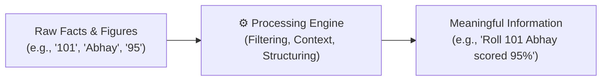
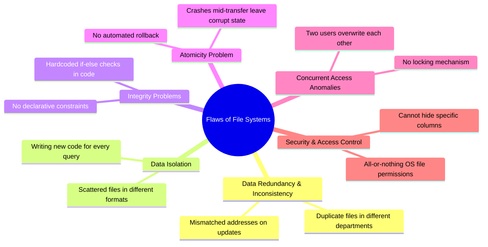
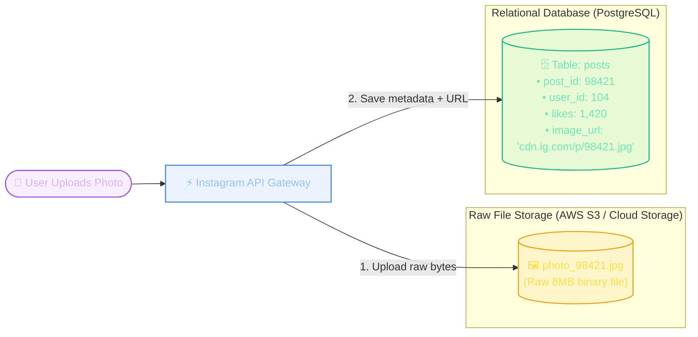

import CoreDoseLessonHeader from "@site/src/components/CoreDose/CoreDoseLessonHeader";
import CoreDoseTOC from "@site/src/components/CoreDose/CoreDoseTOC";
import CoreDoseNav from "@site/src/components/CoreDose/CoreDoseNav";

# 1.1 What is Data & DBMS? File Systems vs Database Systems

<CoreDoseLessonHeader
  module="Module 01: DBMS Foundations"
  topic="Topic 1.1"
  readTime="6 min read"
  relevance="Semester Exams • GATE CSE • Placement Technical Rounds"
/>

## 💡 Core Intuition

### 🍳 The Everyday Analogy: The Roommates' Kitchen Chaos
Imagine three college roommates sharing an apartment. Instead of having a single shared kitchen pantry, each roommate buys their own groceries and keeps spices locked in shoeboxes under their bed.
* **Redundancy**: You now have three identical, half-empty jars of salt taking up space in three different rooms.
* **Inconsistency**: One roommate's salt expired two years ago, while another's is fresh.
* **Isolation**: If Roommate A wants to cook soup, they have no idea if Roommate B or C has pepper without knocking on every door.
* **Race Conditions**: If two roommates rush to use the last remaining cooking oil at the exact same moment, they end up fighting over it or spilling it.

A **DBMS** is the master kitchen pantry: a single, organized cabinet with labeled jars, access rules, and an absolute guarantee that everyone shares the exact same fresh ingredients without stepping on each other's toes.

### 💻 Bridging to Computer Science
Before DBMS software was invented, operating systems stored business records in separate flat files (like spreadsheets or CSVs). This raw file approach caused duplicate customer entries across departments (**redundancy**), mismatched addresses when one department updated records but another didn't (**inconsistency**), lost updates during simultaneous edits (**concurrency bugs**), and corrupt balances when machines crashed mid-transfer (**lack of atomicity**).

A **Database Management System (DBMS)** is the intelligent software shield sitting between user applications and physical storage disks to guarantee multi-user safety, crash recovery, and single-source-of-truth integrity.

---

<CoreDoseTOC toc={toc} />

---

## 🔬 Core Definitions: Data, Information & Database

### 1. Data vs. Information
* **Data**: Any raw facts, unorganized figures, or observations about an entity. 
  > 💡 *Exam Tip*: The singular form of data is **`Datum`**.
* **Information**: Processed, structured, and contextualized data that conveys real meaning to the recipient.
* **The Relationship**: Data is the raw ingredient; Information is the meaningful output.

### 2. What is a Database?
A **Database** is a persistent, logically coherent, and organized collection of related data, stored electronically on secondary storage so it can be accessed, queried, and updated efficiently.

### 3. What is a DBMS?
A **Database Management System (DBMS)** is a comprehensive software suite that provides an interface between the database, end-user applications, and the underlying operating system. It provides tools to:
* **Define** data structures (DDL - Data Definition Language)
* **Manipulate** and query data (DML - Data Manipulation Language)
* **Control** security, concurrent access, and recovery (DCL & TCL)

> 📌 **The Database System Equation**:  
> **Database System = Database + DBMS Software + Application Programs + Users**

---

## ⚠️ Why File Systems Failed: The 6 Classic File System Flaws

In early computing (and in simple scripts), data was stored directly in OS flat files (like `.txt` or `.csv`). In college exams and technical interviews, you will frequently be asked: *"Why can't we just use file systems instead of a DBMS?"*

Here are the 6 critical architectural flaws solved by DBMS:

### 1. Data Redundancy and Inconsistency
**Redundancy**: The exact same student or customer record is duplicated across multiple department files (e.g., Accounts file and Library file both store Student Phone Number).  
**Inconsistency**: If the student updates their phone number in the Library, but the Accounts file is not updated, the database enters an inconsistent state.

### 2. Difficulty in Accessing Data
If a manager asks: *"Find all students living in Bhopal with a GPA > 8.5 who checked out a book today"*, a file system has no query language. An engineer must write a custom C++ or Python program from scratch just to parse the files.

### 3. Data Isolation
Data is scattered across different files, often created by different programmers in incompatible file formats (binary, text, fixed-width), making cross-referencing extraordinarily difficult.

### 4. Integrity Problems
In a database, we can easily enforce rules: `Salary > 0` or `Age >= 18`. In a file system, these rules are hardcoded into application code. When new rules are added, every single program modifying the file must be rewritten.

### 5. Atomicity Problems
If a bank transfer deducts 500 dollars from Account A and the server crashes *before* crediting Account B, the file system leaves money permanently lost. A DBMS guarantees **Atomicity**: either the entire transaction commits, or it is completely rolled back.

### 6. Concurrent Access Anomalies (Race Conditions)
If two users attempt to book the last seat on a flight simultaneously, an operating system file system allows both processes to read "1 seat free" and overwrite each other, causing double booking. DBMS uses **locks and concurrency protocols** to prevent this.

---

## 📊 Comparison: File System vs. Database Management System (DBMS)

| Feature | Traditional File System | Database Management System (DBMS) |
| :--- | :--- | :--- |
| **Data Redundancy** | High duplicate data across multiple files. | Minimized via normalization and single source of truth. |
| **Data Consistency** | Prone to serious inconsistency when data changes. | Guaranteed via ACID transactions and centralized updates. |
| **Querying Mechanism** | No standard query language; requires writing custom code. | Powerful, standardized query languages (SQL). |
| **Concurrent Access** | Extremely poor; prone to data overwrites and race conditions. | Sophisticated concurrency control (2PL, MVCC, Locking). |
| **Data Independence** | Zero; changing file structure breaks application code. | High; separates physical storage from logical views. |
| **Crash Recovery** | Manual, tedious, and often causes data corruption. | Automated recovery using Write-Ahead Logging (WAL). |
| **Security & Privacy** | Crude OS-level file permissions (read/write). | Granular role-based permissions down to row and column levels. |
| **Cost & Overhead** | Low memory and CPU overhead. | Higher RAM, CPU, and storage engine overhead. |

---

## 👥 Components of the Database Environment

A functioning database system consists of 5 tightly integrated components:

1. **Hardware**: Secondary storage disks (SSDs/HDDs), main memory (RAM), and server processors.
2. **Software**: The DBMS engine itself, operating system file managers, and client applications.
3. **Data**: The operational records stored in tables, plus metadata stored in the **Data Dictionary**.
4. **Procedures**: The operational rules, backup schedules, transaction guidelines, and failover instructions.
5. **People (Users)**:
   * **Database Administrator (DBA)**: The person/team responsible for permissions, performance tuning, and schema integrity.
   * **Application Programmers**: Developers writing SQL queries, ORM code, and business logic.
   * **End Users**: Everyday users interacting through mobile apps and web forms without knowing SQL.

---

## 🏭 In The Real World: Production Case Study

### "Why Doesn't Instagram Store Your Photos in a Database?"

A common beginner mistake is assuming that modern tech companies store *everything* inside a DBMS. 

If Instagram stores your posts in a database, why don't they store the actual JPEG photo file directly inside PostgreSQL as a binary `BLOB` (Binary Large Object)?

#### Why Storing Raw Files in a DBMS Fails at Scale:
1. **Buffer Pool Pollution**: A DBMS caches table pages in expensive server RAM (Buffer Pool). Loading 10MB photo files exhausts RAM, evicting critical database indexes and crashing query performance.
2. **Replication & Backup Bloat**: Backing up or replicating a multi-terabyte database across data centers takes hours. Backing up metadata takes seconds.
3. **Database Connection Saturation**: Serving large file downloads directly from a database holds open valuable database connection threads for seconds, causing request queues to spike.

#### The Production Hybrid Pattern:
* **The File / Object System (AWS S3)** stores the raw immutable bytes (photos, videos, PDFs) cheaply with fast CDN distribution.
* **The DBMS (PostgreSQL / MySQL)** stores only the relational metadata (`user_id`, `timestamp`, `likes_count`) and a lightweight string pointer (`image_url`).

> **Engineering Rule of Thumb**: Use a **File System** for large, unstructured, streaming media bytes. Use a **DBMS** for relationships, transactions, fast indexing, and structured records.

---

## 🎯 Exam & Interview Pitfall Check

:::tip Core Conceptual Questions

**Question 1:** *"Explain 4 core differences between a File System and a DBMS."*  
**Key Focus Points:** Always highlight **Redundancy**, **Consistency**, **Atomicity**, and **Concurrent Access**. Conclude with the classic banking transaction example (Account A transferring funds to Account B) to demonstrate complete understanding.

**Question 2:** *"Define Data Redundancy and Data Inconsistency. How does a DBMS eliminate both?"*  
**Key Focus Points:** Define redundancy as duplicate data stored across multiple departmental files. Define inconsistency as mismatched records after partial updates. Explain how a DBMS centralizes storage through relational normalization and enforces constraints (e.g. `FOREIGN KEY`, `NOT NULL`) so an update in one place reflects everywhere automatically.
:::

:::warning Common Interview Traps: Architectural Trade-Offs

**Trap 1: Is a DBMS always superior to a traditional file system?**  
**Answer: No.** If an application is a lightweight, single-user local tool or mobile game reading small, static configuration files (e.g. `settings.json`), a DBMS introduces unnecessary RAM, CPU, and storage overhead. A simple operating system file read is preferred for lightweight, non-concurrent, embedded setups.

**Trap 2: If a DBMS is safer, why do high-speed logging engines (like Apache Kafka) write to raw disk files instead?**  
**Answer: Sequential Write Throughput.** Appending bytes to the end of a raw sequential file on disk approaches the physical hardware bandwidth limit of the disk (hundreds of MB/s) with near-zero CPU overhead. A relational DBMS must parse SQL, update B+ tree indexes, write WAL logs, and acquire row locks, which caps write speeds. For massive event streams, raw sequential disk logging is vastly faster.
:::

---

<CoreDoseNav
  prev={null}
  next={{
    title: "1.2 Three-Schema ANSI/SPARC Architecture & Data Independence",
    url: "/coredose/dbms/chapter-01/three-schema-architecture-and-data-independence"
  }}
  courseUrl="/coredose/dbms"
/>
