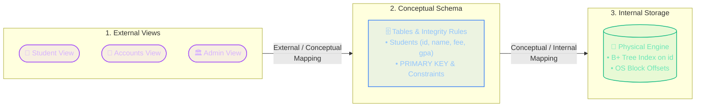
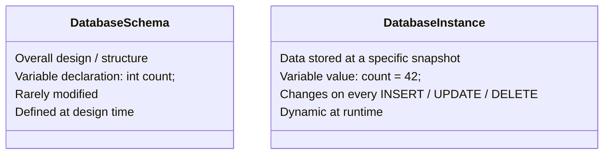
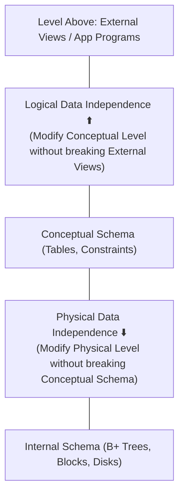
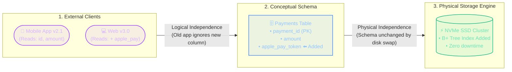

import CoreDoseLessonHeader from "@site/src/components/CoreDose/CoreDoseLessonHeader";
import CoreDoseTOC from "@site/src/components/CoreDose/CoreDoseTOC";
import CoreDoseNav from "@site/src/components/CoreDose/CoreDoseNav";

# 1.2 Three-Schema Architecture & Data Independence

<CoreDoseLessonHeader
  module="Module 01: DBMS Foundations"
  topic="Topic 1.2"
  readTime="7 min read"
  relevance="Semester Exams • GATE CSE (High-Frequency) • SDE System Design"
/>

## 💡 Core Intuition

### 🚗 The Everyday Analogy: The Driver, The Blueprint & The Engine
Think about what happens when you drive a modern car:
* **The External View (The Driver)**: You interact only with the steering wheel, accelerator pedal, and digital speedometer. You don't need to see the pistons or spark plugs.
* **The Conceptual View (The Mechanics)**: The structural blueprint connecting the steering column to the axles, transmission, and brake pads.
* **The Internal View (The Physics)**: The chemical fuel injection, piston combustion strokes, or high-voltage electric battery cells.

Now ask yourself: If the car manufacturer swaps a petrol engine for an electric motor under the hood (**Internal Level**), do you need to learn how to steer with a brand new steering wheel?  
**No!** The physical engine changed completely, but the driver's interface remained 100% untouched. This separation is **Data Independence**.

### 💻 Bridging to Computer Science
In 1975, the ANSI/SPARC committee realized that database software desperately needed this exact three-layer separation. 

Instead of forcing frontend apps and SQL queries to know which physical disk sectors hold bytes, the **Three-Schema Architecture** establishes three decoupled layers:
1. **External Level (Views)**: What specific end-users see (e.g. students see exam grades, accountants see fee receipts).
2. **Conceptual Level (Logical)**: What tables, relationships, and constraints exist globally across the enterprise.
3. **Internal Level (Physical)**: How records, B+ trees, and block offsets are laid out on storage SSDs.

Because these layers connect through **Mappings**, database administrators can tune storage hardware or add indexes underneath without breaking user applications.

---

<CoreDoseTOC toc={toc} />

---

## 🏗️ The 3-Level ANSI/SPARC Architecture

---

### 1. External Level (View Level / Subschema)
* **What it is**: The highest level of data abstraction, closest to real users.
* **How it works**: Different users have completely different requirements. A student checking their result only needs to see `Name`, `Subject`, and `Grade`. They should **never** see financial debts, salt hashes, or salary tables.
* **Subschema**: A view defined for a specific user group that presents only the relevant subset of the database.
* **Key Goal**: User convenience and data security (hiding private attributes).

---

### 2. Conceptual Level (Logical Level)
* **What it is**: The middle level that describes **WHAT** data is stored in the entire database and **WHAT relationships** exist among those data items.
* **Who works here**: Database Administrators (DBAs) and Application Developers.
* **Key Elements**:
  * All entities, attributes, and relationships.
  * Integrity constraints (Primary Keys, Foreign Keys, `NOT NULL`, `CHECK`).
  * The Entity-Relationship (ER) model and Relational Schema tables.
* **Note**: It completely hides physical storage details. At this level, you only care that table `Students` has an `id INT` column—you do not care which physical cylinder or disk sector it sits on.

---

### 3. Internal Level (Physical Level)
* **What it is**: The lowest level of data abstraction, describing **HOW** the data is physically stored on storage media (HDDs, SSDs, SAN).
* **Details Handled**:
  * Allocation of storage blocks and byte alignments.
  * Data compression and encryption techniques.
  * Access paths: B+ Tree indices, Hashing tables, and record pointer chains.
* **Who manages it**: Database storage engine developers and system-level DBAs.

---

## 🔄 The Role of Mappings

The Three-Schema architecture works because of two bidirectional translators called **Mappings**:

### 1. External / Conceptual Mapping
* Connects a specific user view to the global logical tables.
* If a view requests `Full_Name`, this mapping translates it into `CONCAT(first_name, ' ', last_name)` from the conceptual table.

### 2. Conceptual / Internal Mapping
* Connects logical table rows to physical disk addresses and byte offsets.
* If a query asks for `id = 42`, this mapping uses the internal B+ Tree index pointer to retrieve disk block `#8412`.

---

## ⏱️ Database Schema vs. Database Instance

A classic examination distinction:

**Database Schema**: The blueprint or overall design of the database (table names, column types, constraints). Analogous to a class declaration or `int x;` in programming. It rarely changes.  
**Database Instance**: The actual collection of data records stored in the database at a **particular moment in time**. Analogous to variable values `x = 10;`. It changes dynamically with every write query.

---

## 🛡️ Data Independence: Logical vs. Physical

**Data Independence** is the capacity to change the schema at one level of a database system without having to change the schema at the next higher level.

### 1. Logical Data Independence
**Definition**: The ability to modify the **Conceptual Schema** without altering the External Schemas or application programs.

* **Example**:
  * Adding a new column `blood_group` to the `Students` table.
  * Splitting an employee table into two tables (`Emp_Personal` and `Emp_Salary`).
* **Why it doesn't break apps**: Only the *External/Conceptual Mapping* is updated. Existing applications that only query `name` and `roll_number` continue executing without rewriting code.

### 2. Physical Data Independence
**Definition**: The ability to modify the **Internal Schema** without altering the Conceptual Schema or application programs.

* **Example**:
  * Moving database files from an HDD to a high-speed NVMe SSD.
  * Adding a new **B+ Tree Index** on `employee_id` to speed up searches.
  * Changing file organization from a linear Heap file to Hashed blocks.
* **Why it doesn't break apps**: Only the *Conceptual/Internal Mapping* is adjusted. The logical tables and user queries remain identical.

---

## ⚖️ Logical vs. Physical Data Independence: The Critical Comparison

| Parameter | Logical Data Independence | Physical Data Independence |
| :--- | :--- | :--- |
| **Level Affected** | Conceptual Schema &rarr; External Views. | Internal Schema &rarr; Conceptual Schema. |
| **Frequency of Change** | Low (tables and business rules change infrequently). | High (indexes, storage hardware, and performance tuning happen often). |
| **Ease of Implementation** | **Much Harder** to achieve. | **Much Easier** to achieve. |
| **Reason for Difficulty** | Changing logical schema directly alters data semantics and entity relationships. | Changing storage algorithms only changes speed, not data meaning. |

---

## 🏭 In The Real World: Production Case Study

### "Zero-Downtime Database Migrations at Stripe & Shopify"

Have you ever wondered how global platforms like Stripe or Amazon upgrade their database infrastructure or add new features without taking their website offline for maintenance?

This is **Three-Schema Architecture & Data Independence** in action.

#### Scenario A: The Physical Migration (Physical Data Independence)
**The Operation**: Stripe DBAs move transaction tables from standard network storage to high-speed NVMe SSD drives and rebuild B+ tree indexes to optimize query speed.  
**The Impact on Application Code**: **Zero.** Because the query syntax (`SELECT * FROM payments WHERE payment_id = ?`) belongs to the Conceptual Level, the physical storage changes happen underneath without altering a single line of backend application code.

#### Scenario B: The New Feature Rollout (Logical Data Independence)
**The Operation**: Stripe adds Apple Pay support. Engineers add a new column: `apple_pay_token VARCHAR(255)`.  
**The Impact on Older Apps**: Older mobile apps (External View v2.1) do not know Apple Pay exists. Because their external view only requests `id, amount, card_last4`, the newly added column at the conceptual level does not crash older devices.

---

## 🎯 Exam & Interview Pitfall Check

:::tip Core Conceptual Questions

**Question 1:** *"Explain the Three-Schema ANSI/SPARC Architecture with a neat diagram. Differentiate between Schema and Instance."*  
**Key Focus Points:** Draw the three-tier diagram (External &harr; Conceptual &harr; Internal). Explain that the **Schema** is the static design/blueprint established at design time (analogous to `int x;`), while the **Instance** is the dynamic collection of operational records at a specific snapshot in time (analogous to variable value `x = 42;`).

**Question 2:** *"Differentiate between Logical and Physical Data Independence with practical examples."*  
**Key Focus Points:** Define both levels. Point out that **Logical Independence** shields user views from conceptual changes (e.g., adding `blood_group` column), while **Physical Independence** shields the conceptual schema from hardware/storage changes (e.g., creating a B+ tree index or moving to SSDs). State explicitly that Logical Independence is much harder to achieve.
:::

:::warning Common Interview Traps: Architectural Trade-Offs

**Trap 1: Does dropping or renaming a column violate Logical Data Independence?**  
**Answer: Yes, unless an abstraction view is maintained.** Adding a column is safe because older views ignore unseen attributes. However, **dropping or renaming** an active column immediately breaks application queries referencing that name. In production, engineers use the **Expand-Contract Pattern**: add the new column first, mirror writes to both, update all views/apps, and only drop the old column weeks later.

**Trap 2: Why is 100% Logical Data Independence rare in modern startups?**  
**Answer: ORM Tight-Coupling.** Many modern web frameworks use Object-Relational Mappers (like Prisma, Hibernate, or Django ORM) that map database tables directly to code models without an intermediate SQL `VIEW` layer. Consequently, altering a table schema frequently requires updating and redeploying backend code models.
:::

---

<CoreDoseNav
  prev={{
    title: "1.1 What is Data & DBMS? File Systems vs Database Systems",
    url: "/coredose/dbms/chapter-01/introduction-to-dbms-and-database-systems"
  }}
  next={{
    title: "1.3 Types of Databases, DBA Roles & Data Dictionary",
    url: "/coredose/dbms/chapter-01/types-of-databases-and-dbms-architecture"
  }}
  courseUrl="/coredose/dbms"
/>
