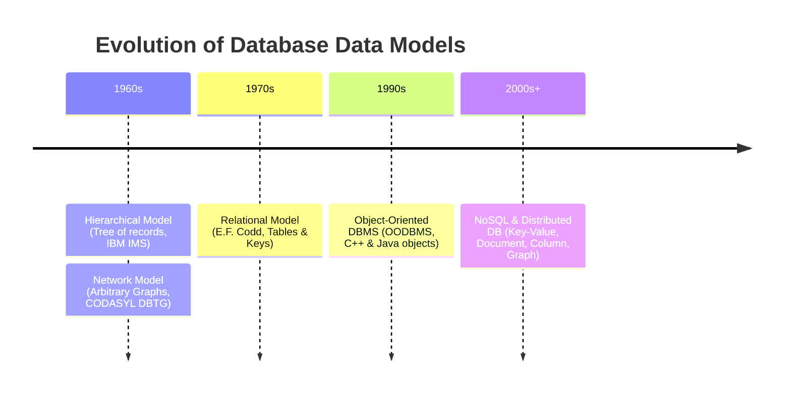
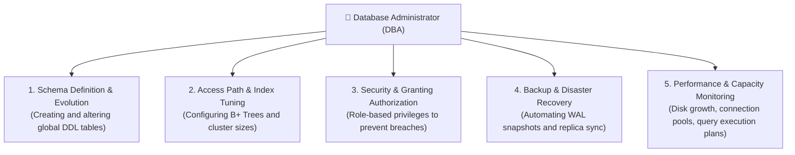
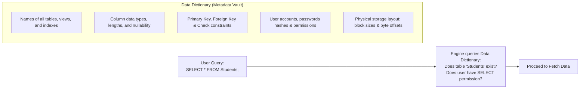
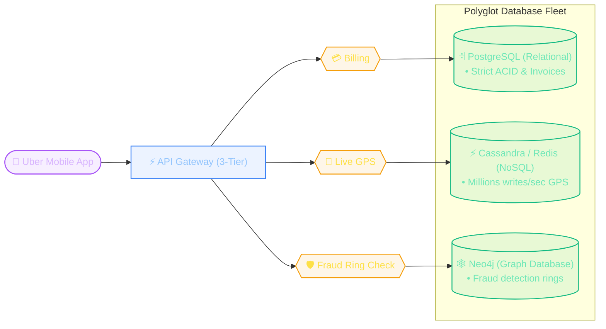

import CoreDoseLessonHeader from "@site/src/components/CoreDose/CoreDoseLessonHeader";
import CoreDoseTOC from "@site/src/components/CoreDose/CoreDoseTOC";
import CoreDoseNav from "@site/src/components/CoreDose/CoreDoseNav";

# 1.3 Types of Databases, DBA Roles & Data Dictionary

<CoreDoseLessonHeader
  module="Module 01: DBMS Foundations"
  topic="Topic 1.3"
  readTime="6 min read"
  relevance="Semester Exams • GATE CSE • System Administration"
/>

## 💡 Core Intuition

### 🧬 The Everyday Analogy: The Living Body and Its DNA
Think about how a complex living organism functions:
* **The Living Cells & Organs (The Operational Data)**: Every cell in your body is continuously carrying oxygen, processing nutrients, and doing work (analogous to table records holding users and transactions).
* **The DNA Blueprint (The Data Dictionary)**: DNA doesn't perform muscle contractions itself. Instead, DNA is the sacred genetic blueprint that defines what a heart cell looks like, how chromosomes are structured, and which biological operations are permitted.
* **The Immune System & Brain (The DBA)**: The brain and immune system monitor vital signs, grant antibodies access, repair damaged tissue, and maintain overall system health.

Without DNA, an organism wouldn't know how to construct a single new cell. In a database, without the **Data Dictionary**, the storage engine is just a blind collection of magnetic bytes with no idea where tables begin, what columns exist, or what constraints must be enforced.

### 💻 Bridging to Computer Science
In the 1960s, mainframe computers forced programmers to navigate records manually using rigid **Hierarchical Trees** and pointer-heavy **Network Graphs**—if a single pointer broke, the entire query crashed.

In 1970, mathematician Edgar F. Codd revolutionized computing by introducing the **Relational Model**: organizing data into declarative tables (relations) governed by mathematical set theory rather than hardware pointers.

To keep these complex engines secure and optimized at scale, the **Database Administrator (DBA)** manages access roles and disaster recovery, relying on the **Data Dictionary (System Catalog)**—the self-describing metadata vault that stores the master blueprint of the entire database.

---

<CoreDoseTOC toc={toc} />

---

## 🏛️ Evolution of Data Models

---

### 1. Hierarchical Data Model
* **Core Structure**: Organized as a collection of **Trees** (inverted tree hierarchy).
* **Relationships**: Strictly **Parent-Child (1:N)** relationships. A parent node can have multiple children, but each child can have **only one parent**.
* **Traversal**: Requires traversing down from the root node along predefined pointer paths.
* **Limitation**: Cannot naturally model Many-to-Many (M:N) relationships (e.g. Students enrolled in multiple Courses) without duplicating subtrees.
* **Example**: IBM IMS (Information Management System).

---

### 2. Network Data Model
* **Core Structure**: Organized as a collection of **Arbitrary Graphs**.
* **Relationships**: Allows children (called *Members*) to have multiple parents (called *Owners*), directly enabling **Many-to-Many (M:N)** relationships.
* **Traversal**: Uses complex bidirectional pointer links between record sets.
* **Limitation**: Pointer spaghetti! If a database developer modified a link structure, application programs that navigated the graph broke completely.
* **Standard**: CODASYL DBTG model.

---

### 3. Relational Data Model (The Industry Standard)
* **Introduced by**: Dr. Edgar F. Codd at IBM in 1970.
* **Core Structure**: Data is organized into 2D tables called **Relations**, consisting of rows (**Tuples**) and columns (**Attributes**).
* **Pointer-Free**: No physical tree or graph pointers are exposed to users! Relationships between tables are created entirely using shared values (**Primary Keys & Foreign Keys**).
* **Query Language**: Declarative Structured Query Language (**SQL**)—you specify *WHAT* data you want, and the database engine figures out *HOW* to retrieve it.
* **Examples**: PostgreSQL, MySQL, Oracle Database, Microsoft SQL Server.

---

### 4. Modern NoSQL & Specialized Databases
When big data web applications needed horizontal scaling across thousands of cloud servers, NoSQL (Not Only SQL) emerged:

| NoSQL Model | Underlying Structure | Primary Use Case | Popular Engines |
| :--- | :--- | :--- | :--- |
| **Document Store** | JSON / BSON hierarchies | Catalogs, Content Management, User Profiles | MongoDB, CouchDB |
| **Key-Value Store** | Fast In-Memory Hash Maps | Caching, User Sessions, Shopping Carts | Redis, AWS DynamoDB |
| **Wide-Column** | Sparse 2D Distributed Tables | Massive time-series, analytics, IoT | Apache Cassandra, HBase |
| **Graph Database** | Nodes, Edges & Properties | Social networks, Fraud detection, Knowledge graphs | Neo4j, Amazon Neptune |

---

## 🛡️ The Database Administrator (DBA)

The **Database Administrator (DBA)** is the individual (or operations team) with master authorization over the entire database system. 

### Key Responsibilities of a DBA:
1. **Schema Definition**: Writes the conceptual schema definitions via DDL to design tables and constraints.
2. **Storage Structure & Access Path Definition**: Decides how data is partitioned across physical disks and creates optimal indexes to accelerate critical queries.
3. **Granting of Authorization**: Assigns access permissions to developers, applications, and end-users, ensuring sensitive data is protected.
4. **Integrity Constraint Specification**: Enforces business rules (Foreign Keys, unique constraints, check conditions).
5. **Routine Maintenance & Disaster Recovery**:
   * Running daily database backups.
   * Ensuring adequate free disk space.
   * Monitoring system load and tuning slow queries.

---

## 📖 The Data Dictionary (System Catalog)

What makes a database "self-describing"? The **Data Dictionary**!

> 💡 **Core Definition**: The **Data Dictionary** (also known as the **System Catalog**) is a specialized set of read-only system tables containing **Metadata** (*data about data*).

### Why Most DBMS Keep the Data Dictionary Hidden:
The data dictionary is typically protected from direct manual editing by end users. If an unauthorized user accidentally runs `DROP` or corrupts a catalog row, the database engine would no longer know where physical table records live, causing catastrophic system-wide failure.

---

## 🏭 In The Real World: Production Case Study

### "Polyglot Persistence: How Uber Uses Multiple Database Types"

In enterprise production engineering, no single database engine handles every workload. Large tech companies use **Polyglot Persistence**—choosing the optimal database model for each specific microservice.

#### 1. Why 2-Tier Architecture is Banned in Mobile Apps
In a **2-Tier setup**, the client application connects directly to the database port (e.g. `3306`).  
If a mobile app did this, an attacker could decompile the `.apk` file, extract the database credentials, and drop production tables!  
In **3-Tier architecture**, the mobile client only speaks HTTPS to an intermediate application server (Node.js/Go/Java). The database sits in a private subnet completely inaccessible from the public internet.

#### 2. The Data Dictionary in Production (MySQL `information_schema`)
When an ORM or engineer runs `EXPLAIN SELECT * FROM trips WHERE driver_id = ?`, the query optimizer does not guess.  
It queries the **Data Dictionary** to check index selectivity, table statistics, and column data types before generating the optimal binary execution plan.

---

## 🎯 Exam & Interview Pitfall Check

:::tip Core Conceptual Questions

**Question 1:** *"Differentiate between 2-Tier and 3-Tier DBMS Architecture with neat diagrams. Why is 3-Tier preferred for web applications?"*  
**Key Focus Points:** Draw the 2-Tier (Client &harr; DB Server) and 3-Tier (Client &harr; Application Server &harr; DB Server) diagrams. Highlight that 3-Tier provides enhanced security (database credentials never touch client machines), horizontal scalability (application servers can scale independently), and connection pooling.

**Question 2:** *"What are the primary responsibilities of a Database Administrator (DBA)?"*  
**Key Focus Points:** Detail the 5 core functions: Schema definition & modification, Storage structure & access method specification, Granting user authorization & security roles, Routine backups & disaster recovery, and Monitoring performance tuning.

**Question 3:** *"What is a Data Dictionary (System Catalog)? Why is it referred to as the 'self-describing' nature of a database?"*  
**Key Focus Points:** Define it as the repository of metadata (data about data). Explain that unlike file systems where data files have no embedded understanding of their own structure, a DBMS stores schemas, column types, and constraints inside itself, making it self-describing.
:::

:::warning Common Interview Traps: Architectural Trade-Offs

**Trap 1: Can you manually modify rows inside the Data Dictionary (`information_schema`)?**  
**Answer: Absolutely not.** Modifying the data dictionary directly through manual `UPDATE` statements is strictly blocked or prohibited in production DBMS engines. If a DBA directly corrupts metadata pointers (e.g. changing block offsets or table ids), the storage engine can no longer locate table pages on disk, resulting in unrecoverable database corruption.

**Trap 2: When is a NoSQL database a worse choice than a Relational DBMS?**  
**Answer: Financial Ledger & Atomic Transfers.** If your domain requires multi-table transactions, foreign key integrity, and zero data loss (e.g. banking transfers, order checkouts, inventory reservation), a relational DBMS with ACID guarantees is essential. NoSQL systems that prioritize eventual consistency can lead to phantom balances and double-spend race conditions.
:::

---

## 🎯 Module 1 Mastery Checklist

Before moving to **Module 2: Entity-Relationship (ER) Model**, verify that you can answer these high-frequency exam questions:

* [x] **Data vs Information vs Datum**: Can you explain the difference in 1 sentence?
* [x] **The 6 File System Flaws**: Redundancy, Inconsistency, Isolation, Integrity, Atomicity, Concurrency.
* [x] **Three-Schema Architecture**: External (Views) &harr; Conceptual (Logical) &harr; Internal (Physical).
* [x] **Data Independence**: Why is Physical Data Independence easier to achieve than Logical?
* [x] **Schema vs Instance**: Static blueprint vs Dynamic runtime snapshot.
* [x] **DBA & Data Dictionary**: The master role and the self-describing metadata engine.
* [x] **2-Tier vs 3-Tier Architecture**: Security, connection pooling, and web application isolation.

---

<CoreDoseNav
  prev={{
    title: "1.2 Three-Schema Architecture & Data Independence",
    url: "/coredose/dbms/chapter-01/three-schema-architecture-and-data-independence"
  }}
  next={{
    title: "2.1 Entities, Attributes & Keys: Foundations of ER Modeling",
    url: "/coredose/dbms/chapter-02/entities-attributes-and-keys"
  }}
  courseUrl="/coredose/dbms"
/>
