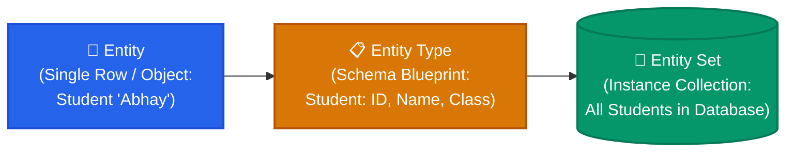
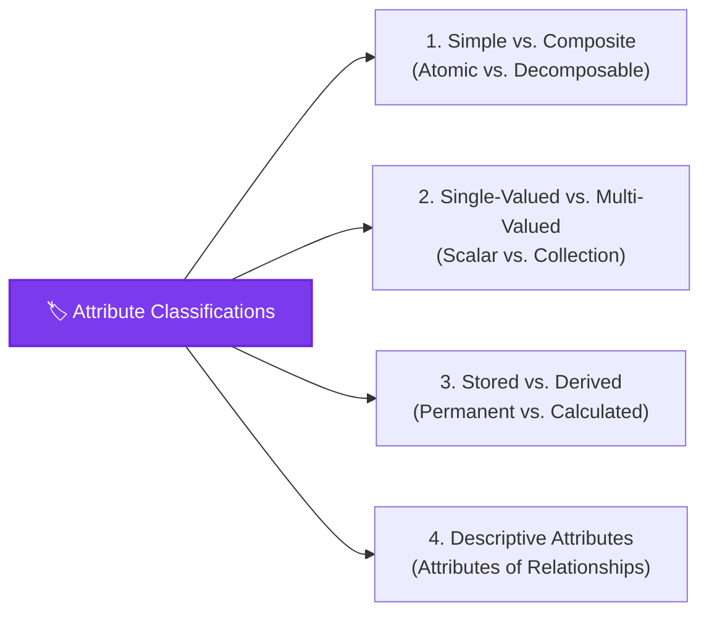
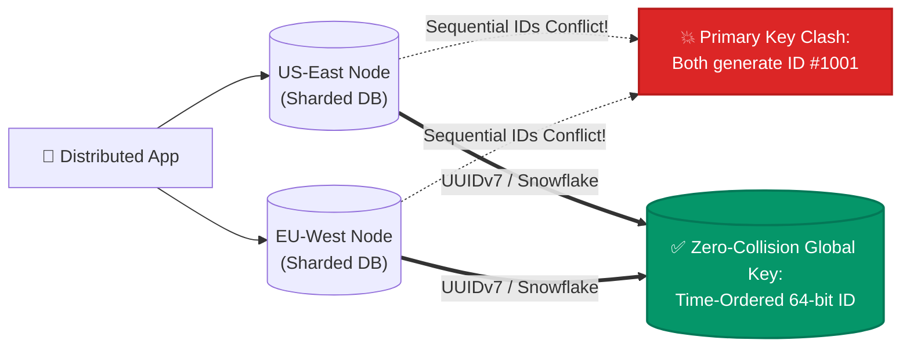

import CoreDoseLessonHeader from "@site/src/components/CoreDose/CoreDoseLessonHeader";
import CoreDoseTOC from "@site/src/components/CoreDose/CoreDoseTOC";
import CoreDoseNav from "@site/src/components/CoreDose/CoreDoseNav";

# 2.1 Entities, Attributes & Keys: Foundations of ER Modeling

<CoreDoseLessonHeader
  module="Module 02: Entity-Relationship (ER) Model"
  topic="Topic 2.1"
  readTime="7 min read"
  relevance="Conceptual Modeling • University Exams • System Schema Design"
/>

## 💡 Core Intuition

### 🍳 The Everyday Analogy: The Passport Office & Identity Files
Imagine walking into a passport verification center.
* **The Entity**: You—a real-world living person with a physical existence.
* **The Entity Set**: The collection of all citizens currently applying for a passport today.
* **The Attributes**: Your specific descriptive traits—your full name, date of birth, height, home address, and list of phone numbers.
* **The Key**: Your government National Identity Number or Passport Number. Two citizens might share the same first and last name, identical birth dates, and even live in the same apartment building, but their Passport Number is strictly unique across the nation.

Before architects lay down concrete or write SQL code to create database tables, they must draw a conceptual blueprint of the real world. The **Entity-Relationship (ER) Model** is that blueprint: identifying *what things exist* (Entities), *what details describe them* (Attributes), and *what guarantees distinctness* (Keys).

### 💻 Bridging to Computer Science
Introduced in 1976 by **Dr. Peter Chen**, the **Entity-Relationship (ER) Model** is a non-technical, high-level conceptual data modeling technique based on the perception of the real world. It operates strictly as a **Top-Down approach** to database design.

In an ER diagram, we do **not** represent individual entities (tuples/data); we only represent **Entity Sets (Schema)**, providing an unambiguous, standard logical structure that can be easily understood by software engineers, database administrators, and non-technical stakeholders alike.

---

<CoreDoseTOC toc={toc} />

---

## 🏛️ Entity, Entity Type & Entity Set

In ER modeling, precise terminology is essential:

### 1. What is an Entity?
An **Entity** is a thing or object in the real world that is distinguishable from all other objects based on the values of the attributes it possesses.
* **Tangible Entities**: Entities that physically exist in the real world (e.g. *Car*, *Pen*, *Person*, *Locker*).
* **Intangible Entities**: Entities that exist logically or conceptually (e.g. *Bank Account*, *Video*, *Course*, *Flight Reservation*).

### 2. Entity Set vs. Relational Table
An **Entity Set** is a collection of entities of the same entity type that share the same properties or attributes:

| ID | NAME | CLASS | Row / Collection Meaning |
| :---: | :---: | :---: | :--- |
| **1** | Abhay | 7 | $\leftarrow$ **Single Row** $=$ **Entity (Instance)** |
| **2** | Anjali | 8 | $\leftarrow$ **Single Row** $=$ **Entity (Instance)** |
| **3** | Anuj | 9 | $\leftarrow$ **Single Row** $=$ **Entity (Instance)** |
| **4** | Deepak | 11 | $\leftarrow$ **Single Row** $=$ **Entity (Instance)** |
| **Table** | **Student** | **Schema** | $\leftarrow$ **Collection of Rows** $=$ **Entity Set** |

:::info The Golden ER Invariant
In an **E-R diagram, we never represent individual entities**. We **only represent Entity Sets**.  
*Why?* Because entities are runtime data instances (tuples), whereas an E-R diagram represents only the **system schema (blueprint)**. Furthermore, because an Entity Set is mathematically a *set*, **order is insignificant** and **duplicate rows are strictly prohibited**.
:::

---

## 🏷️ Classification of Attributes & Domains

**Attributes** are units that define and describe the properties and characteristics of entities.  
The **Domain** of an attribute is the set of all permitted, legal atomic values that the attribute can take.

### 1. Simple vs. Composite Attributes
* **Simple (Atomic) Attribute**: Cannot be divided into sub-parts.  
  *Examples*: `Roll_No`, `Aadhar_No`, `Salary`.
* **Composite Attribute**: Can be subdivided into smaller sub-components that have independent meanings of their own. Represented by an ellipse connected to sub-ellipses.  
  *Example*: $\text{Name} \rightarrow (\text{First\_Name}, \text{Last\_Name})$  
  *Example*: $\text{Address} \rightarrow (\text{Street}, \text{City}, \text{State}, \text{Pincode})$
  > 💡 *Relational Translation*: In the relational model, each composite attribute is decomposed into **separate individual columns** for each atomic sub-part.

### 2. Single-Valued vs. Multi-Valued Attributes
* **Single-Valued Attribute**: Holds exactly one scalar value for an entity at any given instance of time. Represented by a **Single Ellipse**.  
  *Examples*: `Aadhar_No`, `Roll_No`, `DOB`.
* **Multi-Valued Attribute**: Can hold more than one value for an entity at the same time. Represented by a **Double Ellipse** (`((Attribute))`).  
  *Examples*: `Phone_Numbers`, `Email_Addresses`, `Skills`.
  > ⚠️ *Relational Rule*: Relational tables must satisfy First Normal Form (1NF), which forbids multi-valued cells. A multi-valued attribute **always requires a separate table** in the relational model, containing the multi-valued attribute and the primary key of the main table as a foreign key:
  > $$\text{EMP\_PHONE}(\underline{\text{EmpId}, \text{PhoneNumber}})$$

### 3. Stored vs. Derived Attributes
* **Stored Attribute**: An attribute whose value is permanently stored physically in the database.  
  *Example*: `Date_of_Birth`.
* **Derived Attribute**: An attribute whose value is not stored physically, but is calculated/derived on-the-fly from other stored attributes. Represented by a **Dotted / Dashed Ellipse** (`( - - Age - - )`).  
  *Example*: $\text{Age} = \text{Current\_Date} - \text{Date\_of\_Birth}$.

### 4. Descriptive Attributes
A **Descriptive Attribute** is an attribute that belongs to a **Relationship Set** rather than an entity set!

**Example**: `[Employee]` works in `[Department]`. The date they joined that department (`Since`) is a property of the relationship `<Works>`, not the employee or the department alone. Represented as an ellipse connected directly to the relationship diamond.

### 5. Null Attributes
A `NULL` value can designate that:
1. An attribute value is unknown (missing or not yet recorded).
2. An attribute is inapplicable to a specific entity instance (e.g. `Apartment_Number` for a rural standalone bungalow).

---

## 🔑 Key Hierarchies: Super Key, Candidate Key & Primary Key

Keys are fundamental constraints that ensure all tuples in an entity set are distinguishable:

* **Super Key ($SK$)**: Any combination of attributes that uniquely identifies a row. If $K$ is a super key, then $(K \cup \{A\})$ is always a super key.
* **Candidate Key ($CK$)**: A minimal super key. Every candidate key is a super key, but not every super key is a candidate key.
* **Primary Key ($PK$)**: The single candidate key chosen by the database architect. It can **never accept NULL values** and must be immutable.

---

## 📐 Peter Chen ER Notation Quick Reference Table

| ER Geometric Symbol | Meaning & Concept | Relational Equivalent |
| :---: | :--- | :--- |
| **Rectangle** | Entity Set | Relation / Table |
| **Double Rectangle** | Weak Entity Set | Child Table with Composite PK |
| **Single Ellipse** | Simple / Single-Valued Attribute | Table Column |
| **Double Ellipse** | Multi-Valued Attribute | Separate Child Table |
| **Dashed / Dotted Ellipse** | Derived Attribute | Computed SQL View / Virtual Column |
| **Underlined Ellipse** | Key Attribute (Primary Key) | Primary Key Column |
| **Dashed Underlined Ellipse** | Partial Key (Discriminator) | Composite Key Component |
| **Diamond** | Relationship Set | Foreign Key or Junction Table |

---

## 🏭 In The Real World: Production Case Study

### Distributed User Identity at Scale: Uber & Stripe

When engineering systems handling billions of events, primary key selection impacts cross-region latency and indexing overhead:

**The Trap**: Relying on sequential auto-incrementing integer keys (`1, 2, 3...`) creates catastrophic primary key collisions when sharding databases across multiple geographic cloud regions.
 
**The Production Standard**: Distributed architectures utilize **UUIDv7** or **Snowflake IDs** (64-bit integer encoding millisecond timestamp + worker node ID + sequence counter), providing zero-coordination global uniqueness with high B+ tree locality.

---

## 🎯 Exam & Interview Pitfall Check

:::tip Core Conceptual Questions
**Question 1:** What is the fundamental difference between an Entity and an Entity Set? How are they represented?  
**Answer:**  
* An **Entity** is a single occurrence or instance of an object in the real world (e.g. Student "Abhay"). Entities are **never represented in an E-R diagram** because an E-R diagram portrays schema, not data instances.  
* An **Entity Set** is a collection of entities of the same type that share the same attributes (e.g. All Students). In an E-R diagram, an Entity Set is represented by a **Rectangle**. In the relational model, it maps to a **Table**.

**Question 2**: How is a Multi-Valued Attribute converted into the relational model?  
**Answer**:  
A multi-valued attribute (represented by a **double ellipse**) cannot be stored in a single relational cell without violating First Normal Form (1NF). It is converted into a **separate table** containing the multi-valued attribute and the primary key of the main entity table as a foreign key. The combination of both forms the composite primary key of the new table.
:::

:::warning Common Interview Traps
* **Trap 1: "Is an E-R model a physical, logical, or conceptual model?"**  
  The E-R model is strictly a **Conceptual Data Model**. It operates as a Top-Down approach independent of hardware, storage offsets, and SQL database engines.
* **Trap 2: "Where do Descriptive Attributes belong?"**  
  Descriptive attributes belong to the **Relationship Set** (the diamond), *not* to the participating entities. During relational conversion, they are placed into the table that represents the relationship (either the junction table in M:N, or the foreign-key side in 1:N).
:::

---

<CoreDoseNav
  next={{
    title: "2.2 Relationship Sets, Cardinality & Participation Constraints",
    url: "/coredose/dbms/chapter-02/relationship-sets-cardinality-and-participation"
  }}
  courseUrl="/coredose/dbms"
/>
