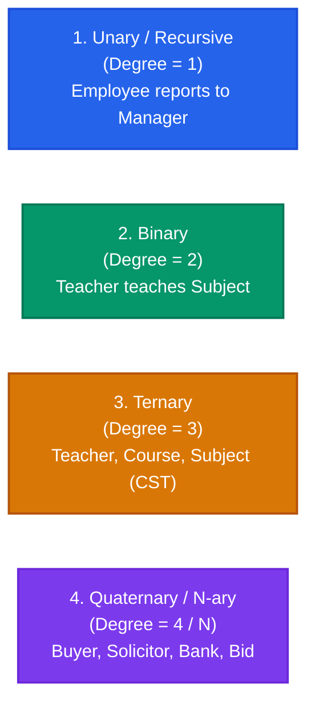
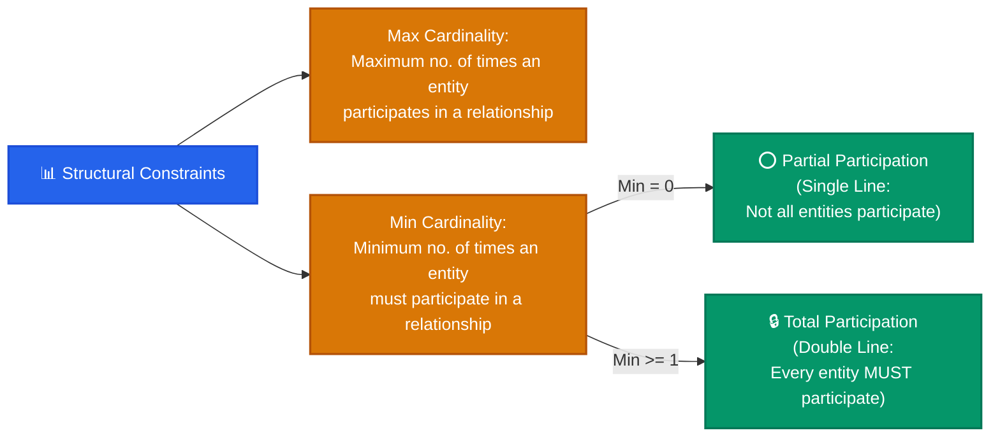
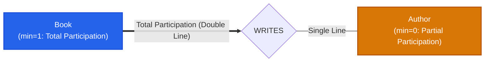

import CoreDoseLessonHeader from "@site/src/components/CoreDose/CoreDoseLessonHeader";
import CoreDoseTOC from "@site/src/components/CoreDose/CoreDoseTOC";
import CoreDoseNav from "@site/src/components/CoreDose/CoreDoseNav";

# 2.2 Relationship Sets, Cardinality & Participation Constraints

<CoreDoseLessonHeader
  module="Module 02: Entity-Relationship (ER) Model"
  topic="Topic 2.2"
  readTime="8 min read"
  relevance="Relational Normalization • University Exams • System Architecture"
/>

## 💡 Core Intuition

### 🍳 The Everyday Analogy: Marriage, Classrooms & Social Media
Think of how people interact in society:
* **One-to-One (1:1)**: A citizen and their legal passport. One citizen possesses exactly one passport; one passport belongs to exactly one citizen.
* **One-to-Many (1:N)**: A biological mother and her children. One mother can have four children, but each child has exactly one biological mother.
* **Many-to-Many (M:N)**: College students and academic courses. A student enrolls in five courses, and each course contains seventy students.

Now consider **Participation (Must you belong?)**:
* Can an academic course exist in the university catalog before any student registers? **Yes** (Partial Participation).
* Can an enrolled student exist in university records without being admitted to any department? **No** (Total Participation—every student *must* belong to a department).

In database architecture, **Relationships** are the glue connecting independent entities. **Cardinality** specifies *how many* entities can pair up, while **Participation** dictates *whether an entity is required* to participate.

### 💻 Bridging to Computer Science
A **Relationship** is an association among several entities of the same or different entity sets. Just like entities, in an E-R diagram **we cannot represent individual relationships**, as individual relationships are runtime data instances. We **only represent the Relationship Set (Schema)**.

Every relationship set must have a **unique name** and is represented by a **Diamond (Rhombus)**. In the relational model, relationships are implemented either through Foreign Keys or through dedicated junction tables.

---

<CoreDoseTOC toc={toc} />

---

## 🔗 Degree of a Relationship Set

The **degree** of a relationship set is the number of entity sets that participate in the relationship:

1. **Unary (Recursive / Self-Referential) Relationship (Degree 1)**:
   A single entity set participates in the relationship with different roles.  
   *Example*: `[TEAM]` $\rightarrow$ Role `Supervisor` and Role `Supervisee` both connect to `<Supervises>`.
2. **Binary Relationship (Degree 2)**:
   Two entity sets participate. This is the overwhelmingly dominant relationship type in database engineering.  
   *Example*: `[Teacher]` $\longleftrightarrow$ `<Teaches>` $\longleftrightarrow$ `[Subject]`.
3. **Ternary Relationship (Degree 3)**:
   Three distinct entity sets participate simultaneously.  
   *Example*: `[Teacher]`, `[Course]`, and `[Subject]` participate in relationship `<CST>`.
4. **Quaternary / N-ary Relationship (Degree 4+)**:
   Four or more entity sets are associated in a single multi-way relationship.

:::tip Relationship Decomposition Formula
If an application involves a complex **$n$-ary relationship**, it can mathematically be decomposed into equivalent binary relationships:
$$\mathbf{Number\ of\ Binary\ Relationships} = \frac{n(n - 1)}{2}$$
*Example*: A 4-way quaternary relationship ($n = 4$) can be replaced by $\frac{4 \times 3}{2} = \mathbf{6\ individual\ binary\ relationships}$ to reduce schema complexity.
:::

---

## 🔢 Mapping Cardinalities & Arrow Notations

Mapping cardinalities define the maximum number of entity instances to which another entity instance can be associated via a relationship set.

### Arrow Convention in ER Diagrams
In standard Peter Chen and Korth ER notation, **an arrow points to the entity with maximum cardinality 1**:
* **Directed edge (Arrow $\rightarrow$)**: Indicates maximum cardinality is **1**.
* **Undirected edge (Line $-$)**: Indicates maximum cardinality is **Many ($N$)**.

```mermaid
flowchart TB
    subgraph OTO["1 : 1 — Arrows on Both Sides (At most 1 on either side)"]
        direction LR
        I1["Instructor"] <--> R1{"Advises"}
        R1 <--> S1["Student"]
    end
    subgraph OTM["1 : N — Arrow Points to 1-Side (Instructor)"]
        direction LR
        S2["Student (Many)"] --- R2{"Advises"}
        R2 --> I2["Instructor (One)"]
    end
    subgraph MTO["N : 1 — Arrow Points to 1-Side (Student)"]
        direction LR
        I3["Instructor (Many)"] --- R3{"Advises"}
        R3 --> S3["Student (One)"]
    end
    subgraph MTM["M : N — Undirected Lines on Both Sides"]
        direction LR
        I4["Instructor (Many)"] --- R4{"Advises"}
        R4 --- S4["Student (Many)"]
    end
```

| Cardinality Ratio | Diagrammatic Notation | Formal Semantics | Mathematical Instance Meaning |
| :---: | :---: | :--- | :--- |
| **One-to-One (1:1)** | `[A] <-- <R> --> [B]` *or* `1 - <R> - 1` | An entity in $A$ is associated with at most one entity in $B$, and an entity in $B$ is associated with at most one entity in $A$. | An instructor advises at most 1 student; each student has at most 1 advisor. |
| **One-to-Many (1:N)** | `[A] <-- <R> --- [B]` *or* `1 - <R> - M` | An entity in $A$ can be associated with any number ($0$ to $N$) of entities in $B$. An entity in $B$ is associated with at most one entity in $A$. | An instructor advises multiple students; a student has at most 1 advisor. |
| **Many-to-One (N:1)** | `[A] --- <R> --> [B]` *or* `M - <R> - 1` | An entity in $A$ is associated with at most one entity in $B$. An entity in $B$ can be associated with any number of entities in $A$. | Multiple students are assigned to 1 hostel room; a room hosts multiple students. |
| **Many-to-Many (M:N)** | `[A] --- <R> --- [B]` *or* `M - <R> - N` | An entity in $A$ is associated with any number of entities in $B$, and an entity in $B$ is associated with any number of entities in $A$. | An instructor advises many students; a student can have multiple co-advisors. |

---

## 🛡️ Participation Constraints: Min / Max Cardinalities

While mapping cardinality sets the **upper bound (Maximum)**, participation constraints specify the **lower bound (Minimum)** of participation.

### 1. Max Cardinality
Defines the maximum number of relationship instances in which an entity occurrence can participate.  
*Example*: If one author writes up to 4 books, the maximum cardinality for Author is 4.

### 2. Min Cardinality & Participation Types
* **Partial Participation ($\mathbf{min = 0}$)**:
  * Only some entities in the entity set participate in relationship instances.
  * Represented in an ER diagram by a **Single Line** ($-$).
  * *Example*: An `Author` can be registered in the system without having published any active book yet ($min = 0$).
* **Total Participation ($\mathbf{min \ge 1}$ / Existence Dependency)**:
  * **Every** entity in the entity set must participate in at least one relationship instance.
  * Represented in an ER diagram by a **Double Line** ($===$).
  * *Example*: Every `Book` must have at least one author ($min \ge 1$). A book cannot exist without an author.

---

## 🏭 In The Real World: Production Case Study

### Amazon E-Commerce Order Fulfillment: The Order-LineItem Relationship

In high-throughput e-commerce systems, cardinality errors destroy checkout performance and financial ledger accuracy.

**The Relationship**:
* An `Order` has Total Participation with `Order_Item` ($min \ge 1$): An empty order with 0 items is invalid and must be rejected before charging the customer's credit card.
* The cardinality between `Order` and `Product` is Many-to-Many ($M:N$).

**Engineering Decision**: Amazon does not connect `Order` directly to `Product`. Instead, it introduces the associative entity **`Order_Item` (Line Item)** storing historical prices. If a product's price changes tomorrow, old completed orders remain financially immutable.

---

## 🎯 Exam & Interview Pitfall Check

:::tip Core Conceptual Questions
**Question 1:** Differentiate between Cardinality Ratio and Participation Constraint in ER modeling.  
**Answer:**  
* **Cardinality Ratio (Maximum Constraint)**: Specifies the maximum number of relationship instances in which an entity can participate (e.g. $1:1, 1:N, M:N$). It dictates where foreign keys or junction tables are created during relational conversion.
* **Participation Constraint (Minimum Constraint)**: Specifies the minimum number of relationship instances an entity must participate in:
  * **Total Participation (Existence Dependency)**: Every entity instance must participate in at least one relationship instance ($min \ge 1$), drawn using a **double line**.
  * **Partial Participation**: Some entity instances may not participate in any relationship instance ($min = 0$), drawn using a **single line**.

**Question 2**: How is an $N$-ary relationship mathematically decomposed into binary relationships?  
**Answer**:  
An $N$-ary relationship involving $n$ entity sets can be decomposed into equivalent pairwise binary relationships using the formula:
$$\text{Number of Binary Relationships} = \frac{n(n - 1)}{2}$$
For example, a 4-way quaternary relationship ($n = 4$) decomposes into $\frac{4 \times 3}{2} = 6$ binary relationships, significantly simplifying relational foreign-key schemas.
:::

:::warning Common Interview Traps
* **Trap 1: "Which direction does the arrow point in a 1:N relationship?"**  
  Examiners frequently try to confuse candidates. In Peter Chen / standard Korth notation, **the arrow points toward the entity with cardinality 1**, *not* towards the Many-side! An undirected line represents Many ($N$).
* **Trap 2: "Can an entity exist without participating in any relationship?"**  
  **Yes**, if the entity set has **Partial Participation** ($min = 0$). Only entities with **Total Participation** ($min \ge 1$) suffer from existence dependency.
:::

---

<CoreDoseNav
  prev={{
    title: "2.1 Entities, Attributes & Keys",
    url: "/coredose/dbms/chapter-02/entities-attributes-and-keys"
  }}
  next={{
    title: "2.3 Weak Entity Sets & Identifying Relationships",
    url: "/coredose/dbms/chapter-02/weak-entity-sets-and-identifying-relationships"
  }}
  courseUrl="/coredose/dbms"
/>
