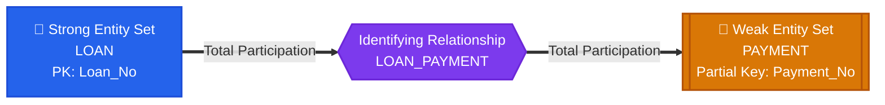
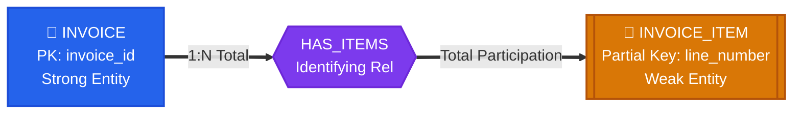

import CoreDoseLessonHeader from "@site/src/components/CoreDose/CoreDoseLessonHeader";
import CoreDoseTOC from "@site/src/components/CoreDose/CoreDoseTOC";
import CoreDoseNav from "@site/src/components/CoreDose/CoreDoseNav";

# 2.3 Weak Entity Sets & Identifying Relationships

<CoreDoseLessonHeader
  module="Module 02: Entity-Relationship (ER) Model"
  topic="Topic 2.3"
  readTime="7 min read"
  relevance="Relational Schema Design • University Exams • System Modeling"
/>

## 💡 Core Intuition

### 🍳 The Everyday Analogy: Bank Loans & Installment Receipts
Imagine taking an educational loan from a bank:
* **The Loan Record**: Has a unique loan account number (`LN-9042`). It exists as an independent entity in the banking system.
* **The Installment Payment Slips**: Slips numbered `Payment #1`, `Payment #2`, `Payment #3`.

Does a slip labeled "Payment #2" have an independent, global identity?  
**No!** Every single loan in the bank has a "Payment #2". You cannot credit money to "Payment #2" without knowing *which Loan Account* it belongs to.
$$\text{Full Identity of Payment} = (\text{Loan Account Number} + \text{Payment Number})$$

If the loan is completely closed or erased from the ledger, its installment slips have no standalone meaning. They cease to exist (**Existence Dependency**).

In DBMS:
* `Loan` is the **Strong Entity (Owner / Dominant)**.
* `Payment` is the **Weak Entity (Child / Subordinate)**.
* `Payment_No` is the **Partial Key (Discriminator)**.
* `<<Has_Payment>>` is the **Identifying Relationship**.

### 💻 Bridging to Computer Science
An entity set that does not possess sufficient attributes to form its own primary key is called a **Weak Entity Set**. All tuples in a weak entity set are distinguishable only when combined with the primary key of its identifying owner entity.

In relational databases, weak entities are converted into normalized tables with **Composite Primary Keys** and **`ON DELETE CASCADE`** foreign keys.

---

<CoreDoseTOC toc={toc} />

---

## 🏛️ Strong vs. Weak Entity Sets: The Master Comparison



| Architectural Dimension | Strong Entity Set | Weak Entity Set |
| :--- | :--- | :--- |
| **Alternative Names** | **Parent Entity Type** / **Dominant Entity Type** | **Child Entity Type** / **Subordinate Entity Type** |
| **Primary Key** | Possesses its own independent Primary Key. | Does **not** have sufficient attributes to form a primary key. |
| **Key Type** | Primary Key ($\underline{\text{Solid Underline}}$) | **Partial Key / Discriminator** (<span style={{textDecoration: 'underline dashed'}}>Dashed Underline</span>) |
| **Existence** | Independent (can exist alone). | **Existence-dependent** on its identifying owner entity. |
| **ER Diagram Symbol** | Single Rectangle (`[ ]`) | **Double Rectangle** (`[[ ]]`) |
| **Identifying Relationship** | Uses regular Diamond (`< >`) | Uses **Double Diamond** (`<< >>`) |
| **Participation** | Can be Partial or Total. | **Always Total Participation** in identifying relationship ($min \ge 1$). |

:::info The Relativity Rule of Weak Entities
**"A weak entity is weak ONLY for the strong entity which identifies it; for all other entities in the database, it acts as a strong entity!"**  
*Example*: A `DEPENDENT` is weak with respect to `EMPLOYEE`. However, if `DEPENDENT` enrolls in a university health plan, it can participate in other relationships as an independent participant.
:::

---

## 🔑 The Three Mandatory Pillars of a Weak Entity Set

To construct a valid weak entity set, three components must exist simultaneously:

### 1. Identifying Owner (Parent / Dominant) Entity Set
The strong entity type that lends its primary key to provide a full unique identity.  
*Example*: `LOAN(Loan_No, Amount)` where `Loan_No` is the identifying key.

### 2. Identifying Relationship Set
The relationship connecting the weak entity set to its owner.
* Represented in Peter Chen ER diagrams by a **Double Diamond** (`<< >>`).
* The identifying relationship set **should not have any descriptive attributes**, since any such attribute can simply be placed directly inside the weak entity set itself!

### 3. Partial Key (Discriminator)
A set of attributes that can uniquely distinguish between different weak entity instances *under the same owner entity*.
* Represented in ER diagrams by a **Dashed Underline** (<span style={{textDecoration: 'underline dashed'}}>Attribute</span>).
* *Primary Key Formulation*:
  $$\mathbf{Primary\ Key\ of\ Weak\ Entity} = (\mathbf{Owner\ Primary\ Key} + \mathbf{Partial\ Key})$$

```
Primary Key of PAYMENT = (Loan_No, Payment_No)
```

---

## 💡 Why Do We Need Weak Entity Sets?

From a software engineering perspective, why not make every entity strong?
1. **Reflects Real-World Existence Dependency**: Accurately models items (like room numbers, payment slips, order line-items) that have no real-world meaning without their parent.
2. **Automated Cascade Deletion (`ON DELETE CASCADE`)**: When a parent record is removed, the storage engine cleanly purges all child records, eliminating orphaned data.
3. **Eliminates Redundant Keys & Inconsistency**: Forcing an artificial primary key (like a globally unique `slip_uuid`) onto a simple 3-item order slip introduces unnecessary index bloat and data duplication.

:::tip Conversion Shortcut
**"A Weak Entity Set can always be converted into a Strong Entity Set by adding a suitable, globally unique attribute (such as a UUID, Aadhaar, or unique barcode)!"**
:::

---

## 🏭 In The Real World: Production Case Study

### Stripe Billing Engine: Invoices & Invoice Line Items

In modern fintech architecture, an invoice contains individual itemized charges:



**Production SQL Schema**:
  ```sql
  CREATE TABLE invoice (
      invoice_id VARCHAR(64) PRIMARY KEY,
      customer_id VARCHAR(64) NOT NULL,
      total_amount NUMERIC(12, 2) NOT NULL
  );

  CREATE TABLE invoice_item (
      invoice_id VARCHAR(64) NOT NULL,
      line_number INT NOT NULL,
      description TEXT,
      amount NUMERIC(10, 2) NOT NULL,
      PRIMARY KEY (invoice_id, line_number),
      FOREIGN KEY (invoice_id) REFERENCES invoice(invoice_id) 
          ON DELETE CASCADE
  );
  ```

---

## 🎯 Exam & Interview Pitfall Check

:::tip Core Conceptual Questions
**Question 1:** What is a Weak Entity Set? What are the essential conditions required to define a weak entity?  
**Answer:**  
A **Weak Entity Set** is an entity set that does not have sufficient attributes to form a primary key of its own. It is existence-dependent on a strong (dominant) entity set.

The essential conditions required are:
1. **Identifying Owner**: It must be associated with a strong entity set through an **Identifying Relationship** (represented by a double diamond).
2. **Cardinality & Participation**: The relationship must be **Many-to-One ($N:1$)** from the weak entity to the owner, and the weak entity must have **Total Participation** ($min \ge 1$, double line).
3. **Partial Key (Discriminator)**: It must possess a discriminator (dashed underline) that distinguishes among instances belonging to the same owner entity. The composite key is formed as $(\text{Owner\_PK} + \text{Discriminator})$.

**Question 2**: How can a weak entity set be converted into a strong entity set?  
**Answer**:  
A weak entity set can be converted into a strong entity set by adding a globally unique attribute (such as an auto-generated unique ID, serial number, or system UUID) to its attributes, making it independent of its parent entity's primary key.
:::

:::warning Common Interview Traps
* **Trap 1: "Can an Identifying Relationship have descriptive attributes?"**  
  **No**. Standard relational design specifies that identifying relationships should not carry descriptive attributes, because any such attribute can be placed directly inside the child weak entity without changing schema semantics.
* **Trap 2: "Can a Weak Entity have another Weak Entity as its parent?"**  
  **Yes**. This is called a **Multilevel Weak Entity Hierarchy** (e.g. `Hospital` $\rightarrow$ `Ward` $\rightarrow$ `Bed`). The Primary Key of `Bed` accumulates `(Hospital_Id, Ward_No, Bed_No)`.
:::

---

<CoreDoseNav
  prev={{
    title: "2.2 Relationship Sets & Cardinality",
    url: "/coredose/dbms/chapter-02/relationship-sets-cardinality-and-participation"
  }}
  next={{
    title: "2.4 ER-to-Relational Mapping & Table Reduction",
    url: "/coredose/dbms/chapter-02/er-to-relational-mapping-and-table-reduction"
  }}
  courseUrl="/coredose/dbms"
/>
