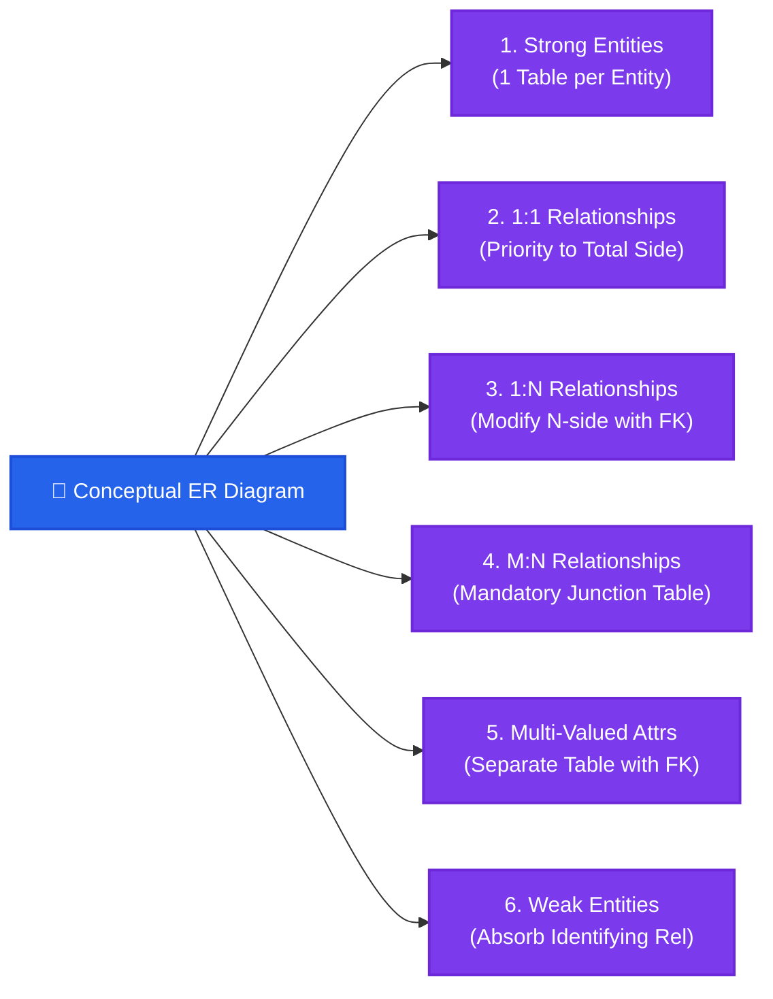
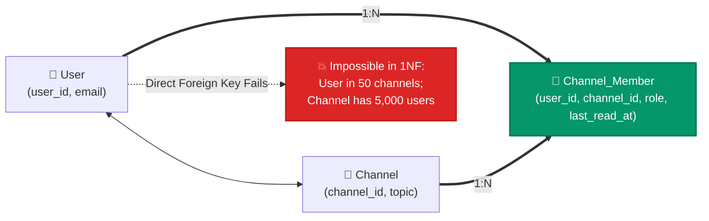

import CoreDoseLessonHeader from "@site/src/components/CoreDose/CoreDoseLessonHeader";
import CoreDoseTOC from "@site/src/components/CoreDose/CoreDoseTOC";
import CoreDoseNav from "@site/src/components/CoreDose/CoreDoseNav";

# 2.4 Step-by-Step Rules: Converting ER Diagrams into Relational Tables

<CoreDoseLessonHeader
  module="Module 02: Entity-Relationship (ER) Model"
  topic="Topic 2.4"
  readTime="9 min read"
  relevance="Relational Schema Design • University Exams • Technical Interview Architecture"
/>

## 💡 Core Intuition

### 🍳 The Everyday Analogy: Translating an Architect's Sketch into Brickwork
Imagine an architect sketching a dream home:
* The sketch uses circles, triangles, and dashed lines to depict rooms, doors, and shared balconies.
* However, bricklayers cannot build "diamonds" and "double ovals" out of concrete. They only know **flat concrete slabs, walls, and doorways**.

The **ER diagram** is the architect's conceptual sketch; **Relational Tables (SQL relations)** are the physical concrete walls and slabs. 
* A simple room becomes a flat table.
* A shared doorway between two rooms becomes a Foreign Key.
* A multi-purpose hallway connected to ten different rooms becomes a separate junction corridor.

**Table Reduction** is the art of building this house with the **minimum necessary walls**—eliminating redundant tables without allowing moisture (data redundancy) or wall collapses (data anomalies) to occur.

### 💻 Bridging to Computer Science
Relational database management systems (like PostgreSQL, MySQL, and Oracle) do not store Peter Chen ER rectangles and diamonds directly. They store **flat 2D relations (tables)** governed by First Normal Form (1NF).

Every software engineer must know how to translate an ER conceptual schema into a mathematical set of normalized relations with the minimum number of tables. Creating too many tables causes massive JOIN performance bottlenecks, while creating too few creates severe NULL bloat.

---

<CoreDoseTOC toc={toc} />

---

## 📋 The Master ER-to-Relational Mapping Framework

---

### Rule 1: Conversion of Strong Entity Sets
For each strong entity set, create an independent relation (table) containing all simple attributes.
* If an attribute is **composite**, include only its atomic sub-attributes.
* The primary key of the entity set becomes the Primary Key of the relation.

---

### Rule 2: Conversion of Binary 1:1 Relationships
In a binary $1:1$ relationship between $A$ and $B$, **no separate table is required**:

1. **One Side Total, One Side Partial**:
   Take the Primary Key of the partial participation side as a Foreign Key into the table on the **Total Participation side**!
   *Why?* Because every tuple on the total participation side participates, resulting in **zero `NULL` values**!
2. **Both Sides Partial**:
   * Take the Primary Key of either side as a Foreign Key on the other side.
3. **Both Sides Total Participation**:
   :::info Golden Table Reduction Invariant
   $$\mathbf{If\ both\ sides\ have\ Total\ Participation\ (} [A] == <R> == [B] \mathbf{),}\ \mathbf{ONLY\ 1\ TABLE\ is\ required!}$$
   * Both entity sets $A$ and $B$, along with the relationship $R$, can be merged into a single consolidated relation with zero NULLs.
   :::

---

### Rule 3: Conversion of Binary 1:N or N:1 Relationships
In a binary $1:N$ relationship, **no separate table is required**.

**Rule**: Modify the table on the **$N$-side (Many-side)** by adding the Primary Key of the $1$-side as a **Foreign Key** on the $N$-side. Any descriptive attributes of the relationship diamond are placed directly into the $N$-side table.

---

### Rule 4: Conversion of Binary M:N Relationships
In a binary $M:N$ relationship, a **separate table is strictly required** (Junction Table).

**Rule**: Take the Primary Keys of both participating tables and declare their combination (composite key) as the **Primary Key of the new table**:
$$\text{Relation\_R}(\underline{PK_A, PK_B}, \text{Descriptive\_Attributes})$$

---

### Rule 5: Conversion of Multi-Valued Attributes
A multi-valued attribute **always requires a separate table**.

**Rule**: Take the multi-valued attribute and the Primary Key of the parent entity table (as a Foreign Key). The composite of both attributes forms the Primary Key of the new table:
$$\text{PARENT\_MULTIVALUED}(\underline{\text{Parent\_PK}, \text{MultiValued\_Attr}})$$

---

### Rule 6: Conversion of Weak Entity Sets
Convert every weak entity set into a separate table:
* The table includes all simple attributes of the weak entity plus the Primary Key of the identifying strong entity as a Foreign Key.
* **The identifying relationship set is absorbed directly into the weak entity table** (no third table needed).
* $\mathbf{Primary\ Key} = (\mathbf{Strong\_Owner\_PK} + \mathbf{Partial\_Key})$.

---

## 🧮 Step-by-Step Solved Numericals

### Problem 1: Multi-Valued Attributes and 1:N Reduction

**Problem Statement**:  
Consider the following entity relationship diagram (ERD), where two entities $E_1$ and $E_2$ have a relation $R$ of cardinality $1 : M$.  
* The attributes of $E_1$ are $A_{11}, A_{12}$ and $A_{13}$ where $A_{11}$ is the key attribute.  
* The attributes of $E_2$ are $A_{21}, A_{22}$ and $A_{23}$ where $A_{21}$ is the key attribute and $A_{23}$ is a **multi-valued attribute**.  
* Relation $R$ does not have any attribute.  

A relational database containing the **minimum number of tables** with each table satisfying the requirements of Third Normal Form (3NF) is designed from the above ERD.  
**Determine the minimum number of relational tables required to represent this schema.**

#### Step-by-Step Mathematical Derivation:

1. **Entity $E_1$ (1-side)**:
   * Since $E_1$ is on the 1-side of a $1:M$ relationship, it forms an independent table:
     $$\text{Table 1: } E_1(\underline{A_{11}}, A_{12}, A_{13})$$

2. **Entity $E_2$ and Relationship $R$ ($M$-side)**:
   * By Rule 3, in a $1:M$ relationship, relationship $R$ is merged into the $M$-side table ($E_2$) by taking the primary key of $E_1$ ($A_{11}$) as a foreign key:
     $$\text{Table 2: } E_2(\underline{A_{21}}, A_{22}, A_{11})$$

3. **Multi-Valued Attribute $A_{23}$**:
   * By Rule 5, a multi-valued attribute cannot reside in $E_2$ without violating 1NF. It requires a dedicated separate table combining the primary key of $E_2$ with $A_{23}$:
     $$\text{Table 3: } E_2\_A_{23}(\underline{A_{21}, A_{23}})$$

$$\mathbf{Total\ Minimum\ Tables} = \text{Table } E_1 + \text{Table } E_2 + \text{Table } E_2\_A_{23} = \mathbf{3\ Tables}$$

---

### Problem 2: Dual Relationships (1:N and M:N) Between Same Entities

**Problem Statement**:  
Let $E_1$ and $E_2$ be two entities in an E-R diagram with simple single-valued attributes.  
$R_1$ and $R_2$ are two distinct relationships between $E_1$ and $E_2$, where $R_1$ is **One-to-Many ($1:M$)** and $R_2$ is **Many-to-Many ($M:N$)**.  
$R_1$ and $R_2$ do not have any attributes of their own.  
**Determine the minimum number of relational tables required to represent this complete schema without data redundancy.**

#### Step-by-Step Mathematical Derivation:

1. **Entity $E_1$ (1-side of $R_1$)**:
   * Requires Table 1: $E_1(\underline{PK_1}, \dots)$
2. **Entity $E_2$ and Relationship $R_1$ ($1:M$)**:
   * By Rule 3, $R_1$ is merged into $E_2$ ($M$-side) by placing $PK_1$ as a Foreign Key inside $E_2$:
     $$\text{Table 2: } E_2(\underline{PK_2}, PK_1, \dots)$$
3. **Relationship $R_2$ ($M:N$)**:
   * By Rule 4, an $M:N$ relationship cannot be merged into either $E_1$ or $E_2$. It strictly requires an independent cross-reference junction table:
     $$\text{Table 3: } R_2(\underline{PK_1, PK_2})$$

$$\mathbf{Total\ Minimum\ Tables} = \text{Table } E_1 + \text{Table } E_2 + \text{Table } R_2 = \mathbf{3\ Tables}$$

---

## 🏭 In The Real World: Production Case Study

### Slack Workspace Architecture: Resolving User-Channel Relationships

In team messaging systems like Slack or Discord, organizations deal with hundreds of millions of users participating in thousands of public and private chat channels.

**The Problem**: A user joins 80 channels; a channel contains 10,000 team members. This is a classic Many-to-Many ($M:N$) relationship.

**Production Table Reduction**: Slack implements the junction table `channel_member(user_id, channel_id, role, last_read_timestamp)`:
  * Acts as an associative entity storing relationship-specific states (`last_read_timestamp`, `is_muted`).
  * Indexed with compound B+ trees on `(user_id, channel_id)` and `(channel_id, user_id)` for sub-millisecond query performance in both directions.

---

## 🎯 Exam & Interview Pitfall Check

:::tip Core Conceptual Questions
**Question 1:** When can a $1:1$ binary relationship be converted into a single relational table?  
**Answer:**  
A $1:1$ binary relationship can be merged into a single table **if and only if both participating entity sets have Total Participation**. If either side has partial participation, merging them into a single table will force numerous attributes to store `NULL` for entities that do not participate.

**Question 2**: How is a Multi-Valued Attribute converted into the relational model?  
**Answer**:  
A multi-valued attribute violates First Normal Form (1NF) if kept inside the parent entity table. Therefore:
1. It is converted into a **separate dedicated relation**.
2. The relation includes the parent entity's Primary Key as a Foreign Key, alongside the multi-valued attribute.
3. The Primary Key of this new relation is the composite of $(\text{Parent\_PK} + \text{MultiValued\_Attribute})$.
:::

:::warning Common Interview Traps
* **Trap 1: "Where does the Foreign Key go in a 1:1 relationship with partial participation?"**  
  If entity $A$ has Total Participation and entity $B$ has Partial Participation, **always place the Foreign Key into entity $A$**. Placing it in $B$ would result in NULLs for every entity in $B$ that does not participate. Placing it in $A$ guarantees that every row has a non-null foreign key value!
* **Trap 2: "Can an M:N relationship ever be reduced to 2 tables?"**  
  **Strictly No.** In relational algebra, converting an $M:N$ relationship into 2 tables either violates 1NF (storing multi-valued lists in a single cell) or introduces catastrophic data duplication. It **always requires 3 tables**.
:::

---

<CoreDoseNav
  prev={{
    title: "2.3 Weak Entity Sets & Identifying Relationships",
    url: "/coredose/dbms/chapter-02/weak-entity-sets-and-identifying-relationships"
  }}
  next={{
    title: "2.5 Extended ER: Specialization, Generalization & Aggregation",
    url: "/coredose/dbms/chapter-02/extended-er-specialization-generalization-aggregation"
  }}
  courseUrl="/coredose/dbms"
/>
