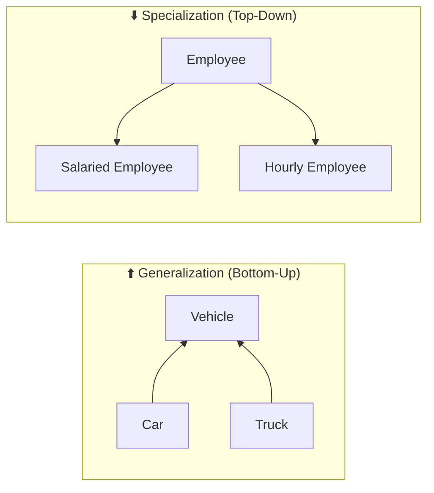
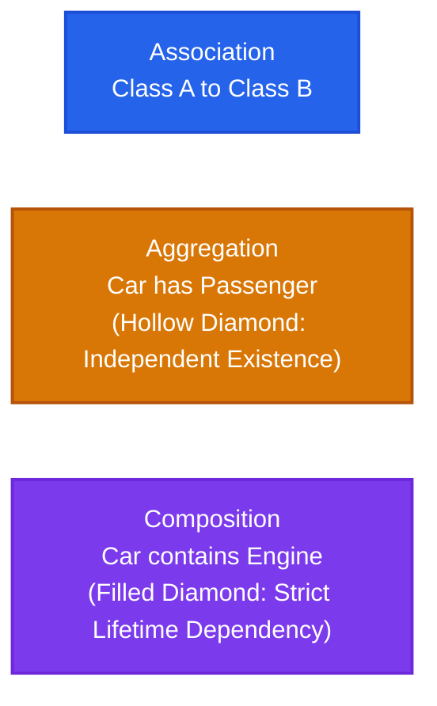
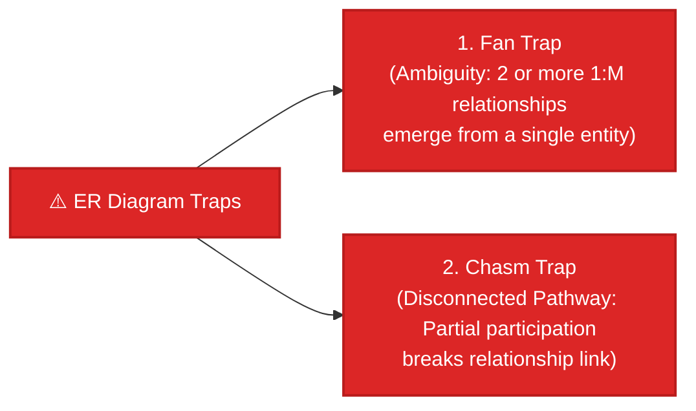
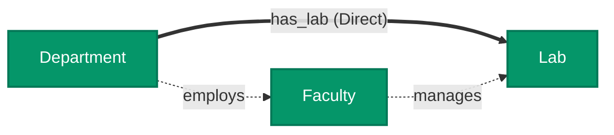
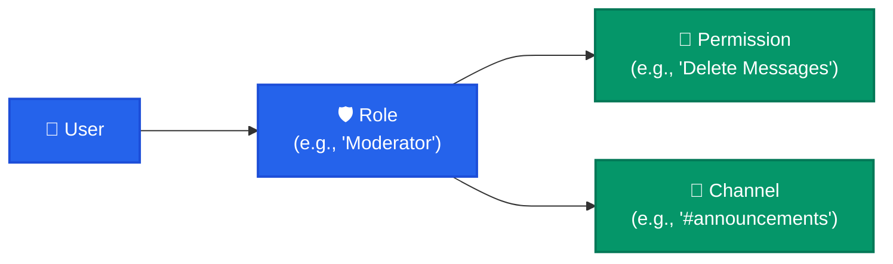

import CoreDoseLessonHeader from "@site/src/components/CoreDose/CoreDoseLessonHeader";
import CoreDoseTOC from "@site/src/components/CoreDose/CoreDoseTOC";
import CoreDoseNav from "@site/src/components/CoreDose/CoreDoseNav";

# 2.5 Extended ER (EER): Specialization, Generalization, Aggregation & ER Traps

<CoreDoseLessonHeader
  module="Module 02: Entity-Relationship (ER) Model"
  topic="Topic 2.5"
  readTime="8 min read"
  relevance="Advanced Schema Modeling • University Exams • System Architecture"
/>

## 💡 Core Intuition

### 🍳 The Everyday Analogy: Vehicles, Passengers & Lost Campus Directions
Think of real-world machines and organization charts:
* **Specialization / Generalization (`is-a`)**: A `Car` **is-a** `Vehicle`. A `Truck` **is-a** `Vehicle`. They inherit the master properties of a vehicle (engine, wheels, license plate), but a Car has a `trunk_capacity` while a Truck has a `cargo_tonnage`.
* **Aggregation vs. Composition (`has-a`)**:
  * A `Car` **has-an** `Engine`. If the car is sent to the metal crusher, the engine is crushed with it (**Composition**—strict lifetime dependency).
  * A `Car` **has-a** `Passenger`. If the car crashes or is sold, the passenger gets out and walks away (**Aggregation**—independent lifetime).
* **The Lost Department Trap (Fan Trap)**:
  Imagine a university campus website that lists: "Site North has 5 Departments, and Site North employs 100 Professors."  
  If a student asks: *"Which specific professor teaches in the Computer Science department?"*, the database cannot answer! The link went through the campus site instead of directly connecting professor to department.

In modern DBMS, **Extended ER (EER)** expands classic Peter Chen modeling with object-oriented abstractions, while **ER Trap Analysis** detects structural flaws before database deployment.

### 💻 Bridging to Computer Science
As software systems grew in complexity, standard ER modeling could not express class inheritance or relationships between relationships.

In the 1980s, computer scientists formulated **Extended Entity-Relationship (EER)** modeling:
1. **Generalization & Specialization** (Mapping OOP inheritance into SQL tables).
2. **Aggregation & Composition** (Modeling whole-part relationships).
3. **Trap Detection** (**Fan Traps** and **Chasm Traps**) that cause queries to return ambiguous or disconnected results.

---

<CoreDoseTOC toc={toc} />

---

## 🧬 Generalization vs. Specialization



| Dimension | Generalization | Specialization |
| :--- | :--- | :--- |
| **Approach** | **Bottom-Up Design** | **Top-Down Design** |
| **Mechanism** | Synthesizes multiple lower-level entity sets with common attributes into a single higher-level entity set. | Subdivides a single higher-level entity set into specialized lower-level entity sets with distinct sub-attributes. |
| **Inheritance** | Lower-level entities share common generalized attributes. | Specialized sub-entities inherit all attributes and relationships of the parent entity. |
| **Direction** | Lower level $\longrightarrow$ Higher level | Higher level $\longrightarrow$ Lower level |
| **Example** | `Car` and `Truck` generalized into `Vehicle(Vehicle_Id, Price)`. | `Employee` specialized into `Salaried_Employee(Monthly_Pay)` and `Hourly_Employee(Hourly_Rate)`. |

---

## 📦 Aggregation vs. Composition: The Whole-Part Paradigm

In database modeling, **Aggregation** is a directional `has-a` association between objects.



### 1. Composition (Filled Diamond: `---<*>---`)
Represents strong ownership where the child cannot exist without the parent.
* **Invariant**: If the parent entity is destroyed, the child entity is automatically destroyed as well.
* **Example**: `[Car] ---<*>--- [Engine]`. Every car has an engine; the engine belongs to that specific car chassis.

### 2. Aggregation (Hollow Diamond: `---<>---`)
Represents weak ownership where the child has an independent lifetime.
* **Invariant**: If the parent entity is destroyed, the associated entity continues to exist.
* **Example**: `[Car] ---<>--- [Passenger]`. A car may carry passengers; if the car is sold, the passengers exist independently.

### 3. Aggregation in Classic Peter Chen ER
In classic ER diagrams, relationships cannot connect directly to other relationships. When a relationship needs to be treated as an entity, we draw a **bounding box around the relationship and its participating entities** (Aggregation), allowing another entity to connect to the entire cluster.  
*Example*: `[Employee]` works on a `[Project]`; this combined assignment requires specific `[Machinery Tools]`.

---

## 🕳️ ER Diagram Traps: Structural Design Flaws

Even experienced engineers can produce flawed ER models. These structural pitfalls are called **ER Traps**:



---

### 1. The Fan Trap (Fan-Out Ambiguity)

**Definition**: A **Fan Trap** occurs when two or more $1:M$ relationships emerge outward from a single central entity, creating an ambiguous fan-like pathway.

#### Flawed ER Diagram:
```
[Department] <--- <is_on> --- [Site] --- <employs> ---> [Staff]
```
**The Flaw**:
A single `Site` contains multiple `Departments` and employs multiple `Staff`.  
*The Missing Information*: **Which specific staff member works in which particular department?** The model connects staff to the physical site, but destroys the direct department-to-staff association!

#### Correction to Resolve Fan Trap:
Restructure the pathway so the $1:M$ relationships chain directionally:

Now, every staff member belongs to a specific department, and that department is located at a specific site. Zero ambiguity!

---

### 2. The Chasm Trap (Missing Pathway Trap)

**Definition**: A **Chasm Trap** occurs when a model suggests the existence of a relationship between two entities, but the pathway between certain entity occurrences is broken because of **Partial Participation ($min = 0$)** in the intermediate entity.

#### Flawed ER Diagram:
```
[Department] --(PP)-- <Oversees> --(PP)-- [Faculty] --(PP)-- <Supervises> --(PP)-- [Lab]
```
**The Flaw**:
A university expects every `Department` to have associated `Labs`. However, both Department and Lab connect through `Faculty` via **Partial Participation (PP)**.  
*The Chasm*: If a newly founded laboratory has not yet been assigned a supervisor faculty member, the pathway between `Department` and `Lab` is severed! The department cannot query or find its own laboratory.

#### Correction to Resolve Chasm Trap:
Create a **direct relationship** between `Department` and `Lab`:

By establishing a direct relationship between `Department` and `Lab`, the pathway is guaranteed to exist regardless of whether a faculty supervisor is currently assigned.

---

## 🏭 In The Real World: Production Case Study

### Discord / Slack Roles: Preventing Fan Traps in Permission Hierarchies

In massive team communication apps like Discord or Slack, authorization models must avoid Fan Traps when associating Users, Permissions, and Channels.



**The Trap**: If Discord modeled `User <--- Guild ---> Channel` and `User <--- Guild ---> Permission`, a user in a 50,000-member server could not have channel-specific permissions (Fan Trap).

**The Resolution**: Introduce explicit associative roles: `Channel_Permission_Override(channel_id, user_id, allow_bits, deny_bits)` to establish deterministic direct pathways.

---

## 🎯 Exam & Interview Pitfall Check

:::tip Core Conceptual Questions
**Question 1:** Differentiate between Specialization and Generalization with suitable examples.  
**Answer:**  
* **Generalization**: A **Bottom-Up** approach where common attributes of lower-level entity sets are synthesized into a higher-level entity set.  
  *Example*: Synthesizing `Saving_Account` and `Current_Account` into higher-level `Account(AccNo, Balance)`.  
* **Specialization**: A **Top-Down** approach where a higher-level entity set is subdivided into lower-level specialized entity sets with unique attributes.  
  *Example*: Subdividing `Employee` into `Engineer(Specialty)` and `Secretary(TypingSpeed)`.

**Question 2**: Explain the difference between a Fan Trap and a Chasm Trap in ER modeling. How is each resolved?  
**Answer**:  
* **Fan Trap**: Occurs when two or more $1:M$ relationships fan out from a single entity, making it ambiguous which child entity relates to which other child entity.  
  *Resolution*: Restructure the relationships into a sequential chain (e.g. `Staff` $\rightarrow$ `Department` $\rightarrow$ `Site`).  
* **Chasm Trap**: Occurs when a pathway between two entities passes through an intermediate entity with partial participation, meaning some records cannot reach each other.  
  *Resolution*: Add a direct relationship connecting the two outer entities.
:::

:::warning Common Interview Traps
* **Trap 1: "Is Relational Algebra capable of computing transitive closures or recursive aggregations?"**  
  Standard relational algebra is **not capable** of aggregate computation (SUM, AVG), multiplication, or finding transitive closures (e.g. recursive organization chart reporting lines). SQL handles this using window functions, `GROUP BY`, and recursive Common Table Expressions (`WITH RECURSIVE`).
* **Trap 2: "What is the difference between Aggregation and Composition in UML/ER?"**  
  In **Composition** (`---<*>---`, filled diamond), child entities cannot exist without the parent (cascade delete). In **Aggregation** (`---<>---`, hollow diamond), child entities have an independent lifecycle.
:::

---

<CoreDoseNav
  prev={{
    title: "2.4 ER-to-Relational Mapping & Table Reduction",
    url: "/coredose/dbms/chapter-02/er-to-relational-mapping-and-table-reduction"
  }}
  courseUrl="/coredose/dbms"
/>
