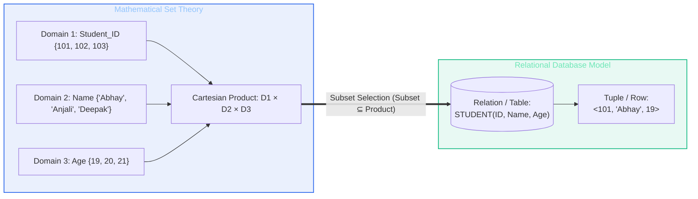
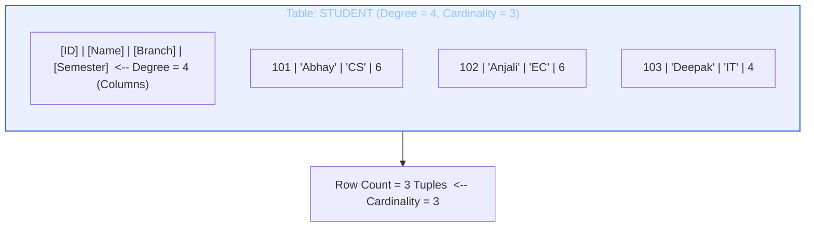
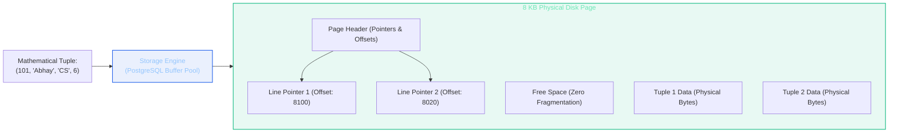

import CoreDoseLessonHeader from "@site/src/components/CoreDose/CoreDoseLessonHeader";
import CoreDoseTOC from "@site/src/components/CoreDose/CoreDoseTOC";
import CoreDoseNav from "@site/src/components/CoreDose/CoreDoseNav";

# 3.1 Relational Data Model: Concepts, Terminology & Set-Theoretic Foundations

<CoreDoseLessonHeader
  module="Module 03: Relational Model & Relational Algebra"
  topic="Topic 3.1"
  readTime="7 min read"
  relevance="Relational Mathematics • University Semester Exams • Technical Interviews"
/>

## 💡 Core Intuition

### 🍳 The Everyday Analogy: The Flight Manifest & Boarding Roster
Imagine an airline ground crew preparing a passenger manifest for an international flight:
* **The Domain (Permitted Values)**: The nationality column can only contain recognized 3-letter ISO country codes (`USA`, `IND`, `GBR`). Any arbitrary string like `"Banana"` is mathematically invalid.
* **The Tuple (A Single Seat Assignment)**: Seat `12A`, Passenger `"Aditi Sharma"`, Passport `"Z984210"`. This entire horizontal row represents a single atomic real-world occurrence.
* **The Relation (The Full Manifest Table)**: The entire collection of all boarding passengers on Flight 402.
* **The Degree (Number of Categories)**: The manifest tracks 5 fixed traits: Seat, Name, Age, Passport, Nationality.
* **The Cardinality (Passenger Count)**: Today, 184 passengers boarded the plane. Tomorrow, 210 might board.

In relational computing, a database table is not merely a visual spreadsheet with arbitrary formatting. It is a strict mathematical object called a **Relation**—governed by set theory where columns are typed sets, rows are elements of a Cartesian product, and duplicate records are fundamentally impossible.

### 💻 Bridging to Computer Science
Introduced by Turing Award laureate **Dr. Edgar F. Codd** in 1970, the **Relational Data Model** liberated software engineering from the physical pointers of hierarchical trees and network graphs.

Instead of writing custom code to traverse disk block addresses, developers represent data as declarative two-dimensional mathematical relations. Understanding the precise set-theoretic vocabulary of this model—**Tuples**, **Attributes**, **Domains**, **Degree**, and **Cardinality**—is essential before writing relational algebra expressions or high-performance SQL queries.

---

<CoreDoseTOC toc={toc} />

---

## 🏛️ Set-Theoretic Definition of a Relation

In formal mathematics, a **Relation** is defined as a subset of the Cartesian product of a list of attribute domains:

$$\mathbf{R} \subseteq \text{dom}(A_1) \times \text{dom}(A_2) \times \dots \times \text{dom}(A_n)$$

Where:
* Each $A_i$ represents an **Attribute** (column name).
* Each $\text{dom}(A_i)$ represents the **Domain** (set of legal atomic scalar values) for that attribute.
* Each element in the relation is an ordered $n$-tuple: $t = \langle v_1, v_2, \dots, v_n \rangle$ where each $v_i \in \text{dom}(A_i)$.

---

## 📐 Formal Relational Terminology

The table below contrasts formal mathematical terminology with practical relational database terminology and physical file system storage concepts:

| Formal Relational Term | Common Database Term | File System Equivalent | Mathematical Meaning |
| :--- | :--- | :--- | :--- |
| **Relation** | Table | File | A set of $n$-tuples representing an entity set or relationship. |
| **Tuple** | Row / Record | Record | An individual horizontal occurrence in the relation. |
| **Attribute** | Column / Field | Field | A named property or characteristic describing the relation. |
| **Domain** | Data Type + Constraints | Type Definition | The pool of permitted atomic scalar values for an attribute. |
| **Degree (Arity)** | Column Count | Number of Fields | Total number of attributes in the relation schema. |
| **Cardinality** | Row Count | Number of Records | Total number of tuples currently stored in the relation instance. |
| **Relation Schema** | Table Definition (DDL) | Record Format | The static blueprint: $R(A_1, A_2, \dots, A_n)$. |
| **Relation State** | Table Snapshot (DML) | Current File Data | The dynamic set of tuples at a given point in time: $r(R)$. |

---

## 🔢 Degree vs. Cardinality: Formal Properties

Understanding the dimensional boundaries of relations is a frequent university exam and interview checkpoint:

### 1. Degree (Arity)
The **Degree** of a relation is the total number of attributes (columns) in its relation schema.
* **Static Nature**: In a production database, the degree rarely changes. Adding or dropping columns requires an explicit Data Definition Language (DDL) operation (`ALTER TABLE`), which is an expensive administrative operation.
* **Non-Zero Bound**: The degree of any legal relation must be strictly greater than zero ($\text{Degree} \ge 1$). A relation cannot exist with zero columns.

### 2. Cardinality
The **Cardinality** of a relation is the total number of tuples (rows) currently present in the relation instance.
* **Dynamic Nature**: Cardinality changes continuously during live system operations as applications execute `INSERT` and `DELETE` commands.
* **Zero Bound Permitted**: Cardinality can legally be zero ($\text{Cardinality} \ge 0$). An empty table that has been created via DDL but contains no rows is an **Empty Relation** with cardinality zero, yet its degree remains non-zero.

---

## ⚡ Fundamental Invariants of the Relational Model

The mathematical formulation of relations enforces five strict structural invariants:

**1. Atomicity of Attribute Values (1NF)**:  
Every attribute cell in every tuple must hold a single, indivisible scalar atomic value from its defined domain. Multi-valued attributes (lists, arrays) and composite attributes (nested records) are strictly forbidden in standard relational theory.

**2. Duplicate Tuples are Strictly Prohibited**:  
Because a relation is formally defined as a mathematical **set** of tuples, and mathematical sets cannot contain duplicate elements, no two tuples in a relation can be identical. There must always exist a primary key or super key to distinguish each tuple uniquely.

**3. Order of Tuples is Insignificant**:  
In set theory, $\{t_1, t_2, t_3\} = \{t_3, t_1, t_2\}$. The physical or visual order of rows in a relation has no semantic meaning. A query returning records in a different sequence does not change the identity of the relation.

**4. Order of Attributes is Insignificant**:  
The attributes in a relation schema are referenced by their unique names, not by physical byte offsets. Whether the schema is written as $R(\text{ID}, \text{Name})$ or $R(\text{Name}, \text{ID})$, the semantic information remains identical.

**5. Attribute Domains Must be Homogeneous**:  
All values appearing in a specific column must originate from the exact same underlying domain. If attribute `Age` has domain $\text{Integer} \in [18, 100]$, storing the string `"twenty"` in that column is strictly illegal.

---

## 🏭 In The Real World: Production Case Study

### PostgreSQL Heap Storage: From Mathematical Tuples to Disk Pages

In relational theory, a relation is an infinite mathematical set. In production systems like PostgreSQL, relations must physically exist on block-storage SSDs:

**The Theoretical vs Physical Gap**:  
In pure mathematics, finding a tuple is an $O(1)$ set membership operation ($t \in R$). In production, PostgreSQL divides physical tables into **8 KB disk blocks (Pages)**. 

When a query requests tuple `101`, the query engine does not evaluate mathematical set membership. It fetches the page from disk, reads the page header line pointers, and reconstructs the tuple at a specific byte offset. If tuples were not required to be atomic (1NF), page layouts would require variable-length pointer chains, degrading disk I/O performance across production clusters.

---

## 🎯 Exam & Interview Pitfall Check

:::tip Core Conceptual Questions

**Question 1:** Define the terms Degree, Cardinality, and Domain in the context of the Relational Model. What is the minimum possible value for each?  
**Answer:**  
* **Degree**: The total number of attributes (columns) defining the relation schema. The minimum possible value is **1** (a relation cannot have zero columns).  
* **Cardinality**: The total number of tuples (rows) currently stored in the relation instance. The minimum possible value is **0** (an empty table with valid schema).  
* **Domain**: The pool of legal, atomic scalar values from which attribute values may be drawn.

**Question 2:** Why is the order of rows and columns considered insignificant in a relational database?  
**Answer:**  
In formal mathematics, a relation is a **set** of tuples, and a tuple is an association of named attributes. In set theory, set membership is independent of ordering: $\{a, b\} = \{b, a\}$. Similarly, columns are identified by unique attribute names rather than positional indices, meaning positional reordering preserves 100% of information and integrity.
:::

:::warning Common Interview Traps

**Trap 1: "Does SQL strictly implement the Relational Model?"**  
**Answer: No.** SQL operates on **Multisets (Bags)** rather than pure mathematical sets. In standard SQL, duplicate rows are permitted by default unless the table explicitly defines a `PRIMARY KEY` or `UNIQUE` constraint, or the query explicitly specifies `SELECT DISTINCT`. In the formal relational model, duplicate tuples are mathematically impossible.

**Trap 2: "Can a relation have degree 0 or cardinality 0?"**  
**Answer: Degree cannot be 0, but Cardinality can.** A table must have at least one column defined in its schema ($\text{Degree} \ge 1$). However, immediately after running `CREATE TABLE`, the table contains zero tuples ($\text{Cardinality} = 0$), which is completely valid.
:::

---

<CoreDoseNav
  prev={{
    title: "2.5 Extended ER: Specialization, Generalization & Traps",
    url: "/coredose/dbms/chapter-02/extended-er-specialization-generalization-aggregation"
  }}
  next={{
    title: "3.2 Keys in Relational Model: Candidate, Primary & Foreign Keys",
    url: "/coredose/dbms/chapter-03/keys-in-relational-model"
  }}
  courseUrl="/coredose/dbms"
/>
