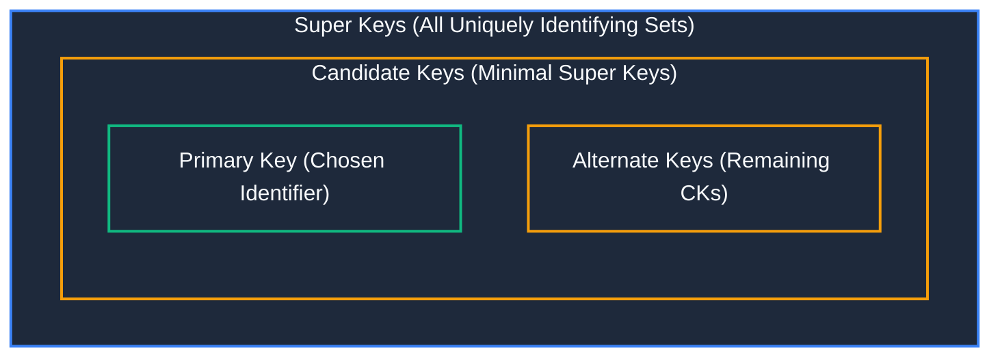
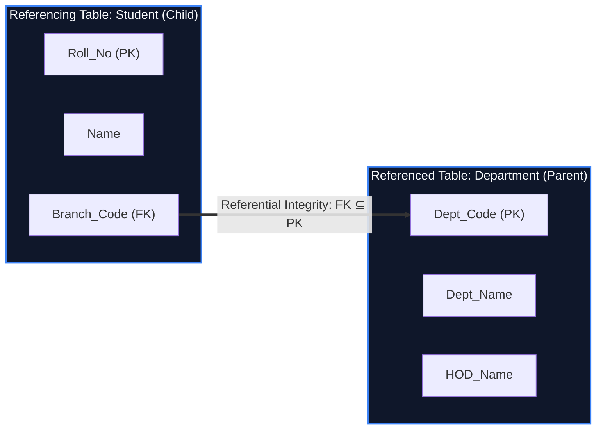
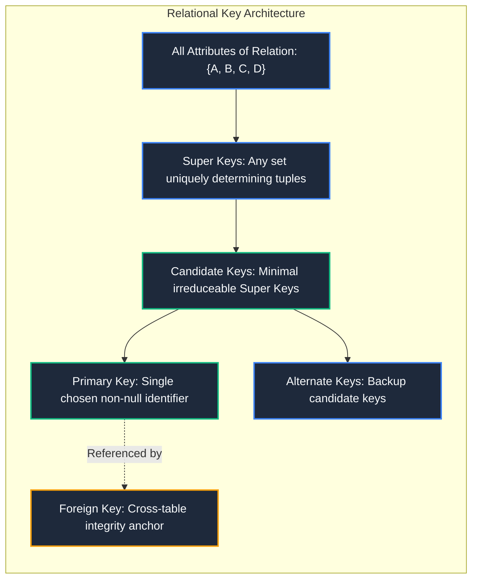

import CoreDoseLessonHeader from "@site/src/components/CoreDose/CoreDoseLessonHeader";
import CoreDoseTOC from "@site/src/components/CoreDose/CoreDoseTOC";
import CoreDoseNav from "@site/src/components/CoreDose/CoreDoseNav";

# 3.2 Keys in Relational Model: Candidate, Primary & Foreign Keys

<CoreDoseLessonHeader
  module="Module 03: Relational Model & Relational Algebra"
  topic="Topic 3.2"
  readTime="7 min read"
  relevance="University Semester Exams • Technical Interviews • Database System Architecture"
/>

## 💡 Core Intuition

### 🍳 The Everyday Analogy: Identifying Citizens
Imagine a government registry office managing 100 million citizens. To find or update any specific individual's file without error, you need a mechanism that uniquely distinguishes one human from everyone else.
* **Overkill identification (Super Key)**: Looking someone up using their `(Passport Number, Favorite Color, Shoe Size)` is 100% unique, but contains redundant baggage.
* **Minimal unique identifier (Candidate Key)**: Looking someone up using solely their `Passport Number` or solely their `National ID (SSN)` is completely sufficient and contains zero fluff.
* **The Official Standard (Primary Key)**: The registry picks one specific identifier (`National ID`) as the universal system reference across all public departments.
* **Secondary Identifiers (Alternate Keys)**: The unused minimal identifiers (`Passport Number`) remain valid alternates.
* **Cross-Department Linkage (Foreign Key)**: When the Department of Motor Vehicles records a driver's license, it stamps the driver's `National ID` into the license record to link back to the central citizen registry.

### 💻 Bridging to Computer Science
In the relational model, a **Key** is a single attribute or a minimal collection of attributes whose values are guaranteed to uniquely identify each tuple in a relation instance. Keys prevent tuple ambiguity, enforce entity integrity, and establish relational links between separate tables.

---

<CoreDoseTOC toc={toc} />

---

## 📚 Core Deep-Dive & Concepts

### 1. The Key Classification Spectrum

In database management systems, keys are categorized based on their uniqueness, minimality, and architectural purpose:

| Key Type | Formal Definition | Uniqueness | Minimality Required? | Allows NULL? |
| :--- | :--- | :--- | :--- | :--- |
| **Super Key ($SK$)** | Any superset of attributes that uniquely identifies a tuple. | Yes | No | Context-dependent |
| **Candidate Key ($CK$)** | A minimal Super Key (no proper subset is a Super Key). | Yes | **Yes** | At least one CK must be `NOT NULL` |
| **Primary Key ($PK$)** | The single Candidate Key chosen by the database designer. | Yes | **Yes** | **Never (`NOT NULL`)** |
| **Alternate Key ($AK$)** | Candidate keys not chosen as the Primary Key ($AK = CK - \{PK\}$). | Yes | **Yes** | Often permitted in standard SQL |
| **Foreign Key ($FK$)** | Attribute referencing the Primary Key of another or same table. | No (can repeat) | Determined by target $PK$ | **Yes (unless declared `NOT NULL`)** |
| **Composite Key** | A key formed by combining two or more distinct attributes. | Yes | Yes (if minimal) | Restricted on PK members |
| **Surrogate Key** | An artificial, system-generated identifier (e.g. `AUTO_INCREMENT ID`, `UUID`). | Yes | Yes | Never |

---

### 2. Super Key ($SK$) & Mathematical Counting

**Definition**: A Super Key is a set of one or more attributes that, taken collectively, allows us to identify uniquely a tuple in the relation.

**The Fundamental Axiom**: Every superset of a Super Key is also a Super Key.

The largest possible Super Key in any relation $R(A_1, A_2, \dots, A_n)$ is the set containing **all attributes**:
$$
SK_{\max} = \{A_1, A_2, \dots, A_n\}
$$

#### Mathematical Derivation: Maximum Number of Superkeys
Consider a relation $R$ containing $n$ distinct attributes:
$$
R = \{A_1, A_2, \dots, A_n\}
$$

**Case A: Exactly One Single-Attribute Candidate Key**  
Let attribute $A_1$ be the lone candidate key. Any superkey must contain $A_1$, combined with any arbitrary subset of the remaining $(n - 1)$ attributes:
$$
\text{Total Superkeys} = 2^{n - 1}
$$

**Case B: Every Attribute is Individually a Candidate Key**  
If every attribute $A_i$ ($1 \le i \le n$) is an individual candidate key, then any non-empty subset of the $n$ attributes forms a valid superkey:
$$
\text{Total Superkeys} = 2^n - 1
$$
*(We subtract $1$ because the empty set $\emptyset$ cannot identify a tuple).*

**Case C: Two Disjoint Candidate Keys (Inclusion-Exclusion Principle)**  
Let $R(A, B, C, D)$ have two candidate keys: $CK_1 = \{A\}$ and $CK_2 = \{B\}$.  
By the Principle of Inclusion-Exclusion:
$$
|\text{Superkeys}| = |SK(A)| + |SK(B)| - |SK(A \cap B)|
$$
1. Superkeys containing $A$: $2^{4 - 1} = 2^3 = 8$
2. Superkeys containing $B$: $2^{4 - 1} = 2^3 = 8$
3. Superkeys containing both $A$ and $B$ (i.e. $\{A, B\}$): $2^{4 - 2} = 2^2 = 4$
$$
\text{Total Superkeys} = 8 + 8 - 4 = 12
$$

---

### 3. Candidate Key ($CK$) & Prime Attributes

**Formal Definition**: A Candidate Key $K$ of a relation schema $R$ is a minimal superkey:
1. **Uniqueness Property**: In every legal relation state $r(R)$, no two distinct tuples have the same value for $K$.
2. **Minimality (Irreducibility) Property**: If $A \in K$, then $(K - \{A\})$ is not a superkey. That is, no proper subset of $K$ is a superkey.

#### Example: Superkey vs Candidate Key
Let relation $R(A, B, C, D)$ satisfy functional dependencies where:
$$
A \to BCD \quad \text{and} \quad AB \to CD
$$
Both $\{A\}$ and $\{AB\}$ are valid Super Keys because each can uniquely determine all attributes of the relation.  
However, because $\{A\} \subset \{AB\}$, the attribute set $\{AB\}$ fails the minimality test.  
Therefore:
* $\{AB\}$ is a **Super Key**, but **not** a Candidate Key.
* $\{A\}$ is both a **Super Key** and a **Candidate Key**.

#### Prime vs. Non-Prime Attributes
**Prime Attribute**: An attribute that is a member of **at least one** candidate key of the relation schema $R$.  
**Non-Prime Attribute**: An attribute that is **not** a member of any candidate key of $R$.

**Analytical Rule**: If a relation has candidate keys $CK_1 = \{A, B\}$ and $CK_2 = \{B, C\}$, the prime attributes are $\{A, B, C\}$. Even though $C$ is absent from $CK_1$, its presence in $CK_2$ makes it prime.

---

### 4. Primary Key ($PK$) & Alternate Keys ($AK$)

**Primary Key**: A database designer or DBA selects **exactly one** candidate key from the available candidate keys to serve as the principal tuple identifier.
* **Rule 1**: A relation schema can have **at most one** Primary Key.
* **Rule 2**: No attribute belonging to the Primary Key can ever accept `NULL` values.
* **Rule 3**: Primary key values should ideally be immutable (rarely or never updated in production).

**Alternate Key**: Any candidate key that was not chosen as the Primary Key:
$$
\text{Alternate Keys} = \text{Candidate Keys} \setminus \{\text{Primary Key}\}
$$

#### Subset Hierarchy of Keys
The relationship between keys forms a strict nested containment:
$$
\text{Primary Key} \subseteq \text{Candidate Keys} \subseteq \text{Super Keys}
$$

---

### 5. Foreign Key ($FK$) & Referential Integrity

**Definition**: A Foreign Key is a set of attributes in a referencing relation $R_1$ that corresponds to and references the Primary Key (or unique key) of a referenced relation $R_2$.

**The Fundamental Constraint of Referential Integrity**:
$$
\pi_{FK}(R_1) \subseteq \pi_{PK}(R_2)
$$
Every value appearing in the foreign key column must either:
1. Exist as a valid primary key value in the referenced relation, OR
2. Be explicitly `NULL` (indicating an unassigned or optional relationship).

#### Self-Referencing (Recursive) Foreign Keys
A table can reference its own primary key. This is called a **Recursive Foreign Key** or **Self-Referential Constraint**.

**Canonical Schema**:
$$
\text{Employee}(\underline{\text{Emp\_ID}}, \text{Emp\_Name}, \text{Role}, \text{Manager\_ID})
$$
Where $\text{Manager\_ID}$ is a foreign key referencing $\text{Emp\_ID}$ within the exact same `Employee` table. The CEO or topmost executive will store `NULL` in $\text{Manager\_ID}$.

---

## 📐 Architecture / Visual Blueprint

---

## 🏭 In The Real World: Production Case Study

### Natural Primary Keys vs Synthetic Surrogate Keys in Stripe API Architecture
When Stripe engineers designed the billing and customer database schemas, they evaluated two key models:
1. **Natural Composite Primary Key**: Combining `(country_code, tax_id_number, registered_business_name)`.
   * *Drawback*: Tax identification formats change across sovereign jurisdictions; businesses re-incorporate or change legal names. Updating natural primary keys cascades expensive locks across millions of payment ledger rows.
2. **Surrogate Primary Key**: Auto-generating globally unique, prefixed cryptographic IDs (e.g. `cus_9sA2bKL01m`, `ch_3Mwj9v2eZvKYlo2C0O`).
   * *Production Benefit*: The primary key is guaranteed to be immutable, fixed-width (indexed rapidly via B+ Trees), and completely shielded from external business domain mutation. Alternate natural candidate keys (like tax ID) are protected via secondary unique constraints with `NULL` support.

---

## 🎯 Exam & Interview Pitfall Check

:::tip Core Conceptual Questions

**Question 1:** Prove mathematically why a relation with $n$ attributes has at most $2^n - 1$ superkeys.  
**Answer:**  
A relation schema with $n$ distinct attributes possesses $2^n$ total subsets (the power set). A superkey is any non-empty subset that uniquely identifies a row. In the theoretical extreme where every single attribute is individually unique (each is a candidate key), any non-empty combination of attributes will also uniquely identify a row. Excluding the empty set $\emptyset$ (which contains zero attributes and cannot identify a tuple), the total possible superkeys equals $2^n - 1$.

**Question 2:** What is the difference between a Composite Key and a Compound Key?  
**Answer:**  
* **Composite Key**: Any key that consists of two or more attributes. The individual constituent attributes may or may not be foreign keys on their own.
* **Compound Key**: A specific subtype of composite key where **at least one** of the constituent attributes is an explicit foreign key referencing another table (e.g. a junction table for an M:N relationship where both columns form the PK and each is simultaneously an FK).
:::

:::warning Common Interview Traps

**Trap 1: "Can a Foreign Key have duplicate values or NULL values?"**  
**Answer: Yes to both.** A foreign key represents the "Many" side of a 1:N relationship, meaning multiple child tuples can legally reference the exact same parent primary key (e.g. multiple students sharing `Dept_Code = 101`). Furthermore, unless explicitly restricted with a `NOT NULL` constraint, foreign key attributes may hold `NULL` values to denote unassigned relationships.

**Trap 2: "Is every minimal set of attributes a candidate key?"**  
**Answer: No.** Minimality is only one of two required conditions. The set must first be a **Super Key** (uniquely identify all tuples). Only among valid superkeys does the minimality condition determine candidate key status.
:::

---

<CoreDoseNav
  prev={{
    title: "3.1 Relational Data Model & Terminology",
    url: "/coredose/dbms/chapter-03/relational-model-concepts-and-terminology"
  }}
  next={{
    title: "3.3 Integrity Constraints & Referential Actions",
    url: "/coredose/dbms/chapter-03/integrity-constraints-and-referential-actions"
  }}
  courseUrl="/coredose/dbms"
/>
