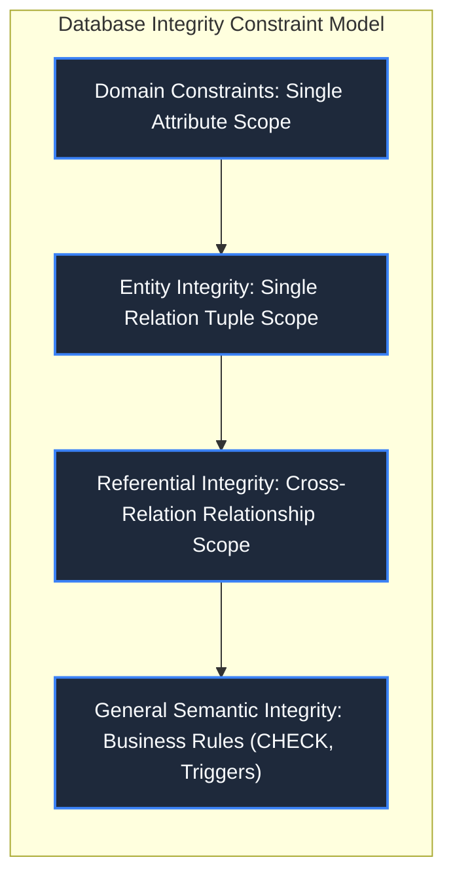
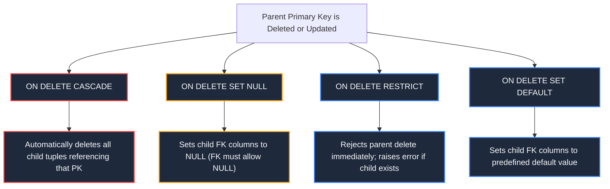
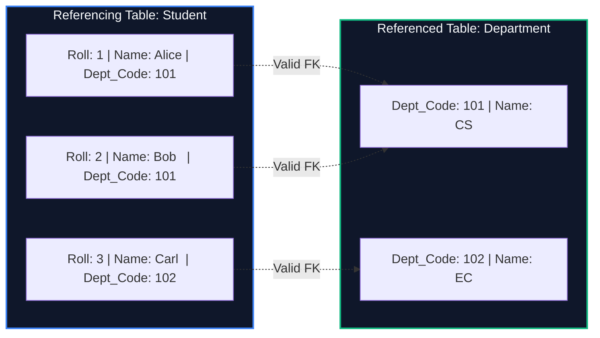

import CoreDoseLessonHeader from "@site/src/components/CoreDose/CoreDoseLessonHeader";
import CoreDoseTOC from "@site/src/components/CoreDose/CoreDoseTOC";
import CoreDoseNav from "@site/src/components/CoreDose/CoreDoseNav";

# 3.3 Integrity Constraints & Referential Actions (CASCADE, SET NULL, RESTRICT)

<CoreDoseLessonHeader
  module="Module 03: Relational Model & Relational Algebra"
  topic="Topic 3.3"
  readTime="8 min read"
  relevance="University Semester Exams • Technical Interviews • Database System Architecture"
/>

## 💡 Core Intuition

### 🍳 The Everyday Analogy: The Bank Account and Debit Cards
Consider a central bank account and the debit cards linked to it.
* **Domain Integrity**: You cannot write "Three Hundred Dollars" in the ATM pin slot; it strictly expects four numeric digits.
* **Entity Integrity**: Every bank account must have a unique Account Number. You cannot open an account with "No Number" (`NULL`).
* **Referential Integrity**: A debit card cannot point to an account number that does not exist in the bank's central ledger.
* **Referential Action Dilemma**: What happens if the customer closes the bank account?
  * **Restrict**: The bank prevents account closure until all linked cards are cancelled first.
  * **Cascade**: Closing the account instantly and automatically terminates all linked cards.
  * **Set Null**: The cards remain active in the system, but their account pointer is cleared (orphaned).

### 💻 Bridging to Computer Science
**Integrity Constraints** are formal predicate conditions declared on a database schema that every legal database state must satisfy. They prevent accidental data corruption by rejecting any write, update, or delete transaction that breaks consistency rules.

---

<CoreDoseTOC toc={toc} />

---

## 📚 Core Deep-Dive & Concepts

### 1. Classification of Relational Integrity Constraints

Relational constraints operate across three hierarchical tiers:



#### A. Domain Constraints
Domain constraints specify that the value of each attribute $A$ must be an atomic element from the physical domain $\text{dom}(A)$.
* **Data Type & Range**: An `Age` column defined as `TINYINT UNSIGNED CHECK (Age >= 18 AND Age <= 120)`.
* **Nullability**: Declaring whether an attribute allows the non-value `NULL`.

#### B. Entity Integrity Constraint
**Rule**: The Primary Key of any relation schema $R$ can **never** contain a `NULL` value.
$$
\forall t \in r(R), \quad t[PK] \neq \text{NULL} \quad \text{and} \quad \forall t_1, t_2 \in r(R), (t_1[PK] = t_2[PK] \implies t_1 = t_2)
$$
Because the primary key serves as the unique identifier for individual real-world entities in the relation, allowing `NULL` would mean storing an entity whose identity is completely undefined.

#### C. Referential Integrity Constraint
**Rule**: Specified between two relations: a **Referencing Relation** (Child $R_1$) and a **Referenced Relation** (Parent $R_2$).
$$
\pi_{FK}(R_1) \subseteq \pi_{PK}(R_2)
$$
Every non-null value of the Foreign Key in the child relation $R_1$ must exist as a primary key value in the referenced parent relation $R_2$.

---

### 2. The Comprehensive Operation Violation Matrix

When users execute `INSERT`, `DELETE`, or `UPDATE` operations on either the Parent table (PK side) or the Child table (FK side), referential integrity may be violated:

| Operation | Executed On Table | Can It Violate Referential Integrity? | Exact Architectural Reason |
| :--- | :--- | :--- | :--- |
| **INSERT** | **Child Table ($FK$)** | **YES (May Violate)** | The inserted tuple may supply a Foreign Key value that does not exist in the Parent table. |
| **INSERT** | **Parent Table ($PK$)** | **NO (Never)** | Adding a new primary key in the parent creates no invalid dangling references. |
| **DELETE** | **Child Table ($FK$)** | **NO (Never)** | Removing a child row simply eliminates a reference; parent rows remain valid. |
| **DELETE** | **Parent Table ($PK$)** | **YES (May Violate)** | Deleting a parent row leaves child rows referencing a non-existent primary key (orphans). |
| **UPDATE** | **Child Table ($FK$)** | **YES (May Violate)** | Changing the $FK$ value to a non-existent parent ID breaks referential integrity. |
| **UPDATE** | **Parent Table ($PK$)** | **YES (May Violate)** | Modifying the $PK$ value invalidates all child tuples pointing to the old $PK$ value. |

---

### 3. Referential Actions on Parent Modification

To maintain consistency when a tuple in the referenced Parent relation is deleted or its Primary Key is updated, the relational engine executes one of four declared **Referential Actions**:

```sql
FOREIGN KEY (Dept_Code) REFERENCES Department(Dept_Code)
  ON DELETE [ CASCADE | SET NULL | SET DEFAULT | RESTRICT | NO ACTION ]
  ON UPDATE [ CASCADE | SET NULL | SET DEFAULT | RESTRICT | NO ACTION ]
```



#### Detailed Breakdown of Policies
**1. CASCADE**:
* `ON DELETE CASCADE`: If parent row `Dept_Code = 101` is deleted, all student rows with `Dept_Code = 101` are automatically purged from the child table.
* `ON UPDATE CASCADE`: If parent `Dept_Code` changes from `101` to `201`, the engine updates all referencing child rows to `201` simultaneously.

**2. SET NULL**:
* If the parent row is deleted or updated, the foreign key column in all matching child rows is set to `NULL`.
* **Prerequisite**: The child foreign key column must **not** be declared with a `NOT NULL` constraint; otherwise, the engine raises an integrity error.

**3. RESTRICT / NO ACTION**:
* The database engine actively checks whether any matching child records exist before permitting the parent modification. If even one matching child tuple exists, the entire transaction is aborted and rolled back.

**4. SET DEFAULT**:
* The child table's foreign key attributes are replaced with their specified default value (e.g., `Dept_Code = 999` for `Unassigned`).

---

### 4. Mathematical Proof: Foreign Key Set Difference

Consider a database containing referencing relation $R_1(A, B)$ and referenced relation $R_2(C, D)$, where attribute $B$ is a foreign key referencing primary key $C$.

Because referential integrity strictly asserts that:
$$
\pi_B(R_1) \subseteq \pi_C(R_2)
$$

It follows directly from fundamental set theory that the set difference of foreign key values minus primary key values must evaluate to the empty set:
$$
\pi_B(R_1) \setminus \pi_C(R_2) = \emptyset
$$

If a query $\pi_B(R_1) - \pi_C(R_2)$ returns any tuple, the database is in an illegal, corrupted state with orphaned records.

---

## 📐 Architecture / Visual Blueprint



---

## 🏭 In The Real World: Production Case Study

### High-Volume Financial Ledgers at Stripe & Square
In enterprise payment gateways, ledger entries record transactions moving money between customer accounts.
* **The Architecture Rule**: Payment records must **never** be deleted under any circumstance (`ON DELETE CASCADE` is strictly prohibited on financial ledgers for auditing and regulatory compliance).
* **The Design Pattern**:
  ```sql
  CREATE TABLE ledger_transactions (
      transaction_id UUID PRIMARY KEY,
      account_id UUID NOT NULL,
      amount NUMERIC(18, 4) NOT NULL,
      status VARCHAR(20) NOT NULL,
      CONSTRAINT fk_account 
          FOREIGN KEY (account_id) 
          REFERENCES user_accounts(account_id) 
          ON DELETE RESTRICT 
          ON UPDATE RESTRICT
  );
  ```
* **Why RESTRICT?** If a user attempts to delete their user account, the database rejects the command immediately because financial records reference that `account_id`. Instead of physical row deletion, financial systems use **Soft Deletion** (setting an `is_deleted = TRUE` flag or `deleted_at` timestamp).

---

## 🎯 Exam & Interview Pitfall Check

:::tip Core Conceptual Questions

**Question 1:** Why is an `INSERT` operation on the parent table guaranteed never to violate referential integrity, whereas an `INSERT` on the child table can?  
**Answer:**  
Referential integrity enforces $\pi_{FK}(\text{Child}) \subseteq \pi_{PK}(\text{Parent})$. When you insert a tuple into the parent table, you are merely expanding the set of available target IDs ($\pi_{PK}(\text{Parent})$). Expanding the superset cannot cause an existing subset to fall outside of it. Conversely, inserting into the child table introduces a new element into $\pi_{FK}(\text{Child})$. If this new ID does not exist in $\pi_{PK}(\text{Parent})$, the subset property is immediately broken.

**Question 2:** Under what condition will an `ON DELETE SET NULL` specification cause an execution error during parent row deletion?  
**Answer:**  
An `ON DELETE SET NULL` action will fail and trigger a database constraint violation error if the foreign key column in the child table was also declared with a `NOT NULL` constraint (e.g. `Dept_Code INT NOT NULL REFERENCES Department(Dept_Code)`). The engine cannot write `NULL` to a column that explicitly prohibits null values.
:::

:::warning Common Interview Traps

**Trap 1: "Is referential integrity specified on an individual table or between tables?"**  
**Answer:** Entity integrity is specified on an individual table (e.g., Primary Key), but Referential Integrity is an inter-relational constraint specified between two tables (or within one table in the case of a recursive foreign key).

**Trap 2: "What is the difference between RESTRICT and NO ACTION in SQL standard?"**  
**Answer:** In standard SQL, both prevent the deletion or update of a referenced parent row. However, `RESTRICT` enforces the check immediately before executing any statement. `NO ACTION` allows deferred constraint checking (if declared as `DEFERRABLE INITIALLY DEFERRED`), meaning foreign key validity is checked at the end of the transaction rather than immediately after the individual statement.
:::

---

<CoreDoseNav
  prev={{
    title: "3.2 Keys in Relational Model: Candidate, Primary & Foreign Keys",
    url: "/coredose/dbms/chapter-03/keys-in-relational-model"
  }}
  next={{
    title: "3.4 Fundamental Relational Algebra Operators",
    url: "/coredose/dbms/chapter-03/fundamental-relational-algebra-operators"
  }}
  courseUrl="/coredose/dbms"
/>
