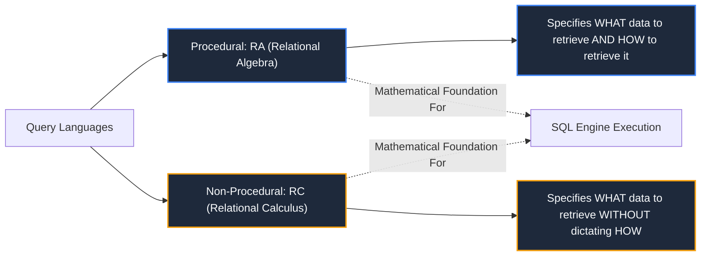
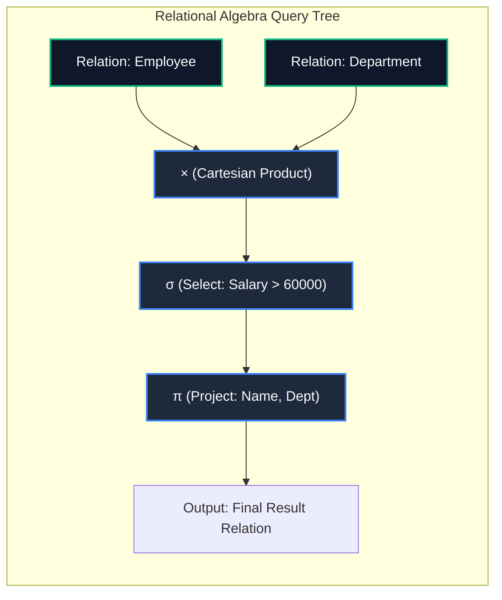

import CoreDoseLessonHeader from "@site/src/components/CoreDose/CoreDoseLessonHeader";
import CoreDoseTOC from "@site/src/components/CoreDose/CoreDoseTOC";
import CoreDoseNav from "@site/src/components/CoreDose/CoreDoseNav";

# 3.4 Fundamental Relational Algebra Operators: Selection, Projection & Set Operations

<CoreDoseLessonHeader
  module="Module 03: Relational Model & Relational Algebra"
  topic="Topic 3.4"
  readTime="9 min read"
  relevance="University Semester Exams • Technical Interviews • Query Optimization Foundations"
/>

## 💡 Core Intuition

### 🍳 The Everyday Analogy: Slicing and Combining Spreadsheets
Imagine you have a printed physical spreadsheet of 10,000 university students:
* **Selection ($\sigma$)**: Using a ruler and pen to cross out all rows except students enrolled in "Computer Science". You are **slicing horizontally**; the number of columns stays identical.
* **Projection ($\pi$)**: Taking scissors and cutting away all columns except `Name` and `Email`. You are **slicing vertically**; duplicate identical cards are collapsed into one.
* **Cartesian Product ($\times$)**: Pairing every single student with every single available campus locker to explore all theoretical combinations.
* **Union ($\cup$) & Difference ($-$)**: Merging two class rosters, or subtracting students who already graduated from the current semester list.

### 💻 Bridging to Computer Science
**Relational Algebra** is a formal procedural query language that defines the theoretical foundation of relational database query processing. An algebra consists of **operands** (relations/tables) and **operators** that manipulate relations to produce a new, unnamed relation as the output.

---

<CoreDoseTOC toc={toc} />

---

## 📚 Core Deep-Dive & Concepts

### 1. Procedural vs Non-Procedural Query Languages

Database query languages fall into two distinct paradigms:

Relational Algebra is pure mathematics based on **Set Theory**. Therefore, in pure relational algebra:
1. Every operator consumes one or two relations as input and produces exactly **one relation** as output (Closure Property).
2. **Duplicate rows are automatically eliminated** from any intermediate or final result relation.

---

### 2. The Six Fundamental Operators

All relational queries can be expressed using a minimal set of **six fundamental operators**:

| Operator | Symbol | Arity | Primary Action | Degree of Output | Cardinality Range |
| :--- | :---: | :--- | :--- | :--- | :--- |
| **Select** | $\sigma$ | Unary | Horizontal row filter | $\text{Deg}(R)$ | $0 \le |\sigma(R)| \le |R|$ |
| **Project** | $\pi$ | Unary | Vertical column filter | Number of chosen cols ($k$) | $1 \le |\pi(R)| \le |R|$ (if $|R| \ge 1$) |
| **Union** | $\cup$ | Binary | Combines tuples from two relations | $\text{Deg}(R)$ | $\max(\|R\|, \|S\|) \le \|R \cup S\| \le \|R\| + \|S\|$ |
| **Set Difference** | $-$ | Binary | Tuples in $R$ but not in $S$ | $\text{Deg}(R)$ | $0 \le \|R - S\| \le \|R\|$ |
| **Cartesian Product** | $\times$ | Binary | Cross pairs all tuples | $\text{Deg}(R) + \text{Deg}(S)$ | $\|R\| \times \|S\|$ |
| **Rename** | $\rho$ | Unary | Renames relation/attributes | $\text{Deg}(R)$ | $\|R\|$ |

---

### 3. Detailed Operator Analysis & Mathematical Bounds

#### A. Select Operation ($\sigma$) — Horizontal Filtering
**Definition**: Selects tuples that satisfy a given boolean predicate condition $p$.
$$
\sigma_p(r) = \{ t \mid t \in r \land p(t) = \text{true} \}
$$

**Properties of Selection**:
* **Degree**: $\text{Degree}(\sigma_p(r)) = \text{Degree}(r)$ (Column count remains invariant).
* **Cardinality Bounds**:
  $$
  0 \le |\sigma_p(r)| \le |r|
  $$
  Minimum cardinality is $0$ (when no tuples satisfy $p$); maximum cardinality is $|r|$ (when every tuple satisfies $p$).
* **Commutativity**: Selection operations are strictly commutative:
  $$
  \sigma_{p_1}(\sigma_{p_2}(r)) = \sigma_{p_2}(\sigma_{p_1}(r))
  $$
* **Predicate Connectives**: Selection conditions can combine comparison operators ($=, \neq, <, \le, >, \ge$) using logical connectives $\land$ (AND), $\lor$ (OR), and $\neg$ (NOT).

---

#### B. Project Operation ($\pi$) — Vertical Filtering
**Definition**: Selects specified columns and discards all unlisted columns.
$$
\pi_{A_1, A_2, \dots, A_k}(r) = \{ t[A_1, A_2, \dots, A_k] \mid t \in r \}
$$

**Properties of Projection**:
* **Degree**: The degree of the result equals the number of attributes specified in the projection list:
  $$
  \text{Degree}(\pi_{A_1, \dots, A_k}(r)) = k \quad (1 \le k \le n)
  $$
* **Duplicate Elimination**: Because relations are mathematical sets, any identical duplicate rows produced after removing distinguishing columns are automatically eliminated.
* **Cardinality Bounds**:
  $$
  1 \le |\pi_{A_1, \dots, A_k}(r)| \le |r| \quad (\text{assuming } |r| \ge 1)
  $$
  If the projection list contains a candidate key of $r$, then $|\pi(r)| = |r|$ (no duplicates can exist).
* **Non-Commutative**: Cascaded projections cannot be swapped arbitrarily:
  $$
  \pi_{A_1}(\pi_{A_1, A_2}(r)) = \pi_{A_1}(r) \quad \text{but} \quad \pi_{A_1, A_2}(\pi_{A_1}(r)) \text{ is illegal}
  $$

---

#### C. Union Operation ($\cup$)
**Definition**: Merges all tuples from relation $R$ and relation $S$.
$$
R \cup S = \{ t \mid t \in R \lor t \in S \}
$$

**Union Compatibility Requirements**:
Two relations $R$ and $S$ can participate in a Union (or Set Difference / Intersection) if and only if they are **Union Compatible**:
1. **Equal Degree**: $\text{Degree}(R) = \text{Degree}(S) = n$.
2. **Compatible Domains**: For all $1 \le i \le n$, $\text{dom}(A_i) = \text{dom}(B_i)$ (corresponding attributes have matching data types).

**Mathematical Bounds**:
* **Degree**: $\text{Degree}(R \cup S) = \text{Degree}(R) = \text{Degree}(S)$.
* **Cardinality**:
  $$
  \max(|R|, |S|) \le |R \cup S| \le |R| + |S|
  $$
  * Lower bound occurs when one relation is a complete subset of the other ($R \subseteq S$ or $S \subseteq R$).
  * Upper bound occurs when $R$ and $S$ are mutually disjoint ($R \cap S = \emptyset$).

---

#### D. Set Difference Operation ($-$)
**Definition**: Finds tuples that belong to relation $R$ but do **not** belong to relation $S$.
$$
R - S = \{ t \mid t \in R \land t \notin S \}
$$

**Mathematical Bounds**:
* **Degree**: $\text{Degree}(R - S) = \text{Degree}(R) = \text{Degree}(S)$ (requires union compatibility).
* **Cardinality**:
  $$
  0 \le |R - S| \le |R|
  $$
  * Lower bound $0$ occurs when $R \subseteq S$.
  * Upper bound $|R|$ occurs when $R \cap S = \emptyset$.
* **Non-Commutative**: $R - S \neq S - R$.

---

#### E. Cartesian Product (Cross Product $\times$)
**Definition**: Associates every tuple in relation $R_1$ with every tuple in relation $R_2$.
$$
R_1 \times R_2 = \{ t_1 \circ t_2 \mid t_1 \in R_1 \land t_2 \in R_2 \}
$$

**Mathematical Bounds**:
* **Degree**: $\text{Degree}(R_1 \times R_2) = \text{Degree}(R_1) + \text{Degree}(R_2)$.
* **Cardinality**:
  $$
  |R_1 \times R_2| = |R_1| \times |R_2| = m \cdot n
  $$

#### Step-by-Step Derivation Example
Let $R_1(A, B)$ have $3$ tuples, and $R_2(B, C)$ have $3$ tuples:

**Table $R_1$**:
| A | B |
| :-: | :-: |
| 1 | P |
| 2 | Q |
| 3 | R |

**Table $R_2$**:
| B | C |
| :-: | :-: |
| Q | X |
| R | Y |
| S | Z |

**Cartesian Product $R_1 \times R_2$ ($3 \times 3 = 9$ tuples)**:
| A | $R_1.B$ | $R_2.B$ | C |
| :-: | :-: | :-: | :-: |
| 1 | P | Q | X |
| 1 | P | R | Y |
| 1 | P | S | Z |
| 2 | Q | Q | X |
| 2 | Q | R | Y |
| 2 | Q | S | Z |
| 3 | R | Q | X |
| 3 | R | R | Y |
| 3 | R | S | Z |

---

#### F. Rename Operation ($\rho$)
**Definition**: Used to rename relation results and attribute names so expressions can be referenced cleanly in subsequent algebra operations.
$$
\rho_{X(B_1, B_2, \dots, B_n)}(E)
$$
Where:
* $X$ is the new relation name assigned to expression $E$.
* $B_1, B_2, \dots, B_n$ are the optional new attribute names assigned to the resulting columns.

---

## 📐 Architecture / Visual Blueprint

---

## 🏭 In The Real World: Production Case Study

### Query Optimizer Rule: Predicate Pushdown in PostgreSQL & CockroachDB
In real database engines, evaluating a raw Cartesian product $\times$ before filtering results in catastrophic performance.
* **Naive Query**: $\sigma_{\text{Age} > 25}(R \times S)$. If $R$ has $1,000,000$ rows and $S$ has $1,000$ rows, computing $R \times S$ creates **$1$ billion intermediate tuples**, exhausting server RAM.
* **Optimized Algebra Rule (Pushdown)**:
  $$
  \sigma_{\text{Age} > 25}(R \times S) \equiv (\sigma_{\text{Age} > 25}(R)) \times S
  $$
* **Engine Execution**: The PostgreSQL query planner recognizes the algebraic equivalence and pushes the selection $\sigma$ down directly to the disk storage scan on table $R$. If only $50,000$ rows satisfy $\text{Age} > 25$, the intermediate Cartesian product drops from $1,000,000,000$ rows down to $50,000,000$ rows—a **95% reduction** in memory and CPU cycles.

---

## 🎯 Exam & Interview Pitfall Check

:::tip Core Conceptual Questions

**Question 1:** Prove why the set intersection operator ($\cap$) is a derived operator rather than a fundamental operator in relational algebra.  
**Answer:**  
An operator is fundamental if it cannot be expressed using any combination of other operators. Set intersection ($R \cap S$) can be completely derived using the fundamental Set Difference ($-$) operator:
$$
R \cap S = R - (R - S)
$$
Alternatively, $R \cap S$ can also be expressed using Union and Set Difference:
$$
R \cap S = (R \cup S) - ((R - S) \cup (S - R))
$$
Because it can be synthesized entirely from fundamental operators, $\cap$ is formally classified as a derived operator.

**Question 2:** If relation $R$ has degree $4$ and cardinality $10$, and relation $S$ has degree $3$ and cardinality $5$, compute the degree and cardinality of $R \times S$.  
**Answer:**  
* **Degree of $R \times S$**: $\text{Deg}(R) + \text{Deg}(S) = 4 + 3 = \mathbf{7}$.
* **Cardinality of $R \times S$**: $|R| \times |S| = 10 \times 5 = \mathbf{50}$.
:::

:::warning Common Interview Traps

**Trap 1: "Is Projection commutative: $\pi_{A}(\pi_{B}(R)) = \pi_{B}(\pi_{A}(R))$?"**  
**Answer: No.** Projection is not commutative. In fact, if attribute $B$ is not present in attribute set $A$, evaluating the outer projection $\pi_{B}$ after $\pi_{A}$ will fail immediately with an "attribute not found" error because the inner projection already discarded attribute $B$.

**Trap 2: "Can two relations of different degrees be combined with Union ($\cup$)?"**  
**Answer: No.** Union requires strict union compatibility: both relations must have the exact same number of attributes ($\text{Deg}(R) = \text{Deg}(S)$) and corresponding columns must share compatible data types.
:::

---

<CoreDoseNav
  prev={{
    title: "3.3 Integrity Constraints & Referential Actions",
    url: "/coredose/dbms/chapter-03/integrity-constraints-and-referential-actions"
  }}
  next={{
    title: "3.5 Derived Relational Algebra Operators: Joins & Division",
    url: "/coredose/dbms/chapter-03/derived-relational-algebra-joins-and-division"
  }}
  courseUrl="/coredose/dbms"
/>
