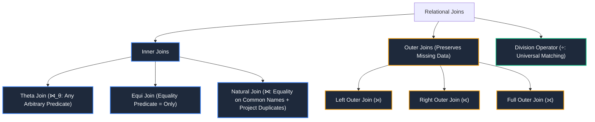
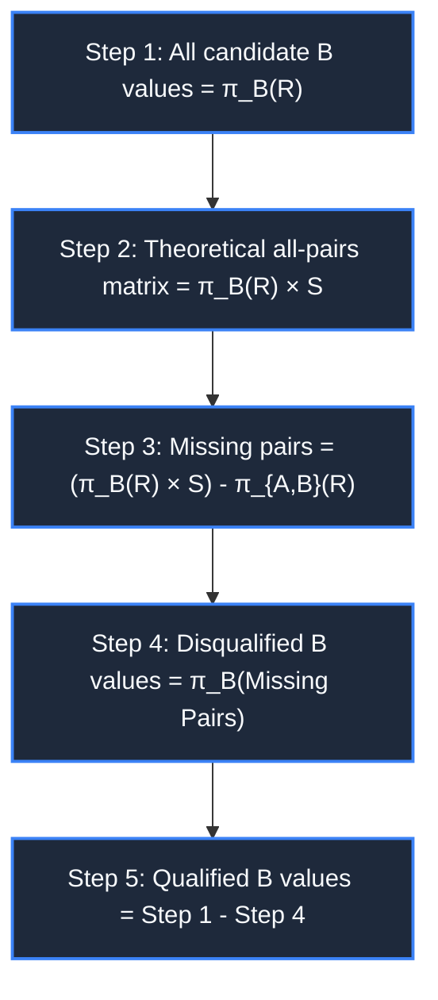
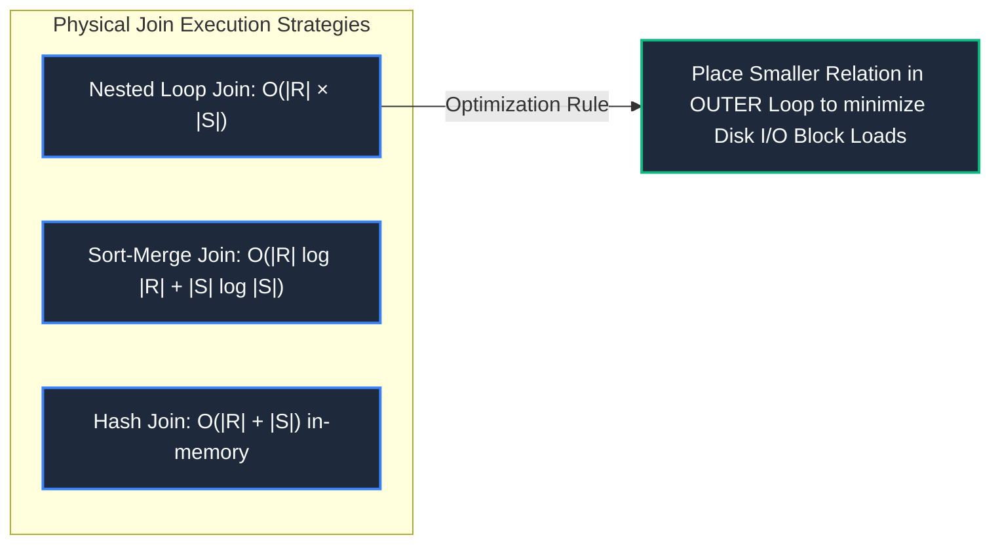

import CoreDoseLessonHeader from "@site/src/components/CoreDose/CoreDoseLessonHeader";
import CoreDoseTOC from "@site/src/components/CoreDose/CoreDoseTOC";
import CoreDoseNav from "@site/src/components/CoreDose/CoreDoseNav";

# 3.5 Derived Relational Algebra Operators: Joins & Relational Division

<CoreDoseLessonHeader
  module="Module 03: Relational Model & Relational Algebra"
  topic="Topic 3.5"
  readTime="10 min read"
  relevance="University Semester Exams • Technical Interviews • Advanced Query Engineering"
/>

## 💡 Core Intuition

### 🍳 The Everyday Analogy: The University Course Requirement Checklist
Imagine you want to find students eligible for an advanced AI scholarship. The prerequisite rule states: *"A student must have passed ALL three foundational math courses: Calculus, Linear Algebra, and Probability."*
* **Natural Join ($\bowtie$)**: Stitching a student's personal profile to their grade records by matching student IDs.
* **Outer Joins**: Listing every enrolled student even if they haven't registered for any exams yet, so no student is accidentally erased from administrative view.
* **Relational Division ($\div$)**: You take the entire university enrollment table and divide it by the required 3-course list. The division engine scans every student and outputs **only those students who match every single entry in the denominator**.

### 💻 Bridging to Computer Science
**Derived Operators** are relational algebra operations that do not introduce new fundamental expressive power, but synthesize common multi-step patterns (such as combining Cartesian product with conditional selection) into concise, computationally optimized primitives.

---

<CoreDoseTOC toc={toc} />

---

## 📚 Core Deep-Dive & Concepts

### 1. Classification of Relational Join Operators

---

### 2. Inner Joins: Theta, Equi, and Natural Join

#### A. Theta Join ($\bowtie_\theta$)
**Definition**: Combines a Cartesian Product of two relations with an arbitrary selection condition $\theta$:
$$
R \bowtie_\theta S = \sigma_\theta(R \times S)
$$
Condition $\theta$ may include comparison operators: $\{=, \neq, <, \le, >, \ge\}$.

#### B. Equi Join
A special case of Theta Join where the condition $\theta$ consists solely of equality comparisons ($=$).

#### C. Natural Join ($\bowtie$)
**Definition**: A binary operator that matches tuples across two relations based on **all attributes that share the exact same name**, enforces equality on those shared attributes, and **projects out duplicate common columns**.

**Formal Algebraic Definition**:
Let $R(A, B)$ and $S(B, C)$ share common attribute $B$:
$$
R \bowtie S = \pi_{A, R.B, C}(\sigma_{R.B = S.B}(R \times S))
$$

**Properties of Natural Join**:
* **Commutativity**: $R \bowtie S = S \bowtie R$.
* **Degree**: $\text{Deg}(R \bowtie S) = \text{Deg}(R) + \text{Deg}(S) - |\text{Common Attributes}|$.
* **Cardinality Bounds**:
  $$
  0 \le |R \bowtie S| \le |R| \times |S|
  $$
  * Minimum is $0$ (when no tuples share matching values on the common attribute).
  * Maximum is $|R| \times |S|$ (when all tuples have the identical value for the common attribute).
  * If the common attribute is a Foreign Key referencing a unique Primary Key in $S$, then:
    $$
    |R \bowtie S| \le |R|
    $$

#### Worked Example: Natural Join
Let $R_1(A, B)$ and $R_2(B, C)$ be defined as:

**Table $R_1$**:
| A | B |
| :-: | :-: |
| 1 | P |
| 2 | Q |
| 3 | R |

**Table $R_2$**:
| B | C |
| :-: | :-: |
| Q | X |
| R | Y |
| S | Z |

**Natural Join Result ($R_1 \bowtie R_2$)**:
| A | B | C |
| :-: | :-: | :-: |
| 2 | Q | X |
| 3 | R | Y |

*(Note: Tuple $(1, P)$ from $R_1$ and $(S, Z)$ from $R_2$ are discarded because attribute $B$ had no corresponding match).*

---

### 3. Outer Joins: Preserving Missing Information

An **Outer Join** extends the natural join to preserve tuples that would otherwise be discarded due to lack of a matching partner, filling missing attribute values with `NULL`.

#### A. Left Outer Join ($\leftouterjoin$)
Preserves **all tuples from the left relation** $R_1$. If a tuple in $R_1$ has no matching tuple in $R_2$, right attributes are padded with `NULL`.

**Result ($R_1 \leftouterjoin R_2$)**:
| A | B | C |
| :-: | :-: | :-: |
| 1 | P | `NULL` |
| 2 | Q | X |
| 3 | R | Y |

#### B. Right Outer Join ($\rightouterjoin$)
Preserves **all tuples from the right relation** $R_2$. If a tuple in $R_2$ has no matching tuple in $R_1$, left attributes are padded with `NULL`.

**Result ($R_1 \rightouterjoin R_2$)**:
| A | B | C |
| :-: | :-: | :-: |
| 2 | Q | X |
| 3 | R | Y |
| `NULL` | S | Z |

#### C. Full Outer Join ($\fullouterjoin$)
Preserves **all tuples from both relations**, padding missing values from either side with `NULL`.

**Result ($R_1 \fullouterjoin R_2$)**:
| A | B | C |
| :-: | :-: | :-: |
| 1 | P | `NULL` |
| 2 | Q | X |
| 3 | R | Y |
| `NULL` | S | Z |

---

### 4. The Division Operator ($\div$): Mathematical Universality

**Definition**: The Division Operator ($R \div S$) is applied when a query involves the universal phrase **"FOR ALL"** or **"EVERY"** (e.g., *"Find customers who purchased EVERY product sold by company X"*).

Let:
$$
R(Z) \quad \text{and} \quad S(X) \quad \text{where} \quad X \subset Z
$$
Let $Y = Z \setminus X$. The result of $R \div S$ is a relation schema $T(Y)$ containing all tuples $t[Y]$ such that for every tuple $s \in S$, the concatenated tuple $t[Y] \circ s \in R$.

#### The Fundamental Algebraic Derivation of Division
Relational division can be expressed entirely using the fundamental operators Projection ($\pi$), Cartesian Product ($\times$), and Set Difference ($-$):

$$
R(A, B) \div S(A) = \pi_B(R) - \pi_B\Big( (\pi_B(R) \times S) - \pi_{A, B}(R) \Big)
$$

#### Step-by-Step Derivation & Reduction
1. **$\pi_B(R)$**: The universe of all distinct $B$ values present in table $R$.
2. **$\pi_B(R) \times S$**: The complete theoretical cartesian matrix pairing **every** candidate $B$ value with **every** required $A$ value from $S$.
3. **$(\pi_B(R) \times S) - \pi_{A, B}(R)$**: Tuples that **should** exist if a $B$ value satisfied all conditions, but are **missing** from the actual relation $R$.
4. **$\pi_B\Big( (\pi_B(R) \times S) - \pi_{A, B}(R) \Big)$**: Projects the $B$ values that failed at least one required match (the disqualified candidates).
5. **Final Subtraction**: Subtracting the disqualified candidates from the universe of all $B$ values leaves only the candidates that matched **every single** entry in $S$.

---

### 5. Fully Solved Numerical: Relational Division

Consider relation $R(A, B)$ and relation $S(A)$:

**Relation $R(A, B)$**:
| A | B |
| :-: | :-: |
| $a_1$ | $b_1$ |
| $a_2$ | $b_1$ |
| $a_3$ | $b_1$ |
| $a_4$ | $b_1$ |
| $a_1$ | $b_2$ |
| $a_3$ | $b_2$ |
| $a_2$ | $b_3$ |
| $a_3$ | $b_3$ |
| $a_4$ | $b_3$ |
| $a_1$ | $b_4$ |
| $a_2$ | $b_4$ |
| $a_3$ | $b_4$ |

**Relation $S(A)$**:
| A |
| :-: |
| $a_1$ |
| $a_2$ |
| $a_3$ |

**Goal**: Compute $R \div S$.

**Solution**:
1. Attributes of result: $Z \setminus X = \{A, B\} \setminus \{A\} = \{B\}$.
2. Inspect each unique $B$ value's associated $A$ values in $R$:
   * For $b_1$: Associated $A$ values are $\{a_1, a_2, a_3, a_4\}$. Since $\{a_1, a_2, a_3\} \subseteq \{a_1, a_2, a_3, a_4\}$, **$b_1$ qualifies**.
   * For $b_2$: Associated $A$ values are $\{a_1, a_3\}$. Missing $a_2$ $\implies$ **$b_2$ disqualified**.
   * For $b_3$: Associated $A$ values are $\{a_2, a_3, a_4\}$. Missing $a_1$ $\implies$ **$b_3$ disqualified**.
   * For $b_4$: Associated $A$ values are $\{a_1, a_2, a_3\}$. Exactly matches $S$ $\implies$ **$b_4$ qualifies**.

**Final Output ($R \div S$)**:
| B |
| :-: |
| $b_1$ |
| $b_4$ |

---

## 📐 Architecture / Visual Blueprint

---

## 🏭 In The Real World: Production Case Study

### Join Execution in Modern Cloud Warehouses (Snowflake & ClickHouse)
In modern analytical systems processing petabyte-scale fact tables (e.g. 50 billion payment transactions):
* **The Problem**: A natural join between `transactions` (50B rows) and `merchants` (200K rows) cannot afford a nested loop.
* **The Production Architecture**:
  1. **Broadcast Join**: The database coordinator broadcasts the small `merchants` dimension table ($200\text{K}$ rows) across all distributed worker nodes into RAM.
  2. **In-Memory Hash Join**: Each worker node builds an in-memory hash table on `merchant_id` in $O(|S|)$ time.
  3. **Stream Probing**: As each worker streams local chunks of the massive `transactions` table, it performs instant $O(1)$ hash lookups. This prevents petabytes of network shuffle across clusters.

---

## 🎯 Exam & Interview Pitfall Check

:::tip Core Conceptual Questions

**Question 1:** Given relation $R(A, B)$ with $|R| = 100$ and relation $S(B, C)$ with $|S| = 50$. What are the minimum and maximum possible number of tuples in $R \bowtie S$?  
**Answer:**  
* **Minimum Tuples**: **$0$**. If the values in attribute $B$ in relation $R$ are completely disjoint from the values in attribute $B$ in relation $S$ ($\pi_B(R) \cap \pi_B(S) = \emptyset$), zero tuples match.
* **Maximum Tuples**: **$5,000$** ($100 \times 50$). If all $100$ tuples of $R$ and all $50$ tuples of $S$ share the exact same constant value for $B$ (e.g. $B = 1$), the natural join degenerates into a full Cartesian product.

**Question 2:** Why must the smaller relation be placed in the outer loop during a Nested Loop Join algorithm?  
**Answer:**  
In a block-oriented nested loop join, if $R$ is outer and $S$ is inner, the total disk block accesses are:
$$
\text{Total I/O} = B_R + (B_R \times B_S)
$$
Where $B_R$ and $B_S$ represent the number of disk blocks occupied by relations $R$ and $S$. Placing the relation with smaller block count ($B_R$) in the outer loop significantly minimizes the leading $(B_R)$ and scalar multiplier term in memory-constrained buffer environments.
:::

:::warning Common Interview Traps

**Trap 1: "Is Natural Join a fundamental operator of relational algebra?"**  
**Answer: No.** Natural Join is a derived operator because it can be fully synthesized using Cartesian Product ($\times$), Selection ($\sigma$), and Projection ($\pi$).

**Trap 2: "Can the Division operator $R \div S$ be executed if $S$ has columns that are not in $R$?"**  
**Answer: No.** Division requires the denominator relation's attributes to be a strict subset of the numerator relation's attributes ($\text{Attributes}(S) \subset \text{Attributes}(R)$).
:::

---

<CoreDoseNav
  prev={{
    title: "3.4 Fundamental Relational Algebra Operators",
    url: "/coredose/dbms/chapter-03/fundamental-relational-algebra-operators"
  }}
  next={{
    title: "4.1 SQL Command Categories: DDL, DML, DCL & TCL",
    url: "/coredose/dbms/chapter-04/sql-command-categories-ddl-dml-dcl-tcl"
  }}
  courseUrl="/coredose/dbms"
/>
