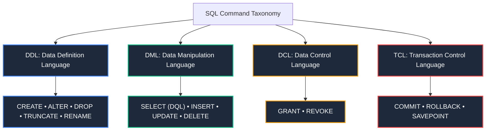
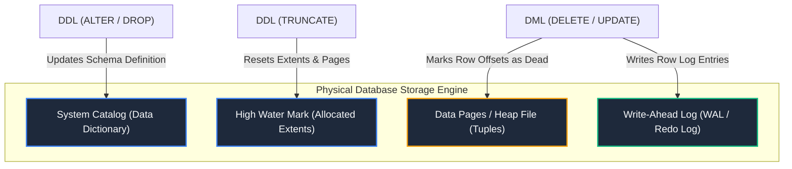

import CoreDoseLessonHeader from "@site/src/components/CoreDose/CoreDoseLessonHeader";
import CoreDoseTOC from "@site/src/components/CoreDose/CoreDoseTOC";
import CoreDoseNav from "@site/src/components/CoreDose/CoreDoseNav";

# 4.1 SQL Command Categories: DDL, DML, DCL & TCL

<CoreDoseLessonHeader
  module="Module 04: Structured Query Language (SQL)"
  topic="Topic 4.1"
  readTime="8 min read"
  relevance="University Semester Exams • Technical Interviews • Database Administration"
/>

## 💡 Core Intuition

### 🍳 The Everyday Analogy: The Restaurant Kitchen Operations
Imagine running a commercial restaurant kitchen:
* **DDL (Data Definition Language)**: The architect and carpenters building the kitchen layout, installing steel counters, prep sinks, and shelves. You design the structure of where things belong.
* **DML (Data Manipulation Language)**: The line chefs cooking food, chopping onions, placing ingredients on plates, and serving dishes. You work with the actual food inside the existing counters.
* **DCL (Data Control Language)**: The restaurant owner handing physical keys to the head chef (`GRANT`) or revoking access from a fired line cook (`REVOKE`).
* **TCL (Transaction Control Language)**: The order ticketing system. When an order of steak and wine is completed without kitchen errors, it is rung up (`COMMIT`). If the kitchen runs out of steak mid-prep, the entire order is canceled and refunded (`ROLLBACK`).

### 💻 Bridging to Computer Science
**Structured Query Language (SQL)** is a domain-specific declarative language designed for managing data held in a relational database management system (RDBMS). While colloquially termed a "query language", SQL does far more than retrieve data: it defines relational schemas, alters table topologies, governs access security, and enforces transactional boundaries.

---

<CoreDoseTOC toc={toc} />

---

## 📚 Core Deep-Dive & Concepts

### 1. The Mathematical Foundation of SQL

SQL is not a purely procedural nor a purely non-procedural language:
* **Relational Algebra Foundation (over 90%)**: The operational execution engine converts SQL queries into procedural Relational Algebra operator trees (Selection, Projection, Join).
* **Tuple Relational Calculus Foundation (declarative layer)**: The user-facing declarative syntax (`SELECT ... FROM ... WHERE`) specifies *what* data to retrieve rather than the procedural traversal steps.

Unlike pure Relational Algebra, SQL operates on **Multisets (Bags)** rather than mathematical sets:
1. SQL relations can contain **duplicate tuples** by default.
2. Duplicate elimination must be explicitly requested using the `DISTINCT` keyword.

---

### 2. The Four Pillars of SQL Commands



---

### 3. Detailed Command Breakdown

#### A. Data Definition Language (DDL)
DDL commands modify the metadata stored in the database's **Data Dictionary (System Catalog)**. They define, adjust, and dismantle schema structures.
* **`CREATE`**: Creates databases, tables, views, indices, and constraints.
  ```sql
  CREATE TABLE department (
      dept_id INT PRIMARY KEY,
      dept_name VARCHAR(50) NOT NULL
  );
  ```
* **`ALTER`**: Modifies the structure of an existing table without destroying existing rows (e.g. adding columns, dropping columns, modifying column types).
  ```sql
  ALTER TABLE department ADD COLUMN budget NUMERIC(12, 2) DEFAULT 0.00;
  ```
* **`DROP`**: Completely deletes a table or database object, including its schema definition, associated indices, and all stored rows from disk storage.
  ```sql
  DROP TABLE department;
  ```
* **`TRUNCATE`**: Deallocates all data storage pages of a table, instantly clearing all tuples while keeping the empty table schema intact.
  ```sql
  TRUNCATE TABLE department;
  ```
* **`RENAME`**: Renames an existing table or schema object.

**Crucial Architectural Rule**: In standard relational database engines (such as MySQL and Oracle), **DDL operations issue an implicit `COMMIT` before and after execution**. Therefore, DDL commands **cannot be rolled back** using standard transaction rollback.

---

#### B. Data Manipulation Language (DML)
DML commands populate, modify, query, and prune tuples within existing schema tables.
* **`SELECT`** *(often categorized separately as Data Query Language / DQL)*: Retrieves tuples satisfying query criteria.
* **`INSERT`**: Adds new rows to a relation.
  ```sql
  INSERT INTO department (dept_id, dept_name, budget) 
  VALUES (101, 'Computer Science', 500000.00);
  ```
* **`UPDATE`**: Modifies attribute values of existing tuples satisfying a condition.
  ```sql
  UPDATE department 
  SET budget = budget * 1.10 
  WHERE dept_name = 'Computer Science';
  ```
* **`DELETE`**: Removes existing tuples matching a predicate condition.
  ```sql
  DELETE FROM department WHERE dept_id = 101;
  ```

**Crucial Architectural Rule**: DML operations execute within the active transaction context. They write row-level changes to the Write-Ahead Log (WAL) and **can be rolled back** safely prior to a `COMMIT`.

---

#### C. Data Control Language (DCL)
DCL commands manage user security, privilege delegations, and access control policies.
* **`GRANT`**: Gives specific privileges (e.g. `SELECT`, `INSERT`, `EXECUTE`) on database objects to designated database users or roles.
  ```sql
  GRANT SELECT, INSERT ON department TO analyst_role;
  ```
* **`REVOKE`**: Withdraws previously granted privileges from a user or role.
  ```sql
  REVOKE INSERT ON department FROM analyst_role;
  ```

---

#### D. Transaction Control Language (TCL)
TCL commands govern transactional atomicity, persistence, and recovery boundaries.
* **`COMMIT`**: Permanently writes all uncommitted transactional modifications to disk storage and releases row locks.
* **`ROLLBACK`**: Reverts all changes made since the start of the current transaction or to a designated checkpoint.
* **`SAVEPOINT`**: Establishes a named intermediate checkpoint within a multi-statement transaction, permitting partial rollbacks.
  ```sql
  BEGIN;
  UPDATE accounts SET balance = balance - 100 WHERE id = 1;
  SAVEPOINT step1;
  UPDATE accounts SET balance = balance + 100 WHERE id = 2;
  -- If step 2 fails:
  ROLLBACK TO SAVEPOINT step1;
  COMMIT;
  ```

---

### 4. Deep-Dive: TRUNCATE vs DELETE vs DROP

Understanding the physical storage differences between `TRUNCATE`, `DELETE`, and `DROP` is one of the most heavily tested areas in systems engineering:

| Architectural Metric | `DELETE` | `TRUNCATE` | `DROP` |
| :--- | :--- | :--- | :--- |
| **SQL Category** | **DML** | **DDL** | **DDL** |
| **Target Scope** | Specified rows (or all rows) | All rows in table | Complete table + schema |
| **`WHERE` Clause Supported?** | **Yes** (selective pruning) | **No** (all rows purged) | **No** |
| **Transaction Rollback?** | **Yes** (Fully logged in WAL) | **Engine-dependent** (No in MySQL/Oracle, Yes in Postgres) | **No** (Schema change committed) |
| **Physical Storage Mechanism** | Scans disk blocks; marks row slots as dead/deleted; maintains pages. | Deallocates all data pages; resets High-Water Mark (HWM). | Deallocates pages and drops table entry from System Catalog. |
| **Execution Speed** | Slow for large tables ($O(N)$ row writes to log). | **Extremely Fast** ($O(1)$ page deallocation). | **Extremely Fast** ($O(1)$ catalog purge). |
| **Trigger Activation** | Fires `BEFORE/AFTER DELETE` triggers per row. | Does **NOT** fire triggers. | Does **NOT** fire triggers. |
| **Schema Preservation** | Table structure remains intact. | Table structure remains intact. | Table structure is destroyed. |

---

## 📐 Architecture / Visual Blueprint



---

## 🏭 In The Real World: Production Case Study

### Safe Zero-Downtime Schema Migrations at Shopify & GitHub
Running naive DDL commands on production tables containing billions of rows can freeze an entire company:
* **The Disaster**: Executing `ALTER TABLE orders ADD COLUMN order_notes VARCHAR(255) DEFAULT 'None';` in older MySQL versions acquires an exclusive table metadata lock (`ACCESS EXCLUSIVE`). The database rewrites 500 GB of disk blocks on the fly, locking all active customer checkouts for 45 minutes.
* **The Production Solution (Online DDL / gh-ost)**:
  1. Engineering tools (like GitHub's `gh-ost` or MySQL `ALGORITHM=INPLACE, LOCK=NONE`) create a shadow replica table with the new schema.
  2. Background asynchronous workers stream binlog row changes from the active table into the shadow table.
  3. Once fully synchronized, an atomic metadata cutover (`RENAME TABLE orders TO orders_old, orders_new TO orders;`) swaps the tables in less than $10$ milliseconds with zero customer impact.

---

## 🎯 Exam & Interview Pitfall Check

:::tip Core Conceptual Questions

**Question 1:** Why is `TRUNCATE` substantially faster than `DELETE FROM table_name` when clearing a table containing 10 million rows?  
**Answer:**  
`DELETE` is a row-level DML command. For every single row among the 10 million tuples, the engine must acquire row-level locks, execute constraint checks, check for `DELETE` triggers, and write individual undo/redo record entries to the Write-Ahead Log (WAL). Conversely, `TRUNCATE` is a DDL command. It bypasses row scanning and trigger checks entirely, directly deallocating the underlying data extents/pages and resetting the table's High-Water Mark in the system catalog in $O(1)$ operations.

**Question 2:** Can a transaction rollback restore a dropped table?  
**Answer:**  
In standard RDBMS implementations (such as Oracle and MySQL), `DROP` is an auto-committing DDL statement that immediately updates the system catalog; it cannot be reversed with a `ROLLBACK` command (data recovery requires point-in-time backup restoration). However, in transactional DDL database engines like PostgreSQL, `DROP TABLE` executed inside an open transaction block (`BEGIN ... DROP TABLE ... ROLLBACK;`) can be rolled back safely because PostgreSQL logs catalog modifications within transactional WAL records.
:::

:::warning Common Interview Traps

**Trap 1: "Is SELECT a DML or DQL command?"**  
**Answer:** In academic database literature and official ANSI SQL standards, `SELECT` is formally classified under DML because it manipulates and reads relational instances. However, many modern textbooks and interviewers categorize it as **DQL (Data Query Language)** to isolate read-only querying from write-modifying operations (`INSERT`, `UPDATE`, `DELETE`).

**Trap 2: "Does TRUNCATE reset an AUTO_INCREMENT primary key counter?"**  
**Answer: Yes.** `TRUNCATE` deallocates all pages and reinitializes table metadata, resetting `AUTO_INCREMENT` or `IDENTITY` sequence counters back to their initial seed value ($1$). `DELETE` does not reset sequence counters; the next inserted row will continue from the highest previous ID.
:::

---

<CoreDoseNav
  prev={{
    title: "3.5 Derived Relational Algebra Operators: Joins & Division",
    url: "/coredose/dbms/chapter-03/derived-relational-algebra-joins-and-division"
  }}
  next={{
    title: "4.2 Aggregations, GROUP BY, and HAVING Clauses",
    url: "/coredose/dbms/chapter-04/aggregations-group-by-and-having-clauses"
  }}
  courseUrl="/coredose/dbms"
/>
