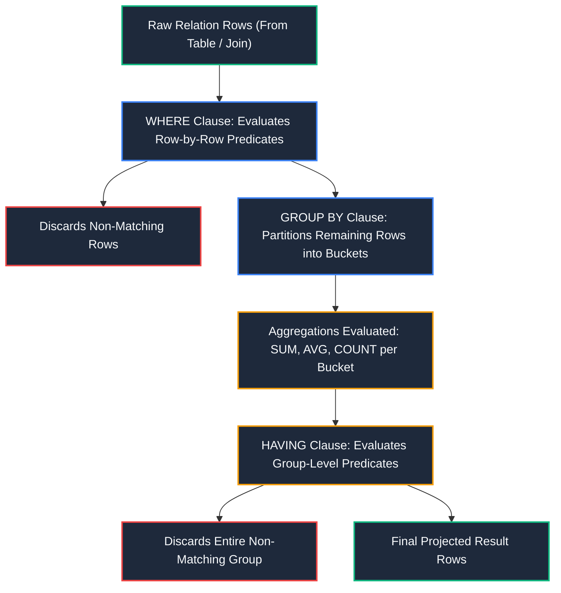
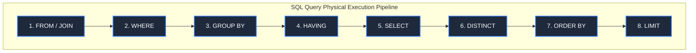

import CoreDoseLessonHeader from "@site/src/components/CoreDose/CoreDoseLessonHeader";
import CoreDoseTOC from "@site/src/components/CoreDose/CoreDoseTOC";
import CoreDoseNav from "@site/src/components/CoreDose/CoreDoseNav";

# 4.2 Aggregations, GROUP BY, and HAVING Clauses

<CoreDoseLessonHeader
  module="Module 04: Structured Query Language (SQL)"
  topic="Topic 4.2"
  readTime="9 min read"
  relevance="University Semester Exams • Technical Interviews • Analytical Query Design"
/>

## 💡 Core Intuition

### 🍳 The Everyday Analogy: Sorting and Weighing Fruit Crates
Imagine a warehouse filled with crates of assorted fruits (Apples, Oranges, Bananas):
* **`WHERE` filtering**: Before anything gets weighed, a worker discards all rotten fruits from the floor. You filter **individual items** before grouping.
* **`GROUP BY` partitioning**: You organize the remaining good fruits into three separate piles: one for Apples, one for Oranges, one for Bananas.
* **Aggregate Functions (`SUM`, `AVG`, `COUNT`)**: You weigh each fruit pile on a scale to find the total kilogram weight and average fruit weight per pile.
* **`HAVING` filtering**: You tell the shipping truck: *"Load only those fruit piles whose total weight exceeds 500 kg."* You filter **entire aggregated piles**, not individual fruits.

### 💻 Bridging to Computer Science
**Aggregate Functions** in SQL compress an entire multiset (collection) of scalar values down to a single summary scalar value. When combined with `GROUP BY`, aggregation transforms a table of raw entity instances into structured categorical summaries.

---

<CoreDoseTOC toc={toc} />

---

## 📚 Core Deep-Dive & Concepts

### 1. Standard SQL Aggregate Functions

SQL defines five core aggregate functions that operate across column multisets:

| Function | Operational Description | Ignores `NULL`? | Permitted on Data Types |
| :--- | :--- | :---: | :--- |
| **`COUNT(*)`** | Counts total rows in the group/table | **No** (Counts all rows) | All types |
| **`COUNT(col)`** | Counts non-null values in the specified column | **Yes** | All types |
| **`SUM(col)`** | Calculates arithmetic sum of column values | **Yes** | Numeric only |
| **`AVG(col)`** | Calculates arithmetic mean of non-null values | **Yes** | Numeric only |
| **`MIN(col)`** | Identifies minimum value | **Yes** | Numeric, String, Date |
| **`MAX(col)`** | Identifies maximum value | **Yes** | Numeric, String, Date |

---

### 2. The Critical Mathematical Behavior of NULL in Aggregates

One of the most frequent traps in database engineering is assuming `AVG(column)` equals `SUM(column) / COUNT(*)`.

**The Formal Rule**: All aggregate functions (except `COUNT(*)`) **completely ignore `NULL` values** during computation.

#### Mathematical Proof & Counter-Example
Consider an `Account` table with three customer accounts:

| Account_No | Balance | Branch_Name |
| :-: | :-: | :-: |
| $X$ | $100$ | Delhi |
| $Y$ | $500$ | Mumbai |
| $Z$ | `NULL` | Gwalior |

**Computing `AVG(Balance)`**:
The engine discards account $Z$ because its balance is `NULL`. The computation evaluates strictly across the two non-null accounts:
$$
\text{AVG(Balance)} = \frac{100 + 500}{2} = \mathbf{300}
$$

**Computing `SUM(Balance) / COUNT(*)`**:
$$
\frac{\text{SUM(Balance)}}{\text{COUNT(*)}} = \frac{100 + 500}{3} = \frac{600}{3} = \mathbf{200} \quad \text{\textbf{(Incorrect Result)}}
$$

Because `COUNT(*)` counts total table rows ($3$) while `SUM` sums only the $2$ non-null accounts, the resulting divisor includes customers who hold no balance data, artificially diluting the average. Hence, SQL requires a distinct `AVG` operator.

---

### 3. The GROUP BY Clause & The Golden Rule

**Definition**: The `GROUP BY` clause collapses all rows that have identical values in specified columns into a single summary row.

```sql
SELECT Dept_ID, Role, AVG(Salary) AS Avg_Pay, COUNT(*) AS Headcount
FROM Employee
GROUP BY Dept_ID, Role;
```

#### The Golden Rule of Grouping
> **The Golden Rule**: If a `SELECT` clause contains both aggregate functions and individual column references, **every non-aggregated column appearing in the `SELECT` list must explicitly appear in the `GROUP BY` clause**.

**Why this rule is mathematically mandatory**:  
Suppose you write the following invalid query:
```sql
-- ILLEGAL SQL (Standard ANSI SQL Violation)
SELECT Dept_ID, Emp_Name, AVG(Salary)
FROM Employee
GROUP BY Dept_ID;
```
If the "Computer Science" department (`Dept_ID = 101`) has 40 employees, `AVG(Salary)` collapses all 40 rows into a single scalar value (e.g. $85,000$). However, what value should the database place in `Emp_Name`? There are 40 different names for that one department row. The relational engine cannot pick an arbitrary name without introducing non-deterministic ambiguity; therefore, the query is rejected.

---

### 4. WHERE vs HAVING: The Exact Architectural Distinction



| Dimension | `WHERE` Clause | `HAVING` Clause |
| :--- | :--- | :--- |
| **Pipeline Position** | Applied **before** grouping and aggregations. | Applied **after** grouping and aggregations. |
| **Evaluation Scope** | Filters individual tuples (rows). | Filters entire summary groups (buckets). |
| **Aggregate Functions?** | **Strictly prohibited** (e.g. `WHERE AVG(sal) > 5000` is illegal). | **Permitted and standard** (e.g. `HAVING AVG(sal) > 5000`). |
| **Index Utilization** | Can directly utilize B+ Tree indexes for rapid seek. | Generally cannot use indexes directly; filters post-hash buckets. |

#### Example Query Combining Both
```sql
SELECT Dept_ID, AVG(Salary) AS Mean_Salary, COUNT(*) AS Total_Staff
FROM Employee
WHERE Status = 'Active'                 -- Row filter: Only active employees
GROUP BY Dept_ID                       -- Grouping: Partition by department
HAVING COUNT(*) >= 5                   -- Group filter: Only depts with >= 5 staff
   AND AVG(Salary) > 60000;
```

---

### 5. The Canonical 8-Stage SQL Execution Lifecycle

When a developer writes a query, the lexical writing order is drastically different from the physical execution order processed by the database query engine:

| Lexical Order (How You Write It) | Execution Order (How the Database Engine Runs It) | Operational Stage Description |
| :---: | :---: | :--- |
| `SELECT` (1) | **`FROM` & `JOIN` (1)** | Identifies target tables; evaluates Cartesian products and join predicates. |
| `FROM` (2) | **`WHERE` (2)** | Applies base row filters to discard non-qualifying tuples early. |
| `WHERE` (3) | **`GROUP BY` (3)** | Groups remaining rows into partition sets by common key attributes. |
| `GROUP BY` (4) | **`HAVING` (4)** | Evaluates group-level conditions and discards entire non-qualifying buckets. |
| `HAVING` (5) | **`SELECT` (5)** | Computes expressions, scalar functions, and projects specified columns. |
| `ORDER BY` (6) | **`DISTINCT` (6)** | Prunes duplicate tuples from the projected result set. |
| `LIMIT / OFFSET` (7) | **`ORDER BY` (7)** | Sorts the resulting rows ascending (`ASC`) or descending (`DESC`). |
| | **`LIMIT / OFFSET` (8)** | Truncates output to the requested pagination window. |

---

## 📐 Architecture / Visual Blueprint



---

## 🏭 In The Real World: Production Case Study

### Aggregation Pipeline Optimization in Stripe Billing Systems
When billing millions of software subscriptions at the end of each billing cycle, Stripe's database infrastructure executes massive aggregation queries over the `usage_records` table:
* **The Naive Query**:
  ```sql
  SELECT customer_id, SUM(api_calls)
  FROM usage_records
  GROUP BY customer_id
  HAVING timestamp >= '2026-09-01' AND timestamp < '2026-10-01'; -- Catastrophic Flaw!
  ```
* **The Production Flaw**: Placing `timestamp` in the `HAVING` clause forces the database to aggregate all $500$ million historical rows across multiple years into memory before discarding out-of-date groups.
* **The Production Fix (Pushing Filters to WHERE)**:
  ```sql
  SELECT customer_id, SUM(api_calls)
  FROM usage_records
  WHERE timestamp >= '2026-09-01' AND timestamp < '2026-10-01'  -- Uses B+ Tree index!
  GROUP BY customer_id;
  ```
  By moving the temporal filter to `WHERE`, the query planner uses a Composite B+ Tree Index on `(timestamp, customer_id, api_calls)`. Only the exact month's disk pages are touched, reducing execution time from **$4$ minutes down to $180$ milliseconds**.

---

## 🎯 Exam & Interview Pitfall Check

:::tip Core Conceptual Questions

**Question 1:** What is the result of executing `COUNT(column_name)` on a table of 10 rows where all 10 rows contain `NULL` in `column_name`? What is the result of `COUNT(*)` on the same table?  
**Answer:**  
* **`COUNT(column_name)`** evaluates to **`0`**, because `COUNT(col)` explicitly ignores null values.
* **`COUNT(*)`** evaluates to **`10`**, because `COUNT(*)` counts the physical existence of rows regardless of individual attribute nullability.

**Question 2:** Can a `HAVING` clause be used in a query that does NOT have a `GROUP BY` clause?  
**Answer:**  
**Yes.** If a `HAVING` clause is specified without a `GROUP BY` clause, the relational engine treats the entire table (or the entire set of rows surviving the `WHERE` clause) as **a single group**. For example: `SELECT AVG(salary) FROM employee HAVING AVG(salary) > 50000;` is valid SQL.
:::

:::warning Common Interview Traps

**Trap 1: "Why can't we use a column alias declared in SELECT inside the WHERE clause?"**  
**Answer:** Because of the physical execution order of SQL. The `WHERE` clause is evaluated at **Stage 2**, long before the `SELECT` clause is executed at **Stage 5**. At the time the engine filters rows in `WHERE`, the column aliases declared in `SELECT` have not yet been evaluated or created in memory.

**Trap 2: "Does SUM on an empty table return 0 or NULL?"**  
**Answer: It returns `NULL`.** In standard SQL, if a table is empty or all values in the column are `NULL`, `SUM()`, `AVG()`, `MIN()`, and `MAX()` return `NULL`. Only `COUNT()` is guaranteed to return `0` on an empty set.
:::

---

<CoreDoseNav
  prev={{
    title: "4.1 SQL Command Categories: DDL, DML, DCL & TCL",
    url: "/coredose/dbms/chapter-04/sql-command-categories-ddl-dml-dcl-tcl"
  }}
  next={{
    title: "4.3 Nested Subqueries, Correlated Subqueries & EXISTS",
    url: "/coredose/dbms/chapter-04/nested-subqueries-correlated-subqueries-and-exists"
  }}
  courseUrl="/coredose/dbms"
/>
