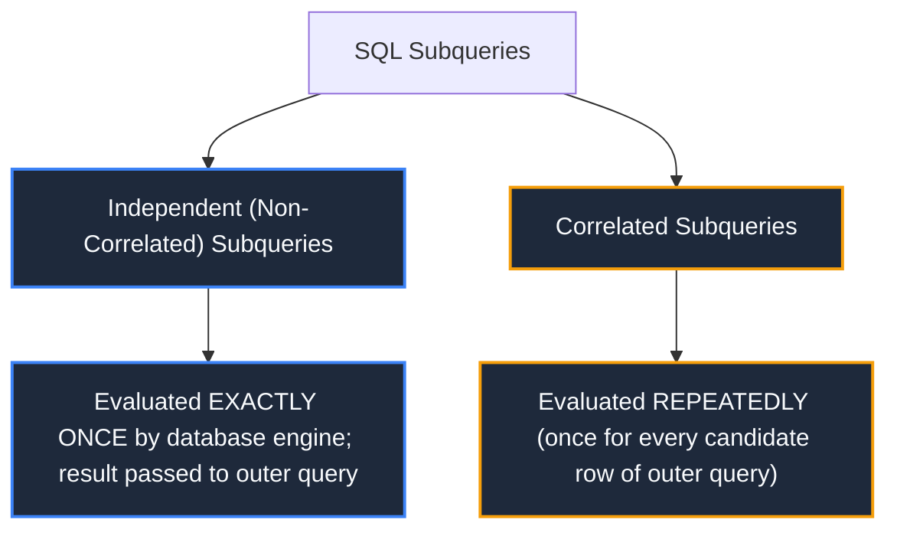
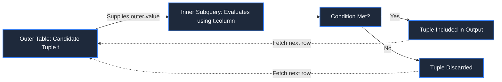
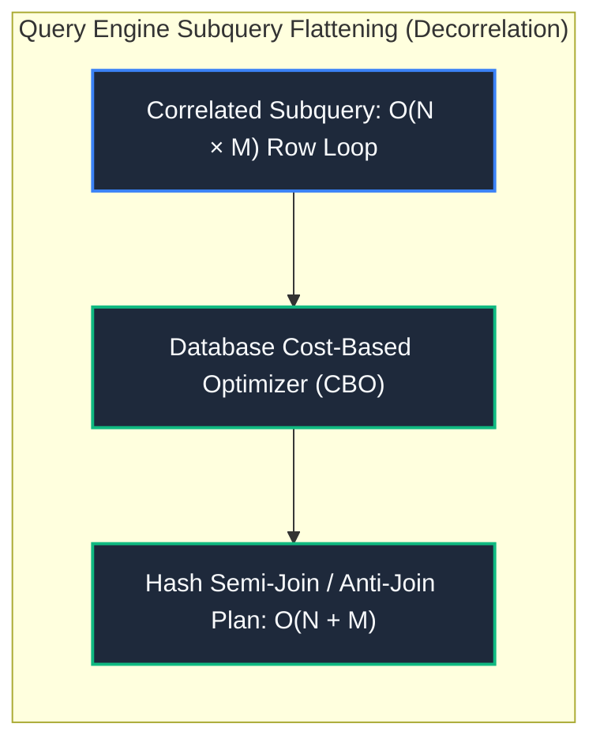

import CoreDoseLessonHeader from "@site/src/components/CoreDose/CoreDoseLessonHeader";
import CoreDoseTOC from "@site/src/components/CoreDose/CoreDoseTOC";
import CoreDoseNav from "@site/src/components/CoreDose/CoreDoseNav";

# 4.3 Nested Subqueries, Correlated Subqueries & EXISTS

<CoreDoseLessonHeader
  module="Module 04: Structured Query Language (SQL)"
  topic="Topic 4.3"
  readTime="9 min read"
  relevance="University Semester Exams • Technical Interviews • Advanced Query Optimization"
/>

## 💡 Core Intuition

### 🍳 The Everyday Analogy: Inspecting Job Applicants
Imagine an HR manager evaluating 500 job candidates:
* **Independent Subquery**: The manager first looks up the university's cutoff GPA: *"What was the highest score this year? (Answer: 3.8)"*. That single number is computed once. The manager then filters all 500 applicant files against 3.8.
* **Correlated Subquery**: The manager looks at Applicant Alice from Department A and asks: *"Is Alice's score higher than the average score of ONLY Department A?"*. Then the manager picks Applicant Bob from Department B and asks: *"Is Bob's score higher than the average score of ONLY Department B?"*. For **every single candidate**, the manager re-calculates department stats.
* **The `EXISTS` Operator**: The manager asks security: *"Does this candidate have ANY police record?"*. Security stops scanning files the exact second they find a single matching record (short-circuit).

### 💻 Bridging to Computer Science
A **Subquery** (or nested query) is an inner `SELECT` statement embedded within the `WHERE`, `HAVING`, `FROM`, or `SELECT` clause of an outer SQL statement. Subqueries allow complex, multi-stage relational logic to be evaluated within a single declarative SQL statement.

---

<CoreDoseTOC toc={toc} />

---

## 📚 Core Deep-Dive & Concepts

### 1. Classification of Subqueries

Subqueries are categorized based on their dependency on the enclosing outer statement:



---

### 2. Independent (Non-Correlated) Subqueries

An **independent subquery** does not reference any columns from the outer query tables. The database execution planner evaluates the subquery once, caches its result, and substitutes that constant value or set into the outer query.

#### Single-Row Subquery (Scalar Output)
Returns a single value (1 row, 1 column), compared using standard scalar operators ($=, <, >, \le, \ge, \neq$):
```sql
SELECT emp_name, salary
FROM employee
WHERE salary > (SELECT AVG(salary) FROM employee);
```

#### Multi-Row Subquery (Set Output)
Returns multiple rows (1 column, $N$ rows), compared using set-membership operators:

| Operator | Operational Meaning | Mathematical Equivalent |
| :--- | :--- | :--- |
| **`IN`** | True if value matches **at least one** element in the subquery set. | $x \in S$ |
| **`NOT IN`** | True if value does **not match any** element in the subquery set. | $x \notin S$ |
| **`> ANY`** | True if value is greater than the **minimum** element in the subquery set. | $x > \min(S)$ |
| `<code>&lt; ANY</code>` | True if value is less than the **maximum** element in the subquery set. | $x < \max(S)$ |
| **`= ANY`** | Equivalent to **`IN`**. | $x \in S$ |
| **`> ALL`** | True if value is greater than the **maximum** element in the subquery set. | $x > \max(S)$ |
| `<code>&lt; ALL</code>` | True if value is less than the **minimum** element in the subquery set. | $x < \min(S)$ |

---

### 3. The Empty Set Mathematical Rule with ALL

A fundamental mathematical theorem of formal SQL logic:
> **The Vacuous Truth Rule**: If a subquery returns an **empty set ($\emptyset$)**, any comparison using the **`ALL`** operator evaluates to **`TRUE`** unconditionally!

$$
\forall s \in \emptyset, \quad x > s \equiv \text{TRUE}
$$

For example, if table `Senior_Engineers` contains zero rows:
```sql
SELECT emp_name FROM employee WHERE salary > ALL (SELECT salary FROM Senior_Engineers);
```
Since the inner subquery produces $0$ tuples, the condition `salary > ALL (empty)` evaluates to `TRUE` for every single employee in the outer table, returning all employees!

Conversely, any comparison using **`ANY`** on an empty subquery evaluates to **`FALSE`**:
$$
\exists s \in \emptyset, \quad x > s \equiv \text{FALSE}
$$

---

### 4. Correlated Subqueries & Classic Numerical Examples

**Definition**: A correlated subquery contains a reference to a table column declared in the outer query. It cannot be evaluated independently of the outer tuple.



#### Canonical Problem: The $K$-th Most Expensive Entity
Find the titles of the **5 most expensive books** in a bookstore where all books have distinct prices:

```sql
SELECT B.title
FROM Book AS B
WHERE (
    SELECT COUNT(*)
    FROM Book AS T
    WHERE T.price > B.price
) < 5;
```

#### Step-by-Step Derivation & Reduction
1. For the single **most expensive book** ($1^{\text{st}}$ rank):
   * How many books have a higher price? Exactly **0**.
   * Inner count = $0$. Since $0 < 5$, it is included.
2. For the **$2^{\text{nd}}$ most expensive book**:
   * How many books have a higher price? Exactly **1**.
   * Inner count = $1$. Since $1 < 5$, it is included.
3. For the **$5^{\text{th}}$ most expensive book**:
   * How many books have a higher price? Exactly **4**.
   * Inner count = $4$. Since $4 < 5$, it is included.
4. For the **$6^{\text{th}}$ most expensive book**:
   * How many books have a higher price? Exactly **5**.
   * Inner count = $5$. Since $5 < 5$ is `FALSE`, it is excluded!

The query cleanly selects the top 5 highest-priced books without requiring vendor-specific keywords like `LIMIT` or `TOP`.

---

### 5. The EXISTS Operator & The Fatal NOT IN NULL Trap

#### A. The EXISTS / NOT EXISTS Operator
The `EXISTS` operator tests whether a subquery returns **at least one row**. It returns a pure boolean (`TRUE` or `FALSE`):
```sql
SELECT D.dept_name
FROM Department AS D
WHERE EXISTS (
    SELECT 1 
    FROM Employee AS E 
    WHERE E.dept_id = D.dept_id AND E.salary > 100000
);
```
**Physical Optimization**: The database storage engine terminates execution of the inner subquery the instant the first matching row is discovered (short-circuit boolean evaluation), making `EXISTS` significantly faster than aggregations like `COUNT(*) > 0`.

---

#### B. The Fatal NOT IN with NULL Trap
One of the most catastrophic silent bugs in SQL production environments arises from combining `NOT IN` with subqueries returning `NULL` values.

**Three-Valued Logic (3VL)**: In SQL, comparisons with `NULL` yield `UNKNOWN`:
$$
x = \text{NULL} \implies \text{UNKNOWN}, \quad \text{NOT}(\text{UNKNOWN}) \implies \text{UNKNOWN}
$$

Consider evaluating:
```sql
SELECT emp_name FROM employee
WHERE emp_id NOT IN (SELECT manager_id FROM employee);
```
Suppose the `manager_id` column contains values: `(101, 102, NULL)` (since the CEO has no manager).

SQL expands the `NOT IN` clause into chained inequality tests:
$$
\text{emp\_id} \neq 101 \quad \text{AND} \quad \text{emp\_id} \neq 102 \quad \text{AND} \quad \text{emp\_id} \neq \text{NULL}
$$
Because $\text{emp\_id} \neq \text{NULL}$ evaluates to **`UNKNOWN`**, and `TRUE AND TRUE AND UNKNOWN` evaluates to **`UNKNOWN`**, the `WHERE` clause **never evaluates to `TRUE` for any row in the entire table!**

**The Production Result**: The query returns an **empty result set ($0$ rows)**, silently failing.

#### The Bulletproof Fix: Use NOT EXISTS
`NOT EXISTS` tests for row count, completely bypassing three-valued boolean logic:
```sql
SELECT E1.emp_name
FROM employee AS E1
WHERE NOT EXISTS (
    SELECT 1 
    FROM employee AS E2 
    WHERE E2.manager_id = E1.emp_id
);
```

---

## 📐 Architecture / Visual Blueprint



---

## 🏭 In The Real World: Production Case Study

### Subquery Decorrelation in Amazon Redshift & CockroachDB
In distributed database architectures, naive correlated subqueries cause network bottlenecks:
* **The Failure**: If an outer table has $10$ million rows distributed across $20$ cloud nodes, evaluating a correlated subquery row-by-row triggers **$10$ million inter-node network round-trips**.
* **The Optimizer Transformation (Subquery Flattening)**:
  Modern query optimizers rewrite `WHERE EXISTS` queries into a **Hash Semi-Join**:
  $$
  R \ltimes S
  $$
  A semi-join returns tuples from $R$ as soon as the first match in $S$ is confirmed via an in-memory hash table, reducing query latency from **$45$ minutes to $1.2$ seconds**.

---

## 🎯 Exam & Interview Pitfall Check

:::tip Core Conceptual Questions

**Question 1:** What does `SELECT 1 FROM table_name WHERE EXISTS (SELECT NULL);` return?  
**Answer:**  
It returns row(s) containing the scalar `1`. The `EXISTS` predicate tests strictly for the **existence of tuples**, not whether the values within those tuples are non-null. Because `SELECT NULL` successfully returns a tuple containing the scalar `NULL`, the subquery returned $1$ row, meaning `EXISTS` evaluates to `TRUE`.

**Question 2:** Explain the difference between `IN` and `EXISTS` from an execution perspective.  
**Answer:**  
* `IN` evaluates the inner subquery to produce a distinct result set, then probes whether the outer column value belongs to that set. If the subquery result is large, holding that set in memory can be expensive.
* `EXISTS` executes a boolean correlated check that halts and returns `TRUE` as soon as the first matching disk block/index entry is located (short-circuit), without materializing the remaining matching rows.
:::

:::warning Common Interview Traps

**Trap 1: "Does NOT IN handle NULLs the same as NOT EXISTS?"**  
**Answer: No.** If the subquery evaluated by `NOT IN` returns even a single `NULL` value, the entire `NOT IN` expression evaluates to `UNKNOWN`, causing the query to return zero rows. `NOT EXISTS` relies on cardinality checks ($|\text{Result}| = 0$) and is immune to NULL traps.

**Trap 2: "Can a subquery return more than one column when used with a scalar comparison operator?"**  
**Answer: No.** Scalar operators ($=, <, >, \le, \ge, \neq$) require a scalar operand (exactly 1 row and 1 column). If a subquery returns multiple columns or multiple rows to a scalar operator, the SQL engine throws a runtime `Subquery returns more than 1 row / operand should contain 1 column(s)` error.
:::

---

<CoreDoseNav
  prev={{
    title: "4.2 Aggregations, GROUP BY, and HAVING Clauses",
    url: "/coredose/dbms/chapter-04/aggregations-group-by-and-having-clauses"
  }}
  next={{
    title: "4.4 SQL Joins Master Guide with Visual Output",
    url: "/coredose/dbms/chapter-04/sql-joins-master-guide-with-visual-output"
  }}
  courseUrl="/coredose/dbms"
/>
