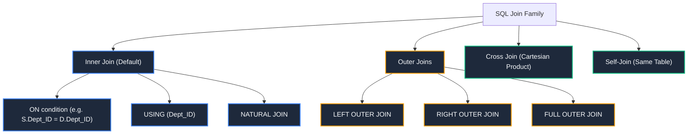
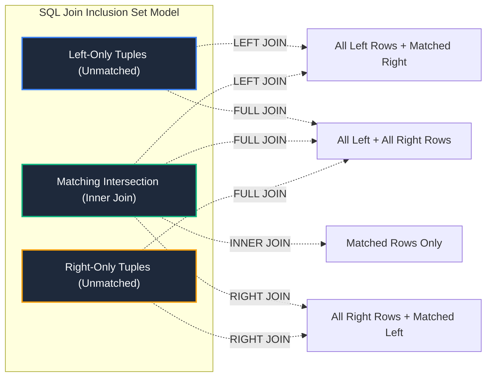

import CoreDoseLessonHeader from "@site/src/components/CoreDose/CoreDoseLessonHeader";
import CoreDoseTOC from "@site/src/components/CoreDose/CoreDoseTOC";
import CoreDoseNav from "@site/src/components/CoreDose/CoreDoseNav";

# 4.4 SQL Joins Master Guide with Visual Output

<CoreDoseLessonHeader
  module="Module 04: Structured Query Language (SQL)"
  topic="Topic 4.4"
  readTime="10 min read"
  relevance="University Semester Exams • Technical Interviews • Database Performance Engineering"
/>

## 💡 Core Intuition

### 🍳 The Everyday Analogy: Stitching Two Halves of a Ledger
Imagine you run a hospital with two paper notebooks:
* **Notebook A (Patients)**: Lists Patient ID, Name, and Assigned Doctor ID.
* **Notebook B (Doctors)**: Lists Doctor ID, Doctor Name, and Specialty.
* **Inner Join**: You create a summary sheet listing only patients who currently have an assigned doctor, matching their Doctor IDs.
* **Left Outer Join**: You want a list of **all patients** without exception; if a newly admitted patient doesn't have an assigned doctor yet, you still write their name down and leave the doctor column blank (`NULL`).
* **Full Outer Join**: You list every patient and every doctor. If a doctor has no assigned patients, or a patient has no assigned doctor, they are all displayed.

### 💻 Bridging to Computer Science
An **SQL Join** is a relational mechanism for stitching together rows from two or more database tables based on a logical relationship between common columns.

---

<CoreDoseTOC toc={toc} />

---

## 📚 Core Deep-Dive & Concepts

### 1. The Concrete Baseline Dataset

To understand every join variation with zero ambiguity, consider these two baseline tables:

**Table `Student` ($R_1$)**:
| Roll_No | Name | Dept_ID |
| :-: | :-: | :-: |
| 1 | Alice | 10 |
| 2 | Bob | 20 |
| 3 | Charlie | 30 |
| 4 | David | `NULL` |

**Table `Department` ($R_2$)**:
| Dept_ID | Dept_Name | Location |
| :-: | :-: | :-: |
| 10 | Computer Science | Building A |
| 20 | Electronics | Building B |
| 50 | Mechanical | Building C |

*(Notice: Charlie has `Dept_ID = 30` which doesn't exist in Department. David has `Dept_ID = NULL`. Department 50 has zero enrolled students).*

---

### 2. Comprehensive SQL Join Taxonomy



---

### 3. Inner Join (`INNER JOIN` / `ON`)

**Definition**: Returns rows when there is at least one match in **both** tables based on the join predicate.

```sql
SELECT S.Roll_No, S.Name, D.Dept_ID, D.Dept_Name
FROM Student AS S
INNER JOIN Department AS D ON S.Dept_ID = D.Dept_ID;
```

**Output Result**:
| Roll_No | Name | Dept_ID | Dept_Name |
| :-: | :-: | :-: | :-: |
| 1 | Alice | 10 | Computer Science |
| 2 | Bob | 20 | Electronics |

*(Note: Charlie, David, and Department 50 are dropped because they lack matching pairs).*

---

### 4. Natural Join & The `USING` Clause

#### A. Natural Join (`NATURAL JOIN`)
**Definition**: Automatically identifies all columns that share the **exact same name** in both tables, evaluates an equality condition on them, and **projects out the duplicate column** so it appears only once in the result.

```sql
SELECT * FROM Student NATURAL JOIN Department;
```

**Attribute Output Order**:
1. Common attribute(s) (`Dept_ID`)
2. Remaining unique attributes of first table (`Roll_No`, `Name`)
3. Remaining unique attributes of second table (`Dept_Name`, `Location`)

**The Engineering Danger of Natural Join**:  
If both tables accidentally share an unrelated column name (e.g. both tables have a `Created_At` or `Status` column), `NATURAL JOIN` will silently match on **both** columns (`S.Dept_ID = D.Dept_ID AND S.Status = D.Status`), producing unintended empty results!

---

#### B. The `JOIN ... USING` Clause
To prevent the hazards of `NATURAL JOIN` when tables share multiple identical column names, SQL provides `USING`:
> **The `USING` Clause**: Explicitly specifies which subset of common columns must be matched and unified.

**Canonical Scenario**:  
Suppose $R_1(A, B, C)$ and $R_2(B, C, D)$ share both attributes $B$ and $C$.
```sql
SELECT * FROM R1 JOIN R2 USING (B);
```
This forces the engine to match **only** on $R_1.B = R_2.B$, completely ignoring attribute $C$ during the match! Attribute $B$ appears once in the output, while columns $R_1.C$ and $R_2.C$ are preserved separately.

---

### 5. Outer Joins (Left, Right, Full)

#### A. Left Outer Join (`LEFT JOIN`)
Preserves every single row from the **Left table** (`Student`). If no match exists in the right table, right-side columns are filled with `NULL`.

```sql
SELECT S.Roll_No, S.Name, D.Dept_ID, D.Dept_Name
FROM Student AS S
LEFT JOIN Department AS D ON S.Dept_ID = D.Dept_ID;
```

**Output Result**:
| Roll_No | Name | Dept_ID | Dept_Name |
| :-: | :-: | :-: | :-: |
| 1 | Alice | 10 | Computer Science |
| 2 | Bob | 20 | Electronics |
| 3 | Charlie | `NULL` | `NULL` |
| 4 | David | `NULL` | `NULL` |

---

#### B. Right Outer Join (`RIGHT JOIN`)
Preserves every single row from the **Right table** (`Department`). If a department has no enrolled students, student columns are filled with `NULL`.

```sql
SELECT S.Roll_No, S.Name, D.Dept_ID, D.Dept_Name
FROM Student AS S
RIGHT JOIN Department AS D ON S.Dept_ID = D.Dept_ID;
```

**Output Result**:
| Roll_No | Name | Dept_ID | Dept_Name |
| :-: | :-: | :-: | :-: |
| 1 | Alice | 10 | Computer Science |
| 2 | Bob | 20 | Electronics |
| `NULL` | `NULL` | 50 | Mechanical |

---

#### C. Full Outer Join (`FULL JOIN`)
Preserves all rows from both relations without exception.

```sql
SELECT S.Roll_No, S.Name, D.Dept_ID, D.Dept_Name
FROM Student AS S
FULL OUTER JOIN Department AS D ON S.Dept_ID = D.Dept_ID;
```

**Output Result**:
| Roll_No | Name | Dept_ID | Dept_Name |
| :-: | :-: | :-: | :-: |
| 1 | Alice | 10 | Computer Science |
| 2 | Bob | 20 | Electronics |
| 3 | Charlie | `NULL` | `NULL` |
| 4 | David | `NULL` | `NULL` |
| `NULL` | `NULL` | 50 | Mechanical |

**The Containment Hierarchy**:  
$$
\text{Inner Join} \subseteq \text{Left Outer Join} \subseteq \text{Full Outer Join}
$$
$$
\text{Inner Join} \subseteq \text{Right Outer Join} \subseteq \text{Full Outer Join}
$$
Full Outer Join is the superset of Inner Join, Left Outer Join, and Right Outer Join.

---

### 6. Cross Join & Self-Join

#### A. Cross Join (`CROSS JOIN`)
Computes the unconstrained Cartesian Product ($\times$) of both relations. Every row in $R_1$ is combined with every row in $R_2$. If $R_1$ has $4$ rows and $R_2$ has $3$ rows, `CROSS JOIN` yields $4 \times 3 = \mathbf{12}$ rows.

```sql
SELECT S.Name, D.Dept_Name FROM Student AS S CROSS JOIN Department AS D;
```

#### B. Self-Join
Joining a table to itself using **Table Aliases (`AS`)** to model recursive hierarchies (e.g. employee-manager networks):

```sql
SELECT E.Emp_Name AS Employee, M.Emp_Name AS Manager
FROM Employee AS E
LEFT JOIN Employee AS M ON E.Manager_ID = M.Emp_ID;
```

---

## 📐 Architecture / Visual Blueprint



---

## 🏭 In The Real World: Production Case Study

### Eliminating the ORM N+1 Query Disaster via SQL Joins
In modern web applications built with ORMs (Django, Prisma, Hibernate):
* **The Antipattern (N+1 Queries)**:
  ```python
  # Fetches 100 posts (1 query)
  posts = Post.objects.all()[:100]
  for post in posts:
      # Fires 100 separate round-trip SQL queries to fetch authors!
      print(post.author.name)
  ```
  This fires **101 individual network round trips** to the database server, causing API latency to skyrocket to over $2,500\text{ ms}$.
* **The Production Fix (Eager Inner/Left Join)**:
  ```sql
  SELECT P.id, P.title, A.id, A.name 
  FROM posts AS P 
  INNER JOIN authors AS A ON P.author_id = A.id 
  LIMIT 100;
  ```
  A single optimized SQL Join loads all 100 posts and their author metadata in **1 single database round trip** in under $8\text{ ms}$ (a **300x latency reduction**).

---

## 🎯 Exam & Interview Pitfall Check

:::tip Core Conceptual Questions

**Question 1:** Why is `NATURAL JOIN` widely discouraged in production enterprise software?  
**Answer:**  
`NATURAL JOIN` dynamically binds join conditions based on identical column names at runtime. If a database migration adds a common audit column (such as `updated_at` or `status`) to both tables, the join condition automatically and silently expands to include `AND table1.status = table2.status`. This breaks application queries without raising any syntax error. Using explicit `INNER JOIN ... ON` or `JOIN ... USING` is mandatory in professional production schemas.

**Question 2:** How do you simulate a FULL OUTER JOIN in database engines that do not natively support it (such as MySQL)?  
**Answer:**  
By taking the `UNION` of a `LEFT JOIN` and a `RIGHT JOIN`:
```sql
SELECT S.Name, D.Dept_Name FROM Student S LEFT JOIN Department D ON S.Dept_ID = D.Dept_ID
UNION
SELECT S.Name, D.Dept_Name FROM Student S RIGHT JOIN Department D ON S.Dept_ID = D.Dept_ID;
```
Because standard `UNION` automatically eliminates duplicate rows, the overlapping inner join records are deduplicated, producing the exact mathematical equivalent of a `FULL OUTER JOIN`.
:::

:::warning Common Interview Traps

**Trap 1: "Does ON clause filtering behave identically to WHERE clause filtering in a LEFT JOIN?"**  
**Answer: No!** In a `LEFT JOIN`, conditions in the `ON` clause determine how rows from the right table are matched; if a right row fails the `ON` condition, the left row is **still retained** with `NULL`s. However, conditions in the `WHERE` clause are applied *after* the join has completed. A condition like `WHERE D.Location = 'Building A'` in the `WHERE` clause will discard left rows where `D.Location` is `NULL`, effectively converting the query into an `INNER JOIN`.

**Trap 2: "What is the degree of a NATURAL JOIN between R(A, B, C) and S(B, C, D)?"**  
**Answer:** The degree is **$4$** ($\{A, B, C, D\}$). The two common attributes ($B, C$) appear only once in the natural join output ($3 + 3 - 2 = 4$).
:::

---

<CoreDoseNav
  prev={{
    title: "4.3 Nested Subqueries, Correlated Subqueries & EXISTS",
    url: "/coredose/dbms/chapter-04/nested-subqueries-correlated-subqueries-and-exists"
  }}
  next={{
    title: "4.5 Window Functions, CTEs (WITH Clause) & Views",
    url: "/coredose/dbms/chapter-04/window-functions-ctes-and-views"
  }}
  courseUrl="/coredose/dbms"
/>
