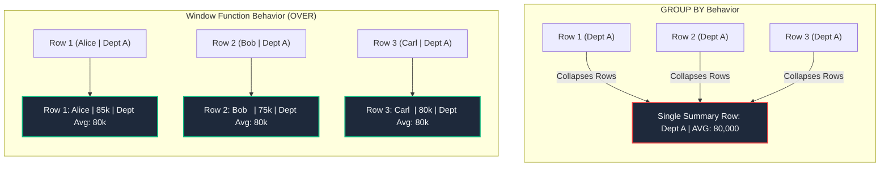
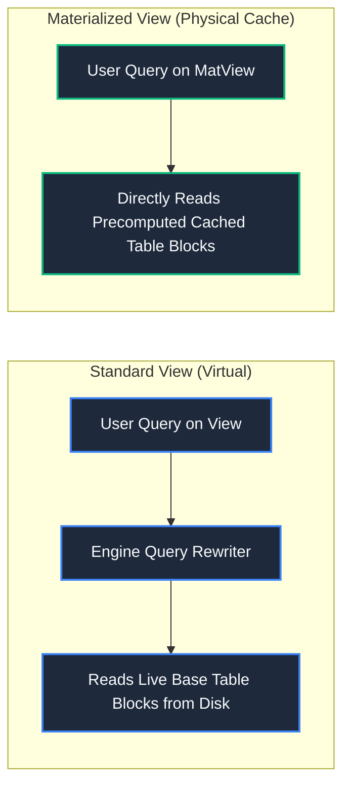
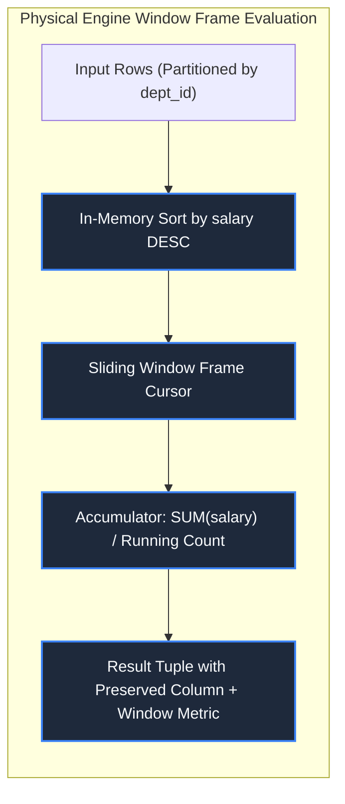

import CoreDoseLessonHeader from "@site/src/components/CoreDose/CoreDoseLessonHeader";
import CoreDoseTOC from "@site/src/components/CoreDose/CoreDoseTOC";
import CoreDoseNav from "@site/src/components/CoreDose/CoreDoseNav";

# 4.5 Window Functions, CTEs (WITH Clause) & Views

<CoreDoseLessonHeader
  module="Module 04: Structured Query Language (SQL)"
  topic="Topic 4.5"
  readTime="10 min read"
  relevance="University Semester Exams • Technical Interviews • Advanced Analytical SQL"
/>

## 💡 Core Intuition

### 🍳 The Everyday Analogy: The Leaderboard and the Security Window
Imagine a high school running a sports tournament:
* **The `GROUP BY` Aggregation**: You ask: *"What was the highest score in each grade?"*. You get back 4 summary numbers; the individual names of all 500 athletes vanish.
* **The Window Function (`RANK() OVER`)**: You post a public leaderboard where **every single student** sees their own name, their score, AND their rank compared to everyone else in their grade. Nobody is collapsed or erased.
* **The CTE (`WITH` clause)**: A temporary whiteboard scratchpad where the referee calculates qualification scores before drafting the final tournament schedule.
* **The View**: A frosted-glass window through which parents can see student names and game scores, but cannot see private medical records or social security numbers stored behind the counter.

### 💻 Bridging to Computer Science
**Window Functions**, **Common Table Expressions (CTEs)**, and **Views** represent the modern toolset of analytical SQL. They eliminate painful nested self-joins, modularize deep query logic, and implement the external level of the 3-Schema ANSI/SPARC architecture.

---

<CoreDoseTOC toc={toc} />

---

## 📚 Core Deep-Dive & Concepts

### 1. Window Functions vs GROUP BY Aggregations

The single most fundamental distinction in SQL analytics:



**The Rule**:
* `GROUP BY` collapses $N$ rows into a single summary row per group.
* `WINDOW FUNCTIONS` evaluate aggregations across a partition frame while **preserving every single original row in the output**.

#### The Universal Window Syntax
```sql
FUNCTION_NAME() OVER (
    [PARTITION BY partition_column]
    [ORDER BY sort_column [ASC|DESC]]
    [ROWS|RANGE BETWEEN frame_start AND frame_end]
)
```

---

### 2. Ranking Window Functions: ROW_NUMBER vs RANK vs DENSE_RANK

When ranking entities that share identical tie scores, the choice of ranking function determines how numerical gaps are handled:

| Function | Operational Behavior on Ties | Example Output on Scores (100, 100, 85, 70) | Gaps in Sequence? |
| :--- | :--- | :--- | :---: |
| **`ROW_NUMBER()`** | Assigns strictly sequential unique integers ($1, 2, 3 \dots$) regardless of ties. | $1, 2, 3, 4$ | **No** |
| **`RANK()`** | Assigns identical ranks to ties; skips subsequent ranks by tie count. | $1, 1, 3, 4$ | **Yes (Gap after tie)** |
| **`DENSE_RANK()`** | Assigns identical ranks to ties; **never skips numbers**. | $1, 1, 2, 3$ | **No** |

```sql
SELECT 
    emp_name, dept_id, salary,
    ROW_NUMBER() OVER (PARTITION BY dept_id ORDER BY salary DESC) AS row_num,
    RANK()       OVER (PARTITION BY dept_id ORDER BY salary DESC) AS rnk,
    DENSE_RANK() OVER (PARTITION BY dept_id ORDER BY salary DESC) AS dense_rnk
FROM employee;
```

---

### 3. Value Navigation Functions: LAG and LEAD

Value functions allow queries to inspect preceding or subsequent rows without performing self-joins:
* **`LAG(column, offset, default)`**: Accesses data from a previous row at a specified offset within the partition.
* **`LEAD(column, offset, default)`**: Accesses data from a following row at a specified offset within the partition.

#### Practical Example: Month-over-Month Growth
```sql
SELECT 
    month, revenue,
    LAG(revenue, 1) OVER (ORDER BY month) AS prev_month_rev,
    revenue - LAG(revenue, 1) OVER (ORDER BY month) AS mom_growth
FROM monthly_sales;
```

---

### 4. Common Table Expressions (CTEs) & The `WITH` Clause

**Definition**: A Common Table Expression (CTE) is a temporary named result set defined within the execution scope of a single `SELECT`, `INSERT`, `UPDATE`, or `DELETE` statement.

```sql
WITH HighEarners AS (
    SELECT emp_id, emp_name, dept_id, salary
    FROM employee
    WHERE salary > 90000
),
DeptStats AS (
    SELECT dept_id, AVG(salary) AS avg_dept_salary
    FROM employee
    GROUP BY dept_id
)
SELECT H.emp_name, H.salary, D.avg_dept_salary
FROM HighEarners AS H
JOIN DeptStats AS D ON H.dept_id = D.dept_id;
```

#### Why CTEs Outperform Nested Subqueries
1. **Readability & Modularity**: Transforms deeply nested "SQL inception" code into clean, sequential, top-to-bottom steps.
2. **Recursive Querying**: CTEs support `WITH RECURSIVE` to traverse organizational hierarchies, trees, and cyclic graph topologies (e.g. bill of materials, social follower graphs) in pure SQL.

---

### 5. Views: Virtual Tables & Materialized Views

**Definition**: A **View** is a virtual table whose contents are defined by an underlying SQL query. A view does not exist physically as a stored set of data values on disk; only its `SELECT` query definition is stored in the system catalog (data dictionary).

```sql
CREATE VIEW faculty_public_view AS
SELECT emp_id, emp_name, dept_id
FROM faculty;
```

#### A. Updatable Views vs Non-Updatable Views
Can a user run `INSERT`, `UPDATE`, or `DELETE` directly against a View?
* **An SQL View is Updatable if and only if**:
  1. The view query references exactly **one base table** in the `FROM` clause.
  2. The view includes the **Primary Key** of the underlying base table.
  3. The view does **NOT** contain `DISTINCT`.
  4. The view does **NOT** contain `GROUP BY`, `HAVING`, or aggregate functions (`SUM`, `AVG`, etc.).
  5. Any base table columns excluded from the view allow `NULL` or have a designated `DEFAULT`.

#### B. Standard Views vs Materialized Views



| Architectural Property | Standard Virtual View | Materialized View (`MATERIALIZED VIEW`) |
| :--- | :--- | :--- |
| **Physical Storage** | **Zero disk storage** (Query definition stored in catalog). | **Allocates physical disk pages** to store precomputed result. |
| **Query Performance** | Executes underlying query every single time it is queried. | **Blazing fast $O(1)$ disk/index scan** of cached tuples. |
| **Data Freshness** | 100% real-time reflection of base table modifications. | Lags behind base table; requires periodic `REFRESH`. |
| **Ideal Workload** | Security column masks, simple join abstractions. | Heavy analytical dashboards, multi-table petabyte rollups. |

---

## 📐 Architecture / Visual Blueprint



---

## 🏭 In The Real World: Production Case Study

### Running Financial Balances & Fraud Detection at Robinhood
Financial platforms must track running balances across millions of ledger transactions:
* **The Naive Approach (Self-Join Loop)**:
  ```sql
  -- Horrific O(N^2) Performance
  SELECT T1.id, T1.amount, SUM(T2.amount) AS running_balance
  FROM transactions T1
  JOIN transactions T2 ON T2.user_id = T1.user_id AND T2.created_at <= T1.created_at
  GROUP BY T1.id, T1.amount;
  ```
  On a user ledger with $10,000$ trades, this produces **$100$ million join comparisons**, freezing user portfolio screens.
* **The Production Fix (Window Running Total)**:
  ```sql
  -- Blazing O(N log N) Performance
  SELECT 
      id, user_id, amount, created_at,
      SUM(amount) OVER (
          PARTITION BY user_id 
          ORDER BY created_at 
          ROWS BETWEEN UNBOUNDED PRECEDING AND CURRENT ROW
      ) AS running_balance
  FROM transactions;
  ```
  The database engine sorts the user's trades once and maintains a running scalar accumulator across disk rows in a single streaming pass, reducing execution time from **$42\text{ seconds}$ to $3\text{ milliseconds}$**.

---

## 🎯 Exam & Interview Pitfall Check

:::tip Core Conceptual Questions

**Question 1:** Given employee salaries `(10000, 10000, 8000, 7000)`, write down the output of `RANK()` and `DENSE_RANK()` for each row when sorted descending.  
**Answer:**  
* **`RANK()`**: `1, 1, 3, 4`. (Because two employees tie at rank $1$, rank $2$ is skipped, and the third employee receives rank $3$).
* **`DENSE_RANK()`**: `1, 1, 2, 3`. (Ties share rank $1$, but the next unique salary strictly receives the consecutive integer $2$ without skipping).

**Question 2:** Why cannot an update be performed on a View that contains a `GROUP BY` clause?  
**Answer:**  
A `GROUP BY` clause aggregates multiple underlying base table rows into a single summary row in the view. If a user issues an `UPDATE` or `DELETE` statement against this aggregated summary row, the database engine cannot determine which specific underlying base row(s) to modify or how to apportion the update across the constituent rows. Because the mapping from view row to base row is not $1:1$ (it is $1:N$), the view is inherently non-updatable.
:::

:::warning Common Interview Traps

**Trap 1: "Can Window Functions be used directly inside the WHERE clause?"**  
**Answer: Strictly No!** Window functions are evaluated during **Stage 5** of the SQL execution pipeline, whereas the `WHERE` clause executes during **Stage 2**. To filter by the result of a window function (e.g. `WHERE rnk <= 3`), you must wrap the window function inside a **CTE (`WITH`)** or a subquery in the `FROM` clause.

**Trap 2: "Does a Materialized View update automatically when base tables receive INSERTs?"**  
**Answer: Not by default.** In standard RDBMS engines (such as PostgreSQL and Oracle), materialized views are static snapshot caches. They do not update automatically unless explicitly configured with incremental fast-refresh triggers or updated manually using `REFRESH MATERIALIZED VIEW`.
:::

---

<CoreDoseNav
  prev={{
    title: "4.4 SQL Joins Master Guide with Visual Output",
    url: "/coredose/dbms/chapter-04/sql-joins-master-guide-with-visual-output"
  }}
  next={{
    title: "5.1 Introduction to Functional Dependencies & Trivial FDs",
    url: "/coredose/dbms/chapter-05/introduction-to-functional-dependencies-and-trivial-fds"
  }}
  courseUrl="/coredose/dbms"
/>
