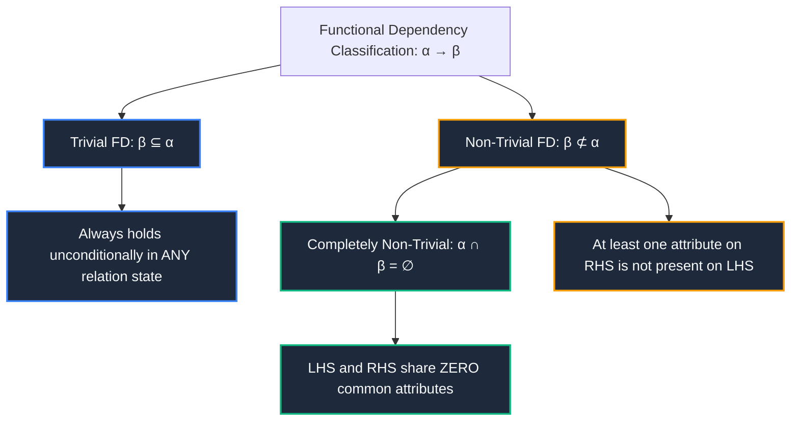
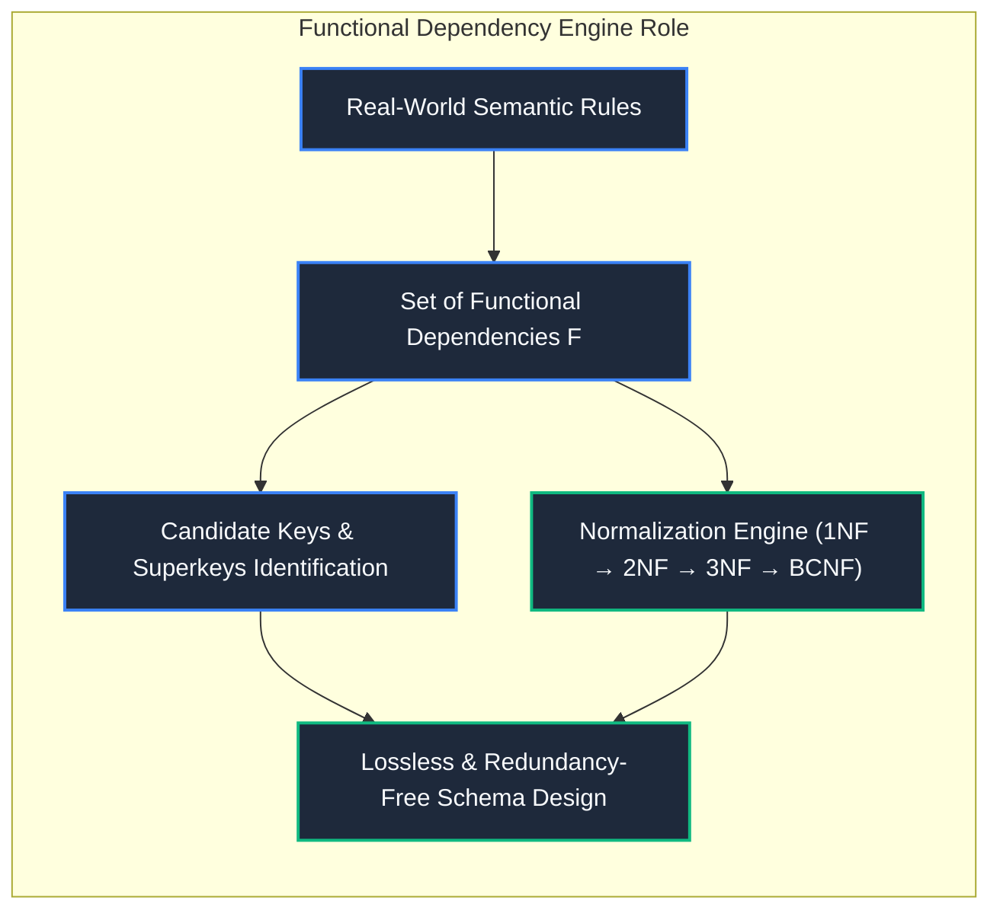

import CoreDoseLessonHeader from "@site/src/components/CoreDose/CoreDoseLessonHeader";
import CoreDoseTOC from "@site/src/components/CoreDose/CoreDoseTOC";
import CoreDoseNav from "@site/src/components/CoreDose/CoreDoseNav";

# 5.1 Introduction to Functional Dependencies & Trivial FDs

<CoreDoseLessonHeader
  module="Module 05: Functional Dependencies (FDs)"
  topic="Topic 5.1"
  readTime="8 min read"
  relevance="University Semester Exams • Technical Interviews • Relational Schema Design"
/>

## 💡 Core Intuition

### 🍳 The Everyday Analogy: The National ID and Blood Type
Imagine looking at a room full of people:
* If you know someone's **National Identity Number (SSN)**, their legal **Full Name** and **Date of Birth** are 100% fixed and unambiguous. There cannot be two different dates of birth assigned to the exact same National ID. We say: $\text{National\_ID} \to \text{Date\_of\_Birth}$.
* However, the reverse is not true: if you know someone's date of birth is "May 14, 1995", that does not uniquely determine their National ID, because thousands of citizens were born on that exact same day.
* **Trivial Knowledge**: If you ask for someone's `(National ID, Eye Color)`, you obviously already know their `National ID`. Stating that `(ID, Color)` determines `ID` is a **Trivial Dependency**—it provides zero new information because the right side is already part of the left side.

### 💻 Bridging to Computer Science
A **Functional Dependency (FD)** is a formal constraint between two sets of attributes in a relational database schema. It generalizes the concept of a mathematical function ($y = f(x)$): for any given value of attribute set $X$, there is exactly one associated value for attribute set $Y$.

---

<CoreDoseTOC toc={toc} />

---

## 📚 Core Deep-Dive & Concepts

### 1. Formal Mathematical Definition of Functional Dependency

Let $R$ be a relation schema, and let $\alpha \subseteq R$ and $\beta \subseteq R$ be subsets of attributes of $R$.

**Formal Definition**: The functional dependency:
$$
\alpha \to \beta
$$
(read as: *"$\alpha$ functionally determines $\beta$"* or *"$\beta$ is functionally dependent on $\alpha$"*) holds on relation schema $R$ if and only if, in any legal relation instance $r(R)$, for all pairs of tuples $t_1, t_2 \in r(R)$:

$$
\text{If } t_1[\alpha] = t_2[\alpha], \quad \text{then } t_1[\beta] = t_2[\beta]
$$

* **$\alpha$ is called the Determinant** (the left-hand side / LHS).
* **$\beta$ is called the Dependent** (the right-hand side / RHS).

---

### 2. Schema Property vs Instance Coincidence

> **The Fundamental Axiom**: A functional dependency is a semantic property of the **Relation Schema (Intension)**, NOT a temporary property of a current **Relation Instance (Extension)**.

* Just because a specific snapshot table currently exhibits no duplicate rows for an attribute does not mean an FD holds for the real-world domain.
* **Counter-Example**: In a startup table with 5 employees, every employee might currently live in a different postal code. However, you **cannot** assert $\text{Zip\_Code} \to \text{Emp\_ID}$, because tomorrow a second employee may move into the same zip code, immediately breaking that assumption.
* An FD represents a business rule enforced by the database engine for **all current and future states**.

---

### 3. Classification: Trivial, Non-Trivial & Completely Non-Trivial FDs

Functional dependencies are classified into three mathematical categories based on set containment:

#### A. Trivial Functional Dependency
**Definition**: An FD $\alpha \to \beta$ is **Trivial** if the dependent $\beta$ is a subset of the determinant $\alpha$:
$$
\beta \subseteq \alpha
$$
* **Examples**:
  * $\{A, B\} \to A$ (Trivial)
  * $\{A, B, C\} \to \{B, C\}$ (Trivial)
  * $A \to A$ (Trivial)
* **Property**: Trivial FDs are mathematically satisfied by **every possible relation instance**, even an empty or completely randomized table.

#### B. Non-Trivial Functional Dependency
**Definition**: An FD $\alpha \to \beta$ is **Non-Trivial** if $\beta$ is not a subset of $\alpha$:
$$
\beta \not\subseteq \alpha
$$
* **Example**: $\{A, B\} \to \{B, C\}$ (Non-trivial, because $C \notin \{A, B\}$).

#### C. Completely Non-Trivial Functional Dependency
**Definition**: An FD $\alpha \to \beta$ is **Completely Non-Trivial** if $\alpha$ and $\beta$ share zero attributes in common:
$$
\alpha \cap \beta = \emptyset
$$
* **Example**: $\{A, B\} \to \{C, D\}$ (Completely disjoint).

---

### 4. Instance Verification Rules & Violation Testing

Given an existing relation instance table, how do you verify whether an FD $\alpha \to \beta$ holds or is violated?

#### The Three Verification Shortcut Rules
1. **The Unique Determinant Rule**: If every single value in column $\alpha$ is distinct/unique, then $\alpha \to \beta$ **automatically holds** (no two rows share the same $\alpha$, so the condition $t_1[\alpha] = t_2[\alpha]$ can never be triggered).
2. **The Constant Dependent Rule**: If every single value in column $\beta$ is identical across all rows, then $\alpha \to \beta$ **automatically holds** (regardless of $\alpha$, $t_1[\beta]$ is always identical to $t_2[\beta]$).
3. **The Violation Test**: To prove an FD $\alpha \to \beta$ **does NOT hold**, you must find at least two tuples $t_1$ and $t_2$ such that:
   $$
   t_1[\alpha] = t_2[\alpha] \quad \text{AND} \quad t_1[\beta] \neq t_2[\beta]
   $$

#### Fully Worked Example: Instance Testing
Consider the following relation instance:

| Tuple | $\alpha$ | $\beta$ |
| :-: | :-: | :-: |
| $t_1$ | 1 | $a$ |
| $t_2$ | 2 | $b$ |
| $t_3$ | 3 | $a$ |
| $t_4$ | 4 | $c$ |

* **Does $\alpha \to \beta$ hold?**  
  **Yes.** Every value of $\alpha$ is distinct ($1, 2, 3, 4$). There are no two tuples with the same $\alpha$ mapping to different $\beta$'s.
* **Does $\beta \to \alpha$ hold?**  
  **No!** Inspect tuples $t_1$ and $t_3$:
  $$
  t_1[\beta] = a \quad \text{and} \quad t_3[\beta] = a \quad (t_1[\beta] = t_3[\beta])
  $$
  However:
  $$
  t_1[\alpha] = 1 \quad \text{and} \quad t_3[\alpha] = 3 \quad (t_1[\alpha] \neq t_3[\alpha])
  $$
  Since the same input $\beta = a$ produces conflicting outputs ($\alpha = 1$ and $\alpha = 3$), the dependency $\beta \to \alpha$ is violated.

---

## 📐 Architecture / Visual Blueprint

---

## 🏭 In The Real World: Production Case Study

### Electronic Medical Record (EMR) Schema Normalization at Epic Systems
In hospital healthcare software, storing medical encounters naively causes life-threatening data anomalies:
* **The Flawed Schema**:
  $$
  \text{Prescription}(\text{Rx\_ID}, \text{Patient\_ID}, \text{Patient\_Phone}, \text{Drug\_Name}, \text{Dosage})
  $$
* **The Functional Dependencies**:
  1. $\text{Rx\_ID} \to \{\text{Patient\_ID}, \text{Drug\_Name}, \text{Dosage}\}$
  2. $\text{Patient\_ID} \to \text{Patient\_Phone}$
* **The Problem**: Because $\text{Patient\_Phone}$ depends solely on $\text{Patient\_ID}$ rather than the full prescription key $\text{Rx\_ID}$, every time a chronic patient receives 20 separate prescriptions, their phone number is duplicated 20 times. If the patient updates their phone number on one prescription, the remaining 19 records hold stale data (**Update Anomaly**).
* **The Production Fix**: Recognizing the non-trivial dependency $\text{Patient\_ID} \to \text{Patient\_Phone}$ allows the database architect to decompose the table into:
  1. $\text{Patients}(\underline{\text{Patient\_ID}}, \text{Patient\_Phone})$
  2. $\text{Prescriptions}(\underline{\text{Rx\_ID}}, \text{Patient\_ID}, \text{Drug\_Name}, \text{Dosage})$

---

## 🎯 Exam & Interview Pitfall Check

:::tip Core Conceptual Questions

**Question 1:** Prove why the trivial functional dependency $\{A, B\} \to A$ can never be violated by any relation instance.  
**Answer:**  
An FD $\alpha \to \beta$ is violated only if there exist two tuples $t_1, t_2$ such that $t_1[\alpha] = t_2[\alpha]$ but $t_1[\beta] \neq t_2[\beta]$.  
For $\{A, B\} \to A$, $\alpha = \{A, B\}$ and $\beta = A$.  
If $t_1[\{A, B\}] = t_2[\{A, B\}]$, then by equality of tuple components, it is guaranteed that $t_1[A] = t_2[A]$ and $t_1[B] = t_2[B]$.  
Since $t_1[A] = t_2[A]$ is already established as true, the condition $t_1[A] \neq t_2[A]$ is mathematically impossible. Hence, the dependency holds unconditionally for all relation states.

**Question 2:** If a relation instance has 1,000 rows and an attribute $X$ has 1,000 distinct values, what can you conclude about any functional dependency $X \to Y$?  
**Answer:**  
The functional dependency $X \to Y$ is **guaranteed to hold** on this relation instance for any arbitrary attribute set $Y$. Because all 1,000 values of $X$ are distinct, no two tuples in the table share the same $X$ value ($t_1[X] \neq t_2[X]$ for all $t_1 \neq t_2$). Thus, the condition where equal $X$ values map to conflicting $Y$ values can never arise.
:::

:::warning Common Interview Traps

**Trap 1: "Can an empty table violate a functional dependency?"**  
**Answer: No.** An empty table ($|r| = 0$) contains zero tuples. Since you cannot find two tuples $t_1, t_2$ that satisfy the premise $t_1[\alpha] = t_2[\alpha]$ and violate the consequence $t_1[\beta] \neq t_2[\beta]$, every functional dependency holds **vacuously** on an empty relation instance.

**Trap 2: "If α → β holds on a table instance, is α necessarily a Candidate Key?"**  
**Answer: No!** A Candidate Key must determine **all** attributes of the relation schema ($K \to R$) and must be minimal. An FD $\alpha \to \beta$ merely states that $\alpha$ determines $\beta$; it does not imply that $\alpha$ can determine the remaining attributes of the table.
:::

---

<CoreDoseNav
  prev={{
    title: "4.5 Window Functions, CTEs (WITH Clause) & Views",
    url: "/coredose/dbms/chapter-04/window-functions-ctes-and-views"
  }}
  next={{
    title: "5.2 Armstrong's Axioms (Inference Rules)",
    url: "/coredose/dbms/chapter-05/armstrongs-axioms-inference-rules"
  }}
  courseUrl="/coredose/dbms"
/>
