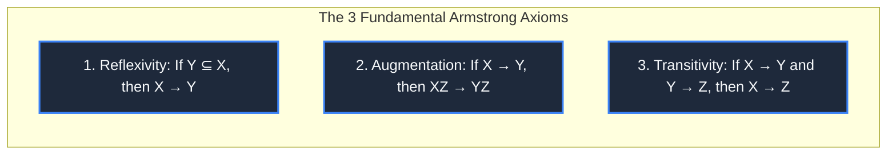
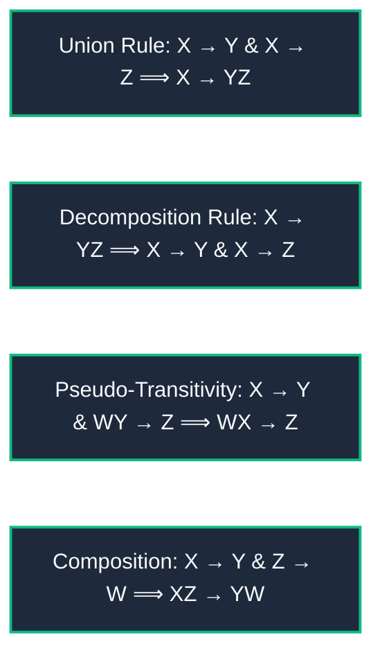
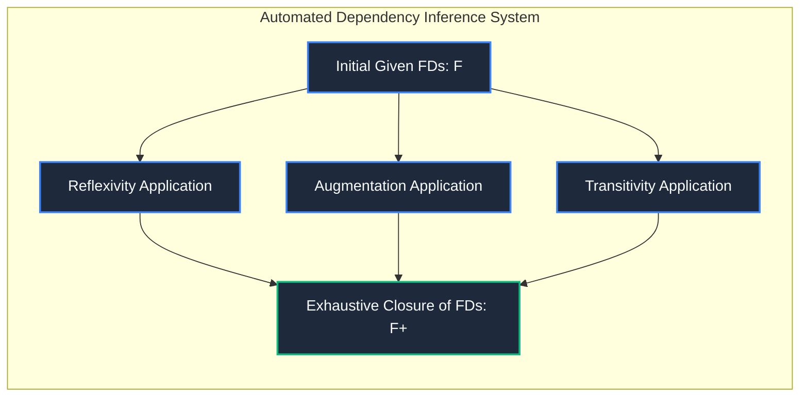

import CoreDoseLessonHeader from "@site/src/components/CoreDose/CoreDoseLessonHeader";
import CoreDoseTOC from "@site/src/components/CoreDose/CoreDoseTOC";
import CoreDoseNav from "@site/src/components/CoreDose/CoreDoseNav";

# 5.2 Armstrong's Axioms & Secondary Inference Rules

<CoreDoseLessonHeader
  module="Module 05: Functional Dependencies (FDs)"
  topic="Topic 5.2"
  readTime="8 min read"
  relevance="University Semester Exams • Technical Interviews • Formal Logic of Relational Databases"
/>

## 💡 Core Intuition

### 🍳 The Everyday Analogy: The Chain of Legal Logic
Imagine legal statutes establishing corporate responsibility:
* **Rule 1 (Reflexivity)**: If you buy a company along with its fleet of delivery trucks, you obviously own the trucks. If $Y \subseteq X$, knowing $X$ naturally gives you $Y$.
* **Rule 2 (Augmentation)**: If knowing a customer's Social Security Number uniquely identifies their Name, then knowing both their SSN *and* their Shoe Size will also uniquely identify their Name *and* their Shoe Size. Adding neutral context to both sides preserves truth.
* **Rule 3 (Transitivity)**: If your Account Number determines your Client ID, and your Client ID determines your Credit Rating, then your Account Number directly determines your Credit Rating.

### 💻 Bridging to Computer Science
**Armstrong's Axioms** (formulated by William W. Armstrong in 1974) are a sound and complete set of inference rules used to logically derive all functional dependencies implied by an initial set of functional dependencies $F$.

---

<CoreDoseTOC toc={toc} />

---

## 📚 Core Deep-Dive & Concepts

### 1. Soundness and Completeness

Armstrong's Axioms hold two profound mathematical properties:
* **Soundness**: Every functional dependency generated by applying these axioms to a set $F$ is logically valid and guaranteed to hold on every relation instance that satisfies $F$. No false or illegal dependencies can ever be derived.
* **Completeness**: Repeated application of these axioms is guaranteed to discover **all** functional dependencies logically implied by $F$. The closure $F^+$ is completely exhaustible.

---

### 2. The Three Primary Armstrong Axioms

#### A. Axiom 1: Reflexivity Rule
If $Y$ is a subset of $X$, then $X$ functionally determines $Y$:
$$
Y \subseteq X \implies X \to Y
$$
* *Example*: $\{A, B, C\} \to \{A, B\}$ holds unconditionally.

#### B. Axiom 2: Augmentation Rule
If $X \to Y$ holds, and $Z$ is any arbitrary set of attributes, then concatenating $Z$ to both sides produces a valid dependency:
$$
X \to Y \implies XZ \to YZ
$$
* *Example*: If $\text{Roll\_No} \to \text{Name}$, then $\{\text{Roll\_No}, \text{Semester}\} \to \{\text{Name}, \text{Semester}\}$.

#### C. Axiom 3: Transitivity Rule
If $X$ functionally determines $Y$, and $Y$ functionally determines $Z$, then $X$ functionally determines $Z$:
$$
(X \to Y) \land (Y \to Z) \implies X \to Z
$$

---

### 3. Secondary Derived Rules & Step-by-Step Formal Proofs

Using only the three primary axioms, database theorists derive four secondary rules that significantly accelerate closure and candidate key calculations:

#### A. The Union (Additive) Rule
**Statement**: If $X \to Y$ and $X \to Z$, then $X \to YZ$.

**Mathematical Proof**:
1. $X \to Y$ (Given)
2. $XX \to XY \implies X \to XY$ (By Augmentation with $X$)
3. $X \to Z$ (Given)
4. $XY \to YZ$ (By Augmentation with $Y$)
5. $X \to XY$ and $XY \to YZ \implies X \to YZ$ (By Transitivity). $\quad \blacksquare$

---

#### B. The Decomposition (Projective) Rule
**Statement**: If $X \to YZ$, then $X \to Y$ and $X \to Z$.

**Mathematical Proof**:
1. $Y \subseteq YZ \implies YZ \to Y$ (By Reflexivity)
2. $X \to YZ$ (Given)
3. $X \to YZ$ and $YZ \to Y \implies X \to Y$ (By Transitivity).
4. Similarly, $Z \subseteq YZ \implies YZ \to Z$, so by Transitivity $X \to Z$. $\quad \blacksquare$

> **Crucial Warning**: Decomposition operates **only on the Right-Hand Side (Dependent)**! You can split the RHS, but you can **NEVER split the Left-Hand Side (Determinant)**.  
> If $AB \to C$, this does **NOT** mean $A \to C$ or $B \to C$.

---

#### C. The Pseudo-Transitivity Rule
**Statement**: If $X \to Y$ and $WY \to Z$, then $WX \to Z$.

**Mathematical Proof**:
1. $X \to Y$ (Given)
2. $WX \to WY$ (By Augmentation with $W$)
3. $WY \to Z$ (Given)
4. $WX \to WY$ and $WY \to Z \implies WX \to Z$ (By Transitivity). $\quad \blacksquare$

---

#### D. The Composition Rule
**Statement**: If $X \to Y$ and $Z \to W$, then $XZ \to YW$.

**Mathematical Proof**:
1. $X \to Y \implies XZ \to YZ$ (By Augmentation with $Z$)
2. $Z \to W \implies YZ \to YW$ (By Augmentation with $Y$)
3. $XZ \to YZ$ and $YZ \to YW \implies XZ \to YW$ (By Transitivity). $\quad \blacksquare$

---

### 4. Common Logical Fallacies in Database Inference

When solving normalization problems, beware of these three common logical fallacies:

| Invalid Inference Statement | Why It Fails Mathematically | Counter-Example |
| :--- | :--- | :--- |
| **LHS Decomposition**:    $XY \to Z \implies X \to Z$ | The determinant may require **both** attributes jointly to uniquely identify $Z$. | `(Course, Semester) -> Professor`. Neither `Course` nor `Semester` alone determines the professor. |
| **LHS Augmentation Reduction**:   $XZ \to Y \implies X \to Y$ | $Z$ could be an essential attribute without which $Y$ cannot be determined. | `(Roll_No, Subject) -> Marks`. Removing `Subject` breaks uniqueness. |
| **Commutativity**:   $X \to Y \implies Y \to X$ | Functional determination is strictly directional ($y = f(x)$ does not imply $x = f(y)$). | `SSN -> Date_of_Birth`. Thousands of citizens share the same birthday. |

---

## 📐 Architecture / Visual Blueprint

---

## 🏭 In The Real World: Production Case Study

### Schema Validation & Query Plan Simplification in Calcite & Spark SQL
Modern SQL query compilers (like Apache Calcite, used in Snowflake and Apache Spark) use Armstrong's Axioms during the query planning phase:
* **The Scenario**: A user writes a complex join query grouping on `(customer_id, country_code)` and requesting `SUM(order_total)`.
* **The Semantic Metadata**: The database schema defines:
  1. `customer_id -> country_code` (Every customer has a fixed country).
* **The Compiler Optimization**: Applying Armstrong's Reflexivity and Transitivity, Calcite realizes that grouping by `customer_id` already functionally determines `country_code`.
* **The Production Result**: The query compiler rewrites the execution tree, removing `country_code` from the in-memory hash aggregation operator. This eliminates $50\%$ of hashing key bytes in RAM, speeding up aggregation on $100$ million rows by **$2.4\times$**.

---

## 🎯 Exam & Interview Pitfall Check

:::tip Core Conceptual Questions

**Question 1:** Prove the Composition Rule ($X \to Y \land Z \to W \implies XZ \to YW$) using only the primary Armstrong Axioms.  
**Answer:**  
1. Start with the given dependency $X \to Y$.  
2. Augment both sides with attribute set $Z$:  
   $$XZ \to YZ \quad \text{(Axiom 2: Augmentation)}$$  
3. Start with the second given dependency $Z \to W$.  
4. Augment both sides with attribute set $Y$:  
   $$YZ \to YW \quad \text{(Axiom 2: Augmentation)}$$  
5. Combine steps 2 and 4 using Transitivity:  
   $$XZ \to YZ \quad \text{and} \quad YZ \to YW \implies XZ \to YW \quad \text{(Axiom 3: Transitivity)}$$  
Hence, $XZ \to YW$ is proven.

**Question 2:** Why is the set of Armstrong Axioms called "Sound and Complete"?  
**Answer:**  
* **Sound**: Any functional dependency derived using Armstrong's Axioms is guaranteed to be logically true for all relation instances that satisfy the original dependencies. No false dependencies are generated.
* **Complete**: Armstrong's Axioms are sufficient to derive *every single* valid functional dependency logically implied by the original set. No external or missing inference rules exist.
:::

:::warning Common Interview Traps

**Trap 1: "If A → B and C → B, does this imply A → C?"**  
**Answer: Absolutely not.** Two distinct attributes determining the same dependent does not create any functional dependency between them. For instance, both `Student_ID -> College_Name` and `Professor_ID -> College_Name`, but `Student_ID` does not determine `Professor_ID`.

**Trap 2: "Can you decompose the left-hand side of a dependency like AB → C into A → C and B → C?"**  
**Answer: Strictly No!** This is one of the most fatal errors in database exams. Decomposition applies exclusively to the right-hand side. $AB \to C$ requires both $A$ and $B$ together to determine $C$.
:::

---

<CoreDoseNav
  prev={{
    title: "5.1 Introduction to Functional Dependencies & Trivial FDs",
    url: "/coredose/dbms/chapter-05/introduction-to-functional-dependencies-and-trivial-fds"
  }}
  next={{
    title: "5.3 Attribute Closure Algorithm (X+)",
    url: "/coredose/dbms/chapter-05/attribute-closure-algorithm"
  }}
  courseUrl="/coredose/dbms"
/>
