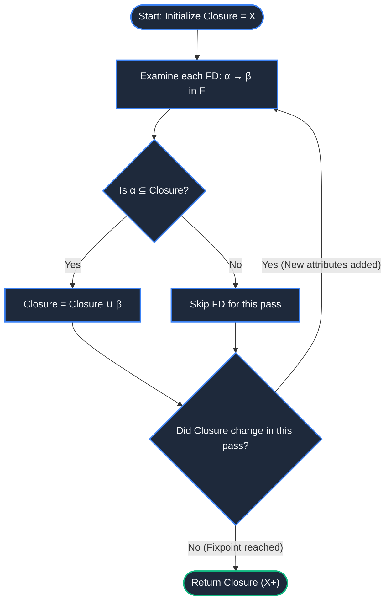
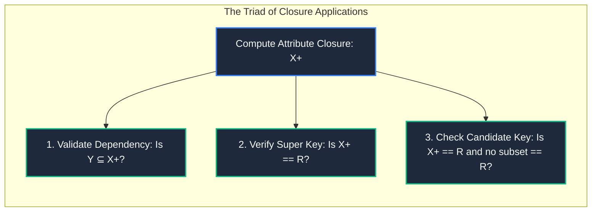

import CoreDoseLessonHeader from "@site/src/components/CoreDose/CoreDoseLessonHeader";
import CoreDoseTOC from "@site/src/components/CoreDose/CoreDoseTOC";
import CoreDoseNav from "@site/src/components/CoreDose/CoreDoseNav";

# 5.3 Attribute Closure Algorithm (X+)

<CoreDoseLessonHeader
  module="Module 05: Functional Dependencies (FDs)"
  topic="Topic 5.3"
  readTime="8 min read"
  relevance="University Semester Exams • Technical Interviews • Core Normalization Mathematics"
/>

## 💡 Core Intuition

### 🍳 The Everyday Analogy: The Domino Effect of Information
Imagine you are given a set of physical keys to an office building:
* You start with a single brass key that opens the **Front Lobby Door ($A$)**.
* Inside the lobby, you find a keycard on the desk that opens the **Server Room ($B$)**.
* Inside the server room, an emergency locker contains the master key for the **Executive Safe ($C$)**.
* Even though you were originally handed only the Front Lobby key ($A$), its ultimate reach allows you to access the Lobby, the Server Room, and the Executive Safe:
  $$
  A^+ = \{A, B, C\}
  $$

### 💻 Bridging to Computer Science
The **Attribute Closure** of a set of attributes $X$ under a set of functional dependencies $F$ (denoted $X^+$) is the complete set of all attributes that are functionally determined by $X$. Computing attribute closures is the universal engine for verifying keys, testing dependencies, and executing database normalization.

---

<CoreDoseTOC toc={toc} />

---

## 📚 Core Deep-Dive & Concepts

### 1. Formal Definition & Why We Need Attribute Closure

**Definition**: Given a relation schema $R$, a set of functional dependencies $F$, and an attribute set $X \subseteq R$, the **Attribute Closure** $X^+$ is defined as:
$$
X^+ = \{ A \in R \mid F \vDash X \to A \}
$$
That is, $X^+$ contains every attribute $A$ that can be determined either directly or transitively from $X$ using the rules of $F$.

#### Why Not Compute the Full FD Closure $F^+$?
To check if a single dependency $X \to Y$ holds, one could theoretically compute the entire closure of dependencies $F^+$ using Armstrong's Axioms.  
However, for a relation with $n$ attributes, $F^+$ can contain up to **$O(2^n)$** dependencies—an exponential calculation that causes algorithmic blowup.  
In contrast, computing the attribute closure $X^+$ operates in **polynomial time $O(|F| \cdot |R|)$**, making it lightning-fast for database query engines.

---

### 2. The Formal Attribute Closure Algorithm



#### Algorithmic Pseudocode
```text
Algorithm: Compute_Attribute_Closure(R, F, X)
Input:  Relation schema R, Set of Functional Dependencies F, Attribute Set X
Output: The attribute closure X+

1.  Closure = X;
2.  repeat
3.      Old_Closure = Closure;
4.      for each functional dependency (α → β) in F do:
5.          if α ⊆ Closure then
6.              Closure = Closure ∪ β;
7.          end if
8.      end for
9.  until (Closure == Old_Closure);
10. return Closure;
```

---

### 3. Practical Applications of Attribute Closure

The Attribute Closure algorithm is the single most versatile tool in relational database theory. It is used to answer three fundamental questions:

#### A. Testing if a Functional Dependency $X \to Y$ Holds
To test if a dependency $X \to Y$ is logically implied by $F$:
1. Compute the closure $X^+$.
2. Check if $Y \subseteq X^+$.
3. If $Y \subseteq X^+$, then $X \to Y$ is **VALID**. Otherwise, it is **INVALID**.

#### B. Testing if $X$ is a Super Key
To determine if an attribute set $X$ is a Super Key for relation $R$:
1. Compute $X^+$.
2. Check if $X^+ = R$ (contains every attribute of the relation schema).
3. If $X^+ = R$, then $X$ is a **Super Key**.

#### C. Testing if $X$ is a Candidate Key
1. Verify that $X^+ = R$ ($X$ is a Super Key).
2. Verify that for every proper subset $Y \subset X$, $Y^+ \neq R$ (minimality condition).

---

### 4. Fully Solved Step-by-Step Numerical Derivations

#### Numerical Problem 1: Basic Single-Attribute Closure
Consider relation $R(A, B, C, D)$ with functional dependency set:
$$
F = \{ A \to B, \quad B \to C, \quad AB \to D \}
$$
**Goal**: Compute $A^+$.

**Step-by-Step Derivation**:
* **Step 0 (Initialization)**:  
  $$A^+ = \{A\}$$
* **Iteration 1**:
  * Check $A \to B$: Since $\{A\} \subseteq A^+$, add $B$:  
    $$A^+ = \{A, B\}$$
  * Check $B \to C$: Since $\{B\} \subseteq A^+$, add $C$:  
    $$A^+ = \{A, B, C\}$$
  * Check $AB \to D$: Since $\{A, B\} \subseteq A^+$, add $D$:  
    $$A^+ = \{A, B, C, D\}$$
* **Iteration 2**:  
  No new attributes can be added. Fixpoint reached.

**Conclusion**:
$$
A^+ = \{A, B, C, D\}
$$
Since $A^+$ contains all attributes of relation $R$, **attribute $A$ is a Super Key** (and since it consists of a single attribute, it is also a **Candidate Key**).

---

#### Numerical Problem 2: Multi-Attribute Composite Closure
Consider relation $R(A, B, C, D, E, F)$ with dependency set:
$$
F = \{ A \to B, \quad BC \to D, \quad D \to E, \quad E \to F \}
$$
**Goal**: Determine whether the composite attribute set $\{A, C\}$ is a Super Key.

**Step-by-Step Derivation**:
* **Initialization**:  
  $$(AC)^+ = \{A, C\}$$
* **Pass 1**:
  * Check $A \to B$: $\{A\} \subseteq (AC)^+ \implies (AC)^+ = \{A, B, C\}$
  * Check $BC \to D$: $\{B, C\} \subseteq (AC)^+ \implies (AC)^+ = \{A, B, C, D\}$
  * Check $D \to E$: $\{D\} \subseteq (AC)^+ \implies (AC)^+ = \{A, B, C, D, E\}$
  * Check $E \to F$: $\{E\} \subseteq (AC)^+ \implies (AC)^+ = \{A, B, C, D, E, F\}$
* **Pass 2**:  
  All attributes $\{A, B, C, D, E, F\}$ are already present. Loop terminates.

**Conclusion**:
$$
(AC)^+ = \{A, B, C, D, E, F\} = R
$$
Therefore, $\{A, C\}$ is a **Super Key** for $R$.

---

## 📐 Architecture / Visual Blueprint



---

## 🏭 In The Real World: Production Case Study

### Index Covering and Query Optimization in SQLite & DuckDB
Modern embedded databases (like SQLite and DuckDB) use attribute closure algorithms inside their cost-based query planners:
* **The Concept (Covering Index)**: A covering index contains all columns requested by a query, allowing the engine to satisfy the read request directly from index pages without fetching rows from the main table heap on disk.
* **The Query Planner Check**: When compiling an analytical query with `GROUP BY` and `WHERE` clauses, the engine calculates the attribute closure of the active indexed columns under the schema's unique and functional constraints. If the closure covers the query's projected projection list, the planner skips heap disk block reads completely, reducing disk I/O by up to **80%**.

---

## 🎯 Exam & Interview Pitfall Check

:::tip Core Conceptual Questions

**Question 1:** Given relation $R(A, B, C, D, E)$ with $F = \{A \to B, B \to C, C \to D, D \to E\}$. Compute $(BD)^+$.  
**Answer:**  
* Initialization: $(BD)^+ = \{B, D\}$.  
* Check $B \to C$: $\{B\} \subseteq (BD)^+ \implies (BD)^+ = \{B, C, D\}$.  
* Check $C \to D$: $D$ is already in the set.  
* Check $D \to E$: $\{D\} \subseteq (BD)^+ \implies (BD)^+ = \{B, C, D, E\}$.  
* Check $A \to B$: Determinant $\{A\} \not\subseteq (BD)^+$, so $A$ cannot be derived.  
* **Final Result**: $(BD)^+ = \mathbf{\{B, C, D, E\}}$.

**Question 2:** Why does the Attribute Closure algorithm run in polynomial time while computing the full dependency closure $F^+$ is exponential?  
**Answer:**  
In computing $X^+$, the closure set starts with at most $n$ attributes and can grow by at most $n$ attributes before reaching the full relation $R$. Each pass inspects the $|F|$ dependencies. Thus, $X^+$ executes in at most $O(|F| \cdot |R|)$ time. In contrast, $F^+$ must generate every possible valid functional dependency between all possible subsets of attributes (of which there are $2^n$ subsets on the left and $2^n$ on the right), producing up to $O(2^n)$ dependencies.
:::

:::warning Common Interview Traps

**Trap 1: "Does the order in which we evaluate functional dependencies during the loop affect the final closure result?"**  
**Answer: Absolutely not.** Because the algorithm iterates in a `repeat...until` loop until no new attributes can be added (a mathematical monotonic fixpoint), any dependency that was skipped in the first pass will be triggered in subsequent passes once its determinant attributes have been added. The final closure is deterministic and unique.

**Trap 2: "If X+ = R, is X guaranteed to be a Candidate Key?"**  
**Answer: No.** $X^+ = R$ only guarantees that $X$ is a **Super Key**. It is a Candidate Key if and only if it also satisfies the **minimality** condition (no proper subset of $X$ can derive $R$).
:::

---

<CoreDoseNav
  prev={{
    title: "5.2 Armstrong's Axioms & Inference Rules",
    url: "/coredose/dbms/chapter-05/armstrongs-axioms-inference-rules"
  }}
  next={{
    title: "5.4 Algorithmic Method to Find All Candidate Keys",
    url: "/coredose/dbms/chapter-05/algorithmic-method-to-find-all-candidate-keys"
  }}
  courseUrl="/coredose/dbms"
/>
