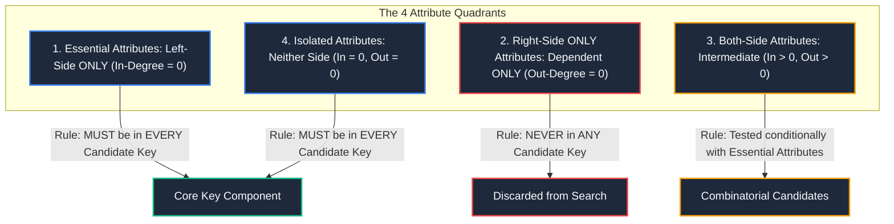
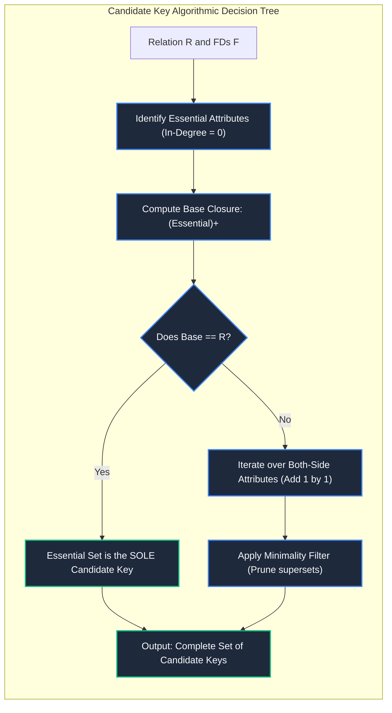

import CoreDoseLessonHeader from "@site/src/components/CoreDose/CoreDoseLessonHeader";
import CoreDoseTOC from "@site/src/components/CoreDose/CoreDoseTOC";
import CoreDoseNav from "@site/src/components/CoreDose/CoreDoseNav";

# 5.4 Algorithmic Method to Find All Candidate Keys

<CoreDoseLessonHeader
  module="Module 05: Functional Dependencies (FDs)"
  topic="Topic 5.4"
  readTime="9 min read"
  relevance="University Semester Exams • Technical Interviews • Database Normalization Core"
/>

## 💡 Core Intuition

### 🍳 The Everyday Analogy: The Detective's Clue Matrix
Imagine a detective solving a complex mystery involving 6 suspects:
* Some pieces of evidence are **"Orphans" (Essential Attributes)**: Nobody can explain where they came from; they have zero leads pointing to them. If you don't collect them manually, they will never be accounted for. They **must be in your case file**.
* Some pieces of evidence are **"Consequences" (Right-Only Attributes)**: They are purely the side-effects of other clues. You never need to start your investigation with them because they will automatically be discovered along the way.
* By identifying the essential clues first, you drastically prune a search space from thousands of random combinations down to two or three targeted leads.

### 💻 Bridging to Computer Science
Finding all candidate keys of a relation schema $R$ by testing all $2^n$ subsets of attributes is computationally intractable for large tables. The **Graphical In-Degree / Essential Attribute Method** classifies attributes into structural categories, pruning over **90% of impossible candidate key permutations** instantly.

---

<CoreDoseTOC toc={toc} />

---

## 📚 Core Deep-Dive & Concepts

### 1. The 4-Quadrant Attribute Classification Method

Given a relation schema $R$ and its functional dependency set $F$, we inspect where each attribute appears across all dependencies $\alpha \to \beta$:



#### Category 1: Left-Side Only Attributes (Essential Attributes)
Attributes that appear **exclusively on the Left-Hand Side (Determinant)** of FDs and never on the Right-Hand Side.
* **The Law**: Since no functional dependency in the system can ever derive these attributes, **they MUST be included in every single Candidate Key** of the relation.

#### Category 2: Right-Side Only Attributes
Attributes that appear **exclusively on the Right-Hand Side (Dependent)** of FDs and never on the Left-Hand Side.
* **The Law**: These attributes are determined by other attributes but cannot determine anything themselves. Therefore, **they can NEVER be part of any minimal Candidate Key**.

#### Category 3: Both-Side Attributes (Intermediate Attributes)
Attributes that appear on both the LHS of some FDs and the RHS of other FDs.
* **The Law**: They may or may not be part of a candidate key. They are systematically combined with the essential attributes during search space exploration.

#### Category 4: Neither-Side Attributes (Isolated Attributes)
Attributes of relation schema $R$ that do not appear in any functional dependency in $F$.
* **The Law**: Since no dependency determines them, **they MUST be included in every single Candidate Key** of $R$.

---

### 2. Systematic Algorithmic Workflow

```text
Algorithm: Find_All_Candidate_Keys(R, F)
1. Categorize all attributes into Essential (L), Right-Only (R), Both (B), and Isolated (I).
2. Form the Base Essential Set: K_base = L ∪ I.
3. Compute closure of Base Set: (K_base)+.
4. If (K_base)+ == R:
       K_base is the ONLY Candidate Key of R. Terminate.
5. If (K_base)+ != R:
       Iteratively pair K_base with 1 attribute from Both-Side (B):
           For each attribute b ∈ B:
               Compute (K_base ∪ {b})+.
               If closure equals R, (K_base ∪ {b}) is a Candidate Key.
       If keys are found at this level, test higher-order combinations 
       only if they do not contain an already confirmed Candidate Key (minimality check).
```

---

### 3. Fully Solved Step-by-Step Numerical Problems

#### Problem 1: Single Candidate Key with In-Degree Pruning
Consider relation $R(A, B, C, D, E, F, G)$ with functional dependency set:
$$
F = \{ AD \to E, \quad BE \to F, \quad B \to C, \quad AF \to G \}
$$
**Goal**: Find all Candidate Keys of $R$.

**Step-by-Step Derivation**:
* **Step 1: Attribute Classification**:
  * Attributes on LHS: $\{A, D, B, E, F\}$
  * Attributes on RHS: $\{E, F, C, G\}$
  * **Left-Only (Essential Attributes)**:
    $$
    \text{LHS} \setminus \text{RHS} = \{A, B, D\}
    $$
    Attributes $A, B$, and $D$ have **zero incoming edges** (they never appear on the right side).
  * Therefore, the attribute set $\{A, B, D\}$ **must be part of every candidate key**.
* **Step 2: Test Closure of Essential Attributes**:
  $$
  (ABD)^+ = \{A, B, D\}
  $$
  * Using $B \to C \implies (ABD)^+ = \{A, B, C, D\}$
  * Using $AD \to E \implies (ABD)^+ = \{A, B, C, D, E\}$
  * Using $BE \to F \implies (ABD)^+ = \{A, B, C, D, E, F\}$
  * Using $AF \to G \implies (ABD)^+ = \{A, B, C, D, E, F, G\} = R$
* **Step 3: Minimality Test**:
  Since $\{A, B, D\}$ are all essential attributes, no proper subset can ever derive all attributes (as the missing essential attribute could never be derived).

**Final Conclusion**:
$$
\mathbf{Candidate\ Key = \{A, B, D\}}
$$
There is **only one** Candidate Key.

---

#### Problem 2: Multiple Overlapping & Varying-Length Candidate Keys
Consider relation $R(U, V, W, X, Y, Z)$ with functional dependency set:
$$
F = \{ UV \to W, \quad XW \to Y, \quad U \to XZ, \quad Y \to U \}
$$
**Goal**: Find all Candidate Keys, Prime Attributes, and Non-Prime Attributes.

**Step-by-Step Derivation**:
* **Step 1: Attribute Classification**:
  * Attributes on LHS: $\{U, V, X, W, Y\}$
  * Attributes on RHS: $\{W, Y, X, Z, U\}$
  * **Essential Attributes (Left-Only)**:  
    Attribute **$V$** appears on the LHS ($UV \to W$) but **never on the RHS**.  
    Therefore, **$V$ must be present in EVERY candidate key** of this relation!
  * **Right-Only Attributes**: Attribute **$Z$** appears on RHS only ($U \to XZ$). $Z$ will **never** be part of any minimal candidate key.
  * **Both-Side Attributes**: $\{U, W, X, Y\}$.

* **Step 2: Test Closure of Essential Set $\{V\}$**:
  $$
  (V)^+ = \{V\} \neq R
  $$
  $V$ alone cannot form a candidate key.

* **Step 3: Test 2-Attribute Combinations with $V$**:
  1. **Test $(UV)^+$**:
     * $(UV)^+ = \{U, V\}$
     * $UV \to W \implies \{U, V, W\}$
     * $U \to XZ \implies \{U, V, W, X, Z\}$
     * $XW \to Y \implies \{U, V, W, X, Y, Z\} = R$
     * $\implies \mathbf{UV}$ **is a valid Candidate Key!**
  2. **Test $(VW)^+$**:
     * $(VW)^+ = \{V, W\} \neq R$ (No dependencies fire).
  3. **Test $(VX)^+$**:
     * $(VX)^+ = \{V, X\} \neq R$.
  4. **Test $(VY)^+$**:
     * $(VY)^+ = \{V, Y\}$
     * $Y \to U \implies \{U, V, Y\}$
     * $UV \to W \implies \{U, V, W, Y\}$
     * $U \to XZ \implies \{U, V, W, X, Y, Z\} = R$
     * $\implies \mathbf{VY}$ **is a valid Candidate Key!**

* **Step 4: Test 3-Attribute Combinations with $V$**:
  * We only test combinations containing $V$ and subsets of $\{W, X\}$ that do not contain existing keys ($UV$ or $VY$):
  * **Test $(VWX)^+$**:
    * $(VWX)^+ = \{V, W, X\}$
    * $XW \to Y \implies \{V, W, X, Y\}$
    * $Y \to U \implies \{U, V, W, X, Y\}$
    * $U \to XZ \implies \{U, V, W, X, Y, Z\} = R$
    * Minimality check: Is any proper subset a superkey?
      * $(VW)^+ \neq R$, $(VX)^+ \neq R$, $(WX)^+ \neq R$ (lacks essential $V$).
    * $\implies \mathbf{VWX}$ **is a valid Candidate Key!**

**Summary of Keys**:
$$
\mathbf{Candidate\ Keys = \{ UV, \quad VY, \quad VWX \}}
$$

**Prime Attributes** (members of at least one candidate key):
$$
\text{Prime Attributes} = \{U, V, W, X, Y\}
$$
**Non-Prime Attributes**:
$$
\text{Non-Prime Attributes} = \{Z\}
$$

---

## 📐 Architecture / Visual Blueprint



---

## 🏭 In The Real World: Production Case Study

### Distributed Shard Key Selection in CockroachDB & Cassandra
In horizontally scaled distributed relational databases:
* **The Engineering Constraint**: Tables are partitioned (sharded) across hundreds of cloud nodes using a primary distribution key.
* **The Hazard**: Choosing an attribute set that is a Super Key but not minimal leads to massive network overhead and unbalanced hotspot partitions.
* **The Algorithm in Practice**: Automated database schema linters parse all domain access patterns and functional constraints to calculate the minimal candidate keys. The database architect picks the candidate key with the highest cardinality and lowest write skew to act as the cluster's primary distribution shard key.

---

## 🎯 Exam & Interview Pitfall Check

:::tip Core Conceptual Questions

**Question 1:** Why is an attribute that never appears in any functional dependency guaranteed to be present in every Candidate Key?  
**Answer:**  
If an attribute $X$ does not appear in any functional dependency in $F$, no dependency can ever functionally determine $X$ ($\nexists \alpha \to \beta$ where $X \in \beta$). The only way for an attribute closure $K^+$ to include $X$ is if $X$ is explicitly supplied in the starting set $K$. Since a candidate key must derive all attributes of the relation schema, every candidate key must contain $X$.

**Question 2:** Given $R(A, B, C)$ with $F = \{A \to B, B \to C, C \to A\}$. Find all Candidate Keys.  
**Answer:**  
All three attributes appear on both the LHS and RHS (no essential attributes, no right-only attributes).  
* Test $A^+$: $A \to B \to C \implies A^+ = \{A, B, C\} = R$. $\implies \mathbf{\{A\}}$ is a Candidate Key.  
* Test $B^+$: $B \to C \to A \implies B^+ = \{A, B, C\} = R$. $\implies \mathbf{\{B\}}$ is a Candidate Key.  
* Test $C^+$: $C \to A \to B \implies C^+ = \{A, B, C\} = R$. $\implies \mathbf{\{C\}}$ is a Candidate Key.  
**Candidate Keys**: $\mathbf{\{A\}, \{B\}, \{C\}}$. (All attributes are Prime; zero non-prime attributes).
:::

:::warning Common Interview Traps

**Trap 1: "Can a Candidate Key have more attributes than another Candidate Key in the same table?"**  
**Answer: Yes!** Minimality does not mean minimum cardinality (fewest number of attributes). Minimality means **irreducibility**—no proper subset is a superkey. As demonstrated in Problem 2, $R$ has candidate keys of length 2 ($\{UV\}, \{VY\}$) and length 3 ($\{VWX\}$) simultaneously.

**Trap 2: "If an attribute appears on both LHS and RHS, can it be part of a candidate key?"**  
**Answer: Absolutely.** Both-side attributes frequently appear in candidate keys. For instance, in $A \to B, B \to C, C \to A$, all three attributes appear on both sides, and all three are individual candidate keys.
:::

---

<CoreDoseNav
  prev={{
    title: "5.3 Attribute Closure Algorithm (X+)",
    url: "/coredose/dbms/chapter-05/attribute-closure-algorithm"
  }}
  next={{
    title: "5.5 Minimal / Canonical Cover of Functional Dependencies",
    url: "/coredose/dbms/chapter-05/minimal-canonical-cover-of-functional-dependencies"
  }}
  courseUrl="/coredose/dbms"
/>
