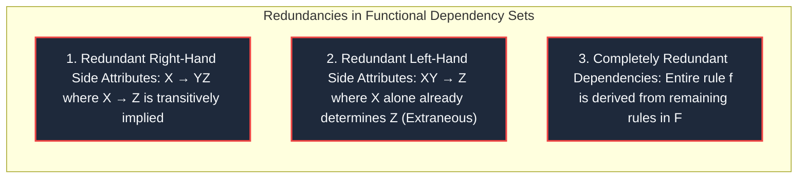
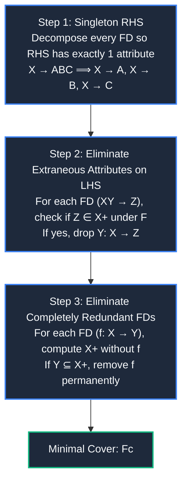
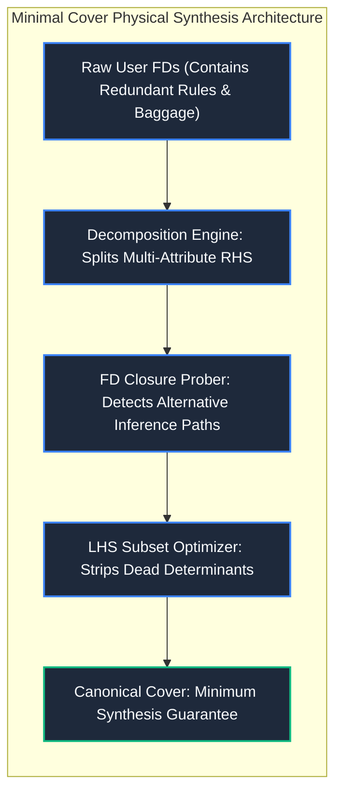

import CoreDoseLessonHeader from "@site/src/components/CoreDose/CoreDoseLessonHeader";
import CoreDoseTOC from "@site/src/components/CoreDose/CoreDoseTOC";
import CoreDoseNav from "@site/src/components/CoreDose/CoreDoseNav";

# 5.5 Minimal / Canonical Cover of Functional Dependencies

<CoreDoseLessonHeader
  module="Module 05: Functional Dependencies (FDs)"
  topic="Topic 5.5"
  readTime="9 min read"
  relevance="University Semester Exams • Technical Interviews • Schema Synthesis & 3NF Normalization"
/>

## 💡 Core Intuition

### 🍳 The Everyday Analogy: The Redundant Employee Handbook
Imagine a company's rulebook containing hundreds of overlapping workplace rules:
* Rule 1 states: *"All employees must wear an official security badge."*
* Rule 2 states: *"Engineering staff must wear an official security badge."* (Rule 2 is completely redundant because Rule 1 already covers everyone).
* Rule 3 states: *"Anyone holding an engineering degree AND wearing red shoes can access the server room."* (The red shoes requirement is an irrelevant extraneous condition).
* A **Minimal (Canonical) Cover** is the streamlined, pruned handbook that conveys the exact same legal authority using the minimum necessary rules, zero redundant policies, and zero extraneous fluff.

### 💻 Bridging to Computer Science
A **Minimal Cover** (also called a **Canonical Cover** or **Irreducible Set**) $F_c$ is a simplified, standardized equivalent of a functional dependency set $F$. It produces the exact same closure ($F_c^+ = F^+$), but contains zero redundant dependencies and zero extraneous attributes.

---

<CoreDoseTOC toc={toc} />

---

## 📚 Core Deep-Dive & Concepts

### 1. Formal Definition of a Minimal Cover

A set of functional dependencies $F_c$ is a **Minimal Cover** for $F$ if and only if it satisfies four formal conditions:

1. **Equivalence**: $F_c \equiv F$ (both sets produce the exact same dependency closure: $F_c^+ = F^+$).
2. **Singleton Right-Hand Side**: Every dependency in $F_c$ is of the form $X \to A$, where $A$ is a **single attribute**.
3. **No Extraneous Attributes**: No attribute in the determinant (LHS) of any dependency in $F_c$ can be deleted without changing the closure $(F_c^+)$.
4. **No Redundant Dependencies**: No dependency can be removed from $F_c$ without reducing its closure power.

---

### 2. The Three Types of Redundancy in Functional Dependencies

---

### 3. The Canonical 3-Step Algorithm

#### Step 1: Apply RHS Decomposition
Use Armstrong's Decomposition Rule ($X \to YZ \implies X \to Y \text{ and } X \to Z$) so that every dependency has a single scalar attribute on its right-hand side.

#### Step 2: Remove Extraneous Attributes on Left-Hand Side
An attribute $A$ is **extraneous** in $X \to Y$ if $A \in X$ and the dependency $(X \setminus \{A\}) \to Y$ can still be derived from $F$.
* **The Test**: For dependency $AB \to C$, compute the closure of $A$ alone ($A^+$).
* If $C \in A^+$, then attribute $B$ was completely useless (extraneous) and can be removed, simplifying the dependency to $A \to C$.

#### Step 3: Remove Redundant Functional Dependencies
For every individual dependency $f: X \to Y$ in the working set:
1. Temporarily remove $f$ from the set: $F' = F \setminus \{f\}$.
2. Compute the attribute closure of the determinant: $X^+$ **using only the remaining dependencies in $F'$**.
3. **The Decision**:
   * If $Y \subseteq X^+$, then $f$ is **redundant** (it can be derived by other paths). Permanently discard $f$.
   * If $Y \not\subseteq X^+$, then $f$ is **essential**. Retain $f$.

---

### 4. Fully Solved Step-by-Step Numerical Derivation

Consider relation $R(A, B, C, D)$ with functional dependency set:
$$
F = \{ A \to B, \quad C \to B, \quad D \to ABC, \quad AC \to D \}
$$
**Goal**: Compute the Minimal (Canonical) Cover $F_c$.

---

#### Step 1: Decompose Right-Hand Side
Decompose $D \to ABC$ into individual singleton dependencies:
$$
F_1 = \{ A \to B, \quad C \to B, \quad D \to A, \quad D \to B, \quad D \to C, \quad AC \to D \}
$$

---

#### Step 2: Test for Redundant Functional Dependencies
We test each of the 6 dependencies one by one by computing the closure of its LHS without that dependency:

1. **Test $A \to B$**:  
   Remove $A \to B$. Under remaining FDs, $A^+ = \{A\}$.  
   Since $B \notin A^+$, $A \to B$ is **Essential**. Keep it.
2. **Test $C \to B$**:  
   Remove $C \to B$. Under remaining FDs, $C^+ = \{C\}$.  
   Since $B \notin C^+$, $C \to B$ is **Essential**. Keep it.
3. **Test $D \to A$**:  
   Remove $D \to A$. Under remaining FDs, $D^+ = \{D, B, C\}$.  
   Since $A \notin D^+$, $D \to A$ is **Essential**. Keep it.
4. **Test $D \to B$**:  
   Remove $D \to B$. Compute $D^+$ using remaining FDs:
   * $D \to A \implies \{D, A\}$
   * $D \to C \implies \{D, A, C\}$
   * $A \to B \implies \{D, A, C, B\}$  
   Notice that $D^+$ derives $B$ even without $D \to B$!  
   $\implies \mathbf{D \to B}$ **is completely REDUNDANT and permanently REMOVED!**
5. **Test $D \to C$**:  
   Remove $D \to C$. Under remaining FDs, $D^+ = \{D, A, B\}$.  
   Since $C \notin D^+$, $D \to C$ is **Essential**. Keep it.
6. **Test $AC \to D$**:  
   Remove $AC \to D$. Under remaining FDs, $(AC)^+ = \{A, C, B\}$.  
   Since $D \notin (AC)^+$, $AC \to D$ is **Essential**. Keep it.

**Active Set after Step 2**:
$$
F_2 = \{ A \to B, \quad C \to B, \quad D \to A, \quad D \to C, \quad AC \to D \}
$$

---

#### Step 3: Check for Extraneous Attributes on Left-Hand Side
The only dependency with multiple attributes on the LHS is $AC \to D$.

* **Check if $C$ is extraneous in $AC \to D$**:  
  Compute $A^+$ under $F_2$:  
  $$A^+ = \{A, B\} \not\ni D$$  
  Since $A^+$ cannot derive $D$, $C$ is **not extraneous**.
* **Check if $A$ is extraneous in $AC \to D$**:  
  Compute $C^+$ under $F_2$:  
  $$C^+ = \{C, B\} \not\ni D$$  
  Since $C^+$ cannot derive $D$, $A$ is **not extraneous**.

Both attributes $A$ and $C$ are necessary.

---

#### Final Minimal Cover ($F_c$)
$$
\mathbf{F_c = \{ A \to B, \quad C \to B, \quad D \to A, \quad D \to C, \quad AC \to D \}}
$$
*(Alternatively, grouping RHS by determinant: $\{ A \to B, \quad C \to B, \quad D \to AC, \quad AC \to D \}$)*.

---

## 📐 Architecture / Visual Blueprint

---

## 🏭 In The Real World: Production Case Study

### Automated Database Index Pruning in CockroachDB & AWS Aurora
In high-throughput transactional systems:
* **The Problem**: Software engineers often create overlapping indexes:
  1. `INDEX idx_user_org (user_id, org_id)`
  2. `INDEX idx_user (user_id)`
  3. `INDEX idx_org_lookup (org_id, status, user_id)`
* **The Storage Penalty**: Every write, update, and insert must update all 3 B+ Trees, cutting database write throughput by $60\%$.
* **The Canonical Solution**: Modern cloud DBMS query optimizers execute canonical cover algorithms against the query workload and database functional constraints. The optimizer detects that index 2 is completely covered by index 1, recommending immediate deletion of the redundant B+ Tree index, instantly freeing gigabytes of memory buffer cache.

---

## 🎯 Exam & Interview Pitfall Check

:::tip Core Conceptual Questions

**Question 1:** Is the Minimal Cover of a functional dependency set always unique?  
**Answer:**  
**No!** A set of functional dependencies can have **multiple distinct minimal covers**.  
For example, consider $F = \{ A \to B, \quad B \to A, \quad B \to C, \quad A \to C \}$.  
Because $A \to B$ and $B \to A$ are mutually transitive:
* One valid minimal cover is: $\{ A \to B, \quad B \to A, \quad B \to C \}$ (using $A \to B \to C$ to eliminate $A \to C$).
* Another equally valid minimal cover is: $\{ A \to B, \quad B \to A, \quad A \to C \}$ (using $B \to A \to C$ to eliminate $B \to C$).  
Both minimal covers are mathematically irreducible and equivalent.

**Question 2:** Why must we decompose the RHS before checking for redundant functional dependencies?  
**Answer:**  
If an FD has multiple attributes on the RHS (such as $D \to ABC$), the whole dependency might appear essential because $D$ cannot derive all of $\{A, B, C\}$ without it. However, a *subset* of that RHS (such as $D \to B$) might be completely redundant. Decomposing the RHS into singletons isolates individual attribute derivations, ensuring fine-grained pruning.
:::

:::warning Common Interview Traps

**Trap 1: "Does finding a minimal cover reduce the total number of functional dependencies implied by F?"**  
**Answer: No!** By definition, $F_c \equiv F$, meaning their closures are identical ($F_c^+ = F^+$). Every dependency that could be derived from $F$ can still be derived from $F_c$. Minimal cover eliminates redundancy in the *representation*, not the underlying logical expressive power.

**Trap 2: "Can an attribute on the RHS of an FD be extraneous?"**  
**Answer:** Technically, yes (if it can be derived by other dependencies). However, our canonical algorithm handles RHS redundancy automatically in **Step 1 and Step 2** by decomposing the RHS into single attributes and testing each singleton FD for redundancy. Hence, extraneous attribute testing is formally reserved for the **LHS**.
:::

---

<CoreDoseNav
  prev={{
    title: "5.4 Algorithmic Method to Find All Candidate Keys",
    url: "/coredose/dbms/chapter-05/algorithmic-method-to-find-all-candidate-keys"
  }}
  next={{
    title: "5.6 Equivalence of Functional Dependency Sets",
    url: "/coredose/dbms/chapter-05/equivalence-of-functional-dependency-sets"
  }}
  courseUrl="/coredose/dbms"
/>
