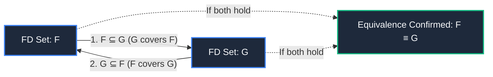
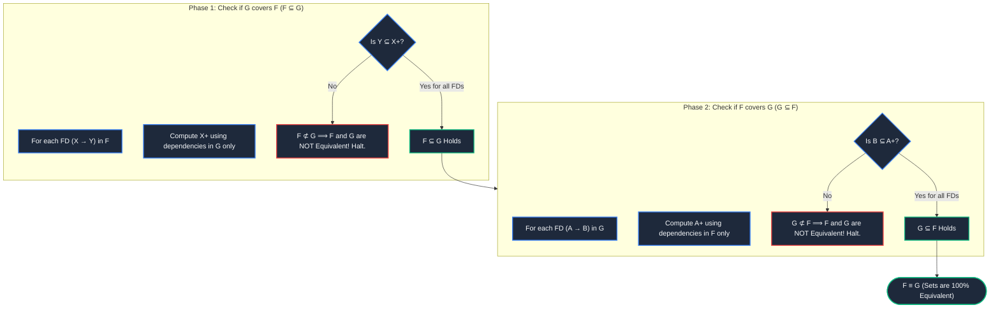
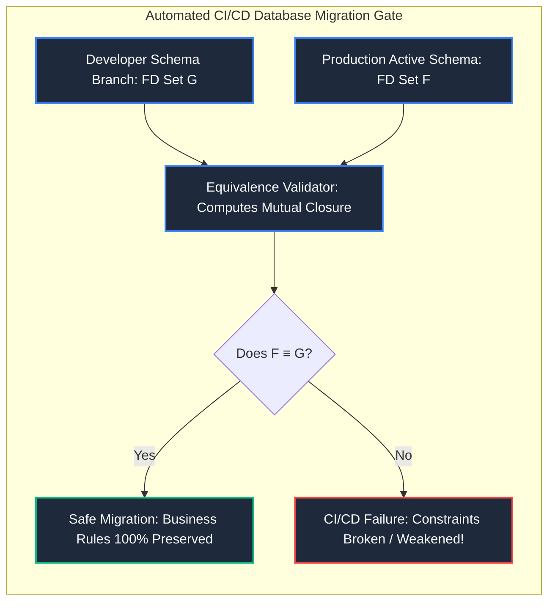

import CoreDoseLessonHeader from "@site/src/components/CoreDose/CoreDoseLessonHeader";
import CoreDoseTOC from "@site/src/components/CoreDose/CoreDoseTOC";
import CoreDoseNav from "@site/src/components/CoreDose/CoreDoseNav";

# 5.6 Equivalence of Functional Dependency Sets

<CoreDoseLessonHeader
  module="Module 05: Functional Dependencies (FDs)"
  topic="Topic 5.6"
  readTime="8 min read"
  relevance="University Semester Exams • Technical Interviews • Schema Verification & Refactoring"
/>

## 💡 Core Intuition

### 🍳 The Everyday Analogy: Two Different Translations of a Legal Contract
Imagine a legal agreement written in English and the same agreement translated into French:
* The sentence phrasing, grammar, and paragraph divisions look completely different.
* However, two contracts are **legally equivalent** if and only if:
  1. Every single right guaranteed by the English contract can be legally enforced under the French contract.
  2. Every single right guaranteed by the French contract can be legally enforced under the English contract.
* If either contract provides an extra loophole or misses a restriction, they are **not equivalent**.

### 💻 Bridging to Computer Science
In database design, two different database engineers or automated schema migration tools may express the business constraints of a table using completely different sets of functional dependencies ($F$ and $G$). We say $F$ and $G$ are **Equivalent ($F \equiv G$)** if both sets enforce the exact same logical constraints on data.

---

<CoreDoseTOC toc={toc} />

---

## 📚 Core Deep-Dive & Concepts

### 1. Formal Mathematical Definition of Equivalence

Two sets of functional dependencies $F$ and $G$ defined on a relation schema $R$ are **Equivalent** (denoted $F \equiv G$) if and only if their closures are strictly identical:
$$
F^+ = G^+
$$

Because calculating the full closures $F^+$ and $G^+$ is exponentially expensive ($O(2^n)$), we use the **Mutual Containment Theorem**:

$$
F \equiv G \iff (F \subseteq G) \land (G \subseteq F)
$$

#### What Does $F \subseteq G$ Mean Operationally?
* $F \subseteq G$ (read: *"G covers F"*): Every functional dependency $\alpha \to \beta \in F$ can be logically derived using the dependencies in $G$.
* $G \subseteq F$ (read: *"F covers G"*): Every functional dependency $\gamma \to \delta \in G$ can be logically derived using the dependencies in $F$.

---

### 2. The 2-Phase Verification Algorithm

---

### 3. Fully Solved Step-by-Step Numerical Problem

Consider two functional dependency sets $F$ and $G$ defined on relation schema $R(A, C, D, E, H)$:

| Set $F$ | Set $G$ |
| :--- | :--- |
| $A \to C$ | $A \to CD$ |
| $AC \to D$ | $E \to AH$ |
| $E \to AD$ | |
| $E \to H$ | |

**Goal**: Determine whether $F$ and $G$ are mathematically equivalent ($F \equiv G$).

---

#### Phase 1: Test if $F \subseteq G$ (Does $G$ cover $F$?)
We must prove that every dependency in $F$ can be derived using only the rules of $G$:

1. **Test $A \to C$ from $F$**:  
   Compute $A^+$ with respect to $G$:  
   $$A \to CD \in G \implies A^+ = \{A, C, D\}$$  
   Since $C \in A^+$, **$A \to C$ is satisfied by $G$**.

2. **Test $AC \to D$ from $F$**:  
   Compute $(AC)^+$ with respect to $G$:  
   $$A \to CD \in G \implies (AC)^+ = \{A, C, D\}$$  
   Since $D \in (AC)^+$, **$AC \to D$ is satisfied by $G$**.

3. **Test $E \to AD$ from $F$**:  
   Compute $E^+$ with respect to $G$:  
   $$E \to AH \in G \implies E^+ = \{E, A, H\}$$  
   $$A \to CD \in G \implies E^+ = \{E, A, H, C, D\}$$  
   Since $\{A, D\} \subseteq E^+$, **$E \to AD$ is satisfied by $G$**.

4. **Test $E \to H$ from $F$**:  
   From step 3, $H \in E^+$ under $G$.  
   Since $H \in E^+$, **$E \to H$ is satisfied by $G$**.

**Phase 1 Result**: Every functional dependency in $F$ is derivable from $G$.  
$$
\mathbf{F \subseteq G \quad \text{(Confirmed)}}
$$

---

#### Phase 2: Test if $G \subseteq F$ (Does $F$ cover $G$?)
We must prove that every dependency in $G$ can be derived using only the rules of $F$:

1. **Test $A \to CD$ from $G$**:  
   Compute $A^+$ with respect to $F$:  
   * $A^+ = \{A\}$
   * $A \to C \in F \implies \{A, C\}$
   * $AC \to D \in F \implies \{A, C, D\}$  
   $$A^+ = \{A, C, D\}$$  
   Since $\{C, D\} \subseteq A^+$, **$A \to CD$ is satisfied by $F$**.

2. **Test $E \to AH$ from $G$**:  
   Compute $E^+$ with respect to $F$:  
   * $E^+ = \{E\}$
   * $E \to AD \in F \implies \{E, A, D\}$
   * $E \to H \in F \implies \{E, A, D, H\}$  
   $$E^+ = \{E, A, D, H\}$$  
   Since $\{A, H\} \subseteq E^+$, **$E \to AH$ is satisfied by $F$**.

**Phase 2 Result**: Every functional dependency in $G$ is derivable from $F$.  
$$
\mathbf{G \subseteq F \quad \text{(Confirmed)}}
$$

---

#### Final Conclusion
Because $F \subseteq G$ and $G \subseteq F$:
$$
\mathbf{F \equiv G \quad \text{(The sets are 100\% Equivalent)}}
$$

---

## 📐 Architecture / Visual Blueprint

---

## 🏭 In The Real World: Production Case Study

### Automated Database Refactoring Gates at Stripe & Meta
When software teams maintain petabyte-scale data models across thousands of microservices:
* **The Risk**: A team rewrites their database ORM schema to simplify relationships, changing the underlying table constraints from set $F$ to set $G$.
* **The Disaster**: If $G$ cannot enforce all dependencies of $F$ ($F \not\subseteq G$), subtle data corruptions enter the ledger undetected.
* **The Automated Production CI/CD Gate**: Build pipelines run formal relational equivalence checkers. If a pull request modifies database constraints, the pipeline extracts the FDs, runs the 2-phase mutual containment algorithm, and automatically blocks the PR if $F^+ \neq G^+$, ensuring zero regression in enterprise business invariants.

---

## 🎯 Exam & Interview Pitfall Check

:::tip Core Conceptual Questions

**Question 1:** If $|F| = 4$ and $|G| = 2$, can $F$ and $G$ still be mathematically equivalent?  
**Answer:**  
**Yes!** The number of dependencies (cardinality of the set) has no bearing on equivalence. A set of 4 dependencies may contain redundant rules or split attributes (e.g. $A \to B, A \to C, B \to C, A \to D$), while $G$ might express the exact same semantics compactly in just 2 dependencies (e.g. $A \to BD, B \to C$). If their closures are identical, they are equivalent.

**Question 2:** If Phase 1 reveals that $F \subseteq G$, is it safe to immediately conclude that $F \equiv G$?  
**Answer:**  
**No!** $F \subseteq G$ only proves that $G$ can derive everything in $F$. It does not prove that $F$ can derive everything in $G$. $G$ might contain additional strict constraints that $F$ lacks (meaning $G$ is strictly more powerful than $F$). You **must** complete Phase 2 to verify that $G \subseteq F$.
:::

:::warning Common Interview Traps

**Trap 1: "To test F ⊆ G, do we compute closures under F or under G?"**  
**Answer:** Under **G**! To prove that $G$ covers $F$, you must test whether the rules of $G$ have the power to derive the dependencies of $F$. Hence, for each $X \to Y \in F$, you compute $X^+$ using the dependencies in $G$.

**Trap 2: "Can two sets of FDs have different Candidate Keys and still be equivalent?"**  
**Answer: Mathematically impossible.** Candidate keys are derived directly from the attribute closures of the relation schema. If $F \equiv G$, then for every attribute set $X$, its closure under $F$ ($X_F^+$) is identical to its closure under $G$ ($X_G^+$). Consequently, all candidate keys, superkeys, and prime attributes must be 100% identical.
:::

---

<CoreDoseNav
  prev={{
    title: "5.5 Minimal / Canonical Cover of Functional Dependencies",
    url: "/coredose/dbms/chapter-05/minimal-canonical-cover-of-functional-dependencies"
  }}
  next={{
    title: "6.1 Database Anomalies: Insertion, Deletion & Update Anomalies",
    url: "/coredose/dbms/chapter-06/database-anomalies-insertion-deletion-and-update"
  }}
  courseUrl="/coredose/dbms"
/>
