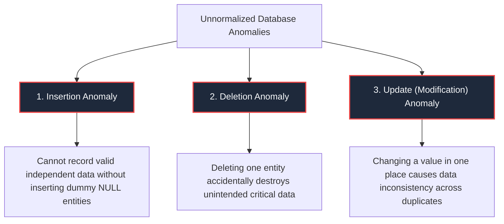
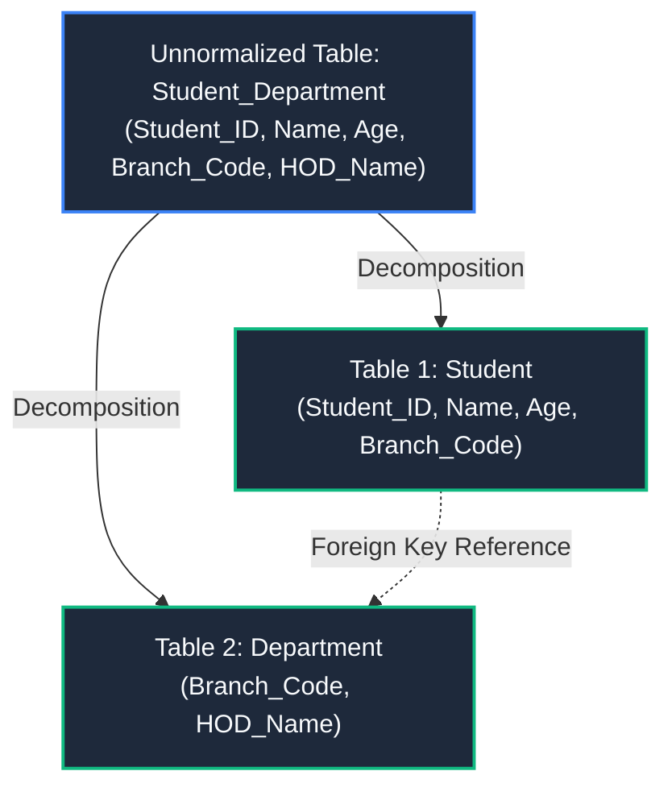
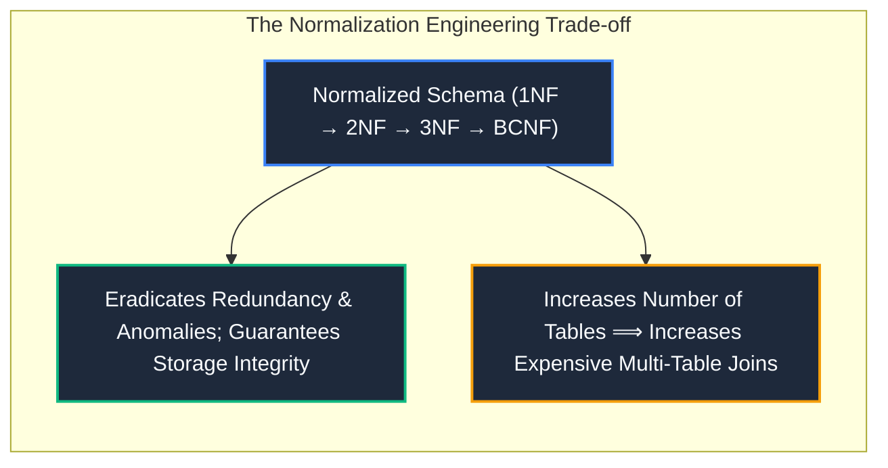

import CoreDoseLessonHeader from "@site/src/components/CoreDose/CoreDoseLessonHeader";
import CoreDoseTOC from "@site/src/components/CoreDose/CoreDoseTOC";
import CoreDoseNav from "@site/src/components/CoreDose/CoreDoseNav";

# 6.1 Database Anomalies: Insertion, Deletion & Update Anomalies

<CoreDoseLessonHeader
  module="Module 06: Database Normalization"
  topic="Topic 6.1"
  readTime="7 min read"
  relevance="University Semester Exams • Technical Interviews • Database Architecture Fundamentals"
/>

## 💡 Core Intuition

### 🍳 The Everyday Analogy: The Single-Paragraph Essay Rule
In good writing, a single paragraph should focus on a **single idea**. If an author bundles together their travel diary, a chocolate chip cookie recipe, and a chemistry theorem into one long paragraph, editing the recipe becomes a nightmare, deleting the travel notes accidentally destroys the chemistry theorem, and you cannot write down a new recipe without inventing a fake vacation!

A relational database table obeys the exact same rule:
> **The Single-Idea Law**: One relational table must contain information about **one single entity or concept**. When multiple concepts are mashed into an unnormalized table, you suffer from **Data Anomalies**.

### 💻 Bridging to Computer Science
**Database Normalization** is the formal mathematical process of decomposing an unnormalized relation schema into smaller, well-structured relations to eliminate **uncontrolled data redundancy**, eradicate **operational anomalies**, and preserve **data integrity**.

---

<CoreDoseTOC toc={toc} />

---

## 📚 Core Deep-Dive & Concepts

### 1. The Anatomy of an Unnormalized Table

Consider an unnormalized university database table storing student enrollments alongside department administration:

**Table `Student_Department_Unnormalized`**:
| Student_ID | Name | Age | Branch_Code | HOD_Name |
| :-: | :-: | :-: | :-: | :-: |
| 1 | Alice | 19 | 101-CS | Dr. Sharma |
| 2 | Bob | 18 | 101-CS | Dr. Sharma |
| 3 | Carl | 19 | 101-CS | Dr. Sharma |
| 4 | David | 20 | 102-EC | Dr. Verma |
| 5 | Emma | 22 | 102-EC | Dr. Verma |
| 6 | Frank | 21 | 103-ME | Dr. Gupta |

In this table:
* Primary Key: `Student_ID`
* Functional Dependencies:
  1. `Student_ID -> {Name, Age, Branch_Code}`
  2. `Branch_Code -> HOD_Name`

Notice that information about a department's HOD is repeatedly duplicated for every student belonging to that branch. This poor design triggers the **Three Classic Database Anomalies**:

---

### 2. The Three Classic Database Anomalies



---

#### A. Insertion Anomaly
**Definition**: The inability to insert valid information about an entity into the database without simultaneously inserting dummy, false, or `NULL` values for unrelated attributes.

**The Scenario**:  
The university founds a brand-new academic department: **"104-AI"** with **"Dr. Roy"** as the Head of Department. However, admissions have not opened yet, meaning zero students are currently enrolled.
* **The Failure**: Since `Student_ID` is the Primary Key of this unnormalized table, Entity Integrity strictly prohibits `NULL` (`Student_ID` cannot be `NULL`).
* **The Dilemma**: You **cannot insert** the new department into the database unless you create a fictitious "ghost student" (`Student_ID = -1, Name = 'Dummy'`)—corrupting analytical queries.

---

#### B. Deletion Anomaly
**Definition**: The unintended loss of critical domain data as a side-effect of deleting an unrelated entity from the relation.

**The Scenario**:  
Student **Frank** (`Student_ID = 6`) decides to drop out or graduate. Frank is currently the **only student** enrolled in the Mechanical Engineering department (`103-ME`).
* **The Action**: An administrator executes:
  ```sql
  DELETE FROM Student_Department_Unnormalized WHERE Student_ID = 6;
  ```
* **The Catastrophic Failure**: Because Frank's row is removed, the fact that `103-ME` exists and that `Dr. Gupta` is its HOD is **permanently erased from the entire database!** Institutional knowledge about a department is wiped out simply because a student left.

---

#### C. Update (Modification) Anomaly
**Definition**: Data inconsistency that occurs when an update to a redundant piece of information is applied to some tuples but not all, creating contradictory records.

**The Scenario**:  
The Computer Science department appoints a new HOD: **Dr. Rao** replaces **Dr. Sharma**.
* **The Failure**: If the database administrator runs an update that modifies the row for Alice, but fails or gets interrupted before updating Bob and Carl, the database enters an inconsistent corrupted state:
  * According to Alice's row, CS HOD is `Dr. Rao`.
  * According to Bob's row, CS HOD is `Dr. Sharma`.
* Querying the database now yields contradictory answers to the exact same question.

---

### 3. The Normalization Solution: Decomposition

The architectural solution to all three anomalies is **Schema Decomposition**: splitting the single unnormalized table into two focused tables, each dedicated to a single real-world concept:



#### Why Decomposition Eradicates All Three Anomalies
1. **Insertion Anomaly Solved**: We can insert `(104-AI, Dr. Roy)` directly into the `Department` table without needing any student records.
2. **Deletion Anomaly Solved**: Deleting student Frank from the `Student` table leaves the `103-ME` row in the `Department` table 100% intact.
3. **Update Anomaly Solved**: Changing the HOD for Computer Science requires modifying **exactly one row** in the `Department` table; inconsistencies are mathematically impossible.

---

## 📐 Architecture / Visual Blueprint



---

## 🏭 In The Real World: Production Case Study

### OLTP Normalization vs OLAP Denormalization in E-Commerce Platforms
In enterprise systems like Amazon:
* **The Transactional Engine (OLTP - PostgreSQL/Aurora)**:
  Order processing, checkout, and inventory databases are normalized up to **3NF / BCNF**. If a customer changes their shipping address, updating a single row in the `addresses` table guarantees that pending shipments receive the correct address with zero update anomalies.
* **The Analytical Warehouse (OLAP - Snowflake/Redshift)**:
  For business intelligence dashboards querying billions of orders, multi-table joins are slow. The data pipeline **intentionally denormalizes** the tables into wide dimensional star schemas (e.g. flattening customer, product, and category into a single massive `fact_sales` table). Read queries execute at blazing speed without joins, and write anomalies are prevented because analytical data is read-only (immutable event logs).

---

## 🎯 Exam & Interview Pitfall Check

:::tip Core Conceptual Questions

**Question 1:** Define the Insertion, Deletion, and Update anomalies in one sentence each.  
**Answer:**  
* **Insertion Anomaly**: Inability to record certain valid real-world data because unrelated attributes cannot accept NULL or are absent.
* **Deletion Anomaly**: Unintentional loss of desirable secondary information caused by deleting the primary record of an unrelated entity.
* **Update Anomaly**: Data inconsistency caused by updating redundant copies of the same fact in some tuples while leaving other tuples unchanged.

**Question 2:** What is the primary operational trade-off introduced by normalizing a database schema?  
**Answer:**  
Normalization splits tables into smaller relations to eradicate anomalies and redundancy. However, querying data that was previously available in a single table now requires executing **relational joins across multiple tables**, which increases CPU cycles and disk I/O for read-heavy operations.
:::

:::warning Common Interview Traps

**Trap 1: "Is data redundancy always bad in database systems?"**  
**Answer: No.** Uncontrolled redundancy in transactional (OLTP) write systems is dangerous because it causes anomalies. However, controlled redundancy (intentional denormalization) is widely used in analytical (OLAP) data warehouses and caching layers to accelerate read queries by avoiding expensive join operations.

**Trap 2: "Does decomposition always solve database problems?"**  
**Answer: Only if the decomposition is Lossless.** If a table is decomposed incorrectly on non-key attributes, reconstructing the original data via join generates "spurious tuples" (bogus data that never existed originally), resulting in irreversible information loss.
:::

---

<CoreDoseNav
  prev={{
    title: "5.6 Equivalence of Functional Dependency Sets",
    url: "/coredose/dbms/chapter-05/equivalence-of-functional-dependency-sets"
  }}
  next={{
    title: "6.2 First Normal Form (1NF) & Second Normal Form (2NF)",
    url: "/coredose/dbms/chapter-06/first-normal-form-1nf-and-second-normal-form-2nf"
  }}
  courseUrl="/coredose/dbms"
/>
