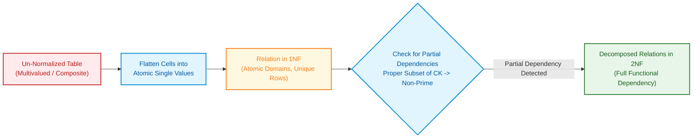

import CoreDoseLessonHeader from '@site/src/components/CoreDose/CoreDoseLessonHeader';
import CoreDoseTOC from '@site/src/components/CoreDose/CoreDoseTOC';
import CoreDoseNav from '@site/src/components/CoreDose/CoreDoseNav';

# First Normal Form (1NF) & Second Normal Form (2NF)

<CoreDoseLessonHeader />

## 💡 Core Intuition

### 🍳 The Everyday Analogy: The Overcrowded Backpack

Imagine packing for a multi-day trek. In a messy backpack, you shove multiple items into a single pouch—a pocket holds a water bottle, two protein bars, and a pocket knife simultaneously. Whenever you reach in to pull out just one protein bar, you accidentally dislodge the knife or spill water. This messy pocket represents a non-atomic cell violating **First Normal Form (1NF)**. To fix it, every pocket must hold exactly one specific item.

Now imagine you and your hiking partner share a dual-signed expedition gear register where your combined signature $(Partner_A, Partner_B)$ is required to check out equipment. However, the register also logs the home phone number of $Partner_A$ on every single row! Why should $Partner_A$'s home phone number depend on a dual checkout signature? It only depends on $Partner_A$ alone! This is a **Partial Dependency** violating **Second Normal Form (2NF)**. The solution is straightforward: split the register into an expedition checkout log and a separate personal contact ledger.

### 💻 Bridging to Computer Science

In relational database systems, normalization is the systematic mathematical process of decomposing tables to minimize uncontrolled data redundancy and prevent anomalies. 

Normalization relies fundamentally on two core tools:
1. **Functional Dependencies ($X \to Y$)**
2. **Candidate Keys ($CK$)**

```
1NF  >>>  2NF  >>>  3NF  >>>  BCNF
```

As normalization level increases, redundancy and anomalies diminish. However, because data is distributed across multiple decomposed tables, the number of joins required to reconstruct information increases—a classic architectural trade-off between write integrity and query latency.

---

<CoreDoseTOC toc={toc} />

---

## 📚 Core Deep-Dive & Concepts

### The Objectives of Normalization

Normalization achieves three primary engineering objectives:
1. **Eliminating uncontrolled redundancy** of stored data across disk blocks.
2. **Eliminating modification anomalies** (Insertion, Deletion, and Update anomalies).
3. **Ensuring functional dependencies** are structurally enforced by relational constraints.

Decomposition resolves poor schema designs by splitting a bloated relation into smaller, well-structured relations without losing data.

---

### First Normal Form (1NF): The Rule of Atomicity

**Definition:** A relation schema $R$ is in **First Normal Form (1NF)** if and only if every attribute in every tuple contains only a single, indivisible (atomic) value from its domain.

A relation cannot be in 1NF if any attribute contains:
- **Multivalued Attributes**: Storing sets or lists of values (e.g. `{9876543210, 9123456780}` in a single `Phone_Number` column).
- **Composite Attributes**: Attributes comprising sub-components (e.g. `Address` containing `Street, City, ZipCode` packed into one field).

> **Foundational ER-to-Relational Law:** Any relation produced directly from a properly designed Entity-Relationship (ER) model is **always in 1NF**, because multivalued attributes are mapped into separate tables and composite attributes are flattened into atomic components.

#### Additional Formal Implications of 1NF
- **Unique Rows**: Every row must be unique (enforced by a Primary Key).
- **Unique Column Names**: Every attribute column must possess a distinct name.
- **Order Invariance**: The physical order of rows and columns has no semantic meaning.

#### Violating 1NF vs. Resolving to 1NF

Consider an un-normalized employee skills table:

| Emp_ID | Emp_Name | Skills |
| :--- | :--- | :--- |
| $E101$ | Alice | Java, Python, Go |
| $E102$ | Bob | C++, Rust |

This violates 1NF because `Skills` contains non-atomic list values. Flattening into 1NF yields atomic cells:

| Emp_ID | Emp_Name | Skill |
| :--- | :--- | :--- |
| $E101$ | Alice | Java |
| $E101$ | Alice | Python |
| $E101$ | Alice | Go |
| $E102$ | Bob | C++ |
| $E102$ | Bob | Rust |

---

### Prime vs. Non-Prime Attributes

Before evaluating 2NF, attributes must be strictly partitioned based on candidate keys:

**Prime Attribute:** An attribute that is a member of **at least one** candidate key of the relation.

**Non-Prime Attribute:** An attribute that is **not part of any** candidate key of the relation.

#### Example Attribute Partitioning

Let relation $R(A, B, C, D)$ have candidate key $CK = \{AB\}$:
- Candidate Key: $AB$
- **Prime Attributes**: $\{A, B\}$
- **Non-Prime Attributes**: $\{C, D\}$

---

### Second Normal Form (2NF): Eliminating Partial Dependencies

**Definition:** A relation schema $R$ is in **Second Normal Form (2NF)** if and only if:
1. $R$ is already in **1NF**.
2. **No non-prime attribute is partially dependent** on any candidate key of $R$.

In other words, every non-prime attribute must be **fully functionally dependent** on every candidate key.

#### Partial Dependency vs. Total (Full) Functional Dependency

**Partial Dependency:** Occurs when a non-prime attribute is functionally determined by a **proper subset** of a candidate key:
$$\text{Proper Subset of Candidate Key} \to \text{Non-Prime Attribute}$$

**Total (Full) Dependency:** Occurs when a non-prime attribute is determined by the **entire** candidate key and cannot be determined by any proper subset:
$$\text{Full Candidate Key} \to \text{Non-Prime Attribute}$$

#### Detecting 2NF Violations

Let relation $R(A, B, C, D)$ have functional dependencies:
$$F = \{ AB \to D, \quad A \to C \}$$

1. Compute candidate keys:
   $$(AB)^+ = \{A, B, C, D\} \implies CK = \{AB\}$$
2. Classify attributes:
   - Prime attributes: $\{A, B\}$
   - Non-Prime attributes: $\{C, D\}$
3. Evaluate dependencies:
   - $AB \to D$: Left hand side is full candidate key $\{AB\}$. Non-prime $D$ is fully dependent. (Valid for 2NF)
   - $A \to C$: Left hand side is $A$, which is a proper subset of candidate key $\{AB\}$. Non-prime $C$ depends on partial key $A$. **(Violates 2NF!)**

Therefore, relation $R$ is in 1NF but **not in 2NF**.

---

### The Golden Rule of 2NF

> **The Single-Attribute Key Theorem:** If all candidate keys of a relation schema $R$ are **simple** (each candidate key consists of exactly one single attribute), then the relation $R$ is **guaranteed to be in 2NF**.

**Mathematical Proof:** A partial dependency requires a dependency of the form $X \to Y$ where $X$ is a *proper subset* of a candidate key $K$. If every candidate key $K$ has cardinality $|K| = 1$, the only proper subset of $K$ is the empty set $\emptyset$. Because no non-trivial functional dependency can stem from an empty attribute set, a partial dependency is mathematically impossible.

---

### Decomposing into 2NF: Step-by-Step Resolution

When a partial dependency exists, the solution is intuitive: **extract the partial dependency into its own independent relation**.

#### Problem Demonstration

Consider relation $R(A, B, C)$ with candidate key $CK = \{AB\}$ and dependency $B \to C$.

Sample instance with update anomalies and redundancy:

| A | B | C |
| :--- | :--- | :--- |
| $a_1$ | $1$ | $X$ |
| $b_1$ | $2$ | $Y$ |
| $a_2$ | $3$ | $Z$ |
| $c_1$ | $3$ | $Z$ |
| $d_1$ | $3$ | $Z$ |
| $e_1$ | $3$ | $Z$ |

Notice how value $Z$ is repeated four times alongside $B = 3$. If the mapping for $B = 3$ changes, multiple rows must be modified.

#### Stepwise Decomposition

Decompose $R(A, B, C)$ into two relations:
1. **$R_1(A, B)$**: Retains the original candidate key relationship.
2. **$R_2(B, C)$**: Isolates the partial dependency, promoting $B$ to candidate key in its own table.

Instance of $R_1(A, B)$:

| A | B |
| :--- | :--- |
| $a_1$ | $1$ |
| $b_1$ | $2$ |
| $a_2$ | $3$ |
| $c_1$ | $3$ |
| $d_1$ | $3$ |
| $e_1$ | $3$ |

Instance of $R_2(B, C)$:

| B | C |
| :--- | :--- |
| $1$ | $X$ |
| $2$ | $Y$ |
| $3$ | $Z$ |

Redundancy is completely eliminated: $Z$ is stored exactly once.

---

## 📐 Architecture / Visual Blueprint

The following diagram illustrates how an un-normalized schema with non-atomic attributes and partial dependencies is systematically transformed through 1NF and 2NF:



---

## 🏭 In The Real World: Production Case Study

### E-Commerce Order Fulfillment Architecture

In large-scale e-commerce platforms like Shopify or Amazon, order line items require strict normalization to avoid devastating billing anomalies.

#### The Flawed 1NF Order Items Table

An engineer creates a single table `Order_Line_Items`:
$$\text{Schema: } (\text{Order\_ID}, \text{Product\_ID}, \text{Quantity}, \text{Product\_Name}, \text{Supplier\_Address})$$

- Candidate Key: $(\text{Order\_ID}, \text{Product\_ID})$
- Prime Attributes: $\{\text{Order\_ID}, \text{Product\_ID}\}$
- Non-Prime Attributes: $\{\text{Quantity}, \text{Product\_Name}, \text{Supplier\_Address}\}$

Dependencies:
- $(\text{Order\_ID}, \text{Product\_ID}) \to \text{Quantity}$ (Full Dependency)
- $\text{Product\_ID} \to \text{Product\_Name}, \text{Supplier\_Address}$ (Partial Dependency!)

#### Production Consequence
Every time an order is placed for product `P-900`, the supplier's address is duplicated across gigabytes of transaction records. If a supplier changes warehouse locations, updating millions of historic order rows locks write transactions across active checkout nodes, degrading database throughput.

#### Production Solution
The schema is normalized to 2NF by decomposition:
1. `Order_Items` $(\underline{\text{Order\_ID}, \text{Product\_ID}}, \text{Quantity})$
2. `Products` $(\underline{\text{Product\_ID}}, \text{Product\_Name}, \text{Supplier\_Address})$

Supplier address updates now require a single $O(1)$ write in the `Products` table with zero locks on live order transactions.

---

## 🎯 Exam & Interview Pitfall Check

:::tip Core Conceptual Questions

**Question 1:** A relation $R(A, B, C, D, E)$ has functional dependencies $F = \{ AB \to C, \quad C \to D, \quad B \to E \}$. Determine whether $R$ is in 2NF. If not, state the dependency that violates 2NF.

**Answer:**
1. Compute the closure of attribute combinations to find candidate keys:
   $$(AB)^+ = \{A, B, C, D, E\} \implies CK = \{AB\}$$
   No other attribute combination without $A$ and $B$ can generate all attributes.
2. Prime attributes: $\{A, B\}$; Non-prime attributes: $\{C, D, E\}$.
3. Examine dependencies:
   - $AB \to C$: LHS is full candidate key $\{AB\}$.
   - $C \to D$: LHS is non-prime attribute $C$ (not a proper subset of candidate key).
   - $B \to E$: LHS is $\{B\}$, which is a proper subset of candidate key $\{AB\}$, and RHS is non-prime attribute $E$.
4. $B \to E$ is a **Partial Dependency**. Thus, relation $R$ is **not in 2NF**.

---

**Question 2:** Explain why every relation schema with a single-attribute candidate key is automatically in 2NF.

**Answer:**
By formal definition, a partial dependency exists if a non-prime attribute is functionally dependent on a proper subset of a candidate key. If the candidate key consists of a single attribute (cardinality 1), its only proper subset is the empty set $\emptyset$. Since a non-trivial functional dependency cannot have an empty left-hand side in a relational schema, partial dependencies cannot exist. Hence, any relation where all candidate keys are simple is unconditionally in 2NF.

:::

:::warning Common Interview Traps

**Trap 1: Assuming a relation is in 2NF because the primary key is a single attribute while other candidate keys are composite.**
If a relation has multiple candidate keys, a partial dependency can occur with respect to *any* candidate key. A relation is in 2NF if and only if no non-prime attribute is partially dependent on **any** candidate key of the relation.

**Trap 2: Confusing Non-Prime $\to$ Non-Prime dependencies with 2NF violations.**
In relation $R(A, B, C, D)$ with $CK = \{A\}$ and $B \to C$, candidates often incorrectly claim this violates 2NF. Since the key $A$ is simple, 2NF holds. A dependency between non-prime attributes ($B \to C$) is a **Transitive Dependency**, which violates **3NF**, not 2NF!

:::

---

<CoreDoseNav
  prev={{
    title: "Database Anomalies (Insertion, Deletion, Update)",
    url: "/coredose/dbms/chapter-06/database-anomalies-insertion-deletion-and-update"
  }}
  next={{
    title: "Third Normal Form (3NF) vs. BCNF",
    url: "/coredose/dbms/chapter-06/third-normal-form-3nf-vs-bcnf"
  }}
  courseUrl="/coredose/dbms"
/>
