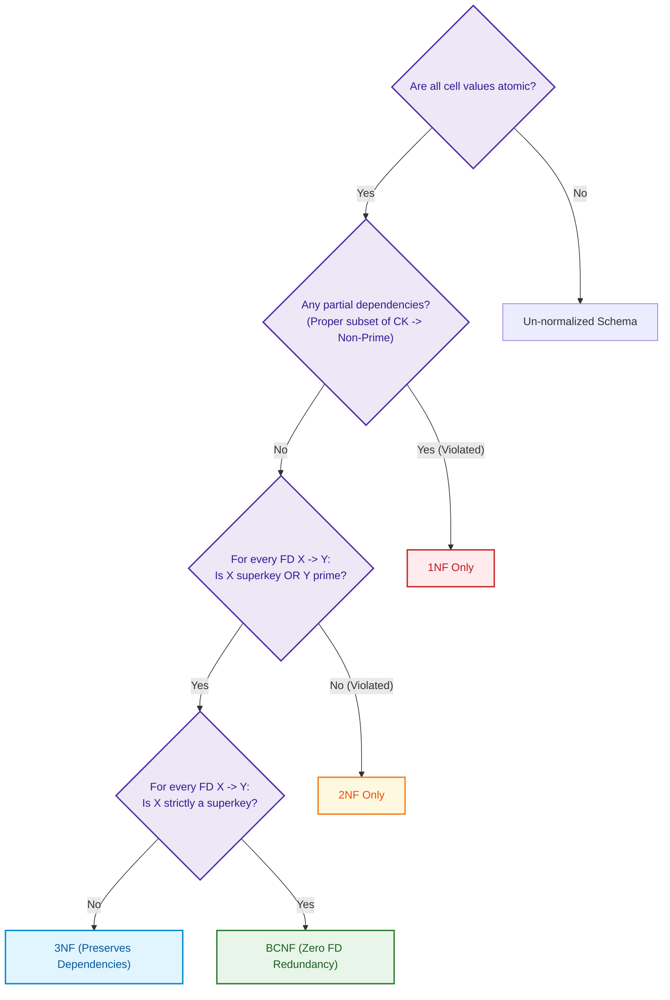

import CoreDoseLessonHeader from '@site/src/components/CoreDose/CoreDoseLessonHeader';
import CoreDoseTOC from '@site/src/components/CoreDose/CoreDoseTOC';
import CoreDoseNav from '@site/src/components/CoreDose/CoreDoseNav';

# Third Normal Form (3NF) vs. Boyce-Codd Normal Form (BCNF)

<CoreDoseLessonHeader />

## 💡 Core Intuition

### 🍳 The Everyday Analogy: The Corporate Chain of Command

Imagine a tech corporate directory where an Employee ID ($A$) determines your direct Manager ($B$), and your Manager ($B$) determines the Department Budget Code ($C$). 

In this structure, you have an indirect chain:
$$A \to B \quad \text{and} \quad B \to C \implies A \to C$$

If the company assigns $200$ employees to Manager Jane, Jane's department budget code is needlessly written $200$ times in the employee directory! If the budget code changes, updating all $200$ rows risks data inconsistency. The budget code ($C$) does not depend on the employee ($A$) directly; it depends on Jane ($B$). This is a **Transitive Dependency** violating **Third Normal Form (3NF)**.

Now, consider a specialized scenario: two senior engineers ($A$ and $B$) co-lead technical squads, while a squad code ($C$) determines the senior engineer in charge. When composite leadership keys overlap ($AB$ and $BC$), 3NF still allows subtle redundancies because non-key attributes are technically absent. To eradicate **every single functional redundancy**, a stricter standard is required: **Boyce-Codd Normal Form (BCNF)**, where every determinant must be a full superkey without exception.

### 💻 Bridging to Computer Science

Third Normal Form (3NF) and Boyce-Codd Normal Form (BCNF) represent the standard milestones in database engineering:

```
1NF  >>>  2NF  >>>  3NF  >>>  BCNF
```

While 2NF eliminated partial dependencies (dependencies on proper subsets of candidate keys), 3NF eliminates transitive dependencies between non-prime attributes. BCNF takes this to the mathematical limit: **any attribute that determines another attribute must be a superkey**.

---

<CoreDoseTOC toc={toc} />

---

## 📚 Core Deep-Dive & Concepts

### Third Normal Form (3NF)

**Definition (General Rule):** A relation schema $R$ is in **Third Normal Form (3NF)** if and only if:
1. $R$ is in **2NF**.
2. **No non-prime attribute is transitively dependent** on any candidate key of $R$.

Transitive dependency occurs when a non-prime attribute functionally determines another non-prime attribute:
$$\text{Candidate Key} \to \text{Non-Prime}_1 \to \text{Non-Prime}_2$$

#### The Universal Mathematical Condition for 3NF

A relation schema $R$ is in **3NF** if, for every non-trivial functional dependency $\alpha \to \beta$ holding on $R$, at least one of the following conditions holds:
1. $\alpha$ is a **Superkey** of $R$ ($\alpha \in SK$), **OR**
2. $\beta$ is a **Prime Attribute** ($\beta$ is a member of at least one Candidate Key).

> **Crucial 3NF Insight:** 3NF relaxes the strict superkey requirement by allowing $\alpha$ to NOT be a superkey, provided the determined attribute $\beta$ is a prime attribute!

#### Step-by-Step Transitive Dependency Elimination

Consider relation $R(A, B, C)$ where $A$ is the candidate key, with dependencies:
$$A \to B \quad \text{and} \quad B \to C$$

Here:
- Candidate Key: $A$
- Prime attribute: $\{A\}$
- Non-prime attributes: $\{B, C\}$
- In $B \to C$, $B$ is not a superkey, and $C$ is not a prime attribute. This is a **Transitive Dependency** violating 3NF!

Sample relation instance demonstrating data duplication:

| A (Emp_ID) | B (Dept_ID) | C (Dept_Head) |
| :--- | :--- | :--- |
| $a_1$ | $1$ | $P$ |
| $b_1$ | $2$ | $Q$ |
| $c_1$ | $2$ | $Q$ |
| $d_1$ | $2$ | $Q$ |
| $e_1$ | $3$ | $R$ |
| $f_1$ | $3$ | $R$ |
| $g_1$ | $4$ | $S$ |

Tuple values $(2, Q)$ and $(3, R)$ are duplicated across multiple employee rows.

**Decomposition to 3NF:**
Extract the transitive dependency into its own relation:
1. **$R_1(\underline{A}, B)$**: Maintains employee-to-department assignments.
2. **$R_2(\underline{B}, C)$**: Promotes $B$ to candidate key, storing department heads once.

---

### Boyce-Codd Normal Form (BCNF)

Boyce-Codd Normal Form was developed by Raymond F. Boyce and Edgar F. Codd to handle subtle redundancies that 3NF allows when relations have multiple overlapping composite candidate keys.

**Definition:** A relation schema $R$ is in **Boyce-Codd Normal Form (BCNF)** if and only if, for every non-trivial functional dependency $\alpha \to \beta$ holding on $R$:
$$\alpha \text{ must be a Superkey of } R$$

In BCNF, there is **no second condition**. The right-hand side being a prime attribute does not save a dependency from violating BCNF.

#### Hierarchy of Normal Forms

Every relation in BCNF is guaranteed to be in 3NF, 2NF, and 1NF:
$$\text{BCNF} \subset \text{3NF} \subset \text{2NF} \subset \text{1NF}$$

---

### Why 3NF is Inadequate: Overlapping Candidate Keys

A relation in 3NF may still exhibit undesirable data redundancy when:
- A non-trivial functional dependency has a prime attribute on the right-hand side.
- A non-trivial functional dependency involves only prime attributes.

This inadequacy occurs specifically when a relation possesses **multiple candidate keys that are composite and overlapping** (sharing one or more attributes).

#### Concrete Example: Student-Subject-Teacher

Consider relation $R(\text{Student}, \text{Subject}, \text{Teacher})$ with rules:
1. For each subject, each student is taught by only one teacher:
   $$(\text{Student}, \text{Subject}) \to \text{Teacher}$$
2. Each teacher teaches only one subject:
   $$\text{Teacher} \to \text{Subject}$$
3. A subject may have multiple teachers.

**Step 1: Determine Candidate Keys**
- Closure of $(\text{Student}, \text{Subject})$:
  $$(\text{Student}, \text{Subject})^+ = \{\text{Student}, \text{Subject}, \text{Teacher}\}$$
- Closure of $(\text{Student}, \text{Teacher})$:
  $$(\text{Student}, \text{Teacher})^+ = \{\text{Student}, \text{Teacher}, \text{Subject}\}$$

Candidate Keys:
$$CK_1 = \{\text{Student}, \text{Subject}\}, \quad CK_2 = \{\text{Student}, \text{Teacher}\}$$

**Step 2: Classify Attributes**
- Prime attributes: $\{\text{Student}, \text{Subject}, \text{Teacher}\}$ (All attributes are prime!)
- Non-prime attributes: $\emptyset$ (None!)

**Step 3: Test 3NF Condition**
- $(\text{Student}, \text{Subject}) \to \text{Teacher}$: LHS is a candidate key (superkey). **(Satisfies 3NF)**
- $\text{Teacher} \to \text{Subject}$: LHS ($\text{Teacher}$) is not a superkey. However, RHS ($\text{Subject}$) is a **Prime Attribute**! **(Satisfies 3NF)**

Because both dependencies pass, the relation is in **3NF**!

**Step 4: Redundancy in 3NF Instance**

| Student | Subject | Teacher |
| :--- | :--- | :--- |
| John | Physics | Prof. Maxwell |
| Alice | Physics | Prof. Maxwell |
| Bob | Physics | Prof. Maxwell |

Notice that the fact that `Prof. Maxwell` teaches `Physics` is redundantly recorded on every student's enrollment row. If Prof. Maxwell leaves, deleting John, Alice, and Bob deletes the information that Physics is taught by Prof. Maxwell!

**Step 5: Test BCNF Condition**
- $\text{Teacher} \to \text{Subject}$: $\text{Teacher}$ is **NOT a superkey**. 
- Therefore, $R$ is **NOT in BCNF**!

---

### The 7 Fundamental Theorems of Normalization

The following formal properties govern relational normalization analysis:

1. **Two-Attribute Theorem:**
   Any relation schema $R(A, B)$ with exactly two attributes is **unconditionally in BCNF**.

2. **All-Prime Attribute Theorem:**
   A relation schema $R$ consisting entirely of prime attributes is **always in 3NF**, but may or may not be in BCNF.

3. **Simple Candidate Key Theorem:**
   If a relation schema $R$ is in 3NF and all of its candidate keys are **simple** (single-attribute), then $R$ is **guaranteed to be in BCNF**.

4. **Trivial Dependency Theorem:**
   If a relation schema $R$ contains only trivial functional dependencies ($\alpha \to \beta$ where $\beta \subseteq \alpha$), then $R$ is **always in BCNF**.

5. **Functional Redundancy Elimination:**
   Reaching BCNF eliminates all data redundancy arising strictly from functional dependencies. (Redundancies arising from multivalued dependencies may still exist until 4NF).

6. **Preservation Trade-off Theorem:**
   In 3NF decomposition, a **lossless join** and **dependency preservation** are **always simultaneously achievable**.
   In BCNF decomposition, a **lossless join is always achievable**, but **dependency preservation cannot always be guaranteed**.

7. **Non-Uniqueness of Decomposition:**
   The decomposition of a relation into BCNF is not unique; different dependency choices during decomposition produce different valid BCNF schemas.

---

### 3NF vs. BCNF Summary Comparison

| Metric / Dimension | Third Normal Form (3NF) | Boyce-Codd Normal Form (BCNF) |
| :--- | :--- | :--- |
| **FD Condition ($\alpha \to \beta$)** | $\alpha \in SK$ **OR** $\beta \in \text{Prime}$ | $\alpha \in SK$ (Strictly Superkey) |
| **Transitive Dependencies** | Disallowed between non-prime attributes | Disallowed completely for any determinant |
| **All-Prime Relation** | Always guaranteed to be 3NF | Not guaranteed (needs superkey test) |
| **Overlapping Candidate Keys** | May exhibit anomalies and redundancy | Completely eliminates FD redundancy |
| **Dependency Preservation** | **Always achievable** | **Not always achievable** |
| **Lossless Join** | Always achievable | Always achievable |
| **Industry Practice** | Preferred default when preserving FDs is mandatory | Preferred when zero redundancy is paramount |

---

## 📐 Architecture / Visual Blueprint

The following Venn hierarchy illustrates the nesting of relational normal forms, accompanied by the decision flow used to classify a schema:



---

## 🏭 In The Real World: Production Case Study

### FinTech Currency Exchange Ledger: The BCNF vs. 3NF Dilemma

In global payment networks like Stripe or Wise, foreign exchange (FX) conversion desks pair currencies, quote rates, and assign market-maker desks.

#### The FX Relational Schema

Consider a high-frequency trading ledger table:
$$\text{FX\_Quotes}(\text{Base\_Currency}, \text{Quote\_Currency}, \text{Dealer\_Desk})$$

Business Rules:
1. Each currency pair $(\text{Base}, \text{Quote})$ is assigned to a specific dealer desk:
   $$(\text{Base\_Currency}, \text{Quote\_Currency}) \to \text{Dealer\_Desk}$$
2. Each dealer desk specializes in only one base currency:
   $$\text{Dealer\_Desk} \to \text{Base\_Currency}$$

#### Formal Analysis
- Candidate Keys:
  $$CK_1 = \{\text{Base\_Currency}, \text{Quote\_Currency}\}, \quad CK_2 = \{\text{Dealer\_Desk}, \text{Quote\_Currency}\}$$
- All attributes are prime: $\{\text{Base}, \text{Quote}, \text{Dealer}\}$.
- In $\text{Dealer\_Desk} \to \text{Base\_Currency}$:
  - $\text{Dealer\_Desk}$ is not a superkey.
  - $\text{Base\_Currency}$ is a prime attribute.
  - Hence, the table is in **3NF**, but **NOT in BCNF**.

#### The Architectural Decision
If the engineering team decomposes the table into BCNF:
1. $R_1(\underline{\text{Dealer\_Desk}}, \text{Base\_Currency})$
2. $R_2(\underline{\text{Dealer\_Desk}, \text{Quote\_Currency}})$

The original dependency $(\text{Base\_Currency}, \text{Quote\_Currency}) \to \text{Dealer\_Desk}$ **cannot be verified without performing a cross-table join query**!

In high-throughput financial transactions, requiring a join on every trade insertion to verify a business constraint adds prohibitive latency. Consequently, payment architectures frequently maintain **3NF**, accepting minor redundancy to preserve functional dependencies and enforce constraints in $O(1)$ single-table lookups.

---

## 🎯 Exam & Interview Pitfall Check

:::tip Core Conceptual Questions

**Question 1:** Relation $R(A, B, C, D)$ has functional dependencies:
$$F = \{ AB \to CD, \quad C \to A \}$$
Find all candidate keys, and determine whether $R$ is in 3NF and BCNF.

**Answer:**
1. Compute attribute closures:
   - $(AB)^+ = \{A, B, C, D\} \implies AB \text{ is a candidate key}$.
   - For $C \to A$, replace $A$ with $C$ in $AB$:
     $$(BC)^+ = \{B, C, A, D\} \implies BC \text{ is also a candidate key}$$
   - Candidate keys: $CK = \{AB, BC\}$.
2. Identify attribute types:
   - Prime attributes: $\{A, B, C\}$ (since $A, B \in AB$ and $C \in BC$).
   - Non-prime attributes: $\{D\}$.
3. Test 3NF for each dependency:
   - $AB \to CD$: $AB$ is a candidate key (superkey). (Valid for 3NF and BCNF)
   - $C \to A$: $C$ is not a superkey. But $A$ is a **Prime Attribute**. (Valid for 3NF, but violates BCNF)
4. Conclusion: $R$ is in **3NF**, but **not in BCNF**.

---

**Question 2:** Prove why any relation with only two attributes is always in BCNF.

**Answer:**
Let relation schema be $R(A, B)$.
The non-trivial functional dependencies possible on $R$ are:
1. $A \to B$: Here $(A)^+ = \{A, B\}$. Thus $A$ is a candidate key (superkey).
2. $B \to A$: Here $(B)^+ = \{A, B\}$. Thus $B$ is a candidate key (superkey).
3. Both $A \to B$ and $B \to A$: Both $A$ and $B$ are candidate keys (superkeys).
4. No non-trivial dependencies: The candidate key is $\{AB\}$. Since there are no non-trivial dependencies, no dependency exists to violate BCNF.

In every possible case, the left-hand side of every non-trivial functional dependency is a superkey. Hence, any binary relation is unconditionally in BCNF.

:::

:::warning Common Interview Traps

**Trap 1: Believing an all-prime relation is automatically in BCNF.**
Candidates often see that all attributes are prime and conclude the schema is in the highest normal form. An all-prime relation is **always in 3NF**, but if an overlapping dependency $\alpha \to \beta$ exists where $\alpha$ is a proper subset of a composite key, $\alpha$ is not a superkey, which violates BCNF!

**Trap 2: Claiming BCNF is always superior to 3NF in production.**
BCNF eliminates more redundancy than 3NF, but at the potential cost of losing functional dependencies. If an application must enforce an integrity rule across tables, loss of dependency preservation forces expensive application-layer locks or trigger-based joins. In practice, 3NF is often chosen over BCNF when dependency preservation is critical.

:::

---

<CoreDoseNav
  prev={{
    title: "First Normal Form (1NF) & Second Normal Form (2NF)",
    url: "/coredose/dbms/chapter-06/first-normal-form-1nf-and-second-normal-form-2nf"
  }}
  next={{
    title: "Lossless Join Decomposition Testing",
    url: "/coredose/dbms/chapter-06/lossless-join-decomposition-testing"
  }}
  courseUrl="/coredose/dbms"
/>
