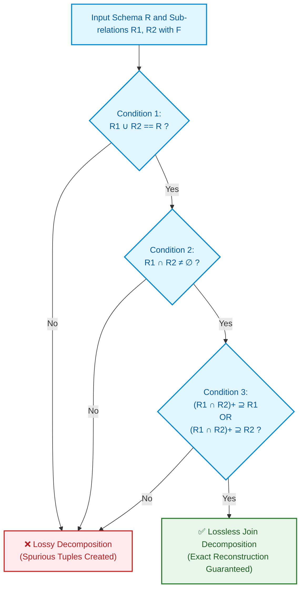

import CoreDoseLessonHeader from '@site/src/components/CoreDose/CoreDoseLessonHeader';
import CoreDoseTOC from '@site/src/components/CoreDose/CoreDoseTOC';
import CoreDoseNav from '@site/src/components/CoreDose/CoreDoseNav';

# Lossless Join Decomposition Testing

<CoreDoseLessonHeader />

## 💡 Core Intuition

### 🍳 The Everyday Analogy: Tearing and Re-assembling a Receipt

Imagine you tear a paper store receipt into two strips to store them in two different pockets. On the left strip, you have:
> `[Transaction #101, Customer: Alice]`

On the right strip, you have:
> `[Transaction #101, Item: Noise-Cancelling Headphones, Price: 300]`

Because both torn slips share the common transaction number `Transaction #101`, putting them back together side-by-side uniquely reconstructs the exact original purchase record without any doubt.

Now imagine tearing the receipt down the middle such that neither strip has a common identifier—or worse, the common field is a non-unique generic word like `Status: Paid`. If fifty different customers all had `Status: Paid`, aligning the two torn strips by `Status: Paid` produces thousands of false combinations, pairing Alice with items bought by Bob, Charlie, and Dave! In database theory, those false combinations are called **spurious tuples**, and the resulting decomposition is **lossy**. A decomposition is **lossless** if and only if natural joining the pieces guarantees the exact original relation—no missing rows, and zero spurious rows.

### 💻 Bridging to Computer Science

When decomposing a large, un-normalized table $R$ into smaller normalized tables $R_1, R_2, \dots, R_k$, the database must preserve the exact factual state of the data. 

```
Decomposition:  R  --->  { R1, R2 }
Reconstruction: R1 ⋈ R2  ===  R  (Lossless Join / Non-Additive Join)
```

Lossless join decomposition is **mandatory and non-negotiable** in relational database design. If a decomposition is lossy, the database generates fake data upon query execution, corrupting business logic.

---

<CoreDoseTOC toc={toc} />

---

## 📚 Core Deep-Dive & Concepts

### What is a Lossy vs. Lossless Decomposition?

Let relation schema $R$ be decomposed into two sub-schemas $R_1$ and $R_2$.

**Lossless (Non-Additive) Join Decomposition:** A decomposition is lossless if natural joining the projections of $R$ across $R_1$ and $R_2$ reproduces the exact original relation:
$$R_1 \bowtie R_2 = R$$

**Lossy Decomposition:** A decomposition is lossy if joining the decomposed tables produces a proper superset of the original relation:
$$R_1 \bowtie R_2 \supset R$$

> **The Paradox of "Lossy":** In everyday language, "loss" implies missing data. In database theory, a lossy join actually creates **spurious (phantom) tuples** ($R_1 \bowtie R_2 \supset R$). Information is lost because the system can no longer distinguish real facts from artificially fabricated join combinations!

#### Concrete Demonstration of Spurious Tuples

Consider instance $r$ of relation $R(A, B, C)$:

| A | B | C |
| :---: | :---: | :---: |
| $1$ | $a$ | $p$ |
| $2$ | $b$ | $q$ |
| $3$ | $a$ | $r$ |

Suppose an engineer improperly decomposes $R$ into:
- $R_1(A, B)$
- $R_2(B, C)$

Projections of the data:

$r_1 = \Pi_{A, B}(r)$:

| A | B |
| :---: | :---: |
| $1$ | $a$ |
| $2$ | $b$ |
| $3$ | $a$ |

$r_2 = \Pi_{B, C}(r)$:

| B | C |
| :---: | :---: |
| $a$ | $p$ |
| $b$ | $q$ |
| $a$ | $r$ |

Now compute the natural join $r_1 \bowtie r_2$ on common attribute $B$:

| A | B | C | Status |
| :---: | :---: | :---: | :---: |
| $1$ | $a$ | $p$ | Valid Original Tuple |
| $1$ | $a$ | $r$ | ⚠️ **Spurious Tuple** |
| $2$ | $b$ | $q$ | Valid Original Tuple |
| $3$ | $a$ | $p$ | ⚠️ **Spurious Tuple** |
| $3$ | $a$ | $r$ | Valid Original Tuple |

Notice that $(1, a, r)$ and $(3, a, p)$ never existed in the real world! Because $B$ was not a unique key in either sub-relation, multiple tuples with $B = a$ cross-multiplied. The decomposition is **lossy**.

---

### The Three Necessary & Sufficient Conditions for Lossless Join

For a decomposition of relation $R$ into two relations $R_1$ and $R_2$ with functional dependency set $F$, the decomposition is **guaranteed to be lossless** if and only if all three of the following conditions are satisfied:

#### Condition 1: Attribute Preservation
The union of attributes in $R_1$ and $R_2$ must equal the attribute set of the original relation $R$:
$$\text{Attr}(R_1) \cup \text{Attr}(R_2) = \text{Attr}(R)$$
*(No attributes are accidentally dropped during decomposition).*

#### Condition 2: Non-Disjoint Common Interface
The intersection of attributes in $R_1$ and $R_2$ must not be empty:
$$\text{Attr}(R_1) \cap \text{Attr}(R_2) \neq \emptyset$$
*(The sub-relations must share at least one attribute to serve as a join bridge).*

#### Condition 3: Common Key Property (The Crucial Test)
The common attribute set must functionally determine **at least one** of the decomposed relations completely. That is, the common attribute set must form a **Superkey** for $R_1$ OR a **Superkey** for $R_2$:
$$\left(\text{Attr}(R_1) \cap \text{Attr}(R_2)\right) \to \text{Attr}(R_1)$$
$$\text{OR}$$
$$\left(\text{Attr}(R_1) \cap \text{Attr}(R_2)\right) \to \text{Attr}(R_2)$$

Equivalently written:
$$(R_1 \cap R_2) \to (R_1 - R_2) \quad \text{OR} \quad (R_1 \cap R_2) \to (R_2 - R_1)$$

---

### Step-by-Step Lossless Verification Walkthroughs

#### Case 1: Valid Lossless Decomposition

Let relation $R(A, B, C, D)$ have functional dependencies:
$$F = \{ A \to B, \quad B \to C, \quad C \to D \}$$
Decompose into:
$$R_1(A, B, C) \quad \text{and} \quad R_2(C, D)$$

**Step 1:** Check Attribute Preservation:
$$R_1 \cup R_2 = \{A, B, C\} \cup \{C, D\} = \{A, B, C, D\} = R \quad \checkmark$$

**Step 2:** Check Non-Disjoint Intersection:
$$R_1 \cap R_2 = \{C\} \neq \emptyset \quad \checkmark$$

**Step 3:** Check Common Key Property:
Test if common attribute $\{C\}$ is a superkey for $R_1$ or $R_2$:
- Compute attribute closure of $\{C\}$ under $F$:
  $$(C)^+ = \{C, D\}$$
- Does $(C)^+$ cover $R_2(C, D)$?
  $$\{C, D\} \supseteq \text{Attr}(R_2) \implies C \to R_2 \quad \checkmark$$

Because the common attribute $C$ is a superkey of $R_2$, the decomposition is **Lossless**!

---

#### Case 2: Invalid (Lossy) Decomposition

Let relation $R(A, B, C, D)$ have functional dependencies:
$$F = \{ A \to B, \quad C \to D \}$$
Decompose into:
$$R_1(A, B, C) \quad \text{and} \quad R_2(B, C, D)$$

**Step 1:** $R_1 \cup R_2 = \{A, B, C, D\} = R \quad \checkmark$
**Step 2:** $R_1 \cap R_2 = \{B, C\} \neq \emptyset \quad \checkmark$
**Step 3:** Compute closure of common attributes $\{B, C\}$:
$$(BC)^+ = \{B, C, D\}$$
- Does $(BC)^+$ contain all attributes of $R_1(A, B, C)$?
  $$\{B, C, D\} \not\supseteq \{A, B, C\} \quad (\text{Missing } A)$$
- Does $(BC)^+$ contain all attributes of $R_2(B, C, D)$?
  Wait, $(BC)^+ = \{B, C, D\}$ contains all attributes of $R_2$! In this specific case, $BC \to D$, making $BC$ a superkey of $R_2$.

Now consider decomposition:
$$R_1(A, B) \quad \text{and} \quad R_2(C, D)$$
- $R_1 \cap R_2 = \emptyset$. Condition 2 fails immediately. Cartesian product join causes catastrophic loss of data relationships.

---

### The Chase Algorithm (Tableau Method for $k \ge 3$ Relations)

When a relation $R$ is decomposed into $k > 2$ sub-relations $(R_1, R_2, \dots, R_k)$, binary intersection testing is insufficient. The standard relational proof is the **Chase Algorithm (Tableau Method)**:

1. Construct a table with rows corresponding to sub-relations $R_i$ and columns corresponding to all attributes $A_j \in R$.
2. For row $i$ and attribute $A_j$:
   - If $A_j \in R_i$, enter symbol $a_j$ (representing distinguishable original attribute value).
   - If $A_j \notin R_i$, enter symbol $b_{ij}$ (representing unassigned placeholder).
3. Repeatedly apply each functional dependency $X \to Y$ in $F$:
   - If two rows agree on all attributes in $X$, equate their symbols in columns of $Y$. (If one row has $a_j$ and another has $b_{kj}$, replace $b_{kj}$ with $a_j$).
4. **Termination Condition:** If any row becomes entirely populated with $a$ symbols $(a_1, a_2, \dots, a_n)$, the decomposition is **Lossless**. If no more changes are possible and no row contains all $a$'s, the decomposition is **Lossy**.

---

## 📐 Architecture / Visual Blueprint

The following decision architecture shows how the relational engine verifies whether a decomposition is lossless:



---

## 🏭 In The Real World: Production Case Study

### Distributed Microservice Sharding in Banking (Ledger vs. Accounts)

A core banking backend at a financial institution holds user deposit records. During an internal refactoring, a data engineering team splits the historic ledger table:
$$\text{Transactions}(\text{Txn\_ID}, \text{Account\_ID}, \text{Timestamp}, \text{Amount}, \text{Merchant\_ID})$$

An inexperienced engineer decomposes the table into two microservice persistence stores:
1. `Billing_Service`: $(\text{Timestamp}, \text{Amount}, \text{Merchant\_ID})$
2. `Account_Service`: $(\text{Account\_ID}, \text{Timestamp})$

#### The Disaster
The common attribute between both services is strictly `Timestamp`.
- Is $\text{Timestamp}$ a superkey for `Billing_Service`? No, hundreds of transactions execute at the exact same millisecond timestamp.
- Is $\text{Timestamp}$ a superkey for `Account_Service`? No, thousands of accounts transact simultaneously.

When the audit team attempted to reconcile ledger records at month-end by joining both stores on `Timestamp`, the query engine produced tens of millions of **spurious cross-account transactions**! Customers appeared to have spent money at merchants they had never visited.

#### The Fix
The table was re-decomposed using the primary candidate key $\text{Txn\_ID}$:
1. `Billing_Service`: $(\underline{\text{Txn\_ID}}, \text{Merchant\_ID}, \text{Amount})$
2. `Account_Service`: $(\underline{\text{Txn\_ID}}, \text{Account\_ID}, \text{Timestamp})$

Since $\text{Txn\_ID}$ is a candidate key in both tables, $(\text{Billing} \cap \text{Account}) \to \text{Billing}$ held true, restoring 100% lossless deterministic joins.

---

## 🎯 Exam & Interview Pitfall Check

:::tip Core Conceptual Questions

**Question 1:** Relation $R(A, B, C, D, E)$ with functional dependencies:
$$F = \{ A \to BC, \quad CD \to E, \quad B \to D, \quad E \to A \}$$
is decomposed into:
$$R_1(A, B, C) \quad \text{and} \quad R_2(A, D, E)$$
Determine whether the decomposition is lossless or lossy.

**Answer:**
1. Check Condition 1:
   $$R_1 \cup R_2 = \{A, B, C\} \cup \{A, D, E\} = \{A, B, C, D, E\} = R \quad \checkmark$$
2. Check Condition 2:
   $$R_1 \cap R_2 = \{A\} \neq \emptyset \quad \checkmark$$
3. Check Condition 3:
   Compute attribute closure of common attribute $\{A\}$ under $F$:
   - $A^+ = \{A\}$
   - Since $A \to BC$, $A^+ = \{A, B, C\}$
   - Since $B \to D$, $A^+ = \{A, B, C, D\}$
   - Since $CD \to E$, $A^+ = \{A, B, C, D, E\}$
4. Compare $(A)^+$ to sub-relation schemas:
   $$(A)^+ \supseteq \text{Attr}(R_1) \quad \text{and} \quad (A)^+ \supseteq \text{Attr}(R_2)$$
   In fact, $A$ is a superkey for both $R_1$ and $R_2$.
5. Therefore, the decomposition is **Lossless**.

---

**Question 2:** Why does a lossy decomposition always result in $R_1 \bowtie R_2 \supset R$ (superset) and never $R_1 \bowtie R_2 \subset R$ (subset)?

**Answer:**
Because $R_1 = \Pi_{R_1}(R)$ and $R_2 = \Pi_{R_2}(R)$, every original tuple $t \in R$ contributes projection fragments $t[R_1] \in R_1$ and $t[R_2] \in R_2$. When $R_1$ and $R_2$ are natural joined on their common attributes $R_1 \cap R_2$, the fragments $t[R_1]$ and $t[R_2]$ necessarily agree on their common attributes (since they originated from the same tuple $t$), thereby recreating $t$ in the join output. Consequently, every original tuple is guaranteed to reappear: $R \subseteq R_1 \bowtie R_2$. If spurious tuples are created due to non-unique matches on common attributes, additional tuples appear, making $R_1 \bowtie R_2 \supset R$. It is mathematically impossible for the natural join to produce fewer tuples than $R$.

:::

:::warning Common Interview Traps

**Trap 1: Assuming that attribute preservation ($R_1 \cup R_2 = R$) is sufficient for lossless join.**
Many engineers believe that as long as no columns are lost, the decomposition is lossless. Attribute preservation is merely Condition 1. Without the common key property (Condition 3), joining produces Cartesian products and spurious rows.

**Trap 2: Checking whether $(R_1 \cap R_2)$ is a key in the original relation $R$ instead of $R_1$ or $R_2$.**
The common attribute $(R_1 \cap R_2)$ does not need to be a candidate key of the bloated parent table $R$. It only needs to functionally determine all attributes of **at least one of the decomposed tables** ($R_1$ or $R_2$).

:::

---

<CoreDoseNav
  prev={{
    title: "Third Normal Form (3NF) vs. BCNF",
    url: "/coredose/dbms/chapter-06/third-normal-form-3nf-vs-bcnf"
  }}
  next={{
    title: "Dependency Preserving Decomposition",
    url: "/coredose/dbms/chapter-06/dependency-preserving-decomposition"
  }}
  courseUrl="/coredose/dbms"
/>
