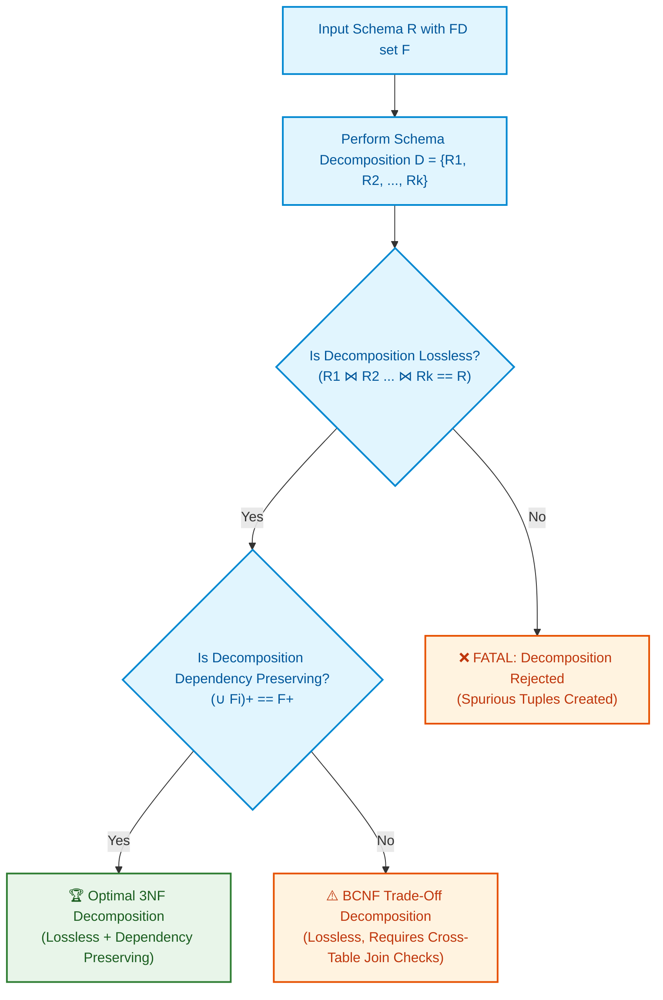

import CoreDoseLessonHeader from '@site/src/components/CoreDose/CoreDoseLessonHeader';
import CoreDoseTOC from '@site/src/components/CoreDose/CoreDoseTOC';
import CoreDoseNav from '@site/src/components/CoreDose/CoreDoseNav';

# Dependency Preserving Decomposition

<CoreDoseLessonHeader />

## 💡 Core Intuition

### 🍳 The Everyday Analogy: The Split Contract and Cross-Town Verification

Imagine a business contract between three parties: Supplier ($A$), Logistics ($B$), and Retailer ($C$). The contract holds two foundational legal rules:
1. Whenever Supplier $A$ delivers goods, Logistics $B$ must assign a transit vehicle ($A \to B$).
2. Whenever Logistics $B$ assigns a vehicle, Retailer $C$ must reserve warehouse bay space ($B \to C$).

From these two rules, you can logically infer a third guarantee: whenever Supplier $A$ delivers, warehouse space is eventually reserved ($A \to C$).

Now suppose the business archives these records by splitting paperwork into two branch offices:
- Branch 1 holds records of $(A, B)$ and enforces Rule 1 ($A \to B$).
- Branch 2 holds records of $(B, C)$ and enforces Rule 2 ($B \to C$).

Can the business enforce all original contract rules? Yes! Whenever a delivery occurs at Branch 1, it checks $A \to B$ locally. When Branch 2 receives the handover, it checks $B \to C$ locally. The overarching guarantee ($A \to C$) is satisfied automatically through the chain without anyone having to travel across town to cross-examine both offices simultaneously. This is **Dependency Preservation**.

If a decomposition forces you to run across town (execute expensive cross-table joins) just to verify that a simple rule has not been broken, the decomposition has **failed to preserve dependencies**.

### 💻 Bridging to Computer Science

In database decomposition, **Lossless Join** ensures that data is not fabricated or corrupted. **Dependency Preservation** ensures that integrity constraints can be enforced cheaply and locally.

```
Original Schema R with FD set F
Decomposed into: { R1 with F1,  R2 with F2,  ...,  Rk with Fk }
Dependency Preserved iff:  (F1 ∪ F2 ∪ ... ∪ Fk)+  ===  F+
```

While lossless join is **strictly mandatory** in database architecture, dependency preservation is **desirable but optional**. A schema decomposition that does not preserve dependencies can still be deployed, but enforcing cross-relation rules requires expensive application-level checks or cross-table join triggers.

---

<CoreDoseTOC toc={toc} />

---

## 📚 Core Deep-Dive & Concepts

### Formal Definition of Dependency Preservation

Let relation schema $R$ with functional dependency set $F$ be decomposed into sub-relations $D = \{R_1, R_2, \dots, R_k\}$.

For each sub-relation $R_i$, its **projected functional dependency set** $F_i$ is the set of all dependencies $X \to Y \in F^+$ such that all attributes in $X \cup Y$ belong exclusively to $R_i$:
$$F_i = \Pi_{R_i}(F) = \{ X \to Y \in F^+ \mid (X \cup Y) \subseteq R_i \}$$

The decomposition $D$ is **Dependency Preserving** if and only if the closure of the union of all projected dependencies is identical to the closure of the original dependency set:
$$(F_1 \cup F_2 \cup \dots \cup F_k)^+ = F^+$$

In practical terms, this means every single dependency $X \to Y \in F$ must be either:
1. **Directly covered:** Entirely contained within the attribute set of at least one single decomposed sub-relation $R_i$ ($X \cup Y \subseteq R_i$), **OR**
2. **Derivable (Inferred):** Logically deducible from the projected dependencies of the sub-relations using Armstrong's Axioms.

---

### Why Dependency Preservation Matters

The primary purpose of dependency preservation is **runtime performance and constraint enforcement**:

- **Local Constraint Enforcement:** When an application executes an `INSERT` or `UPDATE` on sub-relation $R_i$, the database engine can verify all applicable functional dependencies using local indexes on $R_i$ in $O(1)$ or $O(\log n)$ time.
- **Zero Inter-Relational Joins:** If a dependency $X \to Y$ is NOT preserved, verifying whether a new row violates $X \to Y$ requires executing a natural join across multiple tables ($R_1 \bowtie R_2$) before every write operation—a prohibitive performance bottleneck.

---

### Step-by-Step Dependency Preservation Testing Algorithm

Computing the full exponential closure $F^+$ and projecting it onto every $R_i$ is computationally expensive ($O(2^n)$). In relational engineering, we use an efficient **polynomial-time testing algorithm**:

To test whether a specific functional dependency $X \to Y \in F$ is preserved across decomposition $\{R_1, R_2, \dots, R_k\}$:

1. Initialize result attribute set:
   $$Z = X$$
2. Repeat until $Z$ no longer changes:
   - For each sub-relation $R_i$:
     - Compute the intersection of current set $Z$ with $R_i$:
       $$I = Z \cap R_i$$
     - Compute the attribute closure of $I$ under the original dependency set $F$:
       $$I^+$$
     - Intersect this closure back with $R_i$:
       $$C_i = I^+ \cap R_i$$
     - Add these newly derived attributes to $Z$:
       $$Z = Z \cup C_i$$
3. If $Y \subseteq Z$, then the functional dependency $X \to Y$ is **preserved**.
4. Repeat this check for every dependency in $F$. If all dependencies in $F$ are preserved, the entire decomposition is **Dependency Preserving**.

---

### Comprehensive Mathematical Examples

#### Example 1: Full Dependency Preservation

Consider relation $R(A, B, C)$ with functional dependencies:
$$F = \{ A \to B, \quad B \to C, \quad C \to A \}$$

Decompose into:
$$R_1(A, B) \quad \text{and} \quad R_2(B, C)$$

Let us determine the projected dependencies:
1. **For $R_1(A, B)$:**
   - $A \to B$ is directly present in $R_1$.
   - Does $B \to A$ hold? 
     Compute $(B)^+$ under $F$: $(B)^+ = \{B, C, A\}$. 
     Since $A \in (B)^+$, $B \to A$ holds in $F^+$, and both $B, A \in R_1$.
     Therefore, $F_1 = \{ A \to B, \quad B \to A \}$.

2. **For $R_2(B, C)$:**
   - $B \to C$ is directly present in $R_2$.
   - Does $C \to B$ hold? 
     Compute $(C)^+$ under $F$: $(C)^+ = \{C, A, B\}$. 
     Since $B \in (C)^+$, $C \to B$ holds in $F^+$, and both $C, B \in R_2$.
     Therefore, $F_2 = \{ B \to C, \quad C \to B \}$.

3. **Check Original Dependencies under $F' = F_1 \cup F_2$:**
   - $A \to B$: Directly in $F_1$. $\checkmark$
   - $B \to C$: Directly in $F_2$. $\checkmark$
   - $C \to A$: In $F'$, we have $C \to B$ (from $F_2$) and $B \to A$ (from $F_1$). By transitivity:
     $$C \to B \quad \text{and} \quad B \to A \implies C \to A \quad \checkmark$$

All original functional dependencies are fully derived. The decomposition is **Dependency Preserving**!

---

#### Example 2: Non-Preserving BCNF Decomposition

Consider relation $R(A, B, C)$ with:
$$F = \{ AB \to C, \quad C \to B \}$$

Candidate keys:
$$(AB)^+ = \{A, B, C\} \implies CK_1 = \{AB\}$$
$$(AC)^+ = \{A, C, B\} \implies CK_2 = \{AC\}$$

In $C \to B$, $C$ is not a superkey, which violates BCNF. To convert to BCNF, decompose along $C \to B$:
$$R_1(B, C) \quad \text{and} \quad R_2(A, C)$$

1. **For $R_1(B, C)$:**
   - Projected FD: $F_1 = \{ C \to B \}$.
2. **For $R_2(A, C)$:**
   - Projected FDs: Only trivial FDs hold ($F_2 = \emptyset$).
3. **Check Original Dependency $AB \to C$ under $F' = F_1 \cup F_2 = \{ C \to B \}$:**
   - Compute closure of $AB$ under $F'$:
     $$(AB)_{F'}^+ = \{A, B\}$$
   - Attribute $C$ cannot be derived! 
   - $C \notin (AB)_{F'}^+ \implies AB \to C$ is **LOST**.

This decomposition is **Lossless** (since $R_1 \cap R_2 = \{C\}$ and $C \to B$ makes $C$ a key of $R_1$), but it is **NOT Dependency Preserving**.

---

### Core Structural Theorems of Normalization & Dependencies

The following foundational theorems govern normal form transformations:

1. **The 3NF Dual Guarantee:**
   For any relation schema $R$ and functional dependency set $F$, there **always exists a decomposition** into 3NF that is **simultaneously Lossless and Dependency Preserving**.

2. **The BCNF Trade-Off:**
   For any relation schema $R$ and functional dependency set $F$, there **always exists a Lossless decomposition into BCNF**, but dependency preservation **cannot always be guaranteed**.

3. **Composite Key Constraint in BCNF vs. 4NF:**
   A relation schema $R$ will **necessarily possess a composite candidate key** if $R$ is in BCNF but violates 4NF.

4. **Simple Key Progression Theorems:**
   - If relation $R$ is in 3NF and every candidate key of $R$ is **simple** (single-attribute), then $R$ is **guaranteed to be in BCNF**.
   - If relation $R$ is in BCNF and has **at least one simple candidate key**, then $R$ is **guaranteed to be in 4NF**.
   - If relation $R$ is in 3NF and every candidate key is simple, then $R$ is **guaranteed to be in 5NF**.

---

## 📐 Architecture / Visual Blueprint

The following flow represents the structural trade-off between Lossless Join and Dependency Preservation during normalization decomposition:



---

## 🏭 In The Real World: Production Case Study

### Distributed Microservice Architecture: Preserving FDs Across Databases

A multi-tenant SaaS healthcare platform handles doctor appointments across clinics.

#### The Unified Medical Schema
$$\text{Appointments}(\text{Patient\_ID}, \text{Clinic\_ID}, \text{Doctor\_ID}, \text{Slot\_Time})$$

Business Rules:
1. A patient cannot be in two different clinics at the same slot time:
   $$(\text{Patient\_ID}, \text{Slot\_Time}) \to \text{Clinic\_ID}$$
2. A doctor belongs to a single primary clinic:
   $$\text{Doctor\_ID} \to \text{Clinic\_ID}$$

#### The Distributed Refactoring Trap
The engineering team separates scheduling from provider management:
- `Doctor_Service_DB`: $(\underline{\text{Doctor\_ID}}, \text{Clinic\_ID})$
- `Booking_Service_DB`: $(\underline{\text{Patient\_ID}, \text{Doctor\_ID}, \text{Slot\_Time}})$

Notice that the dependency $(\text{Patient\_ID}, \text{Slot\_Time}) \to \text{Clinic\_ID}$ is **lost** across the service boundary!

#### The Consequence
When Patient `#404` books an appointment with Doctor Alpha at 10:00 AM in Clinic East, and simultaneously books an appointment with Doctor Beta at 10:00 AM in Clinic West, `Booking_Service_DB` accepts both bookings because each booking involves a different doctor. 

To prevent this double-booking, the application is forced to implement a two-phase distributed commit protocol (2PC) or an event-driven saga join query across network microservices on every booking attempt, increasing latency from $5\text{ ms}$ to $220\text{ ms}$.

Maintaining a schema that preserved the dependency would have allowed the database to enforce the rule locally using a composite unique index in $O(\log n)$ time.

---

## 🎯 Exam & Interview Pitfall Check

:::tip Core Conceptual Questions

**Question 1:** Relation $R(A, B, C, D)$ with functional dependencies:
$$F = \{ A \to B, \quad B \to C, \quad C \to D, \quad D \to A \}$$
is decomposed into $R_1(A, B)$, $R_2(B, C)$, and $R_3(C, D)$. Determine whether this decomposition is dependency preserving.

**Answer:**
1. Determine projected dependencies:
   - For $R_1(A, B)$: $A \to B \in F_1$.
   - For $R_2(B, C)$: $B \to C \in F_2$.
   - For $R_3(C, D)$: $C \to D \in F_3$.
2. Check the remaining original dependency $D \to A$:
   From the union $F' = F_1 \cup F_2 \cup F_3 = \{ A \to B, \quad B \to C, \quad C \to D \}$:
   - Compute closure of $D$ under $F'$:
     $$(D)_{F'}^+ = \{D\}$$
   - Attribute $A$ cannot be reached because no dependency in $F'$ has $D$ on the left-hand side!
3. Therefore, $D \to A$ cannot be derived from the projected dependencies.
4. The decomposition is **NOT Dependency Preserving**.

---

**Question 2:** Explain the operational distinction between a decomposition being Lossless versus being Dependency Preserving.

**Answer:**
- **Lossless Join** is a **structural data integrity property**. It guarantees that the natural join of decomposed relations reconstructs the exact original relation without missing rows and without generating spurious tuples. Violating lossless join results in data corruption upon querying.
- **Dependency Preservation** is an **operational performance property**. It guarantees that all functional dependencies can be verified on individual decomposed relations without performing joins across multiple tables. Violating dependency preservation does not cause data loss, but forces the system to perform costly cross-table joins during write transactions to enforce business rules.

:::

:::warning Common Interview Traps

**Trap 1: Believing that a dependency is preserved only if its exact left and right hand attributes exist in the same sub-relation.**
A dependency $X \to Y$ is preserved even if it does not appear directly in any single sub-relation, provided it can be logically deduced (via transitive closure) from the union of projected dependencies across the sub-relations.

**Trap 2: Assuming that BCNF decomposition is always preferred over 3NF.**
In production database design, if a BCNF decomposition sacrifices a critical functional dependency, 3NF is frequently preferred. 3NF guarantees both lossless join and complete dependency preservation, avoiding distributed validation joins on every write.

:::

---

<CoreDoseNav
  prev={{
    title: "Lossless Join Decomposition Testing",
    url: "/coredose/dbms/chapter-06/lossless-join-decomposition-testing"
  }}
  next={{
    title: "Multivalued Dependencies (4NF) & Join Dependencies (5NF)",
    url: "/coredose/dbms/chapter-06/multivalued-dependencies-4nf-and-join-dependencies-5nf"
  }}
  courseUrl="/coredose/dbms"
/>
