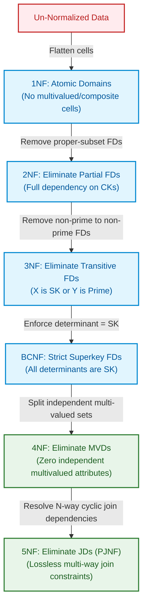

import CoreDoseLessonHeader from '@site/src/components/CoreDose/CoreDoseLessonHeader';
import CoreDoseTOC from '@site/src/components/CoreDose/CoreDoseTOC';
import CoreDoseNav from '@site/src/components/CoreDose/CoreDoseNav';

# Multivalued Dependencies (4NF) & Join Dependencies (5NF)

<CoreDoseLessonHeader />

## 💡 Core Intuition

### 🍳 The Everyday Analogy: The Multi-Hobby Resume Dilemma

Imagine drafting an applicant profile where you list two completely independent multi-valued facts about an engineer: the programming languages they master (`Java`, `Rust`) and the sports they play (`Tennis`, `Swimming`).

If you force these two independent lists into a single flat relational table, you face a combinatorial explosion. Because neither list has anything to do with the other, relational integrity forces you to cross-multiply every programming language with every sport:

$$\text{(Alice, Java, Tennis)}, \quad \text{(Alice, Java, Swimming)}, \quad \text{(Alice, Rust, Tennis)}, \quad \text{(Alice, Rust, Swimming)}$$

If Alice learns a 3rd language (`Go`), you cannot simply append one row—you must insert multiple rows paired with all her sports! If she has $10$ languages and $5$ sports, you store $50$ tuples for a single human being. This cross-product redundancy is caused by independent **Multivalued Dependencies (MVDs)** violating **Fourth Normal Form (4NF)**. The solution is simple: split the profile into two independent tables—one for skills, and one for sports.

### 💻 Bridging to Computer Science

Up to Boyce-Codd Normal Form (BCNF), normalization focuses exclusively on Functional Dependencies ($X \to Y$). However, a table can be in BCNF and still suffer from severe redundancy if it models independent one-to-many relationships within the same relation schema.

```
BCNF (Zero FD Redundancy)  >>>  4NF (Zero MVD Redundancy)  >>>  5NF (Zero JD Redundancy)
```

Fourth Normal Form (4NF) eliminates independent multivalued attributes. Fifth Normal Form (5NF or Project-Join Normal Form - PJNF) handles complex $N$-way join dependencies where a table can only be losslessly reconstructed by joining three or more sub-relations simultaneously.

---

<CoreDoseTOC toc={toc} />

---

## 📚 Core Deep-Dive & Concepts

### What is a Multivalued Dependency (MVD)?

**Definition:** A Multivalued Dependency (MVD) occurs as a direct structural consequence of First Normal Form (1NF), which disallows an attribute from storing a set or list of values within a single tuple cell.

Denoted by:
$$A \twoheadrightarrow B$$
Read as: "*$A$ multidetermines $B$*".

It signifies that for a given value of $A$, there exists a well-defined set of values of $B$, and this set of $B$ values is **completely independent** of all other attributes in the relation.

#### Formal Tuple Permutation Definition

In a relation $R(A, B, C)$, the MVD $A \twoheadrightarrow B$ holds if and only if:
Whenever two tuples $t_1$ and $t_2$ exist in $R$ such that $t_1[A] = t_2[A]$, then there must also exist two tuples $t_3$ and $t_4$ in $R$ such that:
$$t_3[A] = t_1[A], \quad t_3[B] = t_1[B], \quad t_3[C] = t_2[C]$$
$$t_4[A] = t_1[A], \quad t_4[B] = t_2[B], \quad t_4[C] = t_1[C]$$

In simpler terms: the values of $B$ and $C$ appear in all Cartesian combinations for each unique value of $A$.

#### Functional Dependency vs. Multivalued Dependency

| Dimension | Functional Dependency ($A \to B$) | Multivalued Dependency ($A \twoheadrightarrow B$) |
| :--- | :--- | :--- |
| **Cardinality** | Single-valued: each $A$ maps to exactly one $B$. | Multi-valued: each $A$ maps to a set of $B$ values. |
| **Duplicate Keys** | If $t_1[A] = t_2[A]$, then $t_1[B]$ must equal $t_2[B]$. | If $t_1[A] = t_2[A]$, $t_1[B]$ and $t_2[B]$ may be different. |
| **Implication** | If $A \to B$, then $A \twoheadrightarrow B$ is **always true**. | If $A \twoheadrightarrow B$, $A \to B$ is **not necessarily true**. |

> **The Subsumption Rule:** Every functional dependency is a special degenerate case of a multivalued dependency where the associated value set contains exactly one element.

---

### Trivial Multivalued Dependencies

A multivalued dependency $X \twoheadrightarrow Y$ in relation $R$ is **Trivial** if:
1. $Y$ is a subset of $X$ ($Y \subseteq X$), **OR**
2. $X \cup Y$ forms the entire attribute set of $R$ ($X \cup Y = \text{Attr}(R)$).

#### Examples of Trivial MVDs
- In relation $R(A, B)$, the MVD $A \twoheadrightarrow B$ is trivial because $\{A\} \cup \{B\} = \text{Attr}(R)$.
- In relation $R(A, B, C, D)$, the dependency $AB \twoheadrightarrow CD$ is trivial because $\{A, B\} \cup \{C, D\} = \text{Attr}(R)$.

A trivial MVD cannot cause data redundancy because there are no third-party independent attributes to cross-multiply.

---

### The Combinatorial Redundancy Problem

Consider a student activity table:
$$\text{Student\_Activities}(\text{S\_Name}, \text{Club\_Name}, \text{Phone\_No})$$

A student can join multiple clubs and register multiple phone numbers. Clubs and phone numbers are completely independent:
$$\text{S\_Name} \twoheadrightarrow \text{Club\_Name}$$
$$\text{S\_Name} \twoheadrightarrow \text{Phone\_No}$$

Instance demonstration:

| S_Name | Club_Name | Phone_No |
| :--- | :--- | :--- |
| Kamesh | Dance | 123 |
| Kamesh | Guitar | 123 |
| Kamesh | Dance | 789 |
| Kamesh | Guitar | 789 |

Notice how Kamesh's 2 clubs and 2 phone numbers force $2 \times 2 = 4$ tuples into the table. If Kamesh adds a 3rd club, $2$ more rows must be inserted. If an attribute has $m$ values and another has $n$ values, the table stores $m \times n$ tuples!

---

### Fourth Normal Form (4NF)

**Definition:** A relation schema $R$ is in **Fourth Normal Form (4NF)** if and only if:
1. $R$ is in **Boyce-Codd Normal Form (BCNF)**.
2. For every non-trivial multivalued dependency $X \twoheadrightarrow Y$ holding on $R$, **$X$ is a Superkey** of $R$.

If a non-trivial MVD $X \twoheadrightarrow Y$ exists and $X$ is not a superkey, the relation violates 4NF.

#### Resolving 4NF Violations via Decomposition

To decompose a table violating 4NF along $X \twoheadrightarrow Y$:
1. $R_1(X, Y)$
2. $R_2(X, \text{Attr}(R) - Y)$

Applying this decomposition to our student activities table:
1. $R_1(\text{S\_Name}, \text{Club\_Name})$: Stores $(\text{Kamesh}, \text{Dance})$ and $(\text{Kamesh}, \text{Guitar})$ ($2$ tuples).
2. $R_2(\text{S\_Name}, \text{Phone\_No})$: Stores $(\text{Kamesh}, 123)$ and $(\text{Kamesh}, 789)$ ($2$ tuples).

In each sub-table, the respective MVD becomes **trivial** (covering all attributes of the sub-relation). Total rows stored drop from $4$ to $4$, and scaling drops from multiplicative $O(m \times n)$ to additive $O(m + n)$.

---

### Fifth Normal Form (5NF / Project-Join Normal Form)

**Definition:** A Multivalued Dependency is a special 2-way case of a **Join Dependency (JD)**. 

A relation schema $R$ satisfies the Join Dependency:
$$\bowtie(R_1, R_2, \dots, R_n)$$
if and only if $R$ is equal to the natural join of its projections on $R_1, R_2, \dots, R_n$:
$$R = \Pi_{R_1}(R) \bowtie \Pi_{R_2}(R) \bowtie \dots \bowtie \Pi_{R_n}(R)$$

**Fifth Normal Form (5NF / PJNF):** A relation schema $R$ is in 5NF if and only if every non-trivial join dependency $\bowtie(R_1, R_2, \dots, R_n)$ holding on $R$ is implied by the candidate keys of $R$.

That is, a table is in 5NF if it cannot be losslessly decomposed into smaller tables unless those decompositions share candidate keys. 5NF eliminates cyclic join dependencies (such as a 3-way relationship between Supplier, Part, and Project where business rules dictate that a supplier supplies a part to a project only when all three pairwise interactions exist).

---

### The 4 Fundamental Structural Theorems of Higher Normal Forms

1. **Composite Key Prerequisite for 4NF Violation:**
   A relation schema $R$ will **necessarily possess a composite candidate key** if $R$ is in BCNF but not in 4NF.

2. **Simple Key 4NF Guarantee:**
   If a relation schema $R$ is in BCNF and has **at least one simple (single-attribute) candidate key**, then $R$ is **guaranteed to be in 4NF**.

3. **Simple Key 5NF Guarantee:**
   If a relation schema $R$ is in 3NF and every candidate key is simple, then $R$ is **guaranteed to be in 5NF**.

4. **Trivial MVD Reduction:**
   When an MVD $X \twoheadrightarrow Y$ is decomposed into a separate relation containing only $X \cup Y$, the dependency becomes trivial in the new relation, instantly satisfying 4NF.

---

## 📐 Architecture / Visual Blueprint

The following structural diagram summarizes how normal forms progressively eliminate different classifications of data redundancies:



---

## 🏭 In The Real World: Production Case Study

### Developer Profile Tagging at Scale (GitHub / LinkedIn)

A professional developer network manages profiles with independent attributes for technical proficiencies and spoken languages.

#### The Flawed BCNF Schema
$$\text{Developer\_Profiles}(\text{Dev\_ID}, \text{Coding\_Language}, \text{Spoken\_Language})$$

Business Rules:
- A developer codes in multiple languages ($\text{Dev\_ID} \twoheadrightarrow \text{Coding\_Language}$).
- A developer speaks multiple natural languages ($\text{Dev\_ID} \twoheadrightarrow \text{Spoken\_Language}$).
- No functional dependencies exist between coding languages and spoken languages.
- The candidate key is the entire composite triple:
  $$CK = \{\text{Dev\_ID}, \text{Coding\_Language}, \text{Spoken\_Language}\}$$

#### The BCNF Paradox
Because there are zero non-trivial functional dependencies, the table is **trivially in BCNF**!

However, consider an experienced engineer:
- Codes in $12$ languages (`Rust`, `Python`, `Go`, `TypeScript`, `C++`, etc.)
- Speaks $4$ natural languages (`English`, `Spanish`, `French`, `German`)

To store this engineer's profile, the relational database is forced to store:
$$12 \times 4 = 48 \text{ tuples}$$

Across $100\text{ million}$ developers, this schema bloats table storage by tens of gigabytes, multiplies index sizes, and creates devastating update anomalies: deleting one spoken language requires issuing $12$ separate row deletions.

#### The 4NF Resolution
Decompose into two independent relations:
1. `Developer_Skills` $(\underline{\text{Dev\_ID}, \text{Coding\_Language}})$: $12$ tuples.
2. `Developer_Languages` $(\underline{\text{Dev\_ID}, \text{Spoken\_Language}})$: $4$ tuples.

Total rows stored drop from $48$ to $16$ (a $66\%$ reduction per user), write transactions require single row operations, and cache hit rates improve drastically.

---

## 🎯 Exam & Interview Pitfall Check

:::tip Core Conceptual Questions

**Question 1:** Relation $R(A, B, C)$ has no functional dependencies. The candidate key is $ABC$. The relation satisfies the multivalued dependency $A \twoheadrightarrow B$. Determine whether $R$ is in 3NF, BCNF, and 4NF.

**Answer:**
1. **3NF & BCNF Evaluation:**
   Since there are no non-trivial functional dependencies, there are no functional dependencies violating 3NF or BCNF. Hence, relation $R$ is trivially in **3NF** and **BCNF**.
2. **4NF Evaluation:**
   We are given a non-trivial multivalued dependency:
   $$A \twoheadrightarrow B$$
   For $R$ to be in 4NF, the determinant $A$ must be a superkey of $R$.
   Since the only candidate key is $\{ABC\}$, $A$ is not a superkey.
3. Therefore, relation $R$ is in **3NF and BCNF**, but **NOT in 4NF**.

---

**Question 2:** If a relation schema $R$ is in BCNF and has a single-attribute candidate key, can it violate 4NF?

**Answer:**
No, it cannot. By theorem, if a relation $R$ is in BCNF and contains at least one simple candidate key $K = \{A\}$, then $R$ is guaranteed to be in 4NF. 
A violation of 4NF requires an MVD $X \twoheadrightarrow Y$ where $X$ is not a superkey. In a relation with a simple key, any independent one-to-many relationship either stems from the key itself (making $X$ a superkey) or stems from a non-key attribute (which would have introduced an FD or violated BCNF). Therefore, 4NF violations can only occur in relations where all candidate keys are composite.

:::

:::warning Common Interview Traps

**Trap 1: Assuming that reaching BCNF eliminates all relational data redundancy.**
BCNF only eliminates redundancy that stems from **Functional Dependencies**. Redundancies caused by independent **Multivalued Dependencies** (Cartesian cross-product tuples) persist until the schema is normalized to 4NF.

**Trap 2: Believing that $A \twoheadrightarrow B$ means $B$ functionally determines $A$.**
$A \twoheadrightarrow B$ describes a multi-valued mapping from $A$ to a set of $B$ values. It implies nothing about the reverse direction ($B \to A$ or $B \twoheadrightarrow A$). In fact, by MVD complementation rule, $A \twoheadrightarrow B$ in $R(A, B, C)$ implies $A \twoheadrightarrow C$, not $B \to A$.

:::

---

<CoreDoseNav
  prev={{
    title: "Dependency Preserving Decomposition",
    url: "/coredose/dbms/chapter-06/dependency-preserving-decomposition"
  }}
  next={{
    title: "What is a Transaction? Lifecycle States & Operations",
    url: "/coredose/dbms/chapter-07/what-is-a-transaction-and-lifecycle-states"
  }}
  courseUrl="/coredose/dbms"
/>
