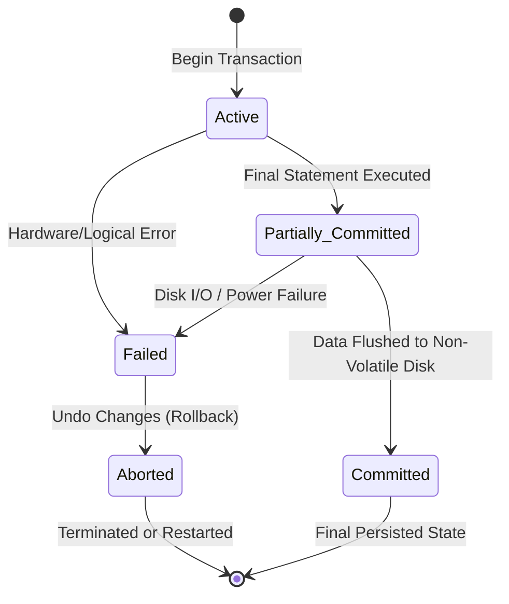
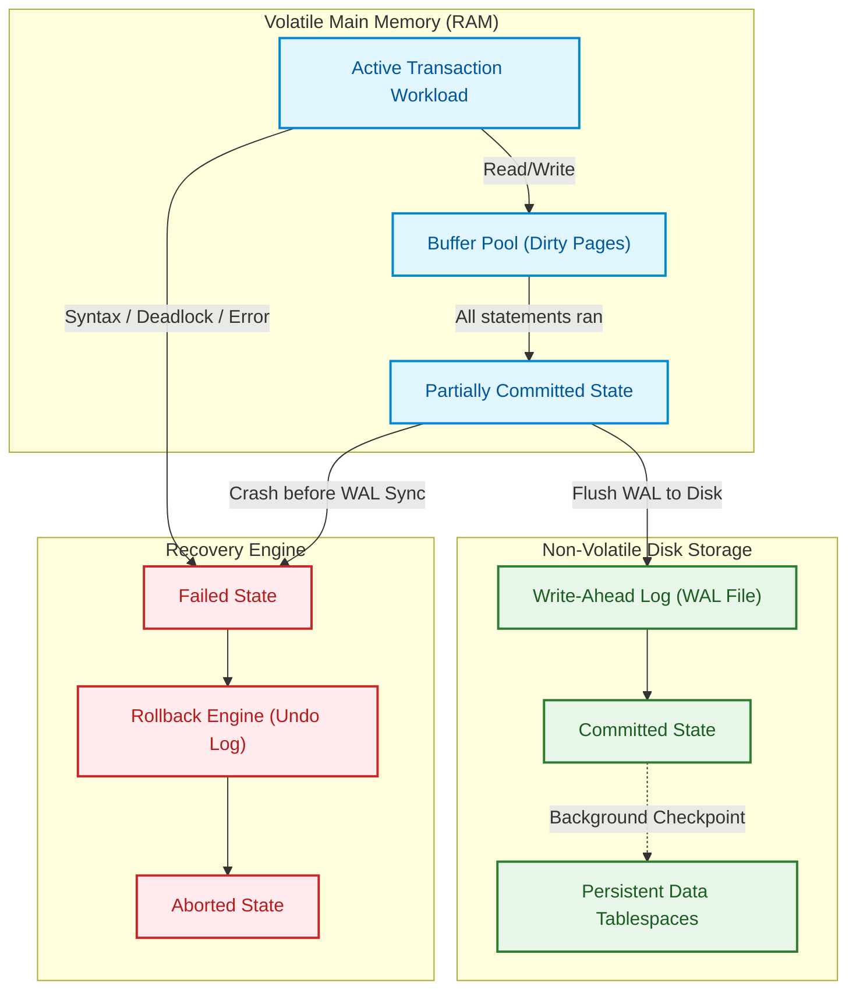

import CoreDoseLessonHeader from '@site/src/components/CoreDose/CoreDoseLessonHeader';
import CoreDoseTOC from '@site/src/components/CoreDose/CoreDoseTOC';
import CoreDoseNav from '@site/src/components/CoreDose/CoreDoseNav';

# What is a Transaction? Lifecycle States & Operations

<CoreDoseLessonHeader />

## 💡 Core Intuition

### 🍳 The Everyday Analogy: The ATM Cash Withdrawal

Imagine withdrawing $\$100$ from an Automated Teller Machine (ATM). Behind the digital screen, the ATM executes several discrete steps:
1. It reads your account balance.
2. It debits $\$100$ from your digital bank balance.
3. It instructs the mechanical rollers to count ten $\$10$ bills.
4. It presents the cash through the dispenser slot.
5. It prints your confirmation receipt.

Now imagine a sudden power failure strikes between step 2 and step 4! Your digital account has already been deducted, but the mechanical shutter never opened, and no cash was dispensed. If the ATM operating system treats every step as an isolated, independent action, you lose $\$100$ to a digital void. 

To prevent such catastrophe, computer science bundles all five steps into a single **Atomic Transaction**. If power fails at *any* millisecond before the cash enters your hand, the entire operation is rewound as if it never happened: the $\$100$ is restored to your balance, and the state remains pristine. Either all five steps finish, or zero steps persist.

### 💻 Bridging to Computer Science

In operating systems and general computing, programs can be interrupted midway, with atomicity restricted to individual CPU clock cycle instructions.

In relational database systems, users perform **logical units of work** that span multiple reads, writes, and constraint validations. To guarantee data consistency across power cuts, hardware crashes, and software bugs, the DBMS elevates atomicity to the logical level:

> **Formal Definition:** A **Transaction** is a collection of logically related operations (reads and writes) that executes as a single, indivisible, all-or-nothing unit of work.

```
Individual Disk Instructions  --->  Bundled into Logical Unit  --->  Transaction (T)
```

A transaction can contain any arbitrary number of instructions. During its lifetime, a transaction moves through a strictly governed finite state machine.

---

<CoreDoseTOC toc={toc} />

---

## 📚 Core Deep-Dive & Concepts

### Why Transactions Are Necessary: The Funds Transfer Problem

Consider two bank accounts, $A$ and $B$. Let a user initiate transaction $T_1$ transferring $100\text{ units}$ from account $A$ to account $B$.

In relational algebra and low-level storage primitives, this logical transfer breaks down into six discrete instructions:

| Step | Instruction | Storage & Memory Action |
| :---: | :--- | :--- |
| **1** | $\text{Read}(A)$ | Fetches block containing $A$ from disk into memory buffer; assigns to local variable $A$. |
| **2** | $A = A - 100$ | Memory CPU arithmetic subtracts $100\text{ units}$ from variable $A$. |
| **3** | $\text{Write}(A)$ | Flushes the updated balance of $A$ back to disk storage buffer. |
| **4** | $\text{Read}(B)$ | Fetches block containing $B$ from disk into memory buffer; assigns to local variable $B$. |
| **5** | $B = B + 100$ | Memory CPU arithmetic adds $100\text{ units}$ to variable $B$. |
| **6** | $\text{Write}(B)$ | Flushes the updated balance of $B$ back to disk storage buffer. |

#### The Consistency Invariant
Before transaction $T_1$ begins, the sum of balances in both accounts must equal the sum after completion:
$$\text{Consistent State: } (A + B)_{\text{initial}} = (A + B)_{\text{final}}$$

#### The Catastrophic Partial Execution Failure
Suppose the server crashes or power is abruptly severed immediately after step 3 ($\text{Write}(A)$):
- Account $A$ has been debited by $100\text{ units}$ on disk.
- Account $B$ was never credited because steps 4, 5, and 6 never ran.
- System state: $(A + B)_{\text{final}} = (A + B)_{\text{initial}} - 100$.

The database is now severely corrupted and inconsistent. 

**The Relational Resolution:** A DBMS never allows partial execution of a transaction. If any failure occurs before all 6 instructions reach permanent storage, the DBMS executes an **Undo (Rollback)** operation, wiping out the intermediate debit to $A$.

---

### Low-Level Primitives: Read and Write

At the storage engine layer, all database transactions interact with data items via two primary operations:

#### 1. $\text{Read}(X)$
Transfers data item $X$ from non-volatile disk storage (data files) into volatile main memory (RAM buffer pool) and assigns its value to a program memory variable named $X$.

#### 2. $\text{Write}(X)$
Transfers the updated value of memory variable $X$ from volatile main memory buffer back to non-volatile disk storage.

> **Fundamental Memory Invariant:** A DBMS does **not** perform calculations directly on the physical storage blocks of the database. It copies the block into the volatile database buffer pool, executes memory modifications, and flushes dirty pages back to disk under strict write-ahead logging (WAL) protocols.

---

### The Transaction State Machine

A transaction is not merely a script of SQL commands; it is an active computational process governed by a finite state machine with **five canonical states**:



#### 1. Active State
The initial state of every transaction upon creation. The transaction remains in the **Active** state as long as it is actively reading data, executing internal arithmetic, and writing updates to volatile buffer memory.

#### 2. Partially Committed State
A transaction enters the **Partially Committed** state immediately after its final SQL statement has been executed in memory.
- **The Vulnerability Window:** Although the application logic has completed, the transaction is **not yet safe**. The modified data pages may still reside exclusively in volatile RAM cache and have not yet been synchronized (flushed) to persistent non-volatile disk blocks.
- If a power outage or kernel panic occurs while in the Partially Committed state, the transaction **fails** and must be aborted!

#### 3. Failed State
A transaction transitions to the **Failed** state upon discovering that normal execution can no longer proceed due to:
- Internal logical errors (e.g. integer divide-by-zero, check constraint violation, deadlock detection).
- External system failures (e.g. out of memory, network disconnect, power failure during write).

A transaction in the Failed state cannot make further progress and must be reversed.

#### 4. Aborted State
A transaction enters the **Aborted** state after the DBMS recovery engine completes the **Rollback (Undo)** procedure:
- All memory buffers modified by the transaction are invalidated.
- Any dirty pages written to disk are restored to their pre-transaction values using undo logs.
- The database is restored to the exact consistent state that existed prior to transaction inception.

Once aborted, the transaction controller can choose to:
1. **Restart** the transaction (if abortion was caused by transient deadlocks or concurrency contention).
2. **Kill** the transaction (if abortion was caused by internal program logic or schema constraint violations).

#### 5. Committed State
A transaction enters the **Committed** state only after **all updates and transaction log records have been successfully and irreversibly written to non-volatile disk storage**.
- Once a transaction reaches the Committed state, its changes are permanent.
- Even if a catastrophic power failure occurs one microsecond later, the database recovery subsystem will reconstruct all committed changes upon reboot.

---

## 📐 Architecture / Visual Blueprint

The following structural diagram details the architectural components within the DBMS engine that supervise each state transition during a transaction's lifecycle:



---

## 🏭 In The Real World: Production Case Study

### Ride-Share Payment Escrow Settlement (Uber / Lyft)

In high-concurrency ride-hailing services, completing a trip triggers a multi-party escrow release:
1. Debit the rider's card token through a payment gateway.
2. Credit the driver's earnings wallet balance.
3. Deduct the platform service commission fee.
4. Issue a digital tax invoice receipt.

#### The Architecture Failure Without State Enclosures
During a major New Year's Eve traffic peak, a cloud availability zone suffered an unexpected network partition while thousands of ride transactions were processing.

In un-isolated systems without strict two-phase commit transaction state supervision:
- Riders' cards were charged by third-party payment APIs.
- The database connection dropped before the driver wallet update could execute.
- Drivers saw zero earnings, while riders received bank debit notifications, flooding customer support with chargeback disputes.

#### The Transactional Production Fix
The engineering team enclosed the entire financial settlement in a strict atomic transaction:
```sql
BEGIN TRANSACTION;
  -- Step 1: Lock and verify trip status
  SELECT status FROM Trips WHERE trip_id = 98124 FOR UPDATE;
  
  -- Step 2: Record rider debit
  INSERT INTO Ledger_Entries (account_id, amount, type) 
  VALUES ('rider_44', -45.00, 'DEBIT');
  
  -- Step 3: Record driver credit
  INSERT INTO Ledger_Entries (account_id, amount, type) 
  VALUES ('driver_89', +33.75, 'CREDIT');
  
  -- Step 4: Record platform commission
  INSERT INTO Ledger_Entries (account_id, amount, type) 
  VALUES ('platform_escrow', +11.25, 'FEE');
  
  -- Step 5: Mark trip finalized
  UPDATE Trips SET status = 'SETTLED' WHERE trip_id = 98124;
COMMIT;
```

If the database node crashed at Step 3:
1. The transaction manager detected an incomplete state.
2. The transaction shifted immediately to `Failed` $\to$ `Aborted`.
3. Undo records rolled back all ledger entries.
4. The background idempotent worker retried the complete transaction safely upon network reconnection.

---

## 🎯 Exam & Interview Pitfall Check

:::tip Core Conceptual Questions

**Question 1:** Why is a transaction in the "Partially Committed" state not yet guaranteed to be durable?

**Answer:**
A transaction enters the Partially Committed state immediately after its final operational statement has completed execution in memory. At this exact juncture, modified data pages and log buffers often reside solely in the database volatile RAM buffer cache. If a sudden power loss, operating system crash, or physical disk write error occurs before the DBMS flushes the dirty log buffer records to persistent non-volatile media, the transaction cannot commit. It must transition to the `Failed` state and be completely rolled back during crash recovery.

---

**Question 2:** Explain the precise difference between the `Failed` state and the `Aborted` state in the transaction lifecycle automaton.

**Answer:**
The `Failed` state is an **active error state** entered immediately upon detecting a violation, syntax error, deadlock, or system crash that renders normal forward execution impossible.
The `Aborted` state is a **terminal finalized state** reached only *after* the recovery subsystem has successfully executed all necessary rollback procedures, reversed all partial memory/disk modifications, and returned the database to its pre-transaction consistent state.

:::

:::warning Common Interview Traps

**Trap 1: Believing a transaction writes its updates directly to disk with every SQL statement.**
A relational database never issues direct synchronous disk writes for every individual SQL `UPDATE` or `INSERT`. It performs modifications in volatile RAM (the buffer pool) and appends intent records to an in-memory WAL buffer. Synchronous disk I/O only occurs when flushing logs during the commit sequence.

**Trap 2: Assuming an aborted transaction can never be re-executed.**
An aborted state terminates the specific execution instance. If the abortion was caused by an external concurrency conflict (such as a deadlock victim selection or serializability failure), the transaction management layer can automatically re-issue and restart the transaction with fresh state.

:::

---

<CoreDoseNav
  prev={{
    title: "Multivalued Dependencies (4NF) & Join Dependencies (5NF)",
    url: "/coredose/dbms/chapter-06/multivalued-dependencies-4nf-and-join-dependencies-5nf"
  }}
  next={{
    title: "ACID Properties Deep-Dive & Subsystem Enforcement",
    url: "/coredose/dbms/chapter-07/acid-properties-deep-dive"
  }}
  courseUrl="/coredose/dbms"
/>
