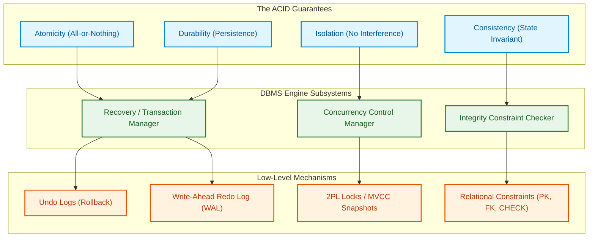

import CoreDoseLessonHeader from '@site/src/components/CoreDose/CoreDoseLessonHeader';
import CoreDoseTOC from '@site/src/components/CoreDose/CoreDoseTOC';
import CoreDoseNav from '@site/src/components/CoreDose/CoreDoseNav';

# ACID Properties Deep-Dive & Subsystem Enforcement

<CoreDoseLessonHeader />

## 💡 Core Intuition

### 🍳 The Everyday Analogy: The Bank Safety Deposit Box

Imagine visiting a high-security bank vault to exchange two historic gold coins with another collector:
1. **Atomicity (All or Nothing):** The vault manager opens the steel box only if the complete exchange paperwork is signed. If either you or the collector refuses to hand over a coin, the transaction halts immediately, and both parties leave with their original items intact.
2. **Consistency (Preserving Truth):** The total monetary value stamped into the bank's sovereign registry must match before and after the vault visit. Value cannot magically appear or vanish.
3. **Isolation (Private Booths):** Even if fifty collectors are trading coins in adjacent private booths simultaneously, you cannot see or touch another collector's coins until their vault box is locked and signed.
4. **Durability (The Indelible Ledger):** Once the exchange is finalized and stamped into the bank's stone ledger, even if a fire strikes the lobby five minutes later, your ownership is legally permanent and cannot be erased.

### 💻 Bridging to Computer Science

In relational databases, these four guarantees form the foundational **ACID paradigm**:
- **A** $\to$ **Atomicity**
- **C** $\to$ **Consistency**
- **I** $\to$ **Isolation**
- **D** $\to$ **Durability**

Every ACID guarantee is mapped to a dedicated engineering subsystem inside the database engine. Understanding which component is responsible for which guarantee is essential for diagnosing system crashes, concurrency bottlenecks, and data anomalies.

---

<CoreDoseTOC toc={toc} />

---

## 📚 Core Deep-Dive & Concepts

### The ACID Matrix: Guarantees vs. Enforcing Subsystems

| ACID Property | Formal Guarantee | Responsible DBMS Subsystem | Mechanism Used |
| :--- | :--- | :--- | :--- |
| **Atomicity** | All operations in the transaction complete successfully, or none persist. | **Recovery Control Manager / Transaction Manager** | Undo Logging / Write-Ahead Logging (WAL) |
| **Consistency** | The database transitions from one valid, constraint-compliant state to another. | **Application Programmer & Integrity Constraint Checker** | Schema assertions, foreign keys, triggers |
| **Isolation** | Concurrently executing transactions cannot observe each other's intermediate uncommitted states. | **Concurrency Control Manager** | Lock-based protocols (2PL), MVCC, Timestamps |
| **Durability** | Committed updates persist permanently on non-volatile storage across all failures. | **Recovery Control Manager** | Redo Logging / Flush to Disk / Battery-backed NVRAM |

---

### 1. Atomicity: The All-or-Nothing Invariant

**Definition:** A transaction is an atomic unit of processing. It must either be performed in its entirety across all instructions, or not performed at all.

#### Subsystem Enforcement
Atomicity is enforced by the **Recovery Manager** using **Undo Logs**.
- When an active transaction updates a data item $X$ from value $v_{\text{old}}$ to $v_{\text{new}}$, the DBMS first records an undo entry:
  $$\langle T, X, v_{\text{old}} \rangle$$
- If the transaction crashes, fails a constraint, or receives an `ABORT` command, the recovery engine traverses the log in reverse, restoring every variable to its original value $v_{\text{old}}$.

---

### 2. Consistency: Correctness Across State Transitions

**Definition:** A transaction must preserve the integrity invariants of the database. If executed from beginning to end without interference, it must transform the database from one valid consistent state to another valid consistent state.

$$\text{State } S_1 \xrightarrow{\quad T \quad} \text{State } S_2 \quad (\text{Both } S_1, S_2 \text{ satisfy all database constraints})$$

#### Responsibility Split
Unlike the other three properties, Consistency is a **shared responsibility**:
1. **The Application Developer:** Must ensure business logic preserves real-world invariants (e.g., in a transfer between accounts $A$ and $B$, deducting $100$ from $A$ must be paired with adding $100$ to $B$, maintaining $(A + B)_{\text{final}} = (A + B)_{\text{initial}}$).
2. **The DBMS Integrity Subsystem:** Automatically enforces declarative relational rules, such as `NOT NULL`, `UNIQUE`, `CHECK (balance >= 0)`, and foreign key referential integrity.

---

### 3. Isolation: Shielding Concurrent Operations

**Definition:** Concurrently executing transactions must execute without mutual interference. To each individual transaction $T_i$, the system must appear as if $T_i$ is executing alone on a dedicated database.

#### Subsystem Enforcement
Isolation is enforced by the **Concurrency Control Manager** using:
- **Two-Phase Locking (2PL)**
- **Multi-Version Concurrency Control (MVCC)**
- **Timestamp Ordering Protocols**

---

### 4. Durability: Permanent Persistence

**Definition:** Once a transaction enters the `Committed` state, all of its modifications must persist permanently in non-volatile storage. These modifications must never be lost due to subsequent software crashes, power outages, or operating system restarts.

#### Subsystem Enforcement
Durability is enforced by the **Recovery Manager** using **Redo Logs (Write-Ahead Logging - WAL)**:
- Under the WAL protocol, the log record containing the commit marker $\langle T, \text{COMMIT} \rangle$ and all modified data values must be physically flushed to non-volatile disk blocks **before** the client receives a commit acknowledgment.
- Even if volatile RAM is cleared by power loss, the database reboots, inspects the redo log, and re-applies all committed changes to data tables.

---

### The 4 Concurrency Anomalies (Violations of Isolation)

When transactions execute concurrently without adequate isolation, four classical data anomalies arise:

#### Anomaly 1: Lost Update Problem (Write-Write Conflict)
Occurs when two transactions concurrently read the same data item and subsequently write updates without reading each other's modifications. The second write blindly overwrites the first write.

```
T1: Read(A) [A=5]
T1: Write(A) [A=50]
        T2: Write(A) [A=15]
        T2: Commit [A=15]
T1: Commit
```
**The Flaw:** $T_1$'s modification ($A = 50$) has been permanently erased without acknowledgement.

---

#### Anomaly 2: Dirty Read Problem (Write-Read Conflict)
Occurs when transaction $T_2$ reads a data item that has been modified by an uncommitted transaction $T_1$. If $T_1$ subsequently aborts, $T_2$ has acted on fabricated data that never existed permanently in the database.

```
T1: Read(A) [A=10]
T1: Write(A) [A=20]
        T2: Read(A) [Reads uncommitted A=20]
        T2: Commit [T2 commits business action on A=20]
T1: ABORT [T1 rolls back; A returns to 10]
```
**The Flaw:** $T_2$ committed actions based on $A = 20$, but the true database state is $A = 10$.

---

#### Anomaly 3: Unrepeatable (Fuzzy) Read Problem (Read-Write Conflict)
Occurs when transaction $T_1$ reads data item $A$, and before $T_1$ finishes, transaction $T_2$ modifies or deletes $A$ and commits. When $T_1$ reads $A$ a second time within its own boundary, it discovers a different value.

```
T1: Read(A) [Returns 50]
        T2: Read(A) [50]
        T2: Write(A) [30]
        T2: Commit
T1: Read(A) [Returns 30 -- Mismatch within same transaction!]
```
**The Flaw:** An individual transaction observing mutating values for the exact same entity during its execution.

---

#### Anomaly 4: Phantom Read Problem
Occurs when transaction $T_1$ executes a range query (e.g., `SELECT COUNT(*) WHERE age > 30`) and receives $10$ rows. Concurrently, transaction $T_2$ inserts a new employee aged $35$ and commits. When $T_1$ re-executes the exact same query, it receives $11$ rows. A new "phantom" row has materialized mid-transaction.

---

### Standard SQL Isolation Levels vs. Anomalies

To balance strict serializability with high query throughput, relational databases define four standardized ANSI/ISO isolation levels:

| Isolation Level | Dirty Read | Unrepeatable Read | Phantom Read | Concurrency Performance |
| :--- | :---: | :---: | :---: | :--- |
| **Read Uncommitted** | ⚠️ Allowed | ⚠️ Allowed | ⚠️ Allowed | Maximum Throughput |
| **Read Committed** | 🛡️ Prevented | ⚠️ Allowed | ⚠️ Allowed | High (PostgreSQL / Oracle Default) |
| **Repeatable Read** | 🛡️ Prevented | 🛡️ Prevented | ⚠️ Allowed | Moderate (MySQL InnoDB Default) |
| **Serializable** | 🛡️ Prevented | 🛡️ Prevented | 🛡️ Prevented | Lowest (Strict Lock / Abort Rate) |

---

## 📐 Architecture / Visual Blueprint

The following diagram illustrates the relationship between the four ACID properties and the corresponding DBMS execution engine subsystems:



---

## 🏭 In The Real World: Production Case Study

### Flash-Sale Inventory Depletion (Amazon / Black Friday)

During mega flash sales, thousands of concurrent shoppers attempt to purchase the last available unit of a gaming console ($Inventory = 1$).

#### The Production Incident
Two checkout worker pods ($T_1$ and $T_2$) execute checkout code at the same millisecond under the `READ COMMITTED` isolation level:

$$\begin{aligned}
T_1: & \quad \text{SELECT stock FROM Inventory WHERE item\_id = 'PS5';} \quad \text{-- Returns 1} \\
T_2: & \quad \text{SELECT stock FROM Inventory WHERE item\_id = 'PS5';} \quad \text{-- Returns 1} \\
T_1: & \quad \text{UPDATE Inventory SET stock = stock - 1;} \quad \text{-- Sets stock to 0} \\
T_2: & \quad \text{UPDATE Inventory SET stock = stock - 1;} \quad \text{-- Overwrites stock to -1 (or 0)}
\end{aligned}$$

Both checkouts succeed. Two credit cards are charged, but only one physical unit exists in the warehouse. The second customer receives a cancellation email 3 days later, damaging customer trust.

#### The Architectural Fix
1. **Pessimistic Row Locking (`SELECT FOR UPDATE`):**
   ```sql
   BEGIN;
     SELECT stock FROM Inventory WHERE item_id = 'PS5' FOR UPDATE;
     -- T2 blocks on row-level lock until T1 commits
     UPDATE Inventory SET stock = stock - 1 WHERE item_id = 'PS5' AND stock > 0;
   COMMIT;
   ```
2. **Atomic In-Database Conditional Update:**
   ```sql
   UPDATE Inventory 
   SET stock = stock - 1 
   WHERE item_id = 'PS5' AND stock > 0;
   ```
If zero rows are updated, the application aborts immediately, preventing overselling.

---

## 🎯 Exam & Interview Pitfall Check

:::tip Core Conceptual Questions

**Question 1:** Which DBMS subsystem is responsible for ensuring each of the four ACID properties?

**Answer:**
- **Atomicity:** Enforced by the **Recovery Control Manager / Transaction Manager** using Undo Logs.
- **Consistency:** Enforced jointly by the **Application Developer** (business logic) and the **DBMS Integrity Constraint Subsystem** (declarative constraints, triggers, assertions).
- **Isolation:** Enforced by the **Concurrency Control Manager** using locking protocols (such as 2PL), timestamp ordering, or MVCC.
- **Durability:** Enforced by the **Recovery Control Manager** using Redo Logs and Write-Ahead Logging (WAL) flushed to persistent storage.

---

**Question 2:** Explain how the "Dirty Read" problem differs fundamentally from the "Unrepeatable Read" problem.

**Answer:**
- In a **Dirty Read (Write-Read conflict)**, a transaction reads uncommitted, in-flight data written by another active transaction. If that active transaction aborts, the data read never officially existed in the database.
- In an **Unrepeatable Read (Read-Write conflict)**, a transaction reads a committed value, but when it re-reads the exact same record later, it observes a different value because another transaction modified and **successfully committed** the record in the interim. The data read in both reads was legitimate, committed data, but the value mutated within the first transaction's lifespan.

:::

:::warning Common Interview Traps

**Trap 1: Believing the DBMS engine alone is responsible for Consistency.**
The database engine cannot determine whether transferring $\$100$ between friends was intended to be $\$100$ or $\$1,000$. If a developer accidentally writes code that debits $\$100$ from $A$ and credits $\$500$ to $B$, the DBMS will commit it as long as no schema constraints are violated. Consistency fundamentally requires correct application logic.

**Trap 2: Assuming "Durability" protects against physical disk hardware destruction.**
Standard database durability guarantees persistence against power outages and operating system crashes by flushing WAL logs to disk. If the physical magnetic disk platter shatters or the server chassis burns, local durability cannot recover data. Real-world durability requires distributed database replication (e.g., Raft/Paxos write replication across availability zones).

:::

---

<CoreDoseNav
  prev={{
    title: "What is a Transaction? Lifecycle States & Operations",
    url: "/coredose/dbms/chapter-07/what-is-a-transaction-and-lifecycle-states"
  }}
  next={{
    title: "Schedules: Serial vs. Non-Serial & Concurrent Execution",
    url: "/coredose/dbms/chapter-07/schedules-serial-vs-non-serial"
  }}
  courseUrl="/coredose/dbms"
/>
