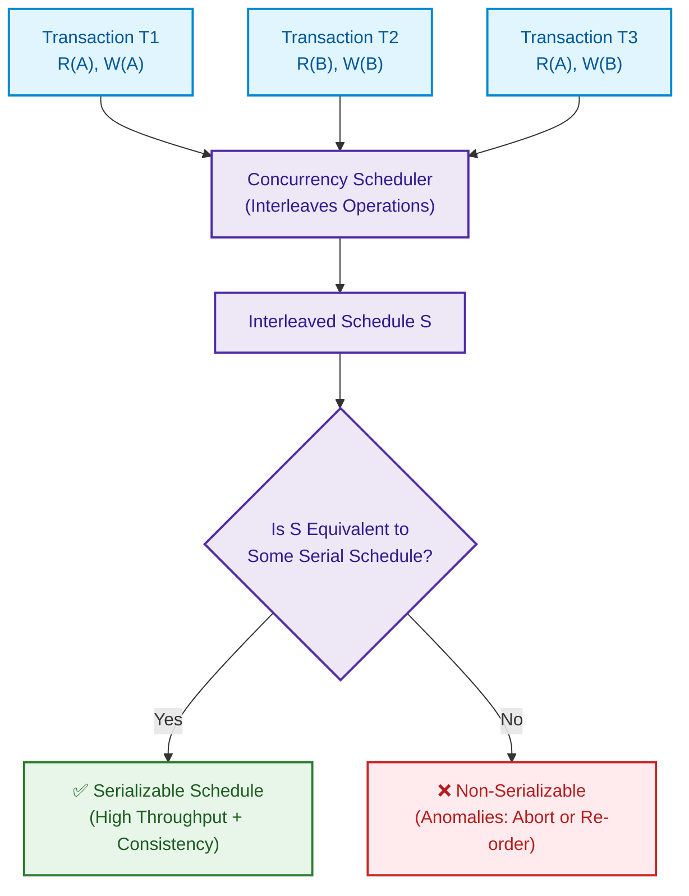

import CoreDoseLessonHeader from '@site/src/components/CoreDose/CoreDoseLessonHeader';
import CoreDoseTOC from '@site/src/components/CoreDose/CoreDoseTOC';
import CoreDoseNav from '@site/src/components/CoreDose/CoreDoseNav';

# Schedules: Serial vs. Non-Serial & Concurrent Execution

<CoreDoseLessonHeader />

## 💡 Core Intuition

### 🍳 The Everyday Analogy: The Single-Lane Drive-Through vs. Multi-Chef Kitchen

Imagine a drive-through fast food kitchen serving two hungry families:
- **Serial Execution:** The kitchen staff takes the entire multi-item order for Family 1. The chef grills their burgers, bakes their fries, pours their sodas, bags the meal, and hands it out the window. Only after Family 1 drives off does the chef take the order for Family 2. There is zero risk of burger mix-ups, but Family 2 waits in their car for 30 minutes with the engine idling while the chef waits for bread to toast.
- **Concurrent (Interleaved) Execution:** The chef drops Family 1's patties on the grill. While waiting 5 minutes for the patties to sear (I/O wait), the chef pours Family 2's sodas and drops their fries. 

The concurrent kitchen achieves dramatically higher throughput. However, if the chef gets confused and places Family 2's spicy sauce into Family 1's mild burger, an interleaving error occurs. A **Schedule** is the formal chronological recipe governing how operations from multiple transactions are interleaved on a single database.

### 💻 Bridging to Computer Science

In relational databases, user requests arrive constantly and simultaneously. Executing transactions serially (one after another) wastes massive CPU cycles because processors sit idle while disk drives seek blocks.

> **Formal Definition:** A **Schedule** $S$ of $n$ transactions $\{T_1, T_2, \dots, T_n\}$ is an ordered sequence of all operations belonging to those transactions, such that for each individual transaction $T_i$, the relative execution order of its operations in $S$ is strictly preserved.

```
Transaction T1:  [R(A), W(A)]
Transaction T2:  [R(B), W(B)]

Interleaved Schedule S:  R1(A) -> R2(B) -> W1(A) -> W2(B)
```

The fundamental challenge of transaction management is ensuring that concurrent interleaving produces the exact same consistent output as executing transactions serially, without the crippling latency of a serial queue.

---

<CoreDoseTOC toc={toc} />

---

## 📚 Core Deep-Dive & Concepts

### Why Concurrency is Mandatory: Resource Utilization

If a database processes transactions serially:
1. **Low CPU / IO Utilization:** When transaction $T_1$ issues a disk read request $\text{Read}(X)$, the CPU waits hundreds of thousands of clock cycles for the magnetic or NVMe disk controller to return the data block.
2. **High Average Response Time:** Short, lightweight transactions (e.g. checking an account balance taking $2\text{ ms}$) get stuck behind massive, long-running batch analytics jobs (e.g. monthly payroll recalculation taking $45\text{ minutes}$).

By interleaving operations, while $T_1$ waits for disk I/O, the CPU executes arithmetic and memory writes for $T_2$, multiplying system throughput and dramatically shrinking average waiting times.

---

### Classification of Schedules

#### 1. Serial Schedule
A schedule in which operations belonging to each transaction are executed consecutively from start to finish without any interleaving from other transactions.
- A transaction $T_j$ begins only after transaction $T_i$ completely finishes and commits.
- **The Golden Invariant:** A serial schedule is **always consistent by definition**. If each individual transaction preserves consistency in isolation, executing them one after another in any order will inevitably preserve consistency. No serializability check is ever required.

Example of a Serial Schedule $S_{\text{serial}}$:

| Time | Transaction $T_1$ | Transaction $T_2$ |
| :---: | :---: | :---: |
| $t_1$ | $\text{Read}(A)$ | |
| $t_2$ | $\text{Write}(A)$ | |
| $t_3$ | $\text{Read}(B)$ | |
| $t_4$ | $\text{Write}(B)$ | |
| $t_5$ | | $\text{Read}(A)$ |
| $t_6$ | | $\text{Write}(A)$ |
| $t_7$ | | $\text{Read}(B)$ |
| $t_8$ | | $\text{Write}(B)$ |

---

#### 2. Non-Serial (Concurrent) Schedule
A schedule in which the operations of different active transactions are **interleaved** in time.
- The relative internal order of statements within each transaction $T_i$ remains strictly identical to its definition.
- However, statements from $T_2, T_3, \dots$ execute between steps of $T_1$.

Example of a Non-Serial Schedule $S_{\text{concurrent}}$:

| Time | Transaction $T_1$ | Transaction $T_2$ |
| :---: | :---: | :---: |
| $t_1$ | $\text{Read}(A)$ | |
| $t_2$ | | $\text{Read}(A)$ |
| $t_3$ | $\text{Write}(A)$ | |
| $t_4$ | | $\text{Write}(A)$ |

---

### Combinatorial Permutation Formulas

A classical interview and engineering benchmark is calculating the total number of possible schedules that can be formed from a set of concurrent transactions.

#### 1. Number of Serial Schedules
Given a set of $n$ distinct transactions $\{T_1, T_2, \dots, T_n\}$, the number of valid serial schedules is the number of ways to sequence the transactions:
$$\text{Number of Serial Schedules} = n!$$

For $3$ transactions $(T_1, T_2, T_3)$, there are $3! = 6$ possible serial schedules:
$$T_1 \to T_2 \to T_3, \quad T_1 \to T_3 \to T_2, \quad T_2 \to T_1 \to T_3, \quad T_2 \to T_3 \to T_1, \quad T_3 \to T_1 \to T_2, \quad T_3 \to T_2 \to T_1$$

---

#### 2. Total Number of Possible Interleaved Schedules
Suppose we have $n$ transactions $\{T_1, T_2, \dots, T_n\}$, where:
- Transaction $T_1$ contains $n_1$ operations
- Transaction $T_2$ contains $n_2$ operations
- $\dots$
- Transaction $T_k$ contains $n_k$ operations

The total number of operations across all transactions is:
$$N = n_1 + n_2 + \dots + n_k$$

Because the relative internal order of operations within each transaction must be preserved, finding the total number of valid interleaved schedules is equivalent to partitioning $N$ positions among the operations:
$$\text{Total Schedules} = \frac{(n_1 + n_2 + \dots + n_k)!}{n_1! \, n_2! \dots n_k!}$$

---

#### 3. Total Number of Strictly Non-Serial Schedules
To find the number of schedules that are strictly interleaved (excluding pure serial sequences):
$$\text{Non-Serial Schedules} = \frac{(n_1 + n_2 + \dots + n_k)!}{n_1! \, n_2! \dots n_k!} - n!$$

#### Solved Mathematical Derivation

**Problem:** Transaction $T_1$ has $3$ operations, and Transaction $T_2$ has $2$ operations. Calculate:
1. The number of serial schedules.
2. The total number of valid schedules.
3. The number of strictly non-serial schedules.

**Step-by-Step Solution:**
1. Number of serial schedules:
   $$n = 2 \implies n! = 2! = 2 \text{ serial schedules } (T_1 \to T_2 \text{ and } T_2 \to T_1)$$
2. Total number of schedules:
   $$n_1 = 3, \quad n_2 = 2, \quad N = 3 + 2 = 5$$
   $$\text{Total Schedules} = \frac{5!}{3! \times 2!} = \frac{120}{6 \times 2} = \frac{120}{12} = 10 \text{ schedules}$$
3. Number of strictly non-serial schedules:
   $$\text{Non-Serial Schedules} = 10 - 2 = 8 \text{ non-serial schedules}$$

---

### The Fundamental Philosophy of Serializability

A database engine cannot inspect an arbitrary, ad-hoc concurrent schedule and instantly deduce whether it will maintain semantic correctness for every possible business rule.

However, computer scientists recognized a profound truth:
1. **A Serial Schedule is unconditionally consistent.**
2. Therefore, if a concurrent non-serial schedule $S$ can be mathematically proven to have the **exact same computational effect as some serial schedule $S_{\text{serial}}$**, then schedule $S$ is **guaranteed to be consistent**!

This equivalence is known as **Serializability**. Concurrency control engines exist solely to ensure that every non-serial schedule permitted to execute is strictly serializable.

---

## 📐 Architecture / Visual Blueprint

The following diagram shows how the transaction scheduling pipeline takes concurrent streams of operations and schedules them to maximize resource utilization while ensuring equivalence to serial execution:



---

## 🏭 In The Real World: Production Case Study

### Ticketmaster Concert Ticket Queue: The Cost of Serialization

During high-demand ticket sales (e.g. Taylor Swift Eras Tour), over $3.5\text{ million}$ fans connect simultaneously to reserve tickets for $80,000$ stadium seats.

#### The Pure Serial Failure
If the ticketing database ran transactions in a pure serial schedule:
- Average seat reservation transaction: $150\text{ ms}$ (database write + credit card pre-auth).
- Serial throughput: $\frac{1000\text{ ms}}{150\text{ ms}} \approx 6.6\text{ transactions per second}$.
- Time required to process $1\text{ million}$ users:
  $$\frac{1,000,000}{6.6 \times 3600} \approx 42\text{ hours!}$$

Fans would sit in a virtual waiting room for nearly two days while the database CPU stayed at $< 5\%$ utilization, bound by payment gateway I/O latency.

#### Concurrent Interleaved Execution
By executing transactions concurrently:
- Non-conflicting seat requests (Customer A reserving Seat `Sec 101, Row A, Seat 1` while Customer B reserves Seat `Sec 204, Row G, Seat 12`) execute concurrently without mutual waiting.
- Database throughput scales to $15,000+$ transactions per second across multi-core database clusters.
- The concurrency scheduler only arbitrates and serializes requests when two customers attempt to purchase the exact same seat simultaneously.

---

## 🎯 Exam & Interview Pitfall Check

:::tip Core Conceptual Questions

**Question 1:** Given three transactions $T_1$, $T_2$, and $T_3$ with $2$, $3$, and $4$ operations respectively. Calculate the total number of possible concurrent schedules and the number of strictly non-serial schedules.

**Answer:**
1. Given:
   $$n = 3 \text{ transactions}$$
   $$n_1 = 2, \quad n_2 = 3, \quad n_3 = 4$$
   $$\text{Total Operations } N = 2 + 3 + 4 = 9$$
2. Total possible schedules:
   $$\text{Total Schedules} = \frac{N!}{n_1! \, n_2! \, n_3!} = \frac{9!}{2! \times 3! \times 4!}$$
   $$\text{Total Schedules} = \frac{362,880}{2 \times 6 \times 24} = \frac{362,880}{288} = 1,260$$
3. Number of serial schedules:
   $$n! = 3! = 6$$
4. Number of strictly non-serial schedules:
   $$\text{Non-Serial Schedules} = 1,260 - 6 = 1,254$$

---

**Question 2:** Why must a schedule preserve the internal order of operations within each transaction?

**Answer:**
An individual transaction represents a logically coherent program written to accomplish a specific business task (e.g., first reading a balance, verifying it is sufficient, and then deducting money). If a schedule were allowed to reorder operations *within* the same transaction (such as writing the deduction before reading the original balance), the program logic of that transaction would be corrupted, producing incorrect results regardless of concurrency control. Preserving transaction-internal order is a fundamental prerequisite for schedule validity.

:::

:::warning Common Interview Traps

**Trap 1: Assuming that all serial schedules produce the exact same final database state.**
While all serial schedules are consistent, different serial schedules can produce different final database states! For example, if $T_1$ writes $A = 10$ and $T_2$ writes $A = 20$, the serial schedule $T_1 \to T_2$ leaves $A = 20$, whereas $T_2 \to T_1$ leaves $A = 10$. Both states are mathematically consistent, but not identical.

**Trap 2: Believing that concurrent execution is always faster than serial execution.**
If all transactions access and modify the exact same single row (extreme lock contention), the overhead of lock acquisition, context switching, and conflict arbitration can make concurrent execution *slower* than pure serialization! Concurrency provides maximum benefit when transactions access non-overlapping partitions of the dataset.

:::

---

<CoreDoseNav
  prev={{
    title: "ACID Properties Deep-Dive & Subsystem Enforcement",
    url: "/coredose/dbms/chapter-07/acid-properties-deep-dive"
  }}
  next={{
    title: "Read-Write Conflicts & Conflict Equivalence",
    url: "/coredose/dbms/chapter-07/read-write-conflicts-and-conflict-equivalence"
  }}
  courseUrl="/coredose/dbms"
/>
