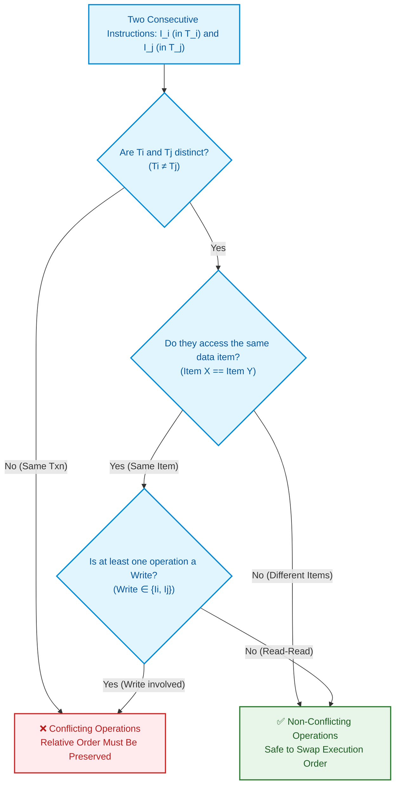

import CoreDoseLessonHeader from '@site/src/components/CoreDose/CoreDoseLessonHeader';
import CoreDoseTOC from '@site/src/components/CoreDose/CoreDoseTOC';
import CoreDoseNav from '@site/src/components/CoreDose/CoreDoseNav';

# Read-Write Conflicts & Conflict Equivalence

<CoreDoseLessonHeader />

## 💡 Core Intuition

### 🍳 The Everyday Analogy: The Shared Whiteboard

Imagine a corporate meeting room with a single whiteboard. Two project managers, Alice ($T_1$) and Bob ($T_2$), enter the room to review numbers:
1. **Both Reading (Non-Conflicting):** Alice reads the revenue metric on the board, and then Bob reads the same metric. If they swap the order—Bob looks first, and Alice looks second—neither of their notes change. Swapping read operations is completely harmless.
2. **One Writing, One Reading (Conflicting):** Bob wants to erase the number and write a new updated budget, while Alice needs to write a report based on the existing number. If Alice reads *before* Bob writes, she records the old budget. If Bob writes *first*, Alice records the new budget! Changing their order completely alters the outcome.
3. **Both Writing (Conflicting):** Alice wants to write "Approved by Sales", and Bob wants to write "Under Review by Legal". Whoever writes second overwrites the other person's work.

In database scheduling, two operations **conflict** if altering their relative chronological order changes the final database state or the values read by transactions.

### 💻 Bridging to Computer Science

To determine whether an interleaved schedule is safe without running full database simulations, the database engine checks **Conflict Equivalence**.

```
Schedule S  --->  [Series of Non-Conflicting Swaps]  --->  Serial Schedule S'
```

If an interleaved schedule $S$ can be converted into a serial schedule $S'$ simply by swapping adjacent, non-conflicting instructions, we know with mathematical certainty that $S$ produces the exact same result as $S'$. This schedule is **Conflict Serializable**.

---

<CoreDoseTOC toc={toc} />

---

## 📚 Core Deep-Dive & Concepts

### The Formal Definition of Conflicting Operations

Let $I_i$ and $I_j$ be two consecutive instructions in a schedule $S$, belonging to transactions $T_i$ and $T_j$ respectively ($T_i \neq T_j$).

Instructions $I_i$ and $I_j$ are **Conflicting** if and only if they satisfy all three of the following criteria:
1. **Different Transactions:** They belong to different transactions ($T_i \neq T_j$).
2. **Same Data Item:** They access the exact same database element ($Q$).
3. **At Least One Write:** At least one of the two instructions is a write operation ($\text{Write}(Q)$).

---

### The Four Operation Combinations

For two transactions $T_i$ and $T_j$ accessing the same data item $Q$:

| Instruction $I_i \in T_i$ | Instruction $I_j \in T_j$ | Classification | Can Order Be Swapped? | Operational Rationale |
| :---: | :---: | :---: | :---: | :--- |
| $\text{Read}_i(Q)$ | $\text{Read}_j(Q)$ | **Non-Conflicting** | ✅ **Yes** | Neither transaction modifies data; both read the identical value. |
| $\text{Read}_i(Q)$ | $\text{Write}_j(Q)$ | ⚠️ **Conflicting** | ❌ **No** | Swapping changes whether $T_i$ reads the pre-write or post-write value of $Q$. |
| $\text{Write}_i(Q)$ | $\text{Read}_j(Q)$ | ⚠️ **Conflicting** | ❌ **No** | Swapping changes whether $T_j$ reads $T_i$'s uncommitted/committed update. |
| $\text{Write}_i(Q)$ | $\text{Write}_j(Q)$ | ⚠️ **Conflicting** | ❌ **No** | Swapping changes which transaction performs the final overwrite on $Q$. |

#### What About Different Data Items?
Any two operations accessing **different** data items (e.g., $\text{Write}_i(A)$ and $\text{Read}_j(B)$) are **unconditionally non-conflicting**, regardless of whether they are reads or writes. They operate on separate disk blocks and memory addresses, allowing them to be swapped freely.

---

### Non-Conflicting Swapping Mechanics

If two adjacent instructions $I_i$ and $I_j$ in schedule $S$ are **non-conflicting**, we can swap their relative execution order ($I_i, I_j \to I_j, I_i$) to produce a new schedule $S'$. 

Because the swapped instructions do not affect each other:
1. Every transaction reads the exact same values in $S'$ as it did in $S$.
2. The final database state on disk after executing $S'$ is identical to the final state after executing $S$.

---

### Conflict Equivalence

**Definition:** Two schedules $S$ and $S'$ over the same set of transactions are said to be **Conflict Equivalent** ($S \equiv_c S'$) if and only if:
Schedule $S$ can be transformed into schedule $S'$ through a finite sequence of swaps of consecutive non-conflicting instructions.

#### Comprehensive Transformation Example

Consider Schedule $S$ with transactions $T_1$ and $T_2$:

| Step | Transaction $T_1$ | Transaction $T_2$ |
| :---: | :---: | :---: |
| 1 | $\text{Read}(A)$ | |
| 2 | $\text{Write}(A)$ | |
| 3 | | $\text{Read}(A)$ |
| 4 | | $\text{Write}(A)$ |
| 5 | $\text{Read}(B)$ | |
| 6 | $\text{Write}(B)$ | |
| 7 | | $\text{Read}(B)$ |
| 8 | | $\text{Write}(B)$ |

Notice that instructions 5 and 6 belong to $T_1$ and operate on data item $B$, whereas instructions 3 and 4 belong to $T_2$ and operate on data item $A$.
- Step 3 ($\text{Read}_2(A)$) and Step 5 ($\text{Read}_1(B)$) access different data items $\to$ **Non-conflicting!**
- Step 4 ($\text{Write}_2(A)$) and Step 5 ($\text{Read}_1(B)$) access different data items $\to$ **Non-conflicting!**
- Step 3 ($\text{Read}_2(A)$) and Step 6 ($\text{Write}_1(B)$) access different data items $\to$ **Non-conflicting!**
- Step 4 ($\text{Write}_2(A)$) and Step 6 ($\text{Write}_1(B)$) access different data items $\to$ **Non-conflicting!**

Because all operations between the pair operate on distinct data items, we can repeatedly bubble $T_1$'s operations $(\text{Read}_1(B), \text{Write}_1(B))$ upward above $T_2$'s operations!

Resulting transformed schedule $S'$:

| Step | Transaction $T_1$ | Transaction $T_2$ |
| :---: | :---: | :---: |
| 1 | $\text{Read}(A)$ | |
| 2 | $\text{Write}(A)$ | |
| 3 | $\text{Read}(B)$ | |
| 4 | $\text{Write}(B)$ | |
| 5 | | $\text{Read}(A)$ |
| 6 | | $\text{Write}(A)$ |
| 7 | | $\text{Read}(B)$ |
| 8 | | $\text{Write}(B)$ |

In schedule $S'$, all operations of $T_1$ execute strictly before any operation of $T_2$. Schedule $S'$ is a **Serial Schedule** ($T_1 \to T_2$).

Because $S$ was transformed into serial schedule $S'$ via valid non-conflicting swaps:
1. $S$ is **Conflict Equivalent** to $S'$.
2. Schedule $S$ is **Conflict Serializable**!

---

### Summary of Conflict Rules

When analyzing whether a schedule can be serialized:
- $\text{Read}_i(X)$ and $\text{Read}_j(X)$ $\implies$ **Never a conflict.**
- Different variables $X \neq Y$ $\implies$ **Never a conflict.**
- Same variable with $\ge 1$ write $\implies$ **Strict conflict; order cannot be inverted.**

---

## 📐 Architecture / Visual Blueprint

The following state matrix illustrates the boundary between swappable non-conflicting operations and locked conflicting operations:



---

## 🏭 In The Real World: Production Case Study

### High-Frequency Order Book Matching Engine (Nasdaq / Coinbase)

In cryptocurrency and stock exchanges, matching engines process millions of limit orders, bid cancellations, and market executions per second across order books.

#### The Concurrency Interleaving
Consider two accounts trading in parallel:
- Transaction $T_1$ (Institutional Trader): Buys $10\text{ BTC}$, deducting USD from cash balance $B_{\text{USD}}$, adding BTC to crypto balance $C_{\text{BTC}}$.
- Transaction $T_2$ (Retail Trader): Withdraws $500\text{ USD}$ from cash balance $B_{\text{USD}}$.
- Transaction $T_3$ (Arbitrage Bot): Sells $2\text{ ETH}$, adding to crypto balance $E_{\text{ETH}}$, deducting from $C_{\text{BTC}}$.

#### How Conflict Analysis Enables Parallelism
At the database and memory layer, the exchange matching scheduler analyzes instruction conflicts on memory addresses:
- $T_1$ and $T_3$ touch $C_{\text{BTC}}$: At least one writes $\to$ **Conflict!** The engine strictly orders these two via lock sequencing.
- $T_2$ touches $B_{\text{USD}}$, while $T_3$ touches $E_{\text{ETH}}$ and $C_{\text{BTC}}$: Different memory addresses $\to$ **Zero Conflict!**

The transaction manager routes $T_2$ and $T_3$ to separate CPU cores concurrently without taking locks against each other. By allowing non-conflicting operations to swap and execute asynchronously, the matching engine achieves sub-millisecond execution latencies while maintaining strict ledger equivalence.

---

## 🎯 Exam & Interview Pitfall Check

:::tip Core Conceptual Questions

**Question 1:** Let a schedule $S$ consist of two transactions $T_1$ and $T_2$:
$$S: R_1(A); \quad W_2(A); \quad W_1(A); \quad R_2(A);$$
Identify all pairs of conflicting operations in schedule $S$.

**Answer:**
A pair of operations is conflicting if they belong to different transactions, access the same data item, and at least one is a write.
Examining all cross-transaction pairs on data item $A$:
1. $R_1(A)$ and $W_2(A)$: Conflicting ($\text{Read-Write}$ conflict).
2. $R_1(A)$ and $R_2(A)$: Non-conflicting ($\text{Read-Read}$ pair).
3. $W_2(A)$ and $W_1(A)$: Conflicting ($\text{Write-Write}$ conflict).
4. $W_1(A)$ and $R_2(A)$: Conflicting ($\text{Write-Read}$ conflict).
5. $W_2(A)$ and $R_2(A)$: Non-conflicting *with respect to schedule conflict definition* because they belong to the **same transaction** ($T_2$).

Therefore, the conflicting pairs are:
$$(R_1(A), W_2(A)), \quad (W_2(A), W_1(A)), \quad (W_1(A), R_2(A))$$

---

**Question 2:** If schedule $S$ can be converted into schedule $S'$ by swapping two read operations on the same data item, are $S$ and $S'$ conflict equivalent?

**Answer:**
Yes. Two read operations on the same data item ($\text{Read}_i(X)$ and $\text{Read}_j(X)$) are non-conflicting because reading a variable does not alter its state in memory or on disk. Swapping two read operations preserves the exact values returned to both transactions and leaves the database state completely unchanged. Because the swap involves non-conflicting operations, the resulting schedule $S'$ is conflict equivalent to $S$.

:::

:::warning Common Interview Traps

**Trap 1: Checking for conflicts between operations of the same transaction.**
Two operations within the *same* transaction (e.g., $R_1(A)$ followed by $W_1(A)$) can never be swapped, but they are not considered a "conflict" in schedule serializability analysis. Conflicts are strictly defined between operations belonging to **two different transactions** ($T_i \neq T_j$).

**Trap 2: Assuming write-write operations on different variables conflict.**
Many beginners see two `Write` operations and immediately flag a conflict. $W_1(A)$ and $W_2(B)$ do not conflict because they target completely distinct data items ($A \neq B$). They can be freely swapped in any schedule.

:::

---

<CoreDoseNav
  prev={{
    title: "Schedules: Serial vs. Non-Serial & Concurrent Execution",
    url: "/coredose/dbms/chapter-07/schedules-serial-vs-non-serial"
  }}
  next={{
    title: "Conflict Serializability & Precedence Graphs",
    url: "/coredose/dbms/chapter-08/conflict-serializability-and-precedence-graphs"
  }}
  courseUrl="/coredose/dbms"
/>
