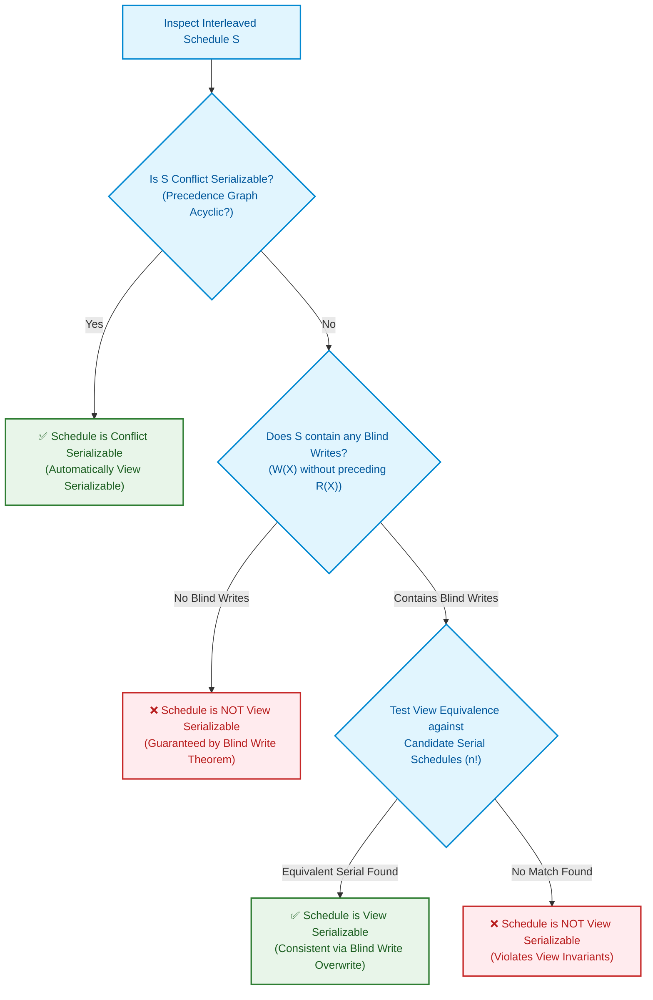
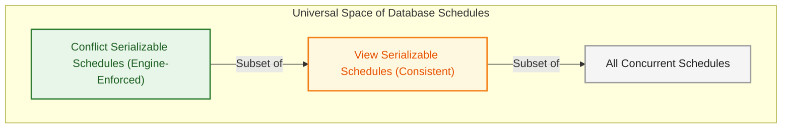

import CoreDoseLessonHeader from '@site/src/components/CoreDose/CoreDoseLessonHeader';
import CoreDoseTOC from '@site/src/components/CoreDose/CoreDoseTOC';
import CoreDoseNav from '@site/src/components/CoreDose/CoreDoseNav';

# View Serializability & Blind Writes

<CoreDoseLessonHeader />

## 💡 Core Intuition

### 🍳 The Everyday Analogy: The Paint Overwrite on the Canvas

Imagine an art workshop with an easel and a single canvas:
- Artist 1 ($T_1$) paints a green landscape on the canvas ($W_1(C)$).
- Artist 2 ($T_2$) steps up and reads the canvas ($R_2(C)$) to review the green paint, then touches up the mountain highlights ($W_2(C)$).
- Artist 3 ($T_3$) walks into the room, doesn't even look at the canvas, and immediately slathers thick black paint over the entire canvas ($W_3(C)$).

Notice Artist 3's action: $T_3$ performed a **Blind Write**—writing without looking! 

Because Artist 3 completely overwrote everything, anyone viewing the final canvas at the end of the day sees only Artist 3's black paint. If we had scheduled Artist 1 first, or swapped intermediate actions, the final visual "view" of the canvas remains completely unchanged because the blind write concealed all prior brushstrokes. 

In database systems, **View Serializability** is a broader, more forgiving standard than Conflict Serializability. It permits schedules that fail strict conflict rules, provided the **observational view** (who reads initial data, who reads whose updates, and who executes the final write) remains identical to a serial execution.

### 💻 Bridging to Computer Science

Conflict serializability is an efficient, practical test ($O(V+E)$), but it is conservative: it rejects certain safe schedules containing write-write races.

View serializability captures the true semantic meaning of serializability:

```
Conflict Serializable Schedules  ⊂  View Serializable Schedules  ⊂  All Schedules
```

Every conflict serializable schedule is automatically view serializable. The only schedules that are **View Serializable but NOT Conflict Serializable** are those containing **Blind Writes** ($W(X)$ without preceding $R(X)$).

---

<CoreDoseTOC toc={toc} />

---

## 📚 Core Deep-Dive & Concepts

### The 3 Formal Conditions of View Equivalence

Two schedules $S$ and $S'$ defined over the same set of transactions are **View Equivalent** ($S \equiv_v S'$) if and only if they satisfy three invariant conditions for every data item $Q$ accessed in the database:

#### Condition 1: Initial Read Invariant
For each data item $Q$, if transaction $T_i$ reads the **initial value** of $Q$ in schedule $S$, then transaction $T_i$ must also read the initial value of $Q$ in schedule $S'$.

#### Condition 2: Updated Read Invariant (Data Flow)
For each data item $Q$, if transaction $T_i$ reads the value of $Q$ produced by transaction $T_j$ in schedule $S$ (i.e. $W_j(Q)$ followed by $R_i(Q)$ without intermediate writes), then $T_i$ must also read the value of $Q$ produced by $T_j$ in schedule $S'$.

#### Condition 3: Final Write Invariant
For each data item $Q$, the transaction $T_k$ (if any) that executes the **final write operation** $\text{Write}(Q)$ in schedule $S$, must also execute the final write operation $\text{Write}(Q)$ in schedule $S'$.

> **Formal Definition:** A schedule $S$ is **View Serializable** if and only if it is View Equivalent to **at least one** serial schedule $S'$.

---

### What is a Blind Write?

**Definition:** A **Blind Write** occurs when a transaction writes or updates a data item without reading its existing value first:
$$\text{Blind Write: } \text{Write}(X) \text{ without a preceding } \text{Read}(X) \text{ in the same transaction } T_i$$

Blind writes occur frequently in production systems, such as:
- Initializing or resetting a sensor metric to $0$.
- Logging a heartbeat timestamp without reading previous logs.
- Overwriting a cache key with a freshly calculated payload.

---

### The Blind Write Theorem

> **Foundational Theorem:** If a schedule $S$ is **NOT Conflict Serializable**, and schedule $S$ contains **NO blind writes** (every write is preceded by a read in the same transaction), then schedule $S$ is **GUARANTEED to NOT be View Serializable**.

**Mathematical Proof Intuition:**
Without blind writes, every transaction that writes to $X$ first reads $X$. This binds the read-write data flow directly to the write-write order. Consequently, any cycle in the conflict graph directly forces a violation of either the Updated Read condition or the Final Write condition in every candidate serial schedule.

Therefore:
- **No Blind Writes + Conflict Serializable** $\implies$ View Serializable $\checkmark$
- **No Blind Writes + Not Conflict Serializable** $\implies$ **NOT View Serializable** ❌
- **Has Blind Writes + Not Conflict Serializable** $\implies$ Must perform View Serializability verification!

---

### The Engineering Decision Tree for Serializability

Because testing view serializability is computationally complex, database query engines follow a strict hierarchical decision tree:



---

### Step-by-Step Solved Problem: View Serializable with Blind Writes

Consider schedule $S$ across transactions $T_1, T_2, T_3$:

| Step | Transaction $T_1$ | Transaction $T_2$ | Transaction $T_3$ |
| :---: | :---: | :---: | :---: |
| 1 | $\text{Read}(A)$ | | |
| 2 | $\text{Write}(A)$ | | |
| 3 | | $\text{Write}(A)$ | |
| 4 | | | $\text{Write}(A)$ |

Notice that both $T_2$ and $T_3$ execute **Blind Writes** on $A$ (writing without reading).

#### 1. Check Conflict Serializability
- Conflicts on item $A$:
  - $W_1(A)$ precedes $W_2(A) \implies T_1 \to T_2$
  - $W_2(A)$ precedes $W_3(A) \implies T_2 \to T_3$
  - $W_1(A)$ precedes $W_3(A) \implies T_1 \to T_3$
  Precedence graph is acyclic: $T_1 \to T_2 \to T_3$. This specific schedule is conflict serializable.

Now consider the classic non-conflict-serializable schedule $S_{\text{classic}}$:

| Step | $T_1$ | $T_2$ | $T_3$ |
| :---: | :---: | :---: | :---: |
| 1 | $\text{Read}(A)$ | | |
| 2 | | $\text{Write}(A)$ | |
| 3 | $\text{Write}(A)$ | | |
| 4 | | | $\text{Write}(A)$ |

- Conflict analysis:
  - $R_1(A)$ precedes $W_2(A) \implies \mathbf{T_1 \to T_2}$
  - $W_2(A)$ precedes $W_1(A) \implies \mathbf{T_2 \to T_1}$
  Cycle: $T_1 \rightleftarrows T_2$. **Not Conflict Serializable!**

- Check for Blind Writes:
  $T_2$ writes $A$ without reading $A$. $T_3$ writes $A$ without reading $A$. **Blind writes exist!**

- Test View Equivalence:
  Examine the 3 invariants for $S_{\text{classic}}$:
  1. **Initial Read of $A$:** Read by $T_1$.
  2. **Updated Read of $A$:** Nobody reads $A$ after writes (empty set).
  3. **Final Write of $A$:** Executed by $T_3$.

Now evaluate candidate serial schedule $S' = T_2 \to T_1 \to T_3$:
- In $S'$, $T_2$ writes first, then $T_1$ reads $A$! But wait: in $S_{\text{classic}}$, $T_1$ performed the *initial read*, whereas in $T_2 \to T_1 \to T_3$, $T_1$ reads $T_2$'s write! Condition 1 fails for this serial candidate.

Now evaluate candidate serial schedule $S'' = T_1 \to T_2 \to T_3$:
- Initial read of $A$: Performed by $T_1$ $\checkmark$
- Updated read of $A$: None $\checkmark$
- Final write of $A$: Performed by $T_3$ $\checkmark$

All three view equivalence conditions hold! Schedule $S_{\text{classic}}$ is **View Equivalent** to serial schedule $T_1 \to T_2 \to T_3$.
**Conclusion:** $S_{\text{classic}}$ is **View Serializable**, despite having a cycle in its conflict precedence graph!

---

### Computational Complexity: Why DBMS Engines Rely on Conflict Testing

Why don't relational database engines use View Serializability for live transaction scheduling?

> **Complexity Theorem:** Testing whether an arbitrary concurrent schedule is View Serializable is **NP-Complete**.

- Testing Conflict Serializability requires building a precedence graph and checking for cycles: $O(|V| + |E|)$ (Linear time, executed in microseconds).
- Testing View Serializability requires verifying view equivalence against up to $n!$ potential serial permutations. For $n = 20$ transactions, $20! \approx 2.43 \times 10^{18}$ combinations—computationally impossible in real-time query engines.

Therefore, commercial database engines (PostgreSQL, Oracle, MySQL, SQL Server) implement **Locking protocols (2PL)** and **Conflict-based validation**, strictly accepting conflict-serializable schedules as a fast, safe subset of view-serializable schedules.

---

## 📐 Architecture / Visual Blueprint

The following Venn set hierarchy highlights the inclusion structure of all database schedules:



---

## 🏭 In The Real World: Production Case Study

### High-Volume IoT Telemetry Ingestion (Tesla Fleet / Smart Grid)

In connected vehicle telemetry ingestion, millions of cars stream state updates into distributed time-series clusters.

#### The Blind Write Pattern
Consider telemetry worker threads ingesting vehicle state:
- Worker 1 ($T_1$): Reads battery temperature $B_{\text{temp}}$, evaluates emergency thermal threshold, and writes updated diagnostic flags.
- Worker 2 ($T_2$): Periodic ingestion worker blindly writes $B_{\text{temp}} = 42^\circ\text{C}$ directly from CAN-bus sensor packet ($W_2(B_{\text{temp}})$) without reading.
- Worker 3 ($T_3$): Heartbeat ping writes $B_{\text{temp}} = 42.1^\circ\text{C}$ blindly ($W_3(B_{\text{temp}})$).

#### Operational Impact
Because sensor ingestion pipelines consist predominantly of **Blind Writes** (overwriting previous state metrics with the latest live telemetry reading), write-write conflicts occur constantly. 

If the database engine enforced strict lock-wait serialization on every write-write conflict, telemetry queues would back up within seconds. Instead, time-series storage engines (like Cassandra or InfluxDB with Last-Write-Wins semantics) exploit view equivalence: as long as the latest telemetry timestamp holds the final write, intermediate write re-orderings are safely absorbed without data corruption.

---

## 🎯 Exam & Interview Pitfall Check

:::tip Core Conceptual Questions

**Question 1:** State the 3 necessary and sufficient conditions for two schedules $S$ and $S'$ to be View Equivalent.

**Answer:**
Two schedules $S$ and $S'$ over the same transaction set are View Equivalent if and only if for every data item $Q$:
1. **Initial Read:** If transaction $T_i$ reads the initial value of $Q$ in schedule $S$, then $T_i$ must also read the initial value of $Q$ in schedule $S'$.
2. **Updated Read:** If transaction $T_i$ reads the value of $Q$ written by transaction $T_j$ in schedule $S$, then $T_i$ must also read the value of $Q$ written by $T_j$ in schedule $S'$.
3. **Final Write:** If transaction $T_k$ performs the final write operation on $Q$ in schedule $S$, then $T_k$ must also perform the final write on $Q$ in schedule $S'$.

---

**Question 2:** If a schedule is NOT conflict serializable, can it be view serializable if it contains no blind writes?

**Answer:**
No, it is mathematically impossible. By the Blind Write Theorem, if a schedule contains no blind writes (meaning every write operation is preceded by a read on that same data item within the same transaction), conflict serializability and view serializability become completely identical. Thus, in the absence of blind writes, failing conflict serializability guarantees that the schedule also fails view serializability.

:::

:::warning Common Interview Traps

**Trap 1: Believing that all view serializable schedules can be accepted by commercial DBMS engines.**
While view serializability is theoretically sound, determining view serializability is an NP-Complete problem. Real-world database engines do not implement view serializability algorithms; they strictly enforce conflict serializability via locking or timestamp mechanisms.

**Trap 2: Forgetting that every Conflict Serializable schedule is automatically View Serializable.**
Some candidates assume conflict and view serializability are mutually exclusive or partially overlapping sets. In reality, Conflict Serializability is a **strict proper subset** of View Serializability ($\text{Conflict} \subset \text{View}$).

:::

---

<CoreDoseNav
  prev={{
    title: "Conflict Serializability & Precedence Graphs",
    url: "/coredose/dbms/chapter-08/conflict-serializability-and-precedence-graphs"
  }}
  next={{
    title: "Recoverability, Cascadeless & Strict Schedules",
    url: "/coredose/dbms/chapter-08/recoverability-cascadeless-and-strict-schedules"
  }}
  courseUrl="/coredose/dbms"
/>
