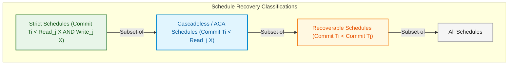

import CoreDoseLessonHeader from '@site/src/components/CoreDose/CoreDoseLessonHeader';
import CoreDoseTOC from '@site/src/components/CoreDose/CoreDoseTOC';
import CoreDoseNav from '@site/src/components/CoreDose/CoreDoseNav';

# Recoverability, Cascadeless & Strict Schedules

<CoreDoseLessonHeader />

## 💡 Core Intuition

### 🍳 The Everyday Analogy: The Domino Run and the Borrowed Blueprint

Imagine an engineering office where Architect Alice ($T_1$) is drafting the foundation schematic for a suspension bridge. 
- **Non-Recoverable Nightmare:** Before Alice has finalized or submitted her draft, Engineer Bob ($T_2$) looks over her shoulder, copies her preliminary uncommitted concrete measurements ($R_2(X)$), and immediately runs outside to pour concrete into the river ($C_2$). Five minutes later, Alice notices a catastrophic calculation error, crumples her blueprint, and throws it in the trash ($A_1$). But Bob has already poured the concrete! You cannot un-pour concrete in the real world. The office is in a **non-recoverable state**.
- **Recoverable Protocol:** Bob is allowed to read Alice's draft, but Bob is legally forbidden from pouring concrete until Alice signs off on her blueprint ($\text{Commit}(T_1) < \text{Commit}(T_2)$).
- **Cascadeless (No Dominoes):** To eliminate the risk of Bob sitting idle or having his work thrown out if Alice aborts, company policy strictly mandates: Bob is not even allowed to *look* at Alice's draft until her final signature is stamped on it!

In database systems, **Recoverability** ensures that the recovery manager can actually restore the database if transactions crash midway, while **Cascadeless** and **Strict** protocols prevent cascading abort dominoes from destroying millions of CPU-cycles of legitimate work.

### 💻 Bridging to Computer Science

Serializability guarantees that execution is logically consistent assuming all transactions run to completion. But in the physical world, hardware crashes, network splits, and power cuts happen constantly.

```
Strict Schedules  ⊂  Cascadeless (ACA) Schedules  ⊂  Recoverable Schedules  ⊂  All Schedules
```

The database recovery subsystem requires schedules to be **Recoverable**. Furthermore, commercial database engines mandate **Strict Execution** to make crash recovery fast, idempotent, and immune to cascading rollbacks.

---

<CoreDoseTOC toc={toc} />

---

## 📚 Core Deep-Dive & Concepts

### 1. Non-Recoverable Schedules (The Fatal Flaw)

**Definition:** A schedule $S$ is **Non-Recoverable** if a transaction $T_j$ reads a data item previously written by an uncommitted transaction $T_i$, and $T_j$ commits **before** $T_i$ commits or aborts:
$$\text{Operation Sequence: } W_i(X) \to R_j(X) \to \text{Commit}(T_j) \to \text{Abort}(T_i)$$

#### Trace Analysis of Non-Recoverability

| Time | Transaction $T_1$ | Transaction $T_2$ | Database State |
| :---: | :---: | :---: | :---: |
| $t_1$ | $\text{Read}(X)$ [$X=5$] | | $X = 5$ |
| $t_2$ | $\text{Write}(X)$ [$X=20$] | | Memory buffer $X = 20$ (Uncommitted) |
| $t_3$ | | $\text{Read}(X)$ [Reads dirty $20$] | $T_2$ takes business action on $20$ |
| $t_4$ | | **Commit** | $T_2$ is permanent and durable! |
| $t_5$ | **ABORT** (Crash!) | | $T_1$ fails constraint check |

**The Fatal Recovery Paradox:**
1. Transaction $T_1$ failed, so the Atomicity rule mandates that $T_1$ must be rolled back ($X$ restored to $5$).
2. But transaction $T_2$ has already **Committed**! Under the Durability rule, a committed transaction's effects cannot be undone.
3. If the DBMS rolls back $T_2$, it violates **Durability**. If it leaves $T_2$ committed, it violates **Atomicity** and persists dirty, invalid data!

Because the database cannot satisfy ACID, the schedule is **Non-Recoverable**. The DBMS must crash-halt or declare data corruption.

---

### 2. Recoverable Schedules

**Definition:** A schedule $S$ is **Recoverable** if and only if:
For every pair of transactions $T_i$ and $T_j$, if $T_j$ reads a data item previously written by $T_i$, then the commit or abort of $T_i$ must appear **before** the commit operation of $T_j$:

$$\text{If } W_i(X) < R_j(X), \quad \text{then } \mathbf{\text{Commit}(T_i) < \text{Commit}(T_j)}$$

#### The Dirty Read Rule of Recoverability
- If a schedule contains **NO dirty reads**, it is **always recoverable**.
- If a schedule contains a dirty read ($T_j$ reads uncommitted $W_i(X)$), the schedule is recoverable **if and only if $T_j$ delays its commit until after $T_i$ commits**.

```
T1: W(X) -------------> Commit
T2:        R(X) -------------> Commit   ✅ Recoverable! (Commit T1 precedes Commit T2)
```

If $T_1$ aborts, the recovery manager can safely roll back $T_2$ as well, because $T_2$ has not yet committed.

---

### 3. Cascading Rollbacks & Cascadeless Schedules (ACA)

While recoverable schedules protect ACID guarantees, they introduce an operational performance disaster known as **Cascading Rollback (Cascading Abort)**.

#### The Domino Collapse Demonstration
Suppose transaction $T_1$ writes $X$. Transaction $T_2$ reads $X$ and writes $Y$. Transaction $T_3$ reads $Y$ and writes $Z$. Transaction $T_4$ reads $Z$:


If $T_1$ aborts at the last millisecond:
- Because $T_2$ read uncommitted data from $T_1$, $T_2$ must be aborted and rolled back.
- Because $T_3$ read uncommitted data from $T_2$, $T_3$ must be aborted and rolled back.
- Because $T_4$ read uncommitted data from $T_3$, $T_4$ must be aborted and rolled back.

A single transaction failure cascades like falling dominoes, destroying thousands of concurrent transactions and wasting immense computing resources.

#### Cascadeless Schedule (Avoids Cascading Aborts - ACA)
**Definition:** A schedule $S$ is **Cascadeless** if and only if:
For every pair of transactions $T_i$ and $T_j$, if $T_j$ reads a data item previously written by $T_i$, then the **commit of $T_i$ must appear BEFORE the read operation of $T_j$**:

$$\mathbf{\text{Commit}(T_i) < \text{Read}_j(X)}$$

> **The Golden Law of Cascadelessness:** A cascadeless schedule permits **ZERO Dirty Reads**. Every transaction is strictly forbidden from reading uncommitted modifications!

---

### 4. Strict Schedules: Protecting Writes and Recovery

Even a cascadeless schedule can experience rollback anomalies during concurrent **writes**.

Consider schedule $S$:
$$W_1(X) \to W_2(X) \to \text{Abort}(T_1)$$

Here, no transaction read uncommitted data (so it is Cascadeless). But $T_2$ overwrote uncommitted data written by $T_1$. If $T_1$ aborts:
- If the recovery manager restores $X$ to its pre-$T_1$ before-image, it accidentally wipes out $T_2$'s active write!
- Restoring state requires parsing complex intermediate log deltas.

**Definition of Strict Schedule:** A schedule $S$ is **Strict** if and only if:
For every pair of transactions $T_i$ and $T_j$, if $T_j$ reads **OR writes** a data item previously written by $T_i$, then the commit or abort of $T_i$ must appear **before** the read or write operation of $T_j$:

$$\mathbf{\text{Commit}(T_i) / \text{Abort}(T_i) < \text{Read}_j(X)} \quad \text{AND} \quad \mathbf{\text{Commit}(T_i) / \text{Abort}(T_i) < \text{Write}_j(X)}$$

#### Why Database Engines Demand Strict Schedules
In a Strict schedule, to roll back an aborted transaction $T_1$, the recovery manager simply copies its original **before-image** back onto disk. Because no other active transaction has read or touched $X$ since $T_1$'s write, restoring the before-image is guaranteed to be 100% safe and conflict-free!

---

### Checkpoints and Crash Recovery Mechanics

To bound recovery time after a server power loss, relational databases write periodic **Checkpoints** to the transaction log:

> **Checkpoint Definition:** A checkpoint is a synchronized snapshot marker where all dirty buffer pool data pages belonging to committed transactions are physically written (flushed) to persistent secondary storage.

#### The 3 Golden Rules of Checkpoint Recovery

```
Timeline:  ---|------------- Checkpoint -------------|--- System Crash!
              T_old (Committed)      T_active (Committed)     T_uncommitted (Failed)
```

1. **Transactions Committed BEFORE Checkpoint:**
   - Both data pages and commit markers are already safely residing on non-volatile disk.
   - **Action upon reboot:** **NEITHER UNDO NOR REDO**. (Zero recovery work required).
2. **Transactions Committed AFTER Checkpoint but BEFORE Crash:**
   - The transaction committed, but some of its data pages may still have been in volatile memory when the crash occurred.
   - **Action upon reboot:** **REDO**. (Re-apply logged changes to ensure Durability).
3. **Transactions Active (Uncommitted) at Time of Crash:**
   - The transaction never committed.
   - **Action upon reboot:** **UNDO**. (Reverse all partial modifications to guarantee Atomicity).

---

## 📐 Architecture / Visual Blueprint

The following Venn inclusion diagram and decision flowchart define the relationships between recovery classifications:



---

## 🏭 In The Real World: Production Case Study

### High-Volume Payment Processor Gateway (Stripe / Adyen)

Payment processing engines ingest millions of card authorization webhooks every minute.

#### The Cascading Abort Disaster
In an early prototype architecture, authorization service worker threads permitted dirty reads across dependent micro-steps:
1. Worker $T_1$ reserved customer funds.
2. Worker $T_2$ generated an authorization token based on $T_1$'s in-memory reservation.
3. Worker $T_3$ dispatched an order fulfillment webhook to the merchant.
4. Suddenly, $T_1$ failed a fraud check and aborted.

Because the system was merely recoverable and not cascadeless:
- Aborting $T_1$ triggered a cascading abort of $T_2$ and $T_3$.
- Over $4,000$ merchant fulfillment webhooks had to be cancelled via expensive reverse HTTP compensation calls.
- Database CPU spiked to $100\%$ purely processing undo logs for cancelled dependent transactions.

#### The Strict Recovery Resolution
The platform re-architected the database engine to enforce **Strict 2PL**:
- No worker is permitted to read an uncommitted authorization state.
- Exclusive locks are held until commit time:
  $$\text{Commit}(T_1) < \text{Read}_2(\text{Auth\_State})$$
Cascading aborts were reduced to zero. Crash recovery time dropped from $12\text{ minutes}$ to under $400\text{ milliseconds}$ using checkpoint-based before-image restoration.

---

## 🎯 Exam & Interview Pitfall Check

:::tip Core Conceptual Questions

**Question 1:** Examine the following schedule $S$ over transactions $T_1$ and $T_2$:
$$S: R_1(A); \quad W_1(A); \quad R_2(A); \quad W_2(B); \quad \text{Commit}_1; \quad \text{Commit}_2;$$
Classify schedule $S$ into: Recoverable, Cascadeless, or Strict.

**Answer:**
1. **Analyze Dependencies:**
   $T_1$ writes $A$ at step 2. $T_2$ reads $A$ at step 3 ($W_1(A)$ followed by $R_2(A)$).
   This is a **Dirty Read**, because $T_2$ reads $A$ while $T_1$ is still uncommitted.
2. **Test Recoverability:**
   Does the commit of $T_1$ precede the commit of $T_2$?
   $$\text{Commit}_1 < \text{Commit}_2 \quad (\text{Step 5 precedes Step 6}) \quad \checkmark$$
   Therefore, the schedule is **Recoverable**.
3. **Test Cascadelessness:**
   Does $\text{Commit}_1$ occur *before* $R_2(A)$?
   No, $R_2(A)$ executes at Step 3, while $\text{Commit}_1$ occurs at Step 5.
   Because a dirty read occurred, schedule $S$ is **NOT Cascadeless**.
4. **Test Strictness:**
   Since any Strict schedule must be Cascadeless, $S$ is **NOT Strict**.
5. **Final Classification:** Schedule $S$ is **Recoverable, but Non-Cascadeless and Non-Strict**.

---

**Question 2:** During crash recovery with checkpointing, how does the DBMS decide whether to UNDO or REDO a transaction?

**Answer:**
The recovery manager inspects the transaction log from the last checkpoint forward:
- **REDO List:** If the log contains both a $\langle T_i, \text{START} \rangle$ record and a $\langle T_i, \text{COMMIT} \rangle$ record (the transaction committed after the checkpoint but before the crash), its updates are re-applied to ensure Durability.
- **UNDO List:** If the log contains a $\langle T_i, \text{START} \rangle$ record but **NO** commit record (the transaction was still active when the crash occurred), all of its modifications are rolled back in reverse order to ensure Atomicity.
- Transactions that committed *prior* to the checkpoint require neither undo nor redo.

:::

:::warning Common Interview Traps

**Trap 1: Assuming that a Conflict Serializable schedule is automatically Recoverable.**
Conflict Serializability and Recoverability are completely orthogonal properties! A schedule can be 100% Conflict Serializable and yet be Non-Recoverable (e.g. $W_1(A) \to R_2(A) \to \text{Commit}_2 \to \text{Abort}_1$ is conflict serializable with serial order $T_1 \to T_2$, but is fatally non-recoverable!).

**Trap 2: Confusing Cascadeless with Strict schedules.**
A Cascadeless schedule prevents dirty reads ($W_i(X) < \text{Commit}_i < R_j(X)$), but still allows dirty writes ($W_i(X) < W_j(X) < \text{Commit}_i$). A Strict schedule forbids **both** dirty reads and dirty writes ($W_i(X) < \text{Commit}_i < W_j(X)$).

:::

---

<CoreDoseNav
  prev={{
    title: "View Serializability & Blind Writes",
    url: "/coredose/dbms/chapter-08/view-serializability-and-blind-writes"
  }}
  next={{
    title: "Two-Phase Locking Protocol (2PL): Basic, Strict & Rigorous",
    url: "/coredose/dbms/chapter-08/two-phase-locking-protocol-2pl"
  }}
  courseUrl="/coredose/dbms"
/>
