import CoreDoseLessonHeader from '@site/src/components/CoreDose/CoreDoseLessonHeader';
import CoreDoseTOC from '@site/src/components/CoreDose/CoreDoseTOC';
import CoreDoseNav from '@site/src/components/CoreDose/CoreDoseNav';

# Two-Phase Locking Protocol (2PL): Basic, Strict & Rigorous

<CoreDoseLessonHeader />

## 💡 Core Intuition

### 🍳 The Everyday Analogy: The Two-Phase Conference Room Booking

Imagine an executive reserving meeting rooms across corporate headquarters for an all-hands strategy session:
- **Phase 1: The Growing Phase (Acquisition Only).** You walk down the hallway placing your reservation card on Room A, Room B, and Room C. During this period, you are strictly allowed to reserve rooms, but company rules forbid you from releasing any room you have already claimed.
- **The Lock Point:** You reserve your final needed space (the Auditorium). You now hold all the resources necessary to execute your meetings.
- **Phase 2: The Shrinking Phase (Release Only).** As meetings finish, you release Room A, then Room B, and finally the Auditorium. Crucially, the moment you surrender Room A, you are legally **forbidden from reserving any new room** in the building.

If employees could arbitrarily reserve a room, release it, and reserve another later, two executives could interleave bookings in a cyclic pattern that scrambles room setups or causes gridlock. By dividing execution into an **expanding phase** followed by a **contracting phase**, the protocol mathematically guarantees that all meetings serialize cleanly.

### 💻 Bridging to Computer Science

In relational databases, locking alone does not guarantee serializability. If transactions acquire and release locks haphazardly, interleaving read and write locks produces serializability cycles and dirty reads.

The **Two-Phase Locking (2PL)** protocol imposes a simple, elegant rule on lock management:

> **The Fundamental 2PL Rule:** A transaction must acquire all locks before releasing any locks. Once a transaction releases a single lock, it enters the shrinking phase and can **never acquire another lock**.

```
Lock Acquisition Allowed?     YES        |        NO
Lock Release Allowed?         NO         |        YES
                         [ Growing Phase ] -> [ Lock Point ] -> [ Shrinking Phase ]
```

2PL is a **pessimistic concurrency control** protocol. It guarantees that any schedule produced is strictly **Conflict Serializable**.

---

<CoreDoseTOC toc={toc} />

---

## 📚 Core Deep-Dive & Concepts

### Lock Modes & Compatibility Matrix

Relational databases maintain data integrity using two primary lock primitives:

#### 1. Shared Mode Lock ($S$)
Also known as a **Read Lock**.
- If transaction $T_i$ holds a Shared lock on data item $Q$ ($S(Q)$), $T_i$ can read $Q$, but cannot write to $Q$.
- Other concurrent transactions can also acquire shared locks on $Q$ simultaneously. Multiple transactions can safely read the same record in parallel.

#### 2. Exclusive Mode Lock ($X$)
Also known as a **Write Lock**.
- If transaction $T_i$ holds an Exclusive lock on data item $Q$ ($X(Q)$), $T_i$ can both read and write to $Q$.
- No other transaction can acquire *any* lock (neither Shared nor Exclusive) on $Q$ until $T_i$ releases it.

#### Lock Compatibility Matrix

| Requested Mode \ Currently Held | **Exclusive ($X$)** | **Shared ($S$)** | **Unlocked** |
| :--- | :---: | :---: | :---: |
| **Exclusive ($X$)** | ❌ No | ❌ No | ✅ Yes |
| **Shared ($S$)** | ❌ No | ✅ Yes | ✅ Yes |
| **Unlock** | ✅ Yes | ✅ Yes | — |

---

### The Two Phases of 2PL

Under the standard Two-Phase Locking protocol, each transaction's execution is divided into two distinct, non-overlapping phases:

#### Phase 1: Growing Phase (Expansion)
- The transaction may **obtain locks** of any mode (Shared or Exclusive).
- The transaction **cannot release** any locks.
- Locks may be upgraded from Shared to Exclusive ($S \to X$) during this phase.

#### The Lock Point
The exact point in time when the transaction acquires its **final lock**. At the Lock Point, the transaction holds the maximum set of locks it will ever possess.

> **Serializability Order Theorem:** In any 2PL schedule, the equivalent serial order of transactions is strictly determined by the chronological order of their **Lock Points**!

#### Phase 2: Shrinking Phase (Contraction)
- The transaction may **release locks**.
- The transaction **cannot obtain any new locks**.
- Locks may be downgraded from Exclusive to Shared ($X \to S$) during this phase.

```
Number of Locks Held
       ^
       |            Lock Point
       |               / \
       |              /   \
       |             /     \
       |  Growing   /       \   Shrinking
       |   Phase   /         \    Phase
       |          /           \
       +----------------------------> Time
```

---

### Variants of Two-Phase Locking

Basic 2PL guarantees conflict serializability, but suffers from two severe operational drawbacks: **Cascading Aborts** and **Deadlocks**. To solve these, relational engineering developed three standardized variants:

#### 1. Basic 2PL
- Follows the standard growing and shrinking rules.
- Locks can be released incrementally during the shrinking phase before the transaction commits.
- **Flaw:** Susceptible to dirty reads, cascading rollbacks, and deadlocks.

#### 2. Conservative (Static) 2PL
- Eliminates the growing phase entirely.
- Before beginning execution, the transaction must declare and **acquire ALL required locks simultaneously**.
- If any requested lock is unavailable, the transaction acquires zero locks, releases any temporary holds, and waits.
- **Guarantee:** **100% Deadlock-Free!**
- **Trade-Off:** Lower concurrency; transactions hold locks longer than necessary and must predict future read/write sets in advance.

#### 3. Strict 2PL
- Modifies basic 2PL by mandating that **ALL Exclusive ($X$) locks must be held until the transaction explicitly Commits or Aborts**.
- Shared ($S$) locks may be released incrementally during the shrinking phase.
- **Guarantee:** **Guarantees Strict and Cascadeless schedules!** Eliminates dirty reads and cascading aborts.

#### 4. Rigorous 2PL
- The strictest variant: requires that **ALL locks (both Shared and Exclusive) must be held until the transaction Commits or Aborts**.
- The transaction has **no shrinking phase** during its operational lifespan; all locks are released simultaneously upon commit.
- **Guarantee:** Strict, Cascadeless, and guarantees that the serialization order is identical to the commit order.

---

### Master Comparison of 2PL Protocols

| Protocol Variant | Conflict Serializable | View Serializable | Recoverable | Cascadeless (ACA) | Free from Deadlock? |
| :--- | :---: | :---: | :---: | :---: | :---: |
| **Basic 2PL** | ✅ Yes | ✅ Yes | ❌ No | ❌ No | ❌ No |
| **Conservative 2PL** | ✅ Yes | ✅ Yes | ❌ No | ❌ No | ✅ **Yes** |
| **Strict 2PL** | ✅ Yes | ✅ Yes | ✅ **Yes** | ✅ **Yes** | ❌ No |
| **Rigorous 2PL** | ✅ Yes | ✅ Yes | ✅ **Yes** | ✅ **Yes** | ❌ No |

#### The 2PL Inclusion Hierarchy
Every conservative schedule satisfies rigorous 2PL; every rigorous schedule satisfies strict 2PL; and every strict schedule satisfies basic 2PL:
$$\text{Conservative 2PL} \subset \text{Rigorous 2PL} \subset \text{Strict 2PL} \subset \text{Basic 2PL}$$

---

### Lock Granularity: Row-Level vs. Table-Level Locking

Relational engines balance locking overhead against concurrency throughput by supporting multiple granularities:
- **Database / Table Level Locking:** Low memory overhead (one lock per table), but low concurrency (one write transaction locks the entire customer table).
- **Page Level Locking:** Locks a $8\text{ KB}$ disk block; balances row and table trade-offs.
- **Row-Level (Tuple) Locking:** Maximum concurrency. Different transactions can concurrently read and update different rows in the exact same table without blocking each other.

---

## 📐 Architecture / Visual Blueprint

The following structural diagram contrasts the lock lifecycle between Basic 2PL, Strict 2PL, and Rigorous 2PL:

```mermaid
flowchart TD
    classDef basic fill:#e1f5fe,stroke:#0288d1,stroke-width:2px,color:#01579b;
    classDef strict fill:#fff3e0,stroke:#e65100,stroke-width:2px,color:#bf360c;
    classDef rigorous fill:#e8f5e9,stroke:#2e7d32,stroke-width:2px,color:#1b5e20;

    subgraph Basic["Basic 2PL"]
        B_GROW["Acquire S and X locks"]:::basic --> B_LP["Lock Point"]:::basic
        B_LP --> B_SHRINK["Release S and X incrementally BEFORE commit"]:::basic
    end

    subgraph Strict["Strict 2PL (Industry Standard)"]
        S_GROW["Acquire S and X locks"]:::strict --> S_LP["Lock Point"]:::strict
        S_LP --> S_SHRINK["Release Shared (S) locks incrementally"]:::strict
        S_LP --> S_HOLD["Hold Exclusive (X) locks UNTIL COMMIT"]:::strict
    end

    subgraph Rigorous["Rigorous 2PL"]
        R_GROW["Acquire S and X locks"]:::rigorous --> R_LP["Lock Point"]:::rigorous
        R_LP --> R_HOLD["Hold ALL S and X locks UNTIL COMMIT"]:::rigorous
        R_HOLD --> R_REL["Release ALL locks at Commit"]:::rigorous
    end
```



---

## 🏭 In The Real World: Production Case Study

### MySQL InnoDB Row-Level Locking Architecture

MySQL's default storage engine, InnoDB, relies on **Strict Two-Phase Locking** combined with Multi-Version Concurrency Control (MVCC) to power high-traffic web applications.

#### Production Locking Workflow
When a payment worker updates user balances:
```sql
BEGIN;
  -- Acquires Shared (S) Lock or reads MVCC snapshot
  SELECT balance FROM User_Accounts WHERE user_id = 42;
  
  -- Upgrades / Acquires Exclusive (X) Record Lock on row 42
  UPDATE User_Accounts SET balance = balance - 50 WHERE user_id = 42;
  
  -- The Exclusive lock on row 42 is NOT released here!
  -- Under Strict 2PL, InnoDB holds the X-lock until COMMIT
  INSERT INTO Audit_Log (user_id, amount) VALUES (42, -50);
COMMIT; 
-- All X-locks on row 42 are atomically released during commit flush
```

#### Why Holding the X-Lock Until Commit is Critical
If InnoDB used Basic 2PL and released the X-lock on `User_Accounts` immediately after the `UPDATE`, another concurrent transaction could read the new balance. If the subsequent `INSERT INTO Audit_Log` failed a disk space constraint and aborted, the database would have permitted a **Dirty Read**, forcing a cascading rollback across concurrent web sessions. Strict 2PL guarantees this anomaly can never manifest.

---

## 🎯 Exam & Interview Pitfall Check

:::tip Core Conceptual Questions

**Question 1:** Can a schedule generated by the Basic Two-Phase Locking protocol suffer from deadlocks? Explain why or why not.

**Answer:**
Yes. Basic 2PL guarantees Conflict Serializability, but it does **NOT guarantee freedom from deadlocks**. 
Consider two transactions:
- $T_1$ acquires lock on $A$ ($\text{Lock-X}(A)$).
- $T_2$ acquires lock on $B$ ($\text{Lock-X}(B)$).
- $T_1$ requests lock on $B$ ($\text{Lock-X}(B)$) $\to$ $T_1$ blocks waiting for $T_2$.
- $T_2$ requests lock on $A$ ($\text{Lock-X}(A)$) $\to$ $T_2$ blocks waiting for $T_1$.

Both transactions are in their growing phase and waiting for the other to release a lock. Neither can proceed. Hence, 2PL engines must run background deadlock detection or timeout algorithms.

---

**Question 2:** Explain the exact operational distinction between Strict 2PL and Rigorous 2PL.

**Answer:**
Under **Strict 2PL**, only Exclusive (Write) locks are required to be held until the transaction commits or aborts. Shared (Read) locks are allowed to be released during the shrinking phase prior to commit.
Under **Rigorous 2PL**, **ALL locks** (both Shared read locks and Exclusive write locks) must be held until the transaction commits or aborts. Rigorous 2PL has no shrinking phase during execution, producing a serial order identical to the transaction commit timestamps.

:::

:::warning Common Interview Traps

**Trap 1: Assuming that all conflict serializable schedules can be produced by 2PL.**
2PL is a sufficient condition for conflict serializability, but not a necessary one. There exist valid conflict serializable schedules that cannot be generated by a 2PL scheduler because 2PL strictly disallows acquiring any lock after releasing a lock.

**Trap 2: Believing 2PL prevents cascading aborts.**
Basic 2PL does **not** prevent cascading rollbacks! If $T_1$ releases an exclusive lock during its shrinking phase before committing, and $T_2$ reads that updated value, an abort by $T_1$ forces $T_2$ to roll back. Only **Strict 2PL** and **Rigorous 2PL** guarantee cascadeless execution.

:::

---

<CoreDoseNav
  prev={{
    title: "Recoverability, Cascadeless & Strict Schedules",
    url: "/coredose/dbms/chapter-08/recoverability-cascadeless-and-strict-schedules"
  }}
  next={{
    title: "Deadlock Handling: Wait-Die vs. Wound-Wait Protocols",
    url: "/coredose/dbms/chapter-08/deadlock-handling-wait-die-vs-wound-wait"
  }}
  courseUrl="/coredose/dbms"
/>
